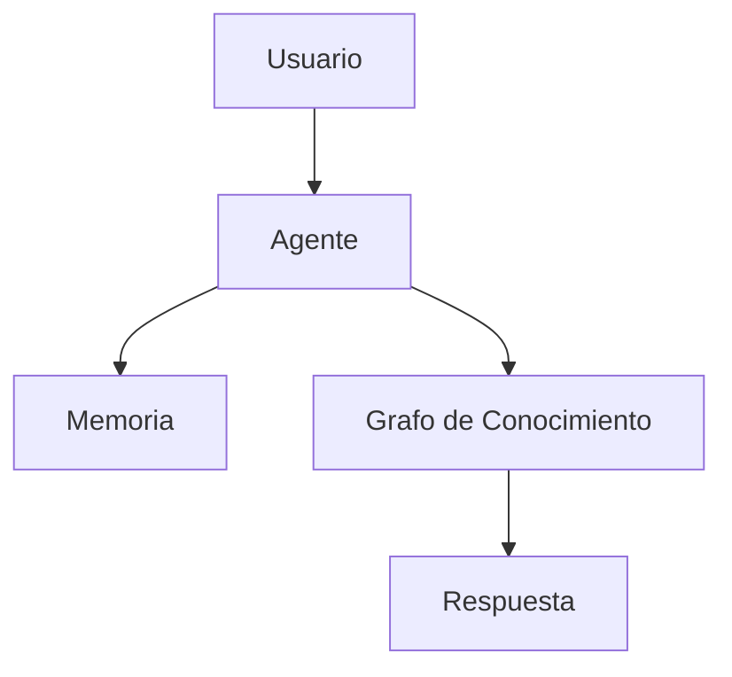

# ORION-008 — Guía de Estilo

**Nivel documental:** L1 — Strategy / Governance
**Proyecto:** ORION / XMIP
**Versión:** 1.0
**Estado:** Draft
**Owner:** Fernando Cuellar
**Última actualización:** 2026-07-01
**Ruta sugerida:** `docs/L1-strategy/ORION-008-guia-de-estilo.md`

---

## 1. Propósito

Este documento define la guía de estilo oficial para toda la documentación, comunicación técnica, prompts, agentes digitales, entregables estratégicos y artefactos operativos del ecosistema ORION / XMIP.

Su objetivo es asegurar consistencia, claridad, trazabilidad y calidad profesional en todos los documentos del proyecto.

XMIP debe documentarse como una plataforma empresarial seria, no como una colección improvisada de ideas, prompts o experimentos.

---

## 2. Alcance

Esta guía aplica a:

* Documentos estratégicos.
* Documentos de arquitectura.
* Especificaciones de agentes.
* Prompts maestros.
* Runbooks operativos.
* Sprints.
* Decisiones técnicas.
* Modelos de datos.
* Diagramas.
* APIs.
* Mensajes entre agentes.
* Documentación para implementación.
* Documentación para revisión ejecutiva.

No aplica a contenido informal, notas personales o borradores temporales que no entren al repositorio oficial.

---

## 3. Principios editoriales

Toda documentación de ORION / XMIP debe seguir estos principios:

### 3.1 Claridad sobre elegancia

El documento debe entenderse sin explicación adicional.

Evitar frases bonitas que no ayuden a implementar, operar o decidir.

### 3.2 Precisión sobre ambigüedad

Cada concepto debe tener una definición clara.

Si un término puede interpretarse de varias formas, debe definirse explícitamente.

### 3.3 Arquitectura antes que implementación

Primero se define el diseño.

Después se implementa.

No se documentan ocurrencias después del código como si fueran arquitectura.

### 3.4 Decisiones trazables

Toda decisión importante debe poder rastrearse a:

* Un objetivo.
* Una restricción.
* Un riesgo.
* Una alternativa descartada.
* Un impacto esperado.

### 3.5 Lenguaje operativo

Los documentos deben servir para ejecutar.

Un buen documento de XMIP debe poder convertirse en tareas, código, configuración, pruebas o decisiones.

---

## 4. Idioma oficial

El idioma principal del proyecto es **español técnico**.

Se permite usar términos en inglés cuando sean estándar de la industria o cuando traducirlos reduzca precisión.

Ejemplos aceptados:

* Agent
* Workflow
* Runtime
* API
* Event
* Knowledge Graph
* Embedding
* Prompt
* Context Window
* Vector Store
* RAG
* Observability
* Runbook

No se deben mezclar idiomas de forma innecesaria.

Incorrecto:

> El agente hace el análisis y luego pushea el insight al user journey para hacer el next action.

Correcto:

> El agente analiza el contexto, genera una recomendación y la envía al flujo operativo correspondiente.

---

## 5. Tono documental

El tono oficial debe ser:

* Profesional.
* Directo.
* Técnico.
* Ejecutivo cuando corresponda.
* Sin exageraciones.
* Sin promesas vagas.
* Sin lenguaje de marketing vacío.

Evitar expresiones como:

* “Revolucionario”.
* “Disruptivo”.
* “De clase mundial”.
* “Ultra avanzado”.
* “La mejor plataforma”.
* “Inteligencia artificial mágica”.
* “Automatización total sin esfuerzo”.

Preferir expresiones verificables:

* “Reduce intervención manual”.
* “Estandariza decisiones”.
* “Aumenta trazabilidad”.
* “Centraliza contexto”.
* “Permite auditoría”.
* “Soporta operación multiagente”.
* “Reduce improvisación operativa”.

---

## 6. Convenciones de nombres

### 6.1 Documentos ORION

Formato oficial:

```text
ORION-###-nombre-del-documento.md
```

Ejemplos:

```text
ORION-008-guia-de-estilo.md
ORION-010-arquitectura-empresarial.md
ORION-011-arquitectura-del-sistema.md
ORION-012-grafo-de-conocimiento.md
ORION-013-modelo-de-datos.md
```

### 6.2 Títulos internos

Formato oficial:

```text
# ORION-### — Nombre del Documento
```

Ejemplo:

```text
# ORION-012 — Grafo de Conocimiento
```

### 6.3 Agentes

Los agentes deben nombrarse en formato Pascal Case cuando sean entidades formales.

Ejemplos:

```text
StrategyAgent
ResearchAgent
ArchitectureAgent
FinanceAgent
RiskAgent
MemoryAgent
ExecutionAgent
```

Cuando se describan en texto, puede usarse nombre natural:

```text
Agente de Estrategia
Agente de Investigación
Agente de Arquitectura
```

### 6.4 Componentes técnicos

Los componentes técnicos deben nombrarse en inglés si representan servicios, módulos, paquetes o clases.

Ejemplos:

```text
agent-runtime
memory-service
knowledge-graph-service
orchestration-engine
context-manager
```

### 6.5 Tablas de base de datos

Usar minúsculas y snake_case.

Ejemplos:

```text
agents
agent_messages
knowledge_nodes
knowledge_edges
execution_runs
audit_events
```

### 6.6 Variables y campos

Usar snake_case en modelos de datos y JSON interno.

Ejemplos:

```json
{
  "agent_id": "strategy-agent",
  "execution_id": "exec_001",
  "created_at": "2026-07-01T00:00:00Z"
}
```

---

## 7. Estructura estándar de documentos

Todo documento formal debe incluir, como mínimo:

```markdown
# ORION-### — Título

**Nivel documental:**  
**Proyecto:**  
**Versión:**  
**Estado:**  
**Owner:**  
**Última actualización:**  
**Ruta sugerida:**  

---

## 1. Propósito

## 2. Alcance

## 3. Contexto

## 4. Definiciones

## 5. Diseño / Estrategia / Especificación

## 6. Decisiones clave

## 7. Riesgos y mitigaciones

## 8. Criterios de aceptación

## 9. Relación con otros documentos

## 10. Próximos pasos
```

La estructura puede ajustarse según el tipo de documento, pero no debe perder claridad ni trazabilidad.

---

## 8. Niveles documentales oficiales

XMIP usa los siguientes niveles:

| Nivel | Nombre       | Uso                                                        |
| ----- | ------------ | ---------------------------------------------------------- |
| L0    | Constitution | Principios fundacionales, charter, reglas casi permanentes |
| L1    | Strategy     | Estrategia, gobierno, estilo, roadmap, decisiones rectoras |
| L2    | Architecture | Arquitectura empresarial, sistema, datos, conocimiento     |
| L3    | Product      | Requerimientos, funcionalidades, casos de uso              |
| L4    | Operations   | Runbooks, soporte, seguridad operativa, monitoreo          |
| L5    | Sprints      | Planeación, ejecución, tareas, entregables iterativos    |

ORION-008 pertenece a **L1 — Strategy / Governance** porque define reglas de documentación y comunicación para todo el proyecto.

---

## 9. Estilo para arquitectura

Los documentos de arquitectura deben responder siempre:

1. Qué problema resuelve.
2. Qué capacidades habilita.
3. Qué componentes participan.
4. Qué datos entran y salen.
5. Qué decisiones fueron tomadas.
6. Qué riesgos existen.
7. Qué restricciones aplican.
8. Qué queda fuera del alcance.
9. Cómo se valida que está correcto.
10. Qué documentos dependen de esta arquitectura.

Evitar arquitectura decorativa.

Un diagrama sin decisiones no es arquitectura.

Un listado de tecnologías sin trade-offs no es arquitectura.

---

## 10. Estilo para prompts

Los prompts oficiales deben escribirse como especificaciones operativas.

Todo prompt maestro debe incluir:

```markdown
## Rol

## Contexto

## Objetivo

## Entradas esperadas

## Proceso obligatorio

## Formato de salida

## Restricciones

## Criterios de calidad

## Ejemplo mínimo
```

Los prompts no deben depender de “intuición” del modelo.

Deben ser explícitos, repetibles y auditables.

---

## 11. Estilo para agentes digitales

Toda especificación de agente debe incluir:

* Nombre del agente.
* Propósito.
* Responsabilidades.
* Límites.
* Entradas.
* Salidas.
* Herramientas permitidas.
* Memoria utilizada.
* Eventos que consume.
* Eventos que produce.
* Errores esperados.
* Criterios de éxito.
* Riesgos operativos.

Ejemplo de formato:

```markdown
## Nombre del agente

StrategyAgent

## Propósito

Convertir objetivos estratégicos en decisiones, restricciones y prioridades ejecutables.

## Responsabilidades

- Analizar contexto estratégico.
- Priorizar objetivos.
- Detectar contradicciones.
- Proponer opciones de decisión.

## Límites

- No ejecuta cambios en sistemas productivos.
- No toma decisiones financieras finales.
- No modifica memoria persistente sin autorización.
```

---

## 12. Estilo para diagramas

Los diagramas deben ser simples, legibles y orientados a decisión.

Preferencia:

1. Mermaid.
2. Diagramas C4.
3. Tablas de relación.
4. Diagramas externos solo si son necesarios.

Formato recomendado:



Todo diagrama debe tener una explicación breve después.

No incluir diagramas decorativos.

---

## 13. Estilo para tablas

Las tablas deben usarse para comparar, clasificar o definir.

Ejemplo correcto:

| Componente     | Responsabilidad              | Riesgo                    | Mitigación                      |
| -------------- | ---------------------------- | ------------------------- | -------------------------------- |
| Memory Service | Persistir contexto relevante | Contaminación de memoria | Reglas de escritura y auditoría |
| Agent Runtime  | Ejecutar agentes             | Fallos no trazables       | Logs, eventos y execution_id     |

Evitar tablas enormes que sustituyan explicación crítica.

---

## 14. Definiciones obligatorias

Los siguientes términos deben usarse consistentemente:

### ORION

Sistema rector del proyecto. Define la visión, estructura documental, arquitectura y gobierno general.

### XMIP

Plataforma operativa multiagente construida bajo ORION.

### Agente

Unidad autónoma o semi-autónoma especializada en una función específica dentro de XMIP.

### Workflow

Secuencia controlada de pasos, agentes, decisiones y eventos para cumplir un objetivo operativo.

### Memoria

Capacidad del sistema para conservar contexto útil y reutilizable.

### Grafo de Conocimiento

Modelo estructurado de entidades, relaciones, eventos y contexto semántico usado para razonamiento y trazabilidad.

### Evento

Registro estructurado de algo que ocurrió en el sistema.

### Run

Ejecución concreta de un flujo, agente o tarea.

### Auditoría

Capacidad de reconstruir qué ocurrió, cuándo, por qué, con qué datos y bajo qué decisión.

---

## 15. Estilo para decisiones técnicas

Las decisiones técnicas deben documentarse con este formato:

```markdown
## Decisión

## Contexto

## Opciones consideradas

## Decisión tomada

## Justificación

## Consecuencias

## Riesgos

## Fecha

## Owner
```

Ejemplo:

```markdown
## Decisión

Usar un grafo de conocimiento como estructura central de contexto.

## Contexto

XMIP requiere representar relaciones entre agentes, usuarios, decisiones, documentos y eventos.

## Opciones consideradas

1. Base relacional únicamente.
2. Vector store únicamente.
3. Grafo de conocimiento + base relacional + embeddings.

## Decisión tomada

Usar un modelo híbrido con grafo de conocimiento, base relacional y embeddings.

## Justificación

El grafo permite trazabilidad relacional; la base relacional permite consistencia transaccional; los embeddings permiten recuperación semántica.
```

---

## 16. Estilo para riesgos

Los riesgos deben escribirse de forma concreta.

Incorrecto:

> Puede haber problemas de seguridad.

Correcto:

> El sistema puede exponer contexto sensible si los agentes acceden a memoria sin controles de autorización por rol.

Formato recomendado:

| Riesgo                                    | Impacto | Probabilidad | Mitigación                                |
| ----------------------------------------- | ------: | -----------: | ------------------------------------------ |
| Memoria contaminada por datos incorrectos |    Alto |        Media | Validación antes de escritura persistente |
| Agente ejecuta acción fuera de alcance   |    Alto |         Baja | Policy engine y permisos por herramienta   |

---

## 17. Estilo para criterios de aceptación

Los criterios deben ser verificables.

Incorrecto:

> El sistema debe funcionar bien.

Correcto:

> El sistema debe registrar cada ejecución de agente con `execution_id`, timestamp, agente responsable, entrada, salida, estado y errores.

Formato recomendado:

```markdown
- [ ] El documento define entradas y salidas.
- [ ] El documento incluye riesgos y mitigaciones.
- [ ] El documento identifica dependencias.
- [ ] El documento permite derivar tareas de implementación.
```

---

## 18. Reglas de Markdown

Usar Markdown limpio y compatible con repositorio Git.

Reglas:

* Un solo `#` por documento.
* Usar `##` para secciones principales.
* Usar `###` solo cuando sea necesario.
* Evitar secciones demasiado profundas.
* Usar listas numeradas para procesos.
* Usar bullets para agrupaciones.
* Usar tablas para comparación.
* Usar bloques de código para ejemplos técnicos.
* No usar emojis en documentación formal.
* No usar colores ni estilos visuales dependientes de herramientas externas.
* No depender de screenshots para explicar arquitectura.

---

## 19. Prohibiciones editoriales

No usar:

* Lenguaje inflado.
* Frases ambiguas.
* Suposiciones no declaradas.
* Promesas sin mecanismo.
* Acrónimos sin definición inicial.
* Diagramas sin explicación.
* Documentos sin owner.
* Documentos sin estado.
* Documentos sin relación con otros documentos.
* Mezcla innecesaria de español e inglés.
* Tareas de sprint sin vínculo arquitectónico.
* Arquitectura basada en herramientas de moda.

---

## 20. Estados documentales

Estados permitidos:

| Estado     | Significado                                |
| ---------- | ------------------------------------------ |
| Draft      | Documento inicial en construcción         |
| Review     | Documento listo para revisión             |
| Approved   | Documento aprobado como referencia oficial |
| Deprecated | Documento reemplazado o ya no vigente      |
| Archived   | Documento conservado solo como histórico  |

Todo documento nuevo inicia como `Draft`.

---

## 21. Versionado

Usar versionado simple:

| Versión | Uso                                   |
| -------- | ------------------------------------- |
| 0.x      | Borradores tempranos                  |
| 1.0      | Primera versión estable              |
| 1.x      | Cambios menores                       |
| 2.0      | Cambio estructural o conceptual mayor |

Cada cambio importante debe registrarse en una sección de historial.

Formato:

```markdown
## Historial de cambios

| Versión | Fecha | Cambio | Autor |
|---|---|---|---|
| 1.0 | 2026-07-01 | Versión inicial | Fernando Cuellar |
```

---

## 22. Relación con otros documentos

Este documento gobierna el estilo de los siguientes documentos:

* ORION-000 — Project Charter
* ORION-001 — Visión Estratégica
* ORION-007 — Flujo Operativo
* ORION-010 — Arquitectura Empresarial
* ORION-011 — Arquitectura del Sistema
* ORION-012 — Grafo de Conocimiento
* ORION-013 — Modelo de Datos
* ORION-014 — Arquitectura de Agentes
* ORION-014A — Protocolo de Comunicación entre Agentes
* ORION-014B — Especificación de Agentes Digitales

Cualquier documento futuro debe alinearse con esta guía.

---

## 23. Checklist antes de aprobar un documento

Antes de aprobar cualquier documento de ORION / XMIP, validar:

* [ ] Tiene metadata completa.
* [ ] Tiene propósito claro.
* [ ] Tiene alcance definido.
* [ ] Usa el nivel documental correcto.
* [ ] Usa terminología consistente.
* [ ] Evita lenguaje ambiguo.
* [ ] Incluye decisiones relevantes.
* [ ] Incluye riesgos si aplica.
* [ ] Incluye criterios de aceptación.
* [ ] Tiene relación con otros documentos.
* [ ] Puede convertirse en tareas o implementación.
* [ ] No contradice documentos superiores.
* [ ] No introduce conceptos sin definición.
* [ ] No usa buzzwords como sustituto de diseño.
* [ ] Está listo para vivir en Git.

---

## 24. Criterios de aceptación de esta guía

Este documento se considera aceptado cuando:

* [ ] Define el estilo oficial de documentación ORION / XMIP.
* [ ] Establece convenciones de nombres.
* [ ] Establece niveles documentales.
* [ ] Define reglas de tono e idioma.
* [ ] Define estructura estándar para documentos.
* [ ] Define reglas para arquitectura, prompts, agentes y riesgos.
* [ ] Puede aplicarse directamente a los documentos ORION-010 a ORION-014B.

---

## 25. Próximos pasos

Después de aprobar esta guía, continuar con el bloque L2 de arquitectura:

1. ORION-010 — Arquitectura Empresarial.
2. ORION-011 — Arquitectura del Sistema.
3. ORION-012 — Grafo de Conocimiento.
4. ORION-013 — Modelo de Datos.

Este documento debe usarse como referencia editorial obligatoria para todos ellos.

---

## 26. Historial de cambios

| Versión | Fecha      | Cambio                                 | Autor            |
| -------- | ---------- | -------------------------------------- | ---------------- |
| 1.0      | 2026-07-01 | Versión inicial de la guía de estilo | Fernando Cuellar |
