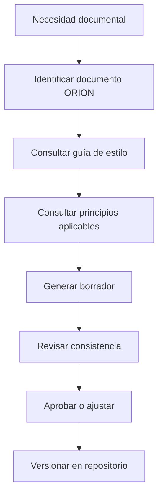
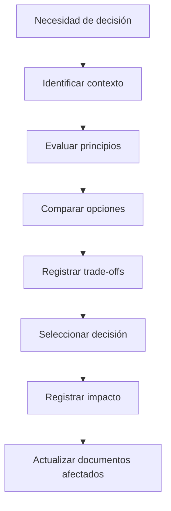
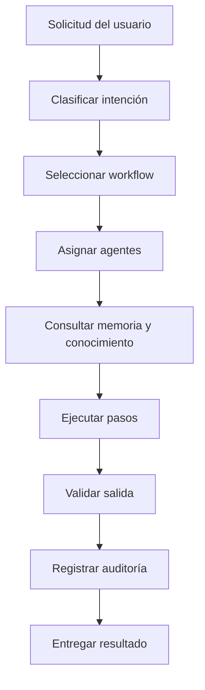
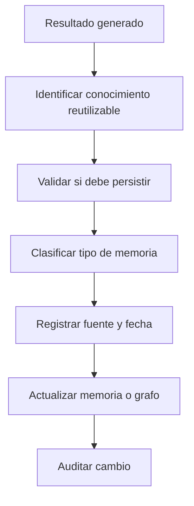
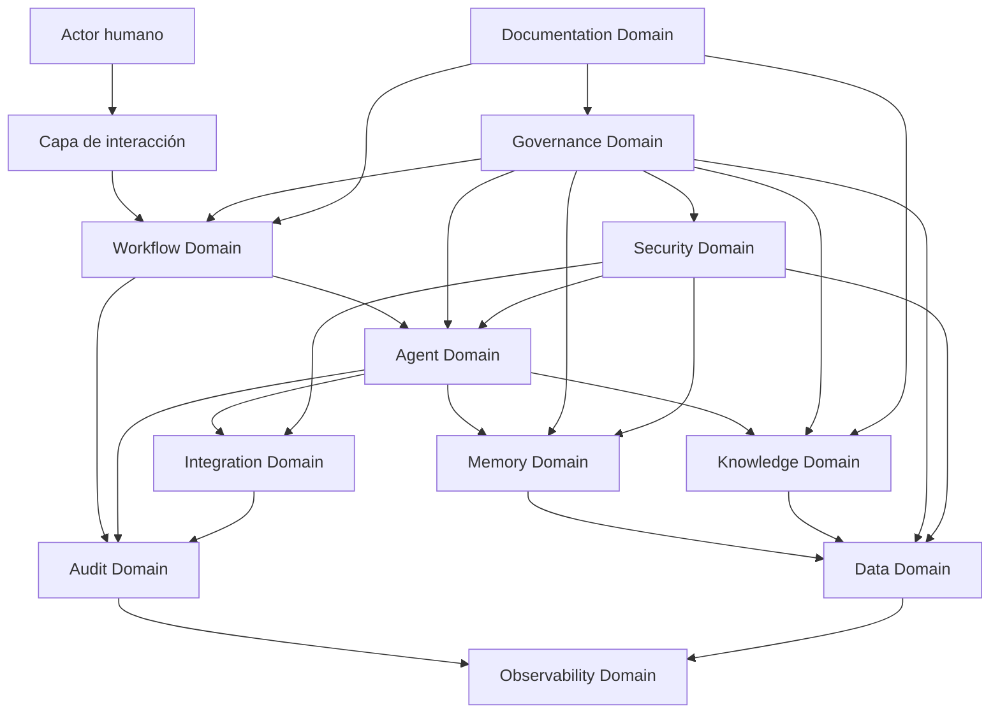

# ORION-010 — Arquitectura Empresarial

**Nivel documental:** L2 — Architecture
**Proyecto:** ORION / XMIP
**Versión:** 1.0
**Estado:** Draft
**Owner:** Fernando Cuellar
**Última actualización:** 2026-07-01
**Ruta sugerida:** `docs/L2-architecture/ORION-010-arquitectura-empresarial.md`

---

## 1. Propósito

Este documento define la arquitectura empresarial de XMIP dentro del marco ORION.

Su propósito es establecer el plano empresarial que conecta estrategia, capacidades, dominios, actores, procesos, información, gobierno y restricciones operativas antes de entrar al diseño técnico detallado.

ORION-010 responde a la pregunta:

> ¿Qué debe ser XMIP como plataforma empresarial y qué capacidades debe habilitar para operar de forma gobernada, trazable, segura y escalable?

Este documento no define todavía tablas, APIs, infraestructura o componentes de bajo nivel.
Eso se desarrolla en documentos posteriores:

* ORION-011 — Arquitectura del Sistema.
* ORION-012 — Grafo de Conocimiento.
* ORION-013 — Modelo de Datos.
* ORION-014 — Arquitectura de Agentes.

---

## 2. Alcance

Este documento cubre:

* Contexto empresarial de XMIP.
* Visión arquitectónica empresarial.
* Capacidades principales.
* Dominios funcionales.
* Actores internos y externos.
* Flujos de valor.
* Modelo operativo.
* Gobierno de arquitectura.
* Gobierno documental.
* Gobierno de datos.
* Seguridad empresarial.
* Riesgos principales.
* Restricciones arquitectónicas.
* Criterios de aceptación para pasar a arquitectura de sistema.

Este documento no cubre:

* Diseño físico de infraestructura.
* Selección final de base de datos.
* Diseño detallado de APIs.
* Modelo lógico completo de datos.
* Esquemas de eventos.
* Implementación de agentes.
* Código.
* Sprints detallados.
* Diseño visual de interfaces.

---

## 3. Contexto

XMIP es una plataforma operativa multiagente diseñada para convertir intención, contexto, conocimiento y decisiones en flujos ejecutables, trazables y gobernados.

Dentro de ORION, XMIP no debe tratarse como un experimento aislado de inteligencia artificial. Debe diseñarse como una plataforma empresarial con reglas claras, documentación versionada, agentes especializados, memoria gobernada, conocimiento estructurado y operación auditable.

La arquitectura empresarial de XMIP parte de tres realidades:

1. Los sistemas multiagente tienden a volverse caóticos si no tienen gobierno.
2. La inteligencia artificial sin trazabilidad produce resultados difíciles de auditar.
3. La automatización sin arquitectura acelera errores, no madurez.

Por eso, XMIP se diseña bajo un enfoque documentation-first, architecture-first y governance-first.

---

## 4. Definiciones

### ORION

Marco rector del proyecto. Define la visión, estructura documental, principios, arquitectura, gobierno y evolución de XMIP.

### XMIP

Plataforma operativa multiagente construida bajo ORION. Su función es coordinar agentes, memoria, conocimiento, flujos, decisiones y entregables dentro de un sistema gobernado.

### Arquitectura empresarial

Capa de arquitectura que conecta estrategia, capacidades, procesos, información, gobierno, actores y dominios funcionales.

### Capacidad empresarial

Habilidad estable que XMIP debe entregar para cumplir su propósito.

Ejemplos:

* Coordinar agentes.
* Administrar memoria.
* Estructurar conocimiento.
* Auditar decisiones.
* Generar documentación.
* Ejecutar workflows.
* Controlar permisos.
* Observar operación.

### Dominio

Área funcional con responsabilidad clara dentro de la plataforma.

Ejemplos:

* Agentes.
* Memoria.
* Conocimiento.
* Auditoría.
* Seguridad.
* Observabilidad.
* Documentación.
* Integraciones.

### Actor

Persona, sistema, agente o servicio que interactúa con XMIP.

### Flujo de valor

Secuencia de actividades que convierte una necesidad en un resultado útil y verificable.

---

## 5. Principios aplicables

Este documento se rige por ORION-009 — Principios de Arquitectura Empresarial.

Los principios más relevantes para ORION-010 son:

| Principio                                | Aplicación en este documento                                             |
| ---------------------------------------- | ------------------------------------------------------------------------- |
| Arquitectura sirve a la estrategia       | Cada capacidad debe conectarse con un objetivo del sistema                |
| Documentación antes que implementación | La arquitectura empresarial precede al diseño técnico                   |
| Diseño orientado a capacidades          | XMIP se organiza por capacidades, no por herramientas                     |
| Separación clara de dominios            | Cada dominio debe tener límites y responsabilidades                      |
| Trazabilidad por diseño                 | Cada decisión, ejecución y cambio relevante debe poder reconstruirse    |
| Seguridad como guardrail                 | La seguridad se define como parte del modelo empresarial                  |
| Memoria gobernada                        | La memoria se trata como activo controlado                                |
| Conocimiento estructurado                | El conocimiento importante debe modelarse, no dejarse como texto suelto   |
| Observabilidad obligatoria               | El sistema debe poder operarse y diagnosticarse                           |
| Evolución incremental                   | La plataforma puede construirse por etapas sin romper la visión objetivo |

---

## 6. Visión empresarial de XMIP

XMIP debe operar como una plataforma de inteligencia operativa gobernada.

Su función principal es convertir información dispersa, intención humana, memoria contextual y razonamiento asistido por agentes en resultados estructurados.

La visión empresarial se resume así:

> XMIP es una plataforma multiagente que permite planear, documentar, analizar, coordinar y ejecutar trabajo intelectual y operativo mediante agentes especializados, memoria gobernada, conocimiento estructurado, trazabilidad completa y control humano sobre decisiones críticas.

XMIP debe habilitar:

* Trabajo asistido por agentes.
* Reutilización de conocimiento.
* Decisiones trazables.
* Documentación viva.
* Automatización controlada.
* Operación auditable.
* Escalabilidad funcional.
* Evolución ordenada del sistema.

XMIP no debe convertirse en:

* Una colección de prompts.
* Un chatbot genérico.
* Un repositorio informal de notas.
* Un sistema sin auditoría.
* Un agente único todopoderoso.
* Una automatización sin control.
* Una plataforma donde la arquitectura se descubre después de implementar.

---

## 7. Objetivos empresariales

Los objetivos empresariales de XMIP son:

1. **Estandarizar la operación multiagente**
   Definir cómo los agentes se crean, configuran, comunican, ejecutan y auditan.
2. **Reducir improvisación operativa**
   Convertir decisiones, flujos y entregables en procesos documentados y repetibles.
3. **Preservar conocimiento útil**
   Capturar memoria, entidades, relaciones, decisiones y contexto relevante.
4. **Aumentar trazabilidad**
   Permitir reconstruir qué ocurrió, por qué ocurrió, con qué información y bajo qué reglas.
5. **Acelerar producción de entregables**
   Generar documentos, análisis, decisiones y artefactos con mayor consistencia.
6. **Controlar riesgos de automatización**
   Mantener revisión humana en decisiones críticas y limitar permisos por agente.
7. **Crear una base implementable**
   Permitir que los sprints futuros deriven directamente de arquitectura documentada.

---

## 8. Drivers arquitectónicos

Los drivers que justifican esta arquitectura son:

| Driver                  | Descripción                                        | Implicación arquitectónica                    |
| ----------------------- | --------------------------------------------------- | ----------------------------------------------- |
| Complejidad multiagente | Varios agentes interactúan con distintos roles     | Se requiere orquestación y contratos           |
| Memoria contextual      | El sistema debe recordar contexto útil             | Se requiere gobierno de memoria                 |
| Conocimiento relacional | Las entidades y relaciones importan                 | Se requiere grafo de conocimiento               |
| Trazabilidad            | Las decisiones deben auditarse                      | Se requiere audit trail                         |
| Seguridad               | No todos los agentes deben tener todos los permisos | Se requiere control de acceso                   |
| Operabilidad            | El sistema debe poder monitorearse                  | Se requiere observabilidad                      |
| Evolución              | La plataforma crecerá por etapas                   | Se requiere modularidad                         |
| Documentación          | Los documentos guían implementación               | Se requiere repositorio documental estructurado |

---

## 9. Capacidades empresariales

XMIP se organiza alrededor de capacidades empresariales.

### 9.1 Mapa de capacidades

| ID      | Capacidad                         | Descripción                                             | Prioridad |
| ------- | --------------------------------- | -------------------------------------------------------- | --------- |
| CAP-001 | Gobierno documental               | Crear, versionar y mantener documentos ORION/XMIP        | Alta      |
| CAP-002 | Gestión de agentes               | Definir, configurar y gobernar agentes digitales         | Alta      |
| CAP-003 | Orquestación de workflows        | Coordinar pasos, agentes, eventos y resultados           | Alta      |
| CAP-004 | Memoria gobernada                 | Persistir y recuperar contexto útil con control         | Alta      |
| CAP-005 | Grafo de conocimiento             | Modelar entidades, relaciones, eventos y decisiones      | Alta      |
| CAP-006 | Auditoría                        | Registrar ejecuciones, cambios, decisiones y errores     | Alta      |
| CAP-007 | Seguridad y acceso                | Controlar identidad, permisos y herramientas             | Alta      |
| CAP-008 | Observabilidad                    | Medir operación, errores, costos y desempeño           | Alta      |
| CAP-009 | Integraciones                     | Conectar servicios externos bajo contratos               | Media     |
| CAP-010 | Generación de entregables        | Producir documentos, reportes, análisis y artefactos    | Alta      |
| CAP-011 | Gestión de decisiones            | Registrar decisiones, alternativas, riesgos y trade-offs | Alta      |
| CAP-012 | Gestión de datos                 | Definir entidades persistentes, retención y gobierno    | Alta      |
| CAP-013 | Administración de configuración | Mantener parámetros, modelos, políticas y versiones    | Media     |
| CAP-014 | Gestión de riesgos               | Identificar, evaluar y mitigar riesgos operativos        | Alta      |
| CAP-015 | Mejora continua                   | Revisar resultados, deuda técnica y evolución          | Media     |

---

## 10. Dominios empresariales

XMIP se divide en dominios para evitar acoplamiento y ambigüedad.

### 10.1 Mapa de dominios

| Dominio              | Responsabilidad principal                                      |
| -------------------- | -------------------------------------------------------------- |
| Documentation Domain | Gobierno documental y estructura del repositorio               |
| Agent Domain         | Definición, roles, límites y configuración de agentes       |
| Workflow Domain      | Diseño y ejecución de flujos operativos                      |
| Memory Domain        | Persistencia, consulta, corrección e invalidación de memoria |
| Knowledge Domain     | Entidades, relaciones, eventos y grafo de conocimiento         |
| Data Domain          | Modelos persistentes, integridad y retención                  |
| Security Domain      | Identidad, autorización, secretos y permisos                  |
| Audit Domain         | Trazabilidad de ejecuciones, cambios y decisiones              |
| Observability Domain | Logs, métricas, trazas, alertas y costos                      |
| Integration Domain   | Contratos con herramientas, APIs y servicios externos          |
| Governance Domain    | Políticas, principios, excepciones y aprobaciones             |
| Product Domain       | Casos de uso, funcionalidades y criterios de valor             |
| Operations Domain    | Runbooks, soporte, incidentes y continuidad                    |

### 10.2 Límites de dominio

Cada dominio debe tener:

* Propósito claro.
* Dueño lógico.
* Datos asociados.
* Eventos asociados.
* Riesgos principales.
* Interfaces con otros dominios.
* Criterios de aceptación.

Ningún dominio debe absorber responsabilidades de otro por conveniencia temporal.

---

## 11. Modelo de actores

XMIP contempla actores humanos, agentes internos y sistemas externos.

### 11.1 Actores humanos

| Actor         | Responsabilidad                                                        |
| ------------- | ---------------------------------------------------------------------- |
| Owner         | Define dirección, aprueba decisiones críticas y gobierna el proyecto |
| Arquitecto    | Diseña estructura empresarial, técnica y operativa                   |
| Operador      | Ejecuta workflows y valida resultados                                  |
| Revisor       | Evalúa documentos, decisiones y entregables                           |
| Usuario final | Consume salidas, análisis o entregables                               |
| Administrador | Configura permisos, agentes, políticas y ambientes                    |

### 11.2 Agentes digitales

| Agente             | Responsabilidad empresarial                           |
| ------------------ | ----------------------------------------------------- |
| StrategyAgent      | Convertir objetivos en prioridades y decisiones       |
| ArchitectureAgent  | Diseñar estructuras, dominios y componentes          |
| ResearchAgent      | Buscar, sintetizar y estructurar información         |
| MemoryAgent        | Gestionar memoria persistente y contexto reutilizable |
| KnowledgeAgent     | Mantener entidades y relaciones del conocimiento      |
| RiskAgent          | Identificar riesgos, controles y mitigaciones         |
| ExecutionAgent     | Ejecutar workflows autorizados                        |
| AuditAgent         | Revisar trazabilidad, cumplimiento y evidencia        |
| DocumentationAgent | Generar y mantener documentos del repositorio         |
| ProductAgent       | Convertir necesidades en funcionalidades y backlog    |

### 11.3 Sistemas externos

| Sistema externo  | Uso esperado                                   |
| ---------------- | ---------------------------------------------- |
| LLM Providers    | Razonamiento, generación y análisis asistido |
| Git Repository   | Versionado documental y técnico               |
| Databases        | Persistencia transaccional y operativa         |
| Vector Store     | Recuperación semántica                       |
| Graph Store      | Relaciones y conocimiento estructurado         |
| Object Storage   | Archivos, evidencias y artefactos              |
| Monitoring Stack | Métricas, logs, trazas y alertas              |
| External APIs    | Herramientas especializadas bajo contrato      |

---

## 12. Flujos de valor empresariales

Los flujos de valor describen cómo XMIP convierte necesidades en resultados verificables.

### 12.1 Flujo de valor: generación documental



Resultado esperado:

* Documento estructurado.
* Metadata completa.
* Relación con otros documentos.
* Criterios de aceptación.
* Listo para Git.

---

### 12.2 Flujo de valor: decisión arquitectónica



Resultado esperado:

* Decisión trazable.
* Alternativas consideradas.
* Riesgos documentados.
* Impacto identificado.

---

### 12.3 Flujo de valor: ejecución multiagente



Resultado esperado:

* Ejecución controlada.
* Agentes dentro de límites.
* Contexto usado de forma explícita.
* Resultado auditable.

---

### 12.4 Flujo de valor: aprendizaje y memoria



Resultado esperado:

* Memoria útil.
* Fuente identificada.
* Control de contaminación contextual.
* Recuperación futura más precisa.

---

## 13. Modelo operativo

XMIP opera bajo un modelo de gobierno humano-asistido.

Los agentes pueden asistir, preparar, analizar, estructurar, recomendar y ejecutar tareas autorizadas, pero las decisiones críticas requieren control humano.

### 13.1 Niveles de autonomía

| Nivel | Descripción           | Ejemplo                                                |
| ----- | ---------------------- | ------------------------------------------------------ |
| A0    | Sin autonomía         | El sistema solo responde preguntas                     |
| A1    | Asistencia             | El agente sugiere opciones                             |
| A2    | Preparación           | El agente prepara documentos o acciones                |
| A3    | Ejecución supervisada | El agente ejecuta con aprobación humana               |
| A4    | Ejecución controlada  | El agente ejecuta tareas de bajo riesgo bajo política |
| A5    | Autonomía completa    | No permitida para decisiones críticas                 |

XMIP debe operar principalmente entre A1 y A4.

A5 no debe permitirse para:

* Cambios arquitectónicos.
* Cambios de seguridad.
* Publicación oficial.
* Eliminación de memoria.
* Acciones financieras.
* Acciones legales.
* Acciones irreversibles.
* Integraciones sensibles.

---

## 14. Gobierno empresarial

El gobierno empresarial define cómo se toman, registran y revisan decisiones.

### 14.1 Objetivos del gobierno

* Evitar decisiones improvisadas.
* Mantener alineación con principios.
* Preservar trazabilidad.
* Controlar riesgos.
* Mantener consistencia documental.
* Asegurar que los sprints implementen arquitectura aprobada.

### 14.2 Tipos de decisión

| Tipo            | Ejemplo                             | Requiere aprobación |
| --------------- | ----------------------------------- | -------------------- |
| Estratégica    | Cambiar dirección del proyecto     | Sí                  |
| Arquitectónica | Cambiar dominios o componentes base | Sí                  |
| Técnica        | Seleccionar librería o framework   | Depende del impacto  |
| Operativa       | Ejecutar workflow documentado       | No siempre           |
| Documental      | Actualizar documento aprobado       | Sí                  |
| Experimental    | Probar enfoque temporal             | No, si está aislado |

### 14.3 Registro de decisiones

Toda decisión relevante debe documentarse con:

* Contexto.
* Opciones consideradas.
* Decisión tomada.
* Justificación.
* Riesgos.
* Impacto.
* Owner.
* Fecha.
* Documentos afectados.

---

## 15. Gobierno documental

La documentación es un activo central de XMIP.

### 15.1 Repositorio documental

Estructura recomendada:

```text
docs/
├── L0-constitution/
├── L1-strategy/
├── L2-architecture/
├── L3-product/
├── L4-operations/
└── L5-sprints/
```

### 15.2 Regla principal

Ningún sprint relevante debe ejecutarse sin referencia a un documento de arquitectura, producto u operación.

### 15.3 Documentos base para arquitectura

| Documento | Función                           |
| --------- | ---------------------------------- |
| ORION-008 | Define estilo documental           |
| ORION-009 | Define principios arquitectónicos |
| ORION-010 | Define arquitectura empresarial    |
| ORION-011 | Define arquitectura del sistema    |
| ORION-012 | Define grafo de conocimiento       |
| ORION-013 | Define modelo de datos             |
| ORION-014 | Define arquitectura de agentes     |

---

## 16. Gobierno de datos

XMIP debe tratar los datos como activos empresariales.

### 16.1 Categorías de datos

| Categoría            | Ejemplos                                                      |
| --------------------- | ------------------------------------------------------------- |
| Datos de agentes      | Configuración, roles, permisos, versiones                    |
| Datos de workflow     | Definiciones, pasos, estados, ejecuciones                     |
| Datos de memoria      | Contexto persistente, preferencias, conocimiento reutilizable |
| Datos de conocimiento | Entidades, relaciones, eventos, decisiones                    |
| Datos de auditoría   | Logs, ejecuciones, cambios, errores                           |
| Datos documentales    | Archivos, versiones, metadata                                 |
| Datos operativos      | Métricas, costos, estados, alertas                           |
| Datos de seguridad    | Identidades, roles, políticas, permisos                      |

### 16.2 Reglas de gobierno de datos

* Todo dato persistente debe tener propósito.
* Todo dato crítico debe tener dueño lógico.
* Todo dato sensible debe tener control de acceso.
* Todo cambio relevante debe auditarse.
* Toda entidad crítica debe tener identificador estable.
* Toda memoria persistente debe tener fuente.
* Todo dato obsoleto debe poder invalidarse.
* Todo dato operativo debe soportar diagnóstico.

---

## 17. Gobierno de memoria

La memoria es un dominio crítico de XMIP.

La memoria debe ayudar al sistema a mejorar continuidad y contexto, pero no debe convertirse en un basurero semántico.

### 17.1 Tipos de memoria

| Tipo                | Descripción                                       |
| ------------------- | -------------------------------------------------- |
| Memoria de usuario  | Preferencias y contexto estable autorizado         |
| Memoria de proyecto | Decisiones, estructuras y reglas de ORION/XMIP     |
| Memoria operativa   | Estado temporal de ejecuciones o workflows         |
| Memoria documental  | Relación entre documentos, versiones y decisiones |
| Memoria técnica    | Configuraciones, patrones y restricciones          |
| Memoria semántica  | Conceptos, entidades y relaciones reutilizables    |

### 17.2 Reglas de escritura en memoria

Antes de persistir memoria, validar:

* ¿Es reutilizable?
* ¿Tiene fuente?
* ¿Tiene fecha?
* ¿Tiene propietario lógico?
* ¿Puede volverse obsoleta?
* ¿Es sensible?
* ¿Debe estar en memoria o en documento?
* ¿Debe estar en grafo o en base relacional?

---

## 18. Gobierno del conocimiento

XMIP debe estructurar conocimiento relevante mediante entidades, relaciones y eventos.

El conocimiento no debe depender únicamente de documentos largos o texto libre.

### 18.1 Entidades empresariales iniciales

| Entidad    | Descripción                    |
| ---------- | ------------------------------- |
| Document   | Documento oficial ORION/XMIP    |
| Agent      | Agente digital definido         |
| Capability | Capacidad empresarial           |
| Domain     | Dominio funcional               |
| Workflow   | Flujo operativo                 |
| Decision   | Decisión registrada            |
| Risk       | Riesgo identificado             |
| Control    | Mitigación o política         |
| Event      | Algo ocurrido en el sistema     |
| User       | Actor humano                    |
| Tool       | Herramienta usada por agentes   |
| MemoryItem | Elemento de memoria persistente |

### 18.2 Relaciones iniciales

| Relación      | Ejemplo                          |
| -------------- | -------------------------------- |
| defines        | ORION-010 defines Capability Map |
| governs        | ORION-009 governs ORION-010      |
| depends_on     | Workflow depends_on Agent        |
| produces       | Agent produces Document          |
| consumes       | Agent consumes MemoryItem        |
| mitigates      | Control mitigates Risk           |
| triggered_by   | Event triggered_by Workflow      |
| approved_by    | Decision approved_by User        |
| implemented_by | Capability implemented_by Sprint |

---

## 19. Seguridad empresarial

La seguridad de XMIP debe diseñarse desde el modelo empresarial, no agregarse al final.

### 19.1 Objetivos de seguridad

* Proteger memoria.
* Limitar permisos por agente.
* Controlar herramientas externas.
* Auditar acciones.
* Separar ambientes.
* Proteger datos sensibles.
* Evitar acciones no autorizadas.
* Mantener control humano en decisiones críticas.

### 19.2 Modelo de acceso

| Elemento     | Control esperado                    |
| ------------ | ----------------------------------- |
| Usuario      | Identidad y rol                     |
| Agente       | Permisos por responsabilidad        |
| Herramienta  | Permiso explícito de uso           |
| Documento    | Lectura/escritura según estado     |
| Memoria      | Acceso por tipo y sensibilidad      |
| Workflow     | Ejecución bajo política           |
| Integración | Contrato y credenciales controladas |
| Auditoría   | Solo escritura append-only          |

### 19.3 Principio base

Ningún agente debe tener permisos globales por defecto.

Cada permiso debe justificarse por responsabilidad funcional.

---

## 20. Observabilidad empresarial

XMIP debe ser observable desde su primera implementación útil.

### 20.1 Preguntas operativas mínimas

El sistema debe permitir responder:

* ¿Qué agentes se ejecutaron?
* ¿Qué workflow se ejecutó?
* ¿Qué documento se generó o modificó?
* ¿Qué memoria se consultó?
* ¿Qué memoria se escribió?
* ¿Qué herramienta externa se invocó?
* ¿Cuánto costó la ejecución?
* ¿Qué error ocurrió?
* ¿Qué usuario aprobó una acción?
* ¿Qué versión de prompt, agente o documento fue usada?

### 20.2 Métricas empresariales iniciales

| Métrica                     | Propósito                            |
| ---------------------------- | ------------------------------------- |
| Ejecuciones por agente       | Medir uso y carga                     |
| Errores por workflow         | Identificar fragilidad operativa      |
| Tiempo por ejecución        | Medir desempeño                      |
| Costo por workflow           | Controlar consumo                     |
| Escrituras en memoria        | Detectar crecimiento o contaminación |
| Cambios documentales         | Controlar evolución                  |
| Decisiones registradas       | Medir trazabilidad                    |
| Excepciones arquitectónicas | Detectar deuda aceptada               |
| Intervenciones humanas       | Medir nivel de supervisión           |
| Reintentos                   | Detectar fallos o inestabilidad       |

---

## 21. Integraciones empresariales

Las integraciones deben tratarse como capacidades controladas, no como llamadas improvisadas desde agentes.

### 21.1 Tipos de integración

| Tipo           | Uso                        |
| -------------- | -------------------------- |
| LLM APIs       | Razonamiento y generación |
| Git            | Versionado                 |
| Database       | Persistencia               |
| Vector Store   | Recuperación semántica   |
| Graph Store    | Relaciones                 |
| Object Storage | Archivos                   |
| Monitoring     | Observabilidad             |
| Messaging      | Eventos y comunicación    |
| External Tools | Capacidades especializadas |

### 21.2 Reglas de integración

* Toda integración debe tener propósito.
* Toda integración debe tener owner.
* Toda integración debe tener contrato.
* Toda integración debe manejar errores.
* Toda integración debe auditarse.
* Toda integración debe poder deshabilitarse.
* Toda integración sensible debe tener control de permisos.
* Toda integración crítica debe tener estrategia de fallback.

---

## 22. Requerimientos no funcionales empresariales

Los requerimientos no funcionales son obligatorios para guiar arquitectura técnica posterior.

| Categoría     | Requerimiento                                                          |
| -------------- | ---------------------------------------------------------------------- |
| Seguridad      | Acceso basado en roles, permisos por agente y control de herramientas  |
| Auditoría     | Registro completo de ejecuciones, decisiones y cambios                 |
| Trazabilidad   | Identificadores estables para agentes, workflows, documentos y eventos |
| Disponibilidad | Degradación controlada ante fallos                                    |
| Mantenibilidad | Componentes modulares y contratos explícitos                          |
| Escalabilidad  | Capacidad de agregar agentes, workflows y dominios                     |
| Observabilidad | Logs, métricas, trazas, costos y alertas                              |
| Versionado     | Versionar documentos, prompts, agentes, workflows y modelos            |
| Gobernanza     | Políticas claras para cambios críticos                               |
| Calidad        | Criterios de aceptación verificables                                  |
| Operabilidad   | Runbooks y estados operativos definidos                                |
| Privacidad     | Control de datos sensibles y memoria persistente                       |

---

## 23. Riesgos empresariales

| Riesgo                                         | Impacto | Probabilidad | Mitigación                                      |
| ---------------------------------------------- | ------: | -----------: | ------------------------------------------------ |
| Convertir XMIP en colección de prompts        |    Alto |        Media | Arquitectura por capacidades y contratos         |
| Agentes con permisos excesivos                 |    Alto |        Media | Menor privilegio y permisos por herramienta      |
| Memoria contaminada                            |    Alto |         Alta | Gobierno de memoria y validación de escritura   |
| Falta de trazabilidad                          |    Alto |        Media | Audit trail obligatorio                          |
| Documentación desconectada de implementación |    Alto |        Media | Sprints derivados de arquitectura                |
| Complejidad prematura                          |   Medio |        Media | Simplicidad deliberada y evolución incremental  |
| Dependencia fuerte de proveedor LLM            |   Medio |        Media | Capa de abstracción e integración por contrato |
| Costos invisibles                              |   Medio |         Alta | Métricas de costo por agente y workflow         |
| Automatización sin aprobación                |    Alto |        Media | Control humano en acciones críticas             |
| Grafo de conocimiento caótico                 |    Alto |        Media | Modelo de entidades y relaciones gobernado       |
| Datos sin dueño lógico                       |    Alto |        Media | Gobierno de datos por dominio                    |
| Observabilidad tardía                         |    Alto |        Media | Observabilidad desde MVP                         |

---

## 24. Restricciones arquitectónicas

Las siguientes restricciones aplican a XMIP:

1. Todo documento formal debe seguir ORION-008.
2. Toda decisión arquitectónica debe respetar ORION-009.
3. Todo sprint debe referenciar al menos un documento base.
4. Todo agente debe tener responsabilidad y límites.
5. Todo workflow debe tener entrada, salida, estado y auditoría.
6. Toda memoria persistente debe tener fuente y propósito.
7. Toda acción crítica debe requerir aprobación humana.
8. Todo componente relevante debe ser observable.
9. Toda integración debe estar gobernada por contrato.
10. Todo dato crítico debe tener dueño lógico.
11. Todo cambio estructural debe versionarse.
12. Ningún agente debe tener permisos globales por defecto.

---

## 25. Arquitectura empresarial objetivo

La arquitectura empresarial objetivo de XMIP puede representarse así:



### Lectura del diagrama

* Los actores humanos interactúan con XMIP mediante una capa de interacción.
* Las solicitudes se convierten en workflows.
* Los workflows coordinan agentes.
* Los agentes consultan memoria, conocimiento y herramientas.
* Cada ejecución genera auditoría.
* Los datos, eventos y errores alimentan observabilidad.
* Gobierno y seguridad controlan todo el ciclo.
* La documentación mantiene coherencia entre intención, arquitectura e implementación.

---

## 26. Modelo de madurez

XMIP debe evolucionar por niveles de madurez.

| Nivel | Estado       | Descripción                                                 |
| ----- | ------------ | ------------------------------------------------------------ |
| M0    | Manual       | Documentos y decisiones generadas manualmente                |
| M1    | Asistido     | Agentes ayudan a crear documentos y análisis                |
| M2    | Estructurado | Workflows, memoria y agentes tienen contratos                |
| M3    | Gobernado    | Auditoría, permisos, políticas y datos están controlados  |
| M4    | Observable   | Métricas, costos, errores y calidad son visibles            |
| M5    | Optimizado   | El sistema mejora con retroalimentación y gobierno continuo |

El objetivo inicial no es llegar directo a M5.
El objetivo correcto es construir M1 y M2 sin bloquear M3, M4 y M5.

---

## 27. Implicaciones para ORION-011

ORION-011 — Arquitectura del Sistema debe traducir esta arquitectura empresarial en componentes técnicos.

Debe definir:

* Componentes principales.
* Runtime de agentes.
* Orquestador.
* Servicios internos.
* APIs.
* Seguridad.
* Persistencia.
* Observabilidad.
* Integraciones.
* Ambientes.
* Estados.
* Fallos.
* Despliegue.

ORION-011 debe demostrar cómo se implementan las capacidades y dominios definidos aquí.

---

## 28. Implicaciones para ORION-012

ORION-012 — Grafo de Conocimiento debe tomar de este documento:

* Entidades empresariales.
* Relaciones iniciales.
* Eventos relevantes.
* Decisiones.
* Documentos.
* Agentes.
* Workflows.
* Riesgos.
* Controles.
* Capacidades.
* Dominios.

El grafo debe permitir que XMIP consulte conocimiento estructurado, no solo texto documental.

---

## 29. Implicaciones para ORION-013

ORION-013 — Modelo de Datos debe tomar de este documento:

* Categorías de datos.
* Entidades persistentes.
* Identificadores.
* Auditoría.
* Versionado.
* Memoria.
* Workflows.
* Agentes.
* Eventos.
* Seguridad.
* Observabilidad.
* Retención.

El modelo de datos debe permitir operar la arquitectura empresarial sin pérdida de trazabilidad.

---

## 30. Implicaciones para ORION-014

ORION-014 — Arquitectura de Agentes debe tomar de este documento:

* Modelo de actores.
* Dominios.
* Capacidades.
* Niveles de autonomía.
* Límites de responsabilidad.
* Seguridad por agente.
* Auditoría de ejecución.
* Interacción con memoria.
* Interacción con conocimiento.
* Relación con workflows.

Ningún agente debe diseñarse fuera de los límites empresariales definidos aquí.

---

## 31. Criterios de aceptación

Este documento se considera aceptado cuando:

* [ ] Define la visión empresarial de XMIP.
* [ ] Define objetivos empresariales.
* [ ] Define drivers arquitectónicos.
* [ ] Define capacidades empresariales.
* [ ] Define dominios funcionales.
* [ ] Define actores humanos, agentes y sistemas externos.
* [ ] Define flujos de valor.
* [ ] Define modelo operativo.
* [ ] Define gobierno empresarial.
* [ ] Define gobierno documental.
* [ ] Define gobierno de datos.
* [ ] Define gobierno de memoria.
* [ ] Define gobierno del conocimiento.
* [ ] Define seguridad empresarial.
* [ ] Define observabilidad empresarial.
* [ ] Define riesgos y mitigaciones.
* [ ] Define restricciones arquitectónicas.
* [ ] Establece implicaciones para ORION-011, ORION-012, ORION-013 y ORION-014.
* [ ] Permite derivar arquitectura técnica sin improvisación.

---

## 32. Relación con otros documentos

Este documento se apoya en:

* ORION-000 — Project Charter.
* ORION-001 — Visión Estratégica.
* ORION-007 — Flujo Operativo.
* ORION-008 — Guía de Estilo.
* ORION-009 — Principios de Arquitectura Empresarial.

Este documento gobierna directamente:

* ORION-011 — Arquitectura del Sistema.
* ORION-012 — Grafo de Conocimiento.
* ORION-013 — Modelo de Datos.
* ORION-014 — Arquitectura de Agentes.
* ORION-014A — Protocolo de Comunicación entre Agentes.
* ORION-014B — Especificación de Agentes Digitales.

Este documento será consumido por:

* L3 — Product.
* L4 — Operations.
* L5 — Sprints.

---

## 33. Próximos pasos

Después de aprobar ORION-010, continuar con:

1. ORION-011 — Arquitectura del Sistema.
2. ORION-012 — Grafo de Conocimiento.
3. ORION-013 — Modelo de Datos.
4. ORION-014 — Arquitectura de Agentes.

ORION-011 debe traducir esta arquitectura empresarial en un diseño técnico implementable.

---

## 34. Historial de cambios

| Versión | Fecha      | Cambio                                       | Autor            |
| -------- | ---------- | -------------------------------------------- | ---------------- |
| 1.0      | 2026-07-01 | Versión inicial de arquitectura empresarial | Fernando Cuellar |
