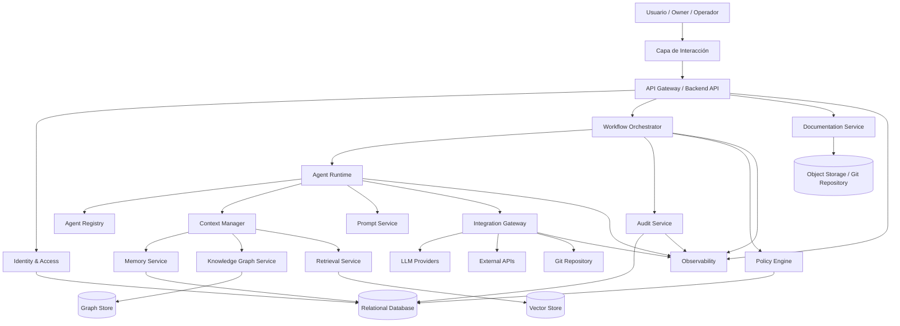
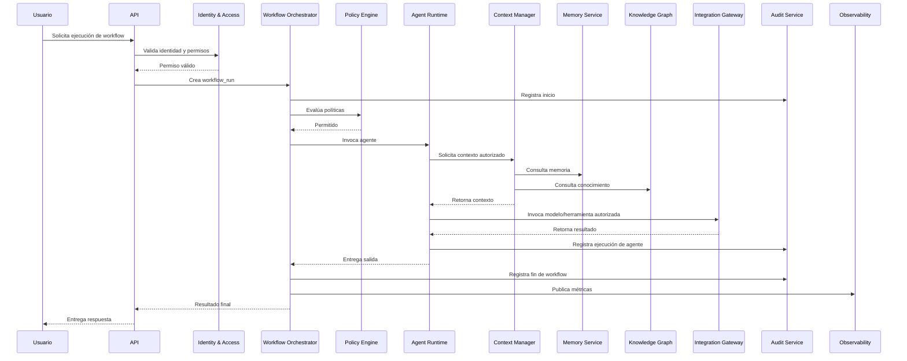
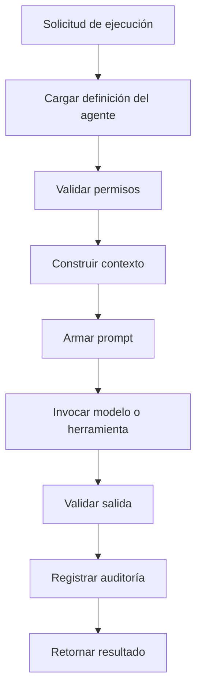
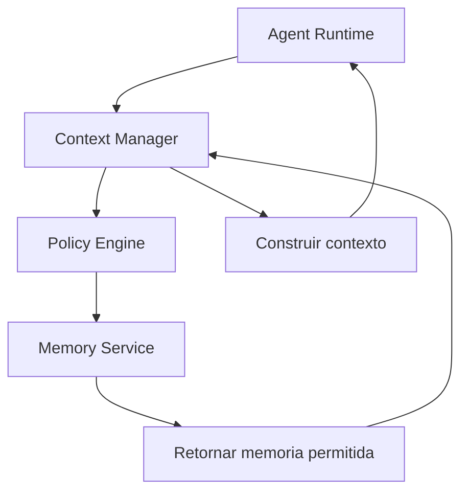
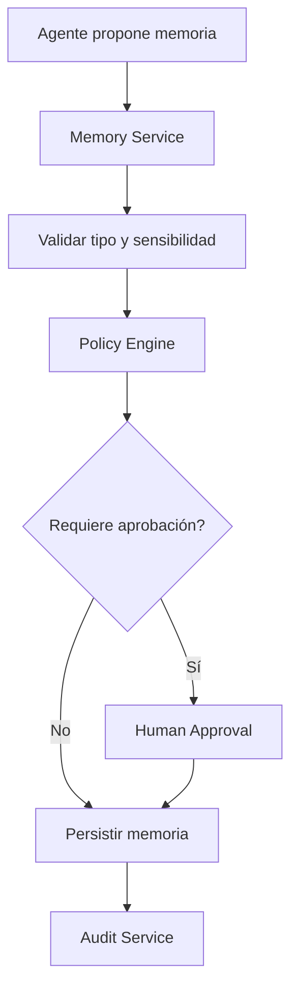

# ORION-011 — Arquitectura del Sistema

**Nivel documental:** L2 — Architecture
**Proyecto:** ORION / XMIP
**Versión:** 1.0
**Estado:** Draft
**Owner:** Fernando Cuellar
**Última actualización:** 2026-07-01
**Ruta sugerida:** `docs/L2-architecture/ORION-011-arquitectura-del-sistema.md`

---

## 1. Propósito

Este documento define la arquitectura del sistema XMIP dentro del marco ORION.

Su propósito es traducir la arquitectura empresarial definida en ORION-010 en un diseño técnico implementable, modular, seguro, observable y preparado para evolucionar.

ORION-011 responde a la pregunta:

> ¿Cómo debe estructurarse técnicamente XMIP para ejecutar agentes, workflows, memoria, conocimiento, auditoría, seguridad e integraciones sin improvisación?

Este documento funciona como puente entre la arquitectura empresarial y los documentos técnicos específicos:

* ORION-012 — Grafo de Conocimiento.
* ORION-013 — Modelo de Datos.
* ORION-014 — Arquitectura de Agentes.
* ORION-014A — Protocolo de Comunicación entre Agentes.
* ORION-014B — Especificación de Agentes Digitales.

---

## 2. Alcance

Este documento cubre:

* Vista general del sistema.
* Capas lógicas de arquitectura.
* Componentes principales.
* Runtime de agentes.
* Orquestación de workflows.
* Comunicación entre componentes.
* Modelo de seguridad técnica.
* Modelo de persistencia.
* Integración con memoria y grafo de conocimiento.
* Auditoría.
* Observabilidad.
* Manejo de errores.
* Ambientes.
* Deployment conceptual.
* Requerimientos no funcionales.
* Riesgos técnicos.
* Roadmap técnico inicial.

Este documento no cubre en detalle:

* Definición completa del grafo de conocimiento.
* Modelo físico completo de base de datos.
* Código fuente.
* Contratos finales de API.
* Implementación específica de cada agente.
* Diseño visual de interfaz.
* Infraestructura cloud final.
* Sprints detallados.

Esos puntos se desarrollan en documentos posteriores.

---

## 3. Contexto

XMIP es una plataforma operativa multiagente diseñada para coordinar agentes digitales, memoria persistente, conocimiento estructurado, workflows, documentos, auditoría e integraciones externas.

La arquitectura del sistema debe resolver un problema central:

> Coordinar razonamiento asistido por IA con operación empresarial gobernada.

Un sistema multiagente sin arquitectura tiende a convertirse en:

* Prompts aislados.
* Agentes con responsabilidades ambiguas.
* Memoria contaminada.
* Flujos imposibles de auditar.
* Costos invisibles.
* Integraciones frágiles.
* Automatización sin control.

XMIP evita ese riesgo mediante una arquitectura basada en:

* Separación de dominios.
* Runtime controlado de agentes.
* Workflows explícitos.
* Contratos de comunicación.
* Memoria gobernada.
* Grafo de conocimiento.
* Auditoría append-only.
* Seguridad por política.
* Observabilidad desde el MVP.

---

## 4. Documentos base

Este documento se apoya en:

* ORION-000 — Project Charter.
* ORION-001 — Visión Estratégica.
* ORION-007 — Flujo Operativo.
* ORION-008 — Guía de Estilo.
* ORION-009 — Principios de Arquitectura Empresarial.
* ORION-010 — Arquitectura Empresarial.

Este documento debe ser usado como base para:

* ORION-012 — Grafo de Conocimiento.
* ORION-013 — Modelo de Datos.
* ORION-014 — Arquitectura de Agentes.
* ORION-014A — Protocolo de Comunicación entre Agentes.
* ORION-014B — Especificación de Agentes Digitales.
* L5 — Sprints de implementación técnica.

---

## 5. Definiciones

### Sistema XMIP

Plataforma técnica que ejecuta workflows multiagente, administra memoria, consulta conocimiento, registra auditoría y genera entregables bajo gobierno ORION.

### Runtime de agentes

Componente encargado de ejecutar agentes bajo reglas, permisos, contexto, herramientas autorizadas y políticas de auditoría.

### Workflow

Secuencia definida de pasos, agentes, validaciones y estados para producir un resultado operativo.

### Orquestador

Componente que coordina workflows, determina pasos, invoca agentes, maneja estados y registra resultados.

### Memoria

Contexto persistente o reutilizable que puede ser consultado por agentes bajo reglas de gobierno.

### Grafo de conocimiento

Modelo estructurado de entidades, relaciones, eventos y decisiones usado para razonamiento y trazabilidad.

### Audit Trail

Registro append-only de acciones, ejecuciones, decisiones, errores, cambios y eventos relevantes.

### Policy Engine

Componente lógico que evalúa reglas de autorización, restricciones, permisos y límites de ejecución.

### Integration Gateway

Capa controlada para acceder a herramientas externas, APIs, modelos de IA, repositorios, almacenamiento y servicios externos.

---

## 6. Principios técnicos aplicables

La arquitectura del sistema debe implementar los principios definidos en ORION-009.

| Principio                                | Aplicación técnica                                       |
| ---------------------------------------- | ---------------------------------------------------------- |
| Documentación antes que implementación | Cada componente debe derivarse de arquitectura documentada |
| Separación de dominios                  | Cada servicio tiene responsabilidad clara                  |
| Trazabilidad por diseño                 | Toda ejecución produce eventos auditables                 |
| Seguridad como guardrail                 | Autorización por usuario, agente, herramienta y dato      |
| Menor privilegio                         | Los agentes solo acceden a capacidades permitidas          |
| Memoria gobernada                        | Lectura/escritura de memoria controlada por política      |
| Conocimiento estructurado                | Entidades y relaciones se modelan explícitamente          |
| Observabilidad obligatoria               | Logs, métricas, trazas y costos desde el MVP              |
| Interoperabilidad por contrato           | APIs, eventos y mensajes tienen esquemas definidos         |
| Evolución incremental                   | El sistema puede crecer por módulos sin reescribir todo   |

---

## 7. Objetivos de arquitectura del sistema

La arquitectura técnica de XMIP debe cumplir los siguientes objetivos:

1. **Ejecutar workflows multiagente de forma controlada.**
2. **Separar claramente agentes, memoria, conocimiento, datos e integraciones.**
3. **Permitir trazabilidad completa de cada ejecución.**
4. **Controlar permisos por usuario, agente, workflow y herramienta.**
5. **Persistir datos críticos con integridad y versionado.**
6. **Representar conocimiento como entidades y relaciones consultables.**
7. **Reducir dependencia directa de proveedores externos.**
8. **Observar operación, errores, latencia, costos y calidad.**
9. **Soportar crecimiento incremental sin romper el modelo base.**
10. **Permitir que cada sprint implemente una pieza arquitectónica identificable.**

---

## 8. Vista general del sistema

La arquitectura general de XMIP se organiza en capas.



### Lectura del diagrama

* El usuario interactúa con XMIP mediante una interfaz.
* La API centraliza entrada, autenticación y autorización.
* El orquestador coordina workflows.
* El runtime ejecuta agentes bajo políticas.
* El contexto se obtiene de memoria, grafo y recuperación semántica.
* Las herramientas externas se consumen mediante una capa controlada.
* Cada operación relevante produce auditoría.
* La observabilidad atraviesa todo el sistema.

---

## 9. Capas lógicas

XMIP se organiza en las siguientes capas:

| Capa                | Responsabilidad                                   |
| ------------------- | ------------------------------------------------- |
| Interaction Layer   | Entrada y salida hacia usuarios humanos           |
| API Layer           | Exposición controlada de capacidades del sistema |
| Security Layer      | Identidad, autorización, permisos y políticas   |
| Workflow Layer      | Orquestación de procesos multiagente             |
| Agent Layer         | Definición, ejecución y control de agentes      |
| Context Layer       | Ensamble de memoria, conocimiento y documentos    |
| Knowledge Layer     | Grafo de conocimiento y recuperación semántica  |
| Data Layer          | Persistencia transaccional y estructurada         |
| Integration Layer   | Herramientas externas, modelos y APIs             |
| Audit Layer         | Registro inmutable de eventos y decisiones        |
| Observability Layer | Logs, métricas, trazas, costos y alertas         |
| Documentation Layer | Documentos versionados y entregables              |

---

## 10. Componentes principales

### 10.1 Interaction Layer

La capa de interacción permite a usuarios humanos solicitar análisis, ejecutar workflows, revisar documentos y aprobar acciones críticas.

Posibles interfaces:

* CLI.
* Web UI.
* Chat UI.
* API client.
* Panel administrativo.
* Integración con repositorio Git.

Responsabilidades:

* Capturar intención del usuario.
* Mostrar resultados.
* Solicitar aprobaciones.
* Mostrar estado de workflows.
* Permitir revisión documental.
* Consultar historial de ejecuciones.

No debe contener lógica crítica de negocio.

---

### 10.2 API Gateway / Backend API

La API es la entrada principal al sistema.

Responsabilidades:

* Validar solicitudes.
* Autenticar usuarios.
* Autorizar operaciones.
* Enrutar hacia servicios internos.
* Normalizar respuestas.
* Aplicar rate limits.
* Registrar eventos básicos.
* Exponer endpoints para workflows, agentes, documentos y auditoría.

Ejemplos conceptuales de endpoints:

```text
POST /workflows/{workflow_id}/runs
GET  /workflows/{workflow_id}/runs/{run_id}
GET  /agents
GET  /agents/{agent_id}
POST /documents/generate
GET  /audit/events
GET  /memory/items
POST /memory/items/propose
GET  /knowledge/entities
POST /approvals/{approval_id}/approve
```

---

### 10.3 Identity & Access Service

Servicio encargado de identidad, roles y permisos.

Responsabilidades:

* Gestionar usuarios.
* Gestionar roles.
* Evaluar permisos.
* Controlar acceso a documentos.
* Controlar acceso a memoria.
* Controlar ejecución de workflows.
* Controlar herramientas disponibles por agente.
* Registrar cambios de permisos.

Modelo inicial de roles:

| Rol       | Permisos generales                      |
| --------- | --------------------------------------- |
| Owner     | Control completo y aprobación crítica |
| Architect | Diseño y revisión arquitectónica     |
| Operator  | Ejecución de workflows autorizados     |
| Reviewer  | Revisión de documentos y resultados    |
| Agent     | Acceso limitado por política           |
| Auditor   | Lectura de eventos y evidencia          |

---

### 10.4 Policy Engine

Componente lógico que evalúa políticas antes de ejecutar acciones sensibles.

Responsabilidades:

* Validar si un usuario puede ejecutar un workflow.
* Validar si un agente puede usar una herramienta.
* Validar si una memoria puede consultarse.
* Validar si una memoria puede escribirse.
* Validar si una acción requiere aprobación humana.
* Validar si una integración está permitida.
* Bloquear acciones fuera de política.

Ejemplo conceptual de política:

```json
{
  "policy_id": "policy_memory_write_approval",
  "resource": "memory",
  "action": "write",
  "condition": {
    "memory_type": "project",
    "sensitivity": "high"
  },
  "requires_approval": true
}
```

---

### 10.5 Workflow Orchestrator

El orquestador coordina la ejecución de workflows.

Responsabilidades:

* Iniciar workflows.
* Crear `workflow_run_id`.
* Resolver pasos.
* Invocar agentes.
* Pasar contexto entre pasos.
* Manejar estados.
* Manejar errores.
* Solicitar aprobación humana cuando aplique.
* Registrar eventos de auditoría.
* Publicar métricas.

Estados mínimos de workflow:

| Estado           | Descripción                      |
| ---------------- | --------------------------------- |
| pending          | Workflow creado, no iniciado      |
| running          | Workflow en ejecución            |
| waiting_approval | Esperando aprobación humana      |
| completed        | Finalizado correctamente          |
| failed           | Falló sin recuperación          |
| cancelled        | Cancelado por usuario o política |
| paused           | Pausado temporalmente             |
| retrying         | Reintentando un paso fallido      |

---

### 10.6 Agent Registry

Registro formal de agentes disponibles.

Responsabilidades:

* Mantener catálogo de agentes.
* Registrar versión de agente.
* Registrar propósito.
* Registrar permisos.
* Registrar herramientas autorizadas.
* Registrar prompt base.
* Registrar límites operativos.
* Registrar owner lógico.
* Exponer metadata al runtime.

Ejemplo conceptual:

```json
{
  "agent_id": "architecture-agent",
  "name": "ArchitectureAgent",
  "version": "1.0.0",
  "status": "active",
  "purpose": "Diseñar estructuras técnicas y validar consistencia arquitectónica",
  "allowed_tools": ["knowledge_query", "document_read", "document_generate"],
  "memory_access": ["project_memory", "architecture_memory"],
  "requires_human_approval_for": ["architecture_change", "official_document_publish"]
}
```

---

### 10.7 Agent Runtime

El runtime ejecuta agentes bajo control del sistema.

Responsabilidades:

* Cargar definición del agente.
* Resolver permisos.
* Construir contexto.
* Aplicar prompt correspondiente.
* Invocar modelo o herramienta.
* Validar salida.
* Registrar ejecución.
* Manejar errores.
* Retornar resultado al workflow.

El runtime no debe permitir que un agente:

* Use herramientas no autorizadas.
* Lea memoria fuera de permiso.
* Escriba memoria sin validación.
* Ejecute acciones críticas sin aprobación.
* Ignore límites de tokens, costo o tiempo.
* Modifique documentos oficiales directamente sin control.

---

### 10.8 Prompt Service

Servicio encargado de versionar y entregar prompts.

Responsabilidades:

* Mantener prompts por agente.
* Mantener prompts por workflow.
* Versionar prompts.
* Registrar cambios.
* Asociar prompt con ejecución.
* Permitir rollback.
* Separar prompt base, instrucciones de tarea y contexto dinámico.

Estructura conceptual:

```json
{
  "prompt_id": "prompt_architecture_agent_base",
  "agent_id": "architecture-agent",
  "version": "1.0.0",
  "status": "approved",
  "template": "...",
  "created_at": "2026-07-01T00:00:00Z"
}
```

---

### 10.9 Context Manager

Componente que construye el contexto que se entrega a un agente.

Responsabilidades:

* Recibir intención del workflow.
* Consultar memoria autorizada.
* Consultar grafo de conocimiento.
* Consultar documentos relevantes.
* Consultar recuperación semántica.
* Aplicar límites de contexto.
* Priorizar información.
* Evitar duplicidad.
* Excluir información no autorizada.
* Registrar qué contexto fue usado.

El Context Manager es crítico porque evita que cada agente arme contexto de forma desordenada.

---

### 10.10 Memory Service

Servicio encargado de memoria persistente.

Responsabilidades:

* Consultar memoria por tipo.
* Proponer nuevas memorias.
* Validar escritura.
* Registrar fuente.
* Registrar fecha.
* Registrar sensibilidad.
* Invalidar memoria obsoleta.
* Auditar lectura y escritura.
* Aplicar permisos por usuario/agente.

Tipos de memoria iniciales:

| Tipo                | Uso                                            |
| ------------------- | ---------------------------------------------- |
| user_memory         | Preferencias y contexto estable del usuario    |
| project_memory      | Decisiones y reglas del proyecto               |
| architecture_memory | Patrones, restricciones y decisiones técnicas |
| operational_memory  | Estado operativo temporal o recurrente         |
| document_memory     | Relación entre documentos y versiones         |
| semantic_memory     | Conceptos reutilizables                        |

---

### 10.11 Knowledge Graph Service

Servicio encargado de entidades, relaciones y eventos estructurados.

Responsabilidades:

* Crear entidades.
* Crear relaciones.
* Consultar relaciones.
* Registrar eventos.
* Relacionar documentos con decisiones.
* Relacionar agentes con capacidades.
* Relacionar workflows con ejecuciones.
* Soportar trazabilidad semántica.
* Exponer consultas al Context Manager.

Ejemplo conceptual:

```json
{
  "source": "ORION-010",
  "relationship": "governs",
  "target": "ORION-011",
  "metadata": {
    "reason": "La arquitectura empresarial define capacidades y dominios que la arquitectura del sistema implementa."
  }
}
```

El detalle completo se define en ORION-012.

---

### 10.12 Retrieval Service

Servicio encargado de recuperación semántica sobre documentos, memoria y conocimiento textual.

Responsabilidades:

* Indexar documentos.
* Generar embeddings.
* Consultar similitud semántica.
* Retornar fragmentos relevantes.
* Aplicar permisos.
* Registrar fuentes usadas.
* Evitar exposición de información no autorizada.

Este servicio complementa al Knowledge Graph, pero no lo reemplaza.

---

### 10.13 Documentation Service

Servicio encargado de documentos y entregables.

Responsabilidades:

* Generar documentos.
* Validar estructura documental.
* Aplicar ORION-008.
* Relacionar documentos.
* Mantener metadata.
* Preparar archivos para Git.
* Registrar cambios.
* Manejar estados documentales.
* Asociar documentos a decisiones y sprints.

Estados documentales:

| Estado     | Uso                  |
| ---------- | -------------------- |
| draft      | Documento inicial    |
| review     | Listo para revisión |
| approved   | Documento oficial    |
| deprecated | Reemplazado          |
| archived   | Histórico           |

---

### 10.14 Audit Service

Servicio de auditoría append-only.

Responsabilidades:

* Registrar eventos de sistema.
* Registrar ejecuciones de agentes.
* Registrar ejecuciones de workflows.
* Registrar accesos a memoria.
* Registrar cambios documentales.
* Registrar decisiones.
* Registrar aprobaciones.
* Registrar errores.
* Registrar invocaciones a herramientas.
* Permitir reconstrucción posterior.

Ejemplo de evento:

```json
{
  "event_id": "evt_001",
  "event_type": "agent_execution_completed",
  "workflow_run_id": "wfr_001",
  "agent_id": "architecture-agent",
  "user_id": "usr_owner",
  "timestamp": "2026-07-01T00:00:00Z",
  "status": "completed",
  "input_hash": "sha256:...",
  "output_hash": "sha256:..."
}
```

---

### 10.15 Observability Service

Servicio encargado de operación visible.

Responsabilidades:

* Capturar logs.
* Capturar métricas.
* Capturar trazas.
* Medir latencia.
* Medir errores.
* Medir costos.
* Medir tokens.
* Medir uso por agente.
* Medir uso por workflow.
* Emitir alertas.
* Generar reportes operativos.

Métricas mínimas:

| Métrica                 | Descripción                 |
| ------------------------ | ---------------------------- |
| agent_execution_count    | Ejecuciones por agente       |
| workflow_execution_count | Ejecuciones por workflow     |
| agent_error_rate         | Tasa de error por agente     |
| workflow_error_rate      | Tasa de error por workflow   |
| avg_execution_latency    | Latencia promedio            |
| token_usage_total        | Uso total de tokens          |
| cost_by_agent            | Costo por agente             |
| cost_by_workflow         | Costo por workflow           |
| memory_reads             | Lecturas de memoria          |
| memory_writes            | Escrituras de memoria        |
| tool_invocations         | Invocaciones externas        |
| approval_wait_time       | Tiempo esperando aprobación |

---

### 10.16 Integration Gateway

Capa controlada para integraciones externas.

Responsabilidades:

* Encapsular llamadas externas.
* Aplicar permisos.
* Manejar credenciales.
* Manejar errores.
* Registrar invocaciones.
* Aplicar límites de uso.
* Proteger secretos.
* Permitir reemplazo de proveedor.
* Exponer herramientas al Agent Runtime bajo contrato.

Integraciones iniciales posibles:

| Integración     | Uso                         |
| ---------------- | --------------------------- |
| LLM Provider     | Razonamiento y generación  |
| Git Repository   | Versionado documental       |
| Database         | Persistencia                |
| Vector Store     | Búsqueda semántica        |
| Graph Store      | Conocimiento estructurado   |
| Object Storage   | Archivos y evidencias       |
| Monitoring Stack | Observabilidad              |
| External APIs    | Herramientas especializadas |

---

### 10.17 Configuration Service

Servicio encargado de configuración del sistema.

Responsabilidades:

* Configuración por ambiente.
* Configuración de modelos.
* Límites de tokens.
* Límites de costo.
* Feature flags.
* Parámetros de workflows.
* Parámetros de agentes.
* Políticas activas.
* Versiones aprobadas.

---

## 11. Flujo de ejecución principal

El flujo general de ejecución en XMIP es el siguiente:



---

## 12. Modelo de ejecución de agentes

Cada ejecución de agente debe seguir un ciclo controlado.

### 12.1 Ciclo de vida



### 12.2 Entrada mínima de ejecución

```json
{
  "agent_id": "architecture-agent",
  "workflow_run_id": "wfr_001",
  "task": "Generar sección de arquitectura del sistema",
  "input": {},
  "requested_by": "usr_owner",
  "context_policy": "architecture_context_v1"
}
```

### 12.3 Salida mínima de ejecución

```json
{
  "agent_execution_id": "agex_001",
  "agent_id": "architecture-agent",
  "workflow_run_id": "wfr_001",
  "status": "completed",
  "output": {},
  "used_context_refs": [],
  "used_tools": [],
  "started_at": "2026-07-01T00:00:00Z",
  "completed_at": "2026-07-01T00:01:20Z"
}
```

---

## 13. Modelo de workflows

Los workflows deben definirse como estructuras versionadas.

### 13.1 Definición conceptual

```json
{
  "workflow_id": "wf_generate_architecture_document",
  "name": "Generate Architecture Document",
  "version": "1.0.0",
  "status": "active",
  "steps": [
    {
      "step_id": "step_001",
      "type": "agent_task",
      "agent_id": "architecture-agent",
      "requires_approval": false
    },
    {
      "step_id": "step_002",
      "type": "validation",
      "validator": "documentation-style-check"
    },
    {
      "step_id": "step_003",
      "type": "human_review",
      "required_role": "Owner"
    }
  ]
}
```

### 13.2 Estados de step

| Estado           | Descripción                |
| ---------------- | --------------------------- |
| pending          | Paso pendiente              |
| running          | Paso en ejecución          |
| completed        | Paso completado             |
| failed           | Paso falló                 |
| skipped          | Paso omitido por condición |
| waiting_approval | Paso esperando aprobación  |
| cancelled        | Paso cancelado              |

---

## 14. Comunicación entre componentes

La comunicación debe ocurrir mediante contratos explícitos.

### 14.1 Tipos de comunicación

| Tipo       | Uso                                              |
| ---------- | ------------------------------------------------ |
| Síncrona  | Solicitudes API, respuestas inmediatas           |
| Asíncrona | Eventos, trabajos largos, procesamiento diferido |
| Interna    | Comunicación entre servicios                    |
| Externa    | Llamadas a APIs, modelos o herramientas          |
| Auditada   | Eventos críticos persistidos                    |

### 14.2 Evento estándar

```json
{
  "event_id": "evt_001",
  "event_type": "workflow_started",
  "source": "workflow-orchestrator",
  "subject_type": "workflow_run",
  "subject_id": "wfr_001",
  "timestamp": "2026-07-01T00:00:00Z",
  "payload": {},
  "correlation_id": "corr_001",
  "causation_id": "evt_000"
}
```

### 14.3 Correlation ID

Toda ejecución debe usar `correlation_id` para rastrear operaciones distribuidas.

Ejemplo:

```text
Usuario solicita documento
→ API recibe solicitud
→ Workflow inicia
→ Agente ejecuta
→ Memoria consulta
→ LLM responde
→ Documento se genera
→ Auditoría registra todo con el mismo correlation_id
```

---

## 15. Arquitectura de datos

La arquitectura de datos se divide en varios tipos de almacenamiento.

| Almacenamiento      | Uso                                                             |
| ------------------- | --------------------------------------------------------------- |
| Relational Database | Datos transaccionales, usuarios, agentes, workflows, auditoría |
| Graph Store         | Entidades y relaciones del conocimiento                         |
| Vector Store        | Recuperación semántica                                        |
| Object Storage      | Documentos, archivos, evidencias                                |
| Git Repository      | Versionado documental y técnico                                |
| Cache               | Contexto temporal, sesiones y resultados efímeros              |

### 15.1 Regla base

No todo debe ir a una sola base de datos.

Cada tipo de dato debe persistirse donde tenga sentido operativo:

* Transacciones en base relacional.
* Relaciones en grafo.
* Similitud semántica en vector store.
* Archivos en object storage.
* Documentos oficiales en Git.

El modelo detallado se define en ORION-013.

---

## 16. Integración con grafo de conocimiento

El grafo de conocimiento debe integrarse como una capacidad central, no como accesorio.

Usos principales:

* Relacionar documentos.
* Relacionar decisiones.
* Relacionar agentes.
* Relacionar capacidades.
* Relacionar workflows.
* Relacionar riesgos.
* Relacionar eventos.
* Consultar dependencias.
* Alimentar contexto a agentes.

Ejemplo de consulta conceptual:

```text
¿Qué documentos gobiernan al Agent Runtime?
¿Qué riesgos están asociados con Memory Service?
¿Qué workflows implementan CAP-004 Memoria Gobernada?
¿Qué decisiones afectaron ORION-011?
```

El diseño completo se define en ORION-012.

---

## 17. Integración con memoria

La memoria debe ser controlada por el Memory Service y consumida por el Context Manager.

Los agentes no deben leer memoria directamente sin control.

### 17.1 Flujo de lectura de memoria



### 17.2 Flujo de escritura de memoria



---

## 18. Seguridad técnica

La seguridad debe implementarse en varias capas.

### 18.1 Capas de seguridad

| Capa         | Control                                        |
| ------------ | ---------------------------------------------- |
| Usuario      | Autenticación, rol, permisos                  |
| API          | Validación, rate limit, autorización         |
| Workflow     | Permiso de ejecución y aprobación            |
| Agente       | Permisos por rol funcional                     |
| Herramienta  | Lista de herramientas permitidas               |
| Memoria      | Acceso por tipo y sensibilidad                 |
| Documento    | Control por estado y owner                     |
| Datos        | Seguridad por dominio                          |
| Integración | Credenciales y contratos                       |
| Auditoría   | Append-only y protección contra modificación |

### 18.2 Reglas mínimas

* Ningún agente tiene permisos globales.
* Ninguna herramienta externa se invoca sin autorización.
* Ninguna memoria sensible se entrega sin política.
* Ninguna acción crítica se ejecuta sin aprobación.
* Ningún secreto se expone al agente.
* Ninguna auditoría crítica se modifica.
* Ningún documento aprobado se cambia sin registro.

---

## 19. Gestión de secretos

Los secretos deben administrarse fuera del código y fuera de prompts.

Secretos típicos:

* API keys.
* Tokens.
* Credenciales de base de datos.
* Llaves de cifrado.
* Webhooks.
* Credenciales de proveedores LLM.
* Credenciales de Git.
* Credenciales de almacenamiento.

Reglas:

* Nunca guardar secretos en documentos.
* Nunca pasar secretos completos a agentes.
* Nunca exponer secretos en logs.
* Usar variables de entorno o secret manager.
* Rotar secretos periódicamente.
* Registrar uso de integraciones sensibles.

---

## 20. Observabilidad técnica

XMIP debe diseñarse para ser operable desde el inicio.

### 20.1 Logs

Cada log relevante debe incluir:

* timestamp.
* level.
* service.
* correlation_id.
* workflow_run_id.
* agent_execution_id, si aplica.
* event_type.
* status.
* error_code, si aplica.

### 20.2 Métricas

Métricas mínimas:

* Requests por endpoint.
* Latencia por endpoint.
* Ejecuciones por workflow.
* Ejecuciones por agente.
* Errores por agente.
* Errores por workflow.
* Tokens consumidos.
* Costo estimado.
* Lecturas de memoria.
* Escrituras de memoria.
* Consultas al grafo.
* Consultas al vector store.
* Invocaciones externas.
* Reintentos.
* Timeouts.

### 20.3 Trazas

Las trazas deben permitir seguir una ejecución completa:

```text
API request
→ authorization
→ workflow start
→ context build
→ memory query
→ graph query
→ agent execution
→ tool invocation
→ output validation
→ audit event
→ response
```

---

## 21. Manejo de errores

Los errores deben clasificarse y manejarse de forma explícita.

| Categoría          | Ejemplo                          | Acción esperada             |
| ------------------- | -------------------------------- | ---------------------------- |
| validation_error    | Entrada inválida                | Rechazar solicitud           |
| authorization_error | Permiso insuficiente             | Bloquear acción             |
| policy_violation    | Acción fuera de política       | Bloquear y auditar           |
| agent_error         | Agente no produce salida válida | Reintento o fallo controlado |
| model_error         | Fallo proveedor LLM              | Retry, fallback o error      |
| memory_error        | Memoria no disponible            | Degradar contexto            |
| graph_error         | Grafo no disponible              | Continuar si no es crítico  |
| integration_error   | API externa falla                | Retry o fallback             |
| timeout_error       | Tiempo excedido                  | Cancelar o reintentar        |
| persistence_error   | Base de datos falla              | Fallar de forma segura       |

### 21.1 Formato estándar de error

```json
{
  "error_id": "err_001",
  "error_code": "policy_violation",
  "message": "Agent is not allowed to write high sensitivity memory.",
  "correlation_id": "corr_001",
  "timestamp": "2026-07-01T00:00:00Z",
  "recoverable": false
}
```

---

## 22. Resiliencia

XMIP debe asumir fallos desde el diseño.

### 22.1 Estrategias de resiliencia

| Estrategia           | Uso                                  |
| -------------------- | ------------------------------------ |
| Retry controlado     | Fallos temporales                    |
| Circuit breaker      | Integraciones inestables             |
| Timeout              | Evitar procesos colgados             |
| Fallback             | Alternativa cuando falla un servicio |
| Graceful degradation | Operar con capacidad reducida        |
| Idempotencia         | Evitar duplicados en reintentos      |
| Dead-letter queue    | Eventos fallidos para revisión      |
| Checkpointing        | Retomar workflows largos             |
| Human escalation     | Fallos que requieren intervención   |

### 22.2 Regla base

El sistema debe fallar de forma segura, explícita y auditable.

No debe fallar silenciosamente.

---

## 23. Ambientes

XMIP debe separar ambientes desde el inicio.

| Ambiente | Uso                              |
| -------- | -------------------------------- |
| local    | Desarrollo individual            |
| dev      | Integración temprana            |
| staging  | Validación previa a producción |
| prod     | Operación real                  |

### 23.1 Reglas por ambiente

| Regla                  |    local |     dev |  staging | prod |
| ---------------------- | -------: | ------: | -------: | ---: |
| Datos reales           |       No |      No | Limitado |  Sí |
| Secretos reales        |       No |      No | Limitado |  Sí |
| Auditoría             |  Básica |     Sí |      Sí |  Sí |
| Observabilidad         |  Básica |     Sí |      Sí |  Sí |
| Aprobación humana     | Simulada | Parcial |      Sí |  Sí |
| Integraciones externas |     Mock | Parcial |      Sí |  Sí |

---

## 24. Deployment conceptual

La arquitectura inicial puede implementarse como un monolito modular o como servicios separados.

### 24.1 Recomendación inicial

Para MVP, usar **monolito modular** con separación interna clara.

Motivo:

* Reduce complejidad operativa.
* Permite avanzar más rápido.
* Mantiene límites lógicos.
* Facilita pruebas.
* Evita distribuir prematuramente el sistema.

### 24.2 Evolución futura

Cuando el sistema crezca, algunos módulos pueden separarse:

* Agent Runtime.
* Workflow Orchestrator.
* Memory Service.
* Knowledge Graph Service.
* Audit Service.
* Integration Gateway.

### 24.3 Regla

Aunque la primera implementación sea monolito modular, los límites de dominio deben respetarse desde el código.

---

## 25. Módulos iniciales recomendados

Estructura lógica sugerida:

```text
xmip/
├── api/
├── auth/
├── policies/
├── workflows/
├── agents/
├── runtime/
├── prompts/
├── context/
├── memory/
├── knowledge/
├── retrieval/
├── documents/
├── audit/
├── observability/
├── integrations/
├── config/
├── database/
└── tests/
```

### 25.1 Responsabilidad por módulo

| Módulo       | Responsabilidad                       |
| ------------- | ------------------------------------- |
| api           | Endpoints y validación de entrada    |
| auth          | Identidad, roles y permisos           |
| policies      | Reglas de autorización y control     |
| workflows     | Definición y ejecución de workflows |
| agents        | Definición de agentes                |
| runtime       | Ejecución controlada de agentes      |
| prompts       | Versionado y plantillas de prompts    |
| context       | Construcción de contexto             |
| memory        | Memoria persistente                   |
| knowledge     | Grafo de conocimiento                 |
| retrieval     | Búsqueda semántica                  |
| documents     | Generación y gestión documental     |
| audit         | Eventos y trazabilidad                |
| observability | Logs, métricas y trazas              |
| integrations  | Herramientas externas                 |
| config        | Configuración y feature flags        |
| database      | Modelos, migraciones y persistencia   |
| tests         | Pruebas automatizadas                 |

---

## 26. API conceptual inicial

### 26.1 Workflows

```text
POST /workflows/{workflow_id}/runs
GET  /workflow-runs/{workflow_run_id}
POST /workflow-runs/{workflow_run_id}/cancel
POST /workflow-runs/{workflow_run_id}/approve
```

### 26.2 Agentes

```text
GET  /agents
GET  /agents/{agent_id}
POST /agents/{agent_id}/execute
```

### 26.3 Documentos

```text
GET  /documents
GET  /documents/{document_id}
POST /documents/generate
POST /documents/{document_id}/review
POST /documents/{document_id}/approve
```

### 26.4 Memoria

```text
GET  /memory/items
POST /memory/items/propose
POST /memory/items/{memory_id}/approve
POST /memory/items/{memory_id}/invalidate
```

### 26.5 Conocimiento

```text
GET  /knowledge/entities
GET  /knowledge/entities/{entity_id}
GET  /knowledge/relationships
POST /knowledge/query
```

### 26.6 Auditoría

```text
GET /audit/events
GET /audit/events/{event_id}
GET /audit/workflow-runs/{workflow_run_id}
GET /audit/agent-executions/{agent_execution_id}
```

---

## 27. Requerimientos no funcionales

| Categoría     | Requerimiento                                                     |
| -------------- | ----------------------------------------------------------------- |
| Seguridad      | Control de acceso por usuario, rol, agente, herramienta y memoria |
| Auditoría     | Registro append-only de eventos críticos                         |
| Trazabilidad   | Uso obligatorio de correlation_id                                 |
| Observabilidad | Logs, métricas, trazas y costos                                  |
| Escalabilidad  | Capacidad de agregar agentes y workflows                          |
| Mantenibilidad | Módulos con límites claros                                      |
| Resiliencia    | Manejo explícito de errores y timeouts                           |
| Versionado     | Prompts, agentes, workflows y documentos versionados              |
| Portabilidad   | Evitar dependencia innecesaria de proveedor                       |
| Testabilidad   | Pruebas unitarias, integración y contrato                        |
| Operabilidad   | Runbooks y diagnósticos básicos                                 |
| Gobernanza     | Políticas y aprobaciones para acciones críticas                 |

---

## 28. Pruebas requeridas

La arquitectura debe permitir pruebas desde el inicio.

### 28.1 Tipos de pruebas

| Tipo                | Objetivo                               |
| ------------------- | -------------------------------------- |
| Unit tests          | Validar lógica de módulos            |
| Integration tests   | Validar interacción entre componentes |
| Contract tests      | Validar APIs, eventos y esquemas       |
| Policy tests        | Validar permisos y restricciones       |
| Workflow tests      | Validar flujos completos               |
| Agent tests         | Validar comportamiento de agentes      |
| Memory tests        | Validar lectura/escritura gobernada    |
| Audit tests         | Validar eventos generados              |
| Observability tests | Validar logs y métricas               |
| Failure tests       | Validar fallos controlados             |

### 28.2 Regla mínima

Todo workflow crítico debe tener prueba de éxito, prueba de error y prueba de autorización.

---

## 29. Roadmap técnico inicial

### Fase 1 — Foundation

Objetivo: base ejecutable mínima.

Incluye:

* Estructura de repositorio.
* Configuración de ambientes.
* API base.
* Base de datos inicial.
* Audit Service básico.
* Agent Registry inicial.
* Workflow Orchestrator básico.
* Runtime de agente simple.
* Logs estructurados.

### Fase 2 — Governance Core

Objetivo: control y trazabilidad.

Incluye:

* Identity & Access.
* Policy Engine.
* Permisos por agente.
* Permisos por herramienta.
* Estados de workflow.
* Aprobaciones humanas.
* Auditoría extendida.
* Versionado de prompts.

### Fase 3 — Context & Memory

Objetivo: contexto gobernado.

Incluye:

* Memory Service.
* Context Manager.
* Reglas de lectura/escritura.
* Auditoría de memoria.
* Validación de sensibilidad.
* Recuperación documental inicial.

### Fase 4 — Knowledge Layer

Objetivo: conocimiento estructurado.

Incluye:

* Knowledge Graph Service.
* Entidades principales.
* Relaciones principales.
* Eventos semánticos.
* Consultas al grafo.
* Integración con Context Manager.

### Fase 5 — Observability & Operations

Objetivo: operación controlada.

Incluye:

* Métricas.
* Trazas.
* Costos.
* Dashboard operativo.
* Alertas.
* Runbooks.
* Reportes de ejecución.

### Fase 6 — Advanced Multi-Agent

Objetivo: operación multiagente madura.

Incluye:

* Workflows multiagente.
* Comunicación agente-agente.
* Validación cruzada.
* Delegación controlada.
* Reintentos inteligentes.
* Evaluación de calidad.
* Optimización de costo.

---

## 30. Decisiones arquitectónicas iniciales

### 30.1 Monolito modular primero

**Decisión:** iniciar con monolito modular.

**Justificación:** reduce complejidad y permite validar dominios antes de distribuir servicios.

**Riesgo:** acoplamiento si no se respetan límites internos.

**Mitigación:** módulos separados, contratos internos y pruebas por dominio.

---

### 30.2 Auditoría desde el MVP

**Decisión:** incluir Audit Service desde la primera fase.

**Justificación:** la trazabilidad es principio no negociable.

**Riesgo:** mayor esfuerzo inicial.

**Mitigación:** empezar con eventos mínimos y extender progresivamente.

---

### 30.3 Agentes sin acceso directo a memoria

**Decisión:** los agentes no consultan memoria directamente; usan Context Manager.

**Justificación:** evita acceso no gobernado y contaminación contextual.

**Riesgo:** mayor complejidad en construcción de contexto.

**Mitigación:** políticas simples al inicio y expansión gradual.

---

### 30.4 Integration Gateway obligatorio

**Decisión:** toda herramienta externa se invoca mediante Integration Gateway.

**Justificación:** permite permisos, auditoría, fallback y reemplazo de proveedor.

**Riesgo:** más trabajo que llamadas directas.

**Mitigación:** wrappers simples al inicio.

---

### 30.5 Versionado de prompts

**Decisión:** prompts versionados desde el inicio.

**Justificación:** los resultados de agentes deben ser reproducibles y auditables.

**Riesgo:** disciplina adicional.

**Mitigación:** usar metadata mínima de versión en cada ejecución.

---

## 31. Riesgos técnicos

| Riesgo                                | Impacto | Probabilidad | Mitigación                               |
| ------------------------------------- | ------: | -----------: | ----------------------------------------- |
| Runtime de agentes demasiado flexible |    Alto |        Media | Permisos estrictos y Agent Registry       |
| Workflows difíciles de depurar       |    Alto |        Media | correlation_id, auditoría y trazas       |
| Memoria contaminada                   |    Alto |         Alta | Context Manager y políticas de escritura |
| Costos de LLM invisibles              |   Medio |         Alta | Métricas por agente y workflow           |
| Integraciones frágiles               |   Medio |        Media | Integration Gateway                       |
| Acoplamiento en monolito modular      |   Medio |        Media | Límites de módulo y pruebas             |
| Grafo de conocimiento sobrediseñado  |   Medio |        Media | Empezar con entidades mínimas            |
| Falta de pruebas de políticas        |    Alto |        Media | Policy tests desde Fase 2                 |
| Documentos desconectados del sistema  |    Alto |        Media | Documentation Service y metadata          |
| Exceso de automatización temprana    |    Alto |        Media | Aprobaciones humanas                      |

---

## 32. Antipatrones técnicos prohibidos

XMIP debe evitar:

* Agente único con todas las responsabilidades.
* Prompts sin versión.
* Herramientas externas llamadas directamente desde agentes.
* Memoria escrita sin validación.
* Workflows sin estados.
* Eventos sin correlation_id.
* Auditoría modificable.
* Secretos dentro de prompts.
* Logs sin contexto.
* Sprints sin relación arquitectónica.
* Base de datos usada como basurero universal.
* Grafo de conocimiento sin modelo.
* Automatización crítica sin aprobación humana.

---

## 33. Criterios de aceptación

Este documento se considera aceptado cuando:

* [ ] Define la vista general del sistema.
* [ ] Define capas lógicas.
* [ ] Define componentes principales.
* [ ] Define responsabilidades por componente.
* [ ] Define flujo de ejecución principal.
* [ ] Define modelo de ejecución de agentes.
* [ ] Define modelo de workflows.
* [ ] Define comunicación por contratos.
* [ ] Define integración con memoria.
* [ ] Define integración con grafo de conocimiento.
* [ ] Define seguridad técnica.
* [ ] Define observabilidad técnica.
* [ ] Define manejo de errores.
* [ ] Define resiliencia.
* [ ] Define ambientes.
* [ ] Define deployment conceptual.
* [ ] Define módulos iniciales.
* [ ] Define API conceptual inicial.
* [ ] Define requerimientos no funcionales.
* [ ] Define roadmap técnico inicial.
* [ ] Define decisiones arquitectónicas iniciales.
* [ ] Define riesgos técnicos.
* [ ] Permite derivar sprints de implementación.

---

## 34. Relación con otros documentos

Este documento se apoya en:

* ORION-008 — Guía de Estilo.
* ORION-009 — Principios de Arquitectura Empresarial.
* ORION-010 — Arquitectura Empresarial.

Este documento gobierna directamente:

* ORION-012 — Grafo de Conocimiento.
* ORION-013 — Modelo de Datos.
* ORION-014 — Arquitectura de Agentes.
* ORION-014A — Protocolo de Comunicación entre Agentes.
* ORION-014B — Especificación de Agentes Digitales.
* L5 — Sprints de implementación técnica.

---

## 35. Próximos pasos

Después de aprobar ORION-011, continuar con:

1. ORION-012 — Grafo de Conocimiento.
2. ORION-013 — Modelo de Datos.
3. ORION-014 — Arquitectura de Agentes.
4. ORION-014A — Protocolo de Comunicación entre Agentes.
5. ORION-014B — Especificación de Agentes Digitales.

El siguiente documento recomendado es **ORION-012 — Grafo de Conocimiento**, porque define cómo XMIP representará conocimiento, entidades, relaciones, eventos, documentos, decisiones, memoria y trazabilidad semántica.

---

## 36. Historial de cambios

| Versión | Fecha      | Cambio                                       | Autor            |
| -------- | ---------- | -------------------------------------------- | ---------------- |
| 1.0      | 2026-07-01 | Versión inicial de arquitectura del sistema | Fernando Cuellar |
