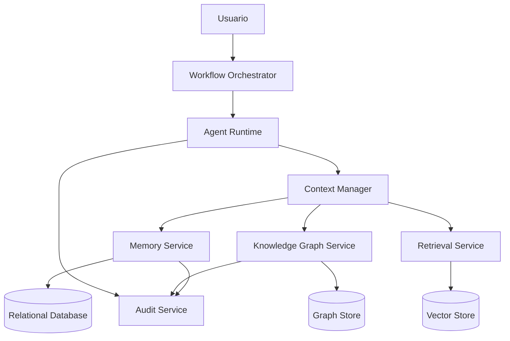
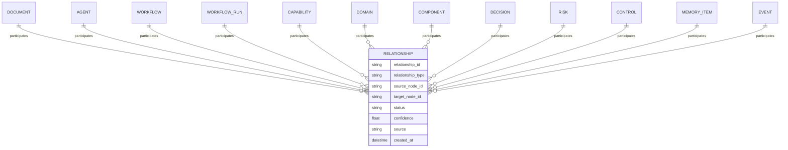

# ORION-012 — Grafo de Conocimiento

**Nivel documental:** L2 — Architecture
**Proyecto:** ORION / XMIP
**Versión:** 1.0
**Estado:** Draft
**Owner:** Fernando Cuellar
**Última actualización:** 2026-07-01
**Ruta sugerida:** `docs/L2-architecture/ORION-012-grafo-de-conocimiento.md`

---

## 1. Propósito

Este documento define la arquitectura del Grafo de Conocimiento de XMIP dentro del marco ORION.

Su propósito es establecer cómo XMIP representa conocimiento estructurado mediante entidades, relaciones, eventos, decisiones, documentos, agentes, capacidades, dominios, workflows y memoria.

ORION-012 responde a la pregunta:

> ¿Cómo debe XMIP representar conocimiento para que los agentes puedan razonar, consultar contexto, auditar decisiones y mantener trazabilidad semántica sin depender únicamente de texto libre?

El Grafo de Conocimiento no debe ser un repositorio caótico de información.
Debe ser una estructura gobernada, consultable, versionada y alineada con la arquitectura empresarial y técnica de XMIP.

---

## 2. Alcance

Este documento cubre:

* Objetivos del Grafo de Conocimiento.
* Principios de diseño.
* Entidades principales.
* Tipos de nodos.
* Tipos de relaciones.
* Tipos de eventos.
* Propiedades mínimas.
* Reglas de escritura.
* Reglas de lectura.
* Integración con agentes.
* Integración con memoria.
* Integración con documentos.
* Integración con auditoría.
* Integración con workflows.
* Consultas semánticas esperadas.
* Gobierno del grafo.
* Seguridad y permisos.
* Riesgos y mitigaciones.
* Criterios de aceptación.

Este documento no cubre:

* Modelo físico completo de base de datos.
* Selección definitiva de motor de grafo.
* Implementación de consultas específicas.
* Código.
* Migraciones.
* Infraestructura cloud.
* Sprints detallados.

El modelo de datos persistente se define en:

* ORION-013 — Modelo de Datos.

---

## 3. Documentos base

Este documento se apoya en:

* ORION-008 — Guía de Estilo.
* ORION-009 — Principios de Arquitectura Empresarial.
* ORION-010 — Arquitectura Empresarial.
* ORION-011 — Arquitectura del Sistema.

Este documento gobierna o alimenta directamente:

* ORION-013 — Modelo de Datos.
* ORION-014 — Arquitectura de Agentes.
* ORION-014A — Protocolo de Comunicación entre Agentes.
* ORION-014B — Especificación de Agentes Digitales.
* L5 — Sprints de implementación relacionados con conocimiento, memoria y trazabilidad.

---

## 4. Contexto

XMIP requiere más que documentos y prompts.

Un sistema multiagente necesita saber:

* Qué documentos existen.
* Qué documento gobierna a otro.
* Qué agente produce qué entregable.
* Qué workflow usa qué agentes.
* Qué decisión afectó qué componente.
* Qué riesgo está asociado a qué capacidad.
* Qué memoria se relaciona con qué proyecto.
* Qué evento ocurrió durante una ejecución.
* Qué política bloqueó una acción.
* Qué sprint implementa qué capacidad.

Si esa información vive solo como texto libre, los agentes pueden leerla, pero no consultarla de forma confiable.

El Grafo de Conocimiento resuelve esto representando conocimiento como:

```text
Entidad → Relación → Entidad
```

Ejemplo:

```text
ORION-009 governs ORION-010
ArchitectureAgent produces ArchitectureDocument
WorkflowRun uses Agent
Risk mitigated_by Control
Sprint implements Capability
MemoryItem derived_from Document
```

Esto permite a XMIP consultar dependencias, razonar sobre contexto, validar consistencia y auditar el origen de una decisión.

---

## 5. Definiciones

### Grafo de Conocimiento

Estructura que representa conocimiento mediante nodos, relaciones y propiedades.

### Nodo

Entidad identificable dentro del grafo.

Ejemplos:

* Documento.
* Agente.
* Workflow.
* Decisión.
* Riesgo.
* Capacidad.
* Dominio.
* Evento.
* Memoria.
* Usuario.

### Relación

Conexión tipificada entre dos nodos.

Ejemplos:

* governs.
* depends_on.
* produces.
* consumes.
* implements.
* mitigates.
* triggered_by.
* approved_by.

### Propiedad

Atributo asociado a un nodo o relación.

Ejemplos:

* name.
* status.
* version.
* created_at.
* owner.
* sensitivity.
* confidence.
* source.

### Evento

Registro de algo que ocurrió en el sistema y que puede conectarse con entidades relevantes.

Ejemplos:

* Workflow iniciado.
* Agente ejecutado.
* Documento generado.
* Decisión aprobada.
* Memoria actualizada.
* Política violada.

### Trazabilidad semántica

Capacidad de reconstruir relaciones de significado entre entidades, decisiones, documentos, agentes, eventos y resultados.

### Knowledge Assertion

Afirmación estructurada registrada en el grafo.

Ejemplo:

```json
{
  "subject": "ORION-011",
  "predicate": "implements",
  "object": "ORION-010",
  "confidence": 1.0,
  "source": "ORION-011",
  "created_at": "2026-07-01T00:00:00Z"
}
```

---

## 6. Principios de diseño

El Grafo de Conocimiento de XMIP debe seguir estos principios.

### 6.1 Conocimiento importante debe estructurarse

Si una relación debe poder consultarse, auditarse o reutilizarse, no debe quedarse solo en texto libre.

### 6.2 El grafo no reemplaza la base relacional

La base relacional mantiene consistencia transaccional.
El grafo representa relaciones semánticas y dependencias.

### 6.3 El grafo no reemplaza la memoria

La memoria guarda contexto reutilizable.
El grafo conecta ese contexto con entidades, documentos, decisiones y eventos.

### 6.4 El grafo no reemplaza el vector store

El vector store recupera contenido por similitud semántica.
El grafo permite recorrer relaciones explícitas y verificables.

### 6.5 Toda relación debe tener significado operativo

No se deben crear relaciones decorativas.

Una relación válida debe ayudar a:

* Consultar.
* Decidir.
* Auditar.
* Validar.
* Ejecutar.
* Gobernar.
* Diagnosticar.

### 6.6 Toda afirmación debe tener fuente

Cada nodo o relación crítica debe indicar de dónde proviene.

### 6.7 El grafo debe ser gobernado

No cualquier agente puede crear o modificar conocimiento persistente sin reglas.

### 6.8 El grafo debe evolucionar incrementalmente

El modelo inicial debe ser simple, pero preparado para crecer.

---

## 7. Objetivos del Grafo de Conocimiento

El Grafo de Conocimiento debe permitir a XMIP:

1. Representar entidades clave del sistema.
2. Relacionar documentos, agentes, workflows, decisiones y capacidades.
3. Consultar dependencias entre componentes.
4. Construir contexto relevante para agentes.
5. Auditar el origen de decisiones y entregables.
6. Detectar inconsistencias documentales.
7. Identificar riesgos asociados a dominios y capacidades.
8. Conectar memoria con documentos y eventos.
9. Soportar razonamiento multiagente.
10. Derivar tareas de implementación desde arquitectura documentada.
11. Evitar pérdida de contexto entre documentos y sprints.
12. Mejorar recuperación de información con relaciones explícitas.

---

## 8. Ubicación del grafo dentro de XMIP

El Grafo de Conocimiento forma parte de la capa de conocimiento definida en ORION-011.



### Lectura del diagrama

* Los agentes no consultan el grafo directamente sin control.
* El Context Manager decide qué conocimiento entregar.
* El Knowledge Graph Service expone consultas gobernadas.
* Las escrituras relevantes al grafo se auditan.
* El grafo complementa memoria, recuperación semántica y datos relacionales.

---

## 9. Modelo conceptual del grafo

El grafo se compone de:

```text
Nodos + Relaciones + Propiedades + Eventos + Fuentes + Políticas
```

### 9.1 Patrón básico

```text
(source_node)-[relationship_type]->(target_node)
```

Ejemplo:

```text
(ORION-009)-[governs]->(ORION-010)
(ArchitectureAgent)-[produces]->(ArchitectureDocument)
(Workflow)-[uses]->(Agent)
(Risk)-[mitigated_by]->(Control)
(Sprint)-[implements]->(Capability)
```

### 9.2 Afirmación estructurada

```json
{
  "subject": {
    "type": "Document",
    "id": "ORION-009"
  },
  "predicate": "governs",
  "object": {
    "type": "Document",
    "id": "ORION-010"
  },
  "properties": {
    "source": "ORION-009",
    "confidence": 1.0,
    "created_at": "2026-07-01T00:00:00Z",
    "created_by": "ArchitectureAgent"
  }
}
```

---

## 10. Tipos de nodos principales

### 10.1 Node: Document

Representa documentos oficiales de ORION / XMIP.

Ejemplos:

* ORION-008 — Guía de Estilo.
* ORION-009 — Principios de Arquitectura Empresarial.
* ORION-010 — Arquitectura Empresarial.
* ORION-011 — Arquitectura del Sistema.
* ORION-012 — Grafo de Conocimiento.

Propiedades mínimas:

```json
{
  "document_id": "ORION-012",
  "title": "Grafo de Conocimiento",
  "level": "L2",
  "status": "Draft",
  "version": "1.0",
  "owner": "Fernando Cuellar",
  "path": "docs/L2-architecture/ORION-012-grafo-de-conocimiento.md",
  "last_updated": "2026-07-01"
}
```

---

### 10.2 Node: Agent

Representa un agente digital definido dentro de XMIP.

Ejemplos:

* StrategyAgent.
* ArchitectureAgent.
* ResearchAgent.
* MemoryAgent.
* KnowledgeAgent.
* AuditAgent.
* DocumentationAgent.

Propiedades mínimas:

```json
{
  "agent_id": "architecture-agent",
  "name": "ArchitectureAgent",
  "version": "1.0.0",
  "status": "active",
  "domain": "Agent Domain",
  "owner": "Fernando Cuellar"
}
```

---

### 10.3 Node: Capability

Representa una capacidad empresarial o técnica.

Ejemplos:

* Gobierno documental.
* Gestión de agentes.
* Orquestación de workflows.
* Memoria gobernada.
* Grafo de conocimiento.
* Auditoría.
* Observabilidad.

Propiedades mínimas:

```json
{
  "capability_id": "CAP-005",
  "name": "Grafo de conocimiento",
  "priority": "High",
  "description": "Representar entidades, relaciones, eventos y decisiones."
}
```

---

### 10.4 Node: Domain

Representa un dominio funcional definido en la arquitectura empresarial o del sistema.

Ejemplos:

* Documentation Domain.
* Agent Domain.
* Workflow Domain.
* Memory Domain.
* Knowledge Domain.
* Audit Domain.
* Observability Domain.
* Security Domain.

Propiedades mínimas:

```json
{
  "domain_id": "knowledge-domain",
  "name": "Knowledge Domain",
  "description": "Responsable de entidades, relaciones y conocimiento estructurado.",
  "owner": "Architecture"
}
```

---

### 10.5 Node: Workflow

Representa una definición versionada de workflow.

Ejemplos:

* GenerateArchitectureDocument.
* ReviewDocument.
* ExecuteAgentTask.
* UpdateMemory.
* RegisterDecision.

Propiedades mínimas:

```json
{
  "workflow_id": "wf_generate_architecture_document",
  "name": "Generate Architecture Document",
  "version": "1.0.0",
  "status": "active",
  "requires_approval": true
}
```

---

### 10.6 Node: WorkflowRun

Representa una ejecución concreta de un workflow.

Propiedades mínimas:

```json
{
  "workflow_run_id": "wfr_001",
  "workflow_id": "wf_generate_architecture_document",
  "status": "completed",
  "started_at": "2026-07-01T00:00:00Z",
  "completed_at": "2026-07-01T00:05:00Z",
  "correlation_id": "corr_001"
}
```

---

### 10.7 Node: AgentExecution

Representa una ejecución concreta de un agente.

Propiedades mínimas:

```json
{
  "agent_execution_id": "agex_001",
  "agent_id": "architecture-agent",
  "workflow_run_id": "wfr_001",
  "status": "completed",
  "started_at": "2026-07-01T00:01:00Z",
  "completed_at": "2026-07-01T00:02:30Z",
  "correlation_id": "corr_001"
}
```

---

### 10.8 Node: Decision

Representa una decisión estratégica, arquitectónica, técnica u operativa.

Ejemplos:

* Usar monolito modular para MVP.
* Incluir auditoría desde la primera fase.
* Bloquear acceso directo de agentes a memoria.
* Versionar prompts desde el inicio.

Propiedades mínimas:

```json
{
  "decision_id": "dec_001",
  "title": "Usar monolito modular primero",
  "type": "architecture",
  "status": "approved",
  "owner": "Fernando Cuellar",
  "decision_date": "2026-07-01"
}
```

---

### 10.9 Node: Risk

Representa un riesgo identificado.

Ejemplos:

* Memoria contaminada.
* Agentes con permisos excesivos.
* Workflows sin trazabilidad.
* Costos invisibles.
* Integraciones frágiles.

Propiedades mínimas:

```json
{
  "risk_id": "risk_memory_contamination",
  "title": "Memoria contaminada",
  "impact": "High",
  "probability": "High",
  "status": "open"
}
```

---

### 10.10 Node: Control

Representa una mitigación, política o mecanismo de control.

Ejemplos:

* Policy Engine.
* Human Approval.
* Context Manager.
* Audit Trail.
* Role-Based Access Control.
* Prompt Versioning.

Propiedades mínimas:

```json
{
  "control_id": "control_context_manager",
  "name": "Context Manager",
  "type": "technical",
  "status": "planned"
}
```

---

### 10.11 Node: MemoryItem

Representa un elemento de memoria persistente.

Propiedades mínimas:

```json
{
  "memory_id": "mem_001",
  "memory_type": "project_memory",
  "title": "XMIP usa documentation-first",
  "sensitivity": "internal",
  "status": "active",
  "source": "ORION-009",
  "created_at": "2026-07-01T00:00:00Z"
}
```

---

### 10.12 Node: Event

Representa algo ocurrido en el sistema.

Ejemplos:

* document_created.
* workflow_started.
* agent_execution_completed.
* memory_item_created.
* decision_approved.
* policy_violation_detected.

Propiedades mínimas:

```json
{
  "event_id": "evt_001",
  "event_type": "document_created",
  "timestamp": "2026-07-01T00:00:00Z",
  "correlation_id": "corr_001",
  "source_service": "documentation-service"
}
```

---

### 10.13 Node: Policy

Representa una política de gobierno, seguridad o ejecución.

Ejemplos:

* Los agentes no escriben memoria sensible sin aprobación.
* Documentos aprobados no se modifican sin revisión.
* Herramientas externas requieren permiso explícito.

Propiedades mínimas:

```json
{
  "policy_id": "policy_memory_write_approval",
  "name": "Memory Write Approval",
  "domain": "Memory Domain",
  "status": "active",
  "severity": "high"
}
```

---

### 10.14 Node: Tool

Representa una herramienta o integración disponible para agentes.

Ejemplos:

* LLM Provider.
* Git Repository.
* Vector Store.
* Graph Store.
* Object Storage.
* External API.

Propiedades mínimas:

```json
{
  "tool_id": "tool_git_repository",
  "name": "Git Repository",
  "type": "integration",
  "status": "active",
  "requires_permission": true
}
```

---

### 10.15 Node: Sprint

Representa un sprint de implementación.

Propiedades mínimas:

```json
{
  "sprint_id": "SPRINT-001",
  "title": "XMIP Foundation",
  "level": "L5",
  "status": "planned",
  "owner": "Fernando Cuellar"
}
```

---

### 10.16 Node: Requirement

Representa un requerimiento funcional o no funcional.

Propiedades mínimas:

```json
{
  "requirement_id": "req_traceability_001",
  "title": "Toda ejecución debe usar correlation_id",
  "type": "non_functional",
  "priority": "high",
  "status": "approved"
}
```

---

### 10.17 Node: Component

Representa un componente técnico del sistema.

Ejemplos:

* Agent Runtime.
* Workflow Orchestrator.
* Context Manager.
* Memory Service.
* Knowledge Graph Service.
* Audit Service.
* Policy Engine.
* Integration Gateway.

Propiedades mínimas:

```json
{
  "component_id": "component_agent_runtime",
  "name": "Agent Runtime",
  "domain": "Agent Domain",
  "status": "planned",
  "documented_in": "ORION-011"
}
```

---

## 11. Tipos de relaciones principales

Las relaciones deben usar nombres consistentes, preferentemente en inglés técnico para facilitar implementación.

### 11.1 Relaciones documentales

| Relación  | Significado                       | Ejemplo                              |
| ---------- | --------------------------------- | ------------------------------------ |
| governs    | Un documento gobierna a otro      | ORION-009 governs ORION-010          |
| depends_on | Un documento depende de otro      | ORION-012 depends_on ORION-011       |
| references | Un documento referencia otro      | ORION-013 references ORION-012       |
| supersedes | Un documento reemplaza otro       | ORION-011 v2 supersedes ORION-011 v1 |
| defines    | Un documento define una entidad   | ORION-010 defines CAP-005            |
| constrains | Un documento impone restricciones | ORION-009 constrains ORION-011       |

---

### 11.2 Relaciones de arquitectura

| Relación      | Significado                               | Ejemplo                                    |
| -------------- | ----------------------------------------- | ------------------------------------------ |
| implements     | Un componente implementa una capacidad    | KnowledgeGraphService implements CAP-005   |
| belongs_to     | Una entidad pertenece a un dominio        | MemoryService belongs_to MemoryDomain      |
| composed_of    | Una entidad está compuesta por otra      | Workflow composed_of WorkflowStep          |
| interacts_with | Un componente interactúa con otro        | AgentRuntime interacts_with ContextManager |
| exposes        | Un componente expone una interfaz         | API exposes WorkflowEndpoint               |
| stores_in      | Un servicio persiste en un almacenamiento | KnowledgeGraphService stores_in GraphStore |
| reads_from     | Un servicio lee de otro recurso           | ContextManager reads_from MemoryService    |
| writes_to      | Un servicio escribe en otro recurso       | AuditService writes_to RelationalDatabase  |

---

### 11.3 Relaciones de agentes

| Relación             | Significado                                 | Ejemplo                                             |
| --------------------- | ------------------------------------------- | --------------------------------------------------- |
| uses                  | Un agente usa herramienta o contexto        | ArchitectureAgent uses KnowledgeGraphService        |
| produces              | Un agente produce salida                    | DocumentationAgent produces Document                |
| consumes              | Un agente consume entrada                   | StrategyAgent consumes MemoryItem                   |
| validates             | Un agente valida algo                       | AuditAgent validates WorkflowRun                    |
| delegates_to          | Un agente delega a otro                     | StrategyAgent delegates_to ResearchAgent            |
| requires_approval_for | Un agente requiere aprobación para acción | ExecutionAgent requires_approval_for CriticalAction |
| restricted_by         | Un agente está restringido por política   | MemoryAgent restricted_by MemoryPolicy              |

---

### 11.4 Relaciones de workflow

| Relación     | Significado                       | Ejemplo                                   |
| ------------- | --------------------------------- | ----------------------------------------- |
| executes      | Un workflow ejecuta un agente     | Workflow executes ArchitectureAgent       |
| triggered_by  | Un workflow es disparado por algo | Workflow triggered_by UserRequest         |
| produces      | Un workflow produce un entregable | GenerateDocument produces Document        |
| requires      | Un workflow requiere recurso      | Workflow requires PolicyApproval          |
| has_run       | Un workflow tiene una ejecución  | Workflow has_run WorkflowRun              |
| has_step      | Un workflow tiene un paso         | Workflow has_step WorkflowStep            |
| failed_due_to | Un workflow falló por causa      | WorkflowRun failed_due_to PolicyViolation |

---

### 11.5 Relaciones de decisión

| Relación    | Significado                                    | Ejemplo                               |
| ------------ | ---------------------------------------------- | ------------------------------------- |
| decided_by   | Una decisión fue tomada por un actor          | Decision decided_by Owner             |
| approved_by  | Una decisión fue aprobada por un actor        | Decision approved_by Fernando Cuellar |
| affects      | Una decisión afecta una entidad               | Decision affects AgentRuntime         |
| based_on     | Una decisión se basa en algo                  | Decision based_on ORION-009           |
| rejects      | Una decisión rechaza una opción              | Decision rejects MicroservicesFirst   |
| creates_risk | Una decisión crea riesgo                      | Decision creates_risk CouplingRisk    |
| mitigated_by | Una decisión o riesgo es mitigado por control | Risk mitigated_by Control             |

---

### 11.6 Relaciones de riesgo y control

| Relación    | Significado                              | Ejemplo                                   |
| ------------ | ---------------------------------------- | ----------------------------------------- |
| mitigated_by | Un riesgo es mitigado por control        | MemoryRisk mitigated_by ContextManager    |
| detected_by  | Un riesgo es detectado por control       | CostRisk detected_by ObservabilityService |
| caused_by    | Un riesgo es causado por entidad         | TraceabilityRisk caused_by MissingAudit   |
| impacts      | Un riesgo impacta capacidad o componente | MemoryRisk impacts CAP-004                |
| owned_by     | Un riesgo tiene owner                    | Risk owned_by Architect                   |
| escalated_to | Un riesgo escala a actor                 | Risk escalated_to Owner                   |

---

### 11.7 Relaciones de memoria

| Relación     | Significado                     | Ejemplo                                 |
| ------------- | ------------------------------- | --------------------------------------- |
| derived_from  | Memoria deriva de fuente        | MemoryItem derived_from ORION-009       |
| related_to    | Memoria relacionada con entidad | MemoryItem related_to XMIP              |
| used_by       | Memoria usada por agente        | MemoryItem used_by ArchitectureAgent    |
| invalidates   | Una memoria invalida otra       | MemoryItem invalidates OldMemoryItem    |
| supersedes    | Una memoria reemplaza otra      | MemoryItemV2 supersedes MemoryItemV1    |
| classified_as | Memoria clasificada por tipo    | MemoryItem classified_as project_memory |

---

### 11.8 Relaciones de eventos

| Relación       | Significado                    | Ejemplo                               |
| --------------- | ------------------------------ | ------------------------------------- |
| emitted_by      | Evento emitido por componente  | Event emitted_by WorkflowOrchestrator |
| associated_with | Evento asociado con entidad    | Event associated_with WorkflowRun     |
| caused_by       | Evento causado por otro evento | Event caused_by UserRequest           |
| resulted_in     | Evento produjo resultado       | Event resulted_in Document            |
| observed_in     | Evento observado en ejecución | Event observed_in WorkflowRun         |
| violates        | Evento viola política         | PolicyViolationEvent violates Policy  |

---

## 12. Propiedades estándar

### 12.1 Propiedades mínimas para todo nodo

Todo nodo debe incluir:

```json
{
  "id": "string",
  "type": "string",
  "name": "string",
  "status": "draft | active | approved | deprecated | archived",
  "created_at": "datetime",
  "updated_at": "datetime",
  "created_by": "string",
  "source": "string"
}
```

### 12.2 Propiedades recomendadas

```json
{
  "description": "string",
  "owner": "string",
  "version": "string",
  "domain": "string",
  "sensitivity": "public | internal | confidential | restricted",
  "confidence": "number",
  "tags": [],
  "metadata": {}
}
```

### 12.3 Propiedades mínimas para toda relación

```json
{
  "relationship_id": "string",
  "type": "string",
  "source_id": "string",
  "target_id": "string",
  "created_at": "datetime",
  "created_by": "string",
  "source": "string",
  "confidence": 1.0
}
```

### 12.4 Propiedades de gobierno

```json
{
  "review_status": "pending | reviewed | approved | rejected",
  "approved_by": "string",
  "approved_at": "datetime",
  "valid_from": "datetime",
  "valid_until": "datetime",
  "retention_policy": "string"
}
```

---

## 13. Identificadores

Los identificadores deben ser estables, legibles y consistentes.

### 13.1 Convenciones

| Tipo           | Formato        | Ejemplo                   |
| -------------- | -------------- | ------------------------- |
| Document       | ORION-###      | ORION-012                 |
| Capability     | CAP-###        | CAP-005                   |
| Agent          | kebab-case     | architecture-agent        |
| Workflow       | wf_name        | wf_generate_document      |
| WorkflowRun    | wfr_###        | wfr_001                   |
| AgentExecution | agex_###       | agex_001                  |
| Decision       | dec_###        | dec_001                   |
| Risk           | risk_name      | risk_memory_contamination |
| Control        | control_name   | control_context_manager   |
| Event          | evt_###        | evt_001                   |
| MemoryItem     | mem_###        | mem_001                   |
| Component      | component_name | component_agent_runtime   |

### 13.2 Regla

Un identificador no debe cambiar solo porque cambió el nombre visible de la entidad.

---

## 14. Modelo inicial de conocimiento ORION / XMIP

### 14.1 Documentos base

```text
ORION-008 — Guía de Estilo
ORION-009 — Principios de Arquitectura Empresarial
ORION-010 — Arquitectura Empresarial
ORION-011 — Arquitectura del Sistema
ORION-012 — Grafo de Conocimiento
ORION-013 — Modelo de Datos
ORION-014 — Arquitectura de Agentes
ORION-014A — Protocolo de Comunicación entre Agentes
ORION-014B — Especificación de Agentes Digitales
```

### 14.2 Relaciones iniciales entre documentos

```text
ORION-008 governs ORION-009
ORION-008 governs ORION-010
ORION-008 governs ORION-011
ORION-008 governs ORION-012

ORION-009 governs ORION-010
ORION-009 governs ORION-011
ORION-009 governs ORION-012
ORION-009 governs ORION-013
ORION-009 governs ORION-014

ORION-010 governs ORION-011
ORION-010 defines CapabilityMap
ORION-010 defines DomainMap

ORION-011 implements ORION-010
ORION-011 defines SystemComponents
ORION-011 defines RuntimeModel

ORION-012 depends_on ORION-010
ORION-012 depends_on ORION-011
ORION-012 defines KnowledgeModel

ORION-013 depends_on ORION-011
ORION-013 depends_on ORION-012
ORION-013 defines PersistentDataModel

ORION-014 depends_on ORION-010
ORION-014 depends_on ORION-011
ORION-014 depends_on ORION-012
```

---

## 15. Capacidades conectadas al grafo

| Capacidad                          | Relación con el grafo                                      |
| ---------------------------------- | ----------------------------------------------------------- |
| CAP-001 Gobierno documental        | Relaciona documentos, versiones y estados                   |
| CAP-002 Gestión de agentes        | Relaciona agentes, roles, herramientas y permisos           |
| CAP-003 Orquestación de workflows | Relaciona workflows, steps, runs y resultados               |
| CAP-004 Memoria gobernada          | Relaciona memoria con fuente, usuario, documento y contexto |
| CAP-005 Grafo de conocimiento      | Capacidad central definida por este documento               |
| CAP-006 Auditoría                 | Relaciona eventos con ejecuciones y decisiones              |
| CAP-007 Seguridad y acceso         | Relaciona políticas, roles, recursos y restricciones       |
| CAP-008 Observabilidad             | Relaciona métricas, errores y componentes                  |
| CAP-010 Generación de entregables | Relaciona agentes, documentos y resultados                  |
| CAP-011 Gestión de decisiones     | Relaciona decisiones, alternativas, riesgos y controles     |
| CAP-012 Gestión de datos          | Relaciona entidades persistentes con dominios               |

---

## 16. Integración con agentes

Los agentes usan el Grafo de Conocimiento para consultar relaciones explícitas.

### 16.1 Reglas

* Los agentes no deben escribir directamente al grafo sin pasar por Knowledge Graph Service.
* Las escrituras críticas deben ser validadas.
* Las relaciones nuevas deben tener fuente.
* Las relaciones de baja confianza deben marcarse como propuestas.
* Los agentes deben recibir solo el subgrafo relevante a la tarea.

### 16.2 Uso por agente

| Agente             | Uso del grafo                                                |
| ------------------ | ------------------------------------------------------------ |
| StrategyAgent      | Consulta objetivos, decisiones y capacidades                 |
| ArchitectureAgent  | Consulta dominios, componentes, dependencias y restricciones |
| ResearchAgent      | Propone entidades y relaciones basadas en investigación     |
| MemoryAgent        | Relaciona memoria con documentos, decisiones y contexto      |
| KnowledgeAgent     | Mantiene y valida nodos y relaciones                         |
| AuditAgent         | Recorre eventos, ejecuciones y decisiones                    |
| DocumentationAgent | Relaciona documentos generados con fuentes y dependencias    |
| ProductAgent       | Relaciona funcionalidades con capacidades y sprints          |

---

## 17. Integración con memoria

La memoria y el grafo son complementarios.

### 17.1 Diferencia entre memoria y grafo

| Elemento   | Memoria                       | Grafo de Conocimiento              |
| ---------- | ----------------------------- | ---------------------------------- |
| Propósito | Guardar contexto reutilizable | Representar relaciones explícitas |
| Forma      | Texto, metadata, fragmentos   | Nodos, relaciones, propiedades     |
| Uso        | Continuidad contextual        | Razonamiento relacional            |
| Riesgo     | Contaminación contextual     | Relaciones incorrectas             |
| Control    | Memory Service                | Knowledge Graph Service            |

### 17.2 Patrón recomendado

Cuando una memoria se crea, debe evaluarse si requiere relación en el grafo.

Ejemplo:

```text
MemoryItem: "XMIP usa documentation-first"
derived_from: ORION-009
related_to: DocumentationDomain
supports: CAP-001
```

### 17.3 Reglas

* No toda memoria necesita nodo en el grafo.
* Toda memoria crítica sí debe estar conectada a su fuente.
* Memoria de proyecto debe relacionarse con documentos.
* Memoria técnica debe relacionarse con componentes o decisiones.
* Memoria obsoleta debe marcarse, no borrarse silenciosamente.

---

## 18. Integración con documentos

El grafo debe conectar documentos con:

* Documentos que los gobiernan.
* Documentos de los que dependen.
* Capacidades que definen.
* Componentes que describen.
* Decisiones que registran.
* Riesgos que identifican.
* Sprints que habilitan.
* Agentes que los generan o modifican.

### 18.1 Ejemplo

```json
{
  "document": "ORION-011",
  "relationships": [
    {
      "type": "implements",
      "target": "ORION-010"
    },
    {
      "type": "defines",
      "target": "component_agent_runtime"
    },
    {
      "type": "defines",
      "target": "component_workflow_orchestrator"
    },
    {
      "type": "governs",
      "target": "ORION-012"
    }
  ]
}
```

---

## 19. Integración con auditoría

El grafo no reemplaza el Audit Service.

La auditoría registra eventos con integridad operacional.
El grafo permite conectar esos eventos con significado.

### 19.1 Ejemplo

Evento en auditoría:

```json
{
  "event_id": "evt_001",
  "event_type": "document_created",
  "subject_id": "ORION-012",
  "correlation_id": "corr_001"
}
```

Relación en grafo:

```text
Event evt_001 resulted_in Document ORION-012
Document ORION-012 depends_on Document ORION-011
Document ORION-012 defines Capability CAP-005
```

### 19.2 Regla

Todo evento crítico debe poder conectarse con al menos una entidad de negocio o arquitectura.

---

## 20. Integración con workflows

Los workflows deben quedar representados en el grafo para trazabilidad.

### 20.1 Relaciones mínimas

```text
Workflow has_step WorkflowStep
Workflow executes Agent
Workflow produces Document
Workflow requires Approval
Workflow implements Capability
WorkflowRun instance_of Workflow
WorkflowRun emitted Event
WorkflowRun resulted_in Deliverable
```

### 20.2 Ejemplo

```text
wf_generate_architecture_document executes ArchitectureAgent
wf_generate_architecture_document produces Document
wf_generate_architecture_document requires ORION-008
wf_generate_architecture_document requires ORION-009
wfr_001 instance_of wf_generate_architecture_document
wfr_001 resulted_in ORION-012
```

---

## 21. Integración con sprints

Cada sprint debe conectarse con arquitectura.

### 21.1 Relaciones mínimas

```text
Sprint implements Capability
Sprint implements Component
Sprint depends_on Document
Sprint mitigates Risk
Sprint produces Deliverable
Sprint validates Requirement
```

### 21.2 Ejemplo

```text
SPRINT-001 implements CAP-006
SPRINT-001 implements component_audit_service
SPRINT-001 depends_on ORION-011
SPRINT-001 mitigates risk_missing_traceability
```

Esto evita sprints sueltos sin relación con arquitectura.

---

## 22. Reglas de escritura en el grafo

### 22.1 Escritura permitida

Se permite escribir en el grafo cuando:

* La entidad tiene propósito claro.
* La relación tiene significado operativo.
* Existe fuente.
* Existe owner lógico.
* La confianza es explícita.
* No contradice documentos aprobados.
* No duplica una entidad existente.
* Pasa validación de esquema.

### 22.2 Escritura restringida

Requiere revisión o aprobación:

* Relaciones que afectan documentos aprobados.
* Relaciones que cambian decisiones arquitectónicas.
* Relaciones sobre memoria sensible.
* Relaciones que habilitan permisos.
* Relaciones que cambian estado de riesgos.
* Relaciones que conectan agentes con herramientas críticas.

### 22.3 Escritura prohibida

No se debe escribir:

* Información sin fuente.
* Relaciones ambiguas.
* Nodos duplicados.
* Datos sensibles sin clasificación.
* Opiniones como hechos.
* Resultados no validados como conocimiento aprobado.
* Información temporal como si fuera permanente.

---

## 23. Estados de nodos y relaciones

### 23.1 Estados permitidos

| Estado      | Significado                                 |
| ----------- | ------------------------------------------- |
| proposed    | Propuesto por agente o usuario, no validado |
| draft       | Borrador estructurado                       |
| active      | En uso                                      |
| approved    | Aprobado formalmente                        |
| deprecated  | Reemplazado o ya no recomendado             |
| invalidated | Marcado como incorrecto                     |
| archived    | Conservado solo como histórico             |

### 23.2 Regla

No borrar conocimiento crítico sin dejar rastro.

Cuando algo deja de ser válido, debe marcarse como:

* deprecated.
* invalidated.
* superseded.
* archived.

---

## 24. Confianza y validación

No todo conocimiento tiene el mismo nivel de confianza.

### 24.1 Niveles de confianza

| Nivel    | Valor | Uso                                                |
| -------- | ----: | -------------------------------------------------- |
| Low      |  0.25 | Inferencia débil o no revisada                    |
| Medium   |  0.50 | Inferencia razonable con fuente parcial            |
| High     |  0.75 | Relación validada por documento o revisión       |
| Verified |  1.00 | Relación aprobada o derivada de documento oficial |

### 24.2 Reglas

* Relaciones derivadas de documentos aprobados pueden tener confianza alta o verificada.
* Relaciones inferidas por agentes deben iniciar como proposed.
* Relaciones críticas requieren aprobación humana.
* Inferencias no deben presentarse como hechos aprobados.

---

## 25. Consultas esperadas

El Grafo de Conocimiento debe soportar preguntas como las siguientes.

### 25.1 Consultas documentales

```text
¿Qué documentos gobiernan ORION-012?
¿Qué documentos dependen de ORION-011?
¿Qué documentos definen capacidades de arquitectura?
¿Qué documentos están en estado Draft?
¿Qué documentos deben actualizarse si cambia ORION-009?
```

### 25.2 Consultas de arquitectura

```text
¿Qué componentes implementan CAP-005?
¿Qué dominios dependen de Knowledge Domain?
¿Qué riesgos afectan Agent Runtime?
¿Qué controles mitigan memoria contaminada?
¿Qué componentes interactúan con Context Manager?
```

### 25.3 Consultas de agentes

```text
¿Qué herramientas puede usar ArchitectureAgent?
¿Qué documentos puede producir DocumentationAgent?
¿Qué políticas restringen MemoryAgent?
¿Qué workflows ejecutan ResearchAgent?
¿Qué agentes participan en generación documental?
```

### 25.4 Consultas de workflows

```text
¿Qué workflows producen documentos L2?
¿Qué workflows requieren aprobación humana?
¿Qué agentes participaron en una ejecución específica?
¿Qué eventos ocurrieron durante workflow_run wfr_001?
¿Qué salida produjo una ejecución?
```

### 25.5 Consultas de memoria

```text
¿Qué memoria deriva de ORION-009?
¿Qué memoria está relacionada con ArchitectureAgent?
¿Qué memorias fueron invalidadas?
¿Qué memorias soportan CAP-004?
¿Qué memoria fue usada para generar ORION-012?
```

### 25.6 Consultas de sprint

```text
¿Qué sprints implementan Agent Runtime?
¿Qué capacidades implementa SPRINT-001?
¿Qué documentos justifican SPRINT-002?
¿Qué riesgos mitiga SPRINT-003?
¿Qué componentes quedaron sin sprint asociado?
```

---

## 26. Patrones de consulta

### 26.1 Traversal por dependencia

Objetivo: encontrar impacto de cambio.

```text
Document ORION-009
→ governs
→ ORION-010
→ governs
→ ORION-011
→ governs
→ ORION-012
```

Uso:

* Análisis de impacto.
* Planeación de cambios.
* Revisión documental.

---

### 26.2 Traversal por capacidad

Objetivo: rastrear implementación de una capacidad.

```text
Capability CAP-005
→ implemented_by
→ KnowledgeGraphService
→ documented_in
→ ORION-012
→ implemented_by
→ SPRINT-004
```

Uso:

* Planeación de sprints.
* Trazabilidad de arquitectura a implementación.

---

### 26.3 Traversal por riesgo

Objetivo: conocer mitigaciones.

```text
Risk MemoryContamination
→ impacts
→ MemoryDomain
→ mitigated_by
→ ContextManager
→ governed_by
→ ORION-011
```

Uso:

* Revisión de riesgo.
* Diseño de controles.
* Auditoría.

---

### 26.4 Traversal por ejecución

Objetivo: reconstruir una operación.

```text
WorkflowRun wfr_001
→ instance_of
→ Workflow
→ executed
→ ArchitectureAgent
→ used
→ MemoryItem
→ produced
→ Document ORION-012
→ emitted
→ Event
```

Uso:

* Auditoría.
* Diagnóstico.
* Trazabilidad.

---

## 27. Modelo mínimo viable del grafo

El MVP del Grafo de Conocimiento no debe intentar modelar todo.

### 27.1 Nodos MVP

* Document.
* Agent.
* Workflow.
* WorkflowRun.
* Capability.
* Domain.
* Component.
* Decision.
* Risk.
* Control.
* MemoryItem.
* Event.

### 27.2 Relaciones MVP

* governs.
* depends_on.
* defines.
* implements.
* belongs_to.
* uses.
* produces.
* consumes.
* mitigated_by.
* associated_with.
* derived_from.
* approved_by.
* emitted_by.

### 27.3 Propiedades MVP

* id.
* type.
* name.
* status.
* source.
* created_at.
* updated_at.
* owner.
* confidence.

### 27.4 Reglas MVP

* Toda entidad crítica debe tener ID estable.
* Toda relación debe tener fuente.
* Toda escritura debe auditarse.
* Toda relación inferida debe marcarse como proposed.
* Toda relación aprobada debe marcarse como approved o verified.

---

## 28. Diseño lógico inicial



### Lectura del modelo

* Cada tipo de nodo puede participar en relaciones.
* Las relaciones son entidades con metadata propia.
* La relación tiene tipo, estado, fuente y confianza.
* El detalle físico se define en ORION-013.

---

## 29. Opciones de implementación

La implementación puede evolucionar por etapas.

### 29.1 Opción A — Grafo lógico sobre base relacional

Representar nodos y relaciones en tablas relacionales.

Ventajas:

* Simple para MVP.
* Menor complejidad operativa.
* Fácil de auditar.
* Compatible con SQL.
* Buena opción inicial.

Desventajas:

* Traversals complejos pueden volverse costosos.
* Menor expresividad que un motor de grafo nativo.

---

### 29.2 Opción B — Motor de grafo dedicado

Usar motor especializado de grafo.

Ventajas:

* Traversals eficientes.
* Modelo natural de nodos y relaciones.
* Mejor para consultas profundas.

Desventajas:

* Mayor complejidad operativa.
* Más componentes que mantener.
* Puede ser prematuro para MVP.

---

### 29.3 Opción C — Modelo híbrido

Usar base relacional para consistencia y motor de grafo para relaciones complejas.

Ventajas:

* Balance entre integridad y capacidad relacional.
* Escalable a futuro.
* Permite empezar simple y evolucionar.

Desventajas:

* Requiere sincronización.
* Mayor diseño de consistencia.

---

### 29.4 Decisión recomendada

Para MVP, iniciar con **grafo lógico sobre base relacional**.

Justificación:

* XMIP todavía está en fase de arquitectura y foundation.
* La prioridad inicial es trazabilidad y gobierno, no traversals masivos.
* Permite implementar rápido sin sobrecargar infraestructura.
* Mantiene opción de migrar a motor de grafo dedicado después.

Decisión:

```text
MVP: relational graph model
Future: optional dedicated graph store
```

---

## 30. Seguridad del grafo

El grafo puede contener relaciones sensibles.

### 30.1 Controles mínimos

* Acceso por rol.
* Acceso por tipo de nodo.
* Acceso por sensibilidad.
* Escritura controlada por política.
* Auditoría de cambios.
* Separación de lectura y escritura.
* Protección de relaciones críticas.
* Validación contra documentos aprobados.

### 30.2 Lectura por agente

| Agente             | Acceso recomendado                              |
| ------------------ | ----------------------------------------------- |
| StrategyAgent      | Lectura de capacidades, decisiones y documentos |
| ArchitectureAgent  | Lectura amplia de arquitectura                  |
| ResearchAgent      | Lectura limitada y propuesta de relaciones      |
| MemoryAgent        | Lectura de memoria y relaciones asociadas       |
| KnowledgeAgent     | Lectura/escritura controlada                    |
| AuditAgent         | Lectura de eventos y relaciones                 |
| DocumentationAgent | Lectura de documentos y dependencias            |
| ExecutionAgent     | Lectura de workflows permitidos                 |

### 30.3 Escritura por agente

| Agente             | Escritura recomendada                      |
| ------------------ | ------------------------------------------ |
| KnowledgeAgent     | Puede proponer y validar relaciones        |
| DocumentationAgent | Puede proponer relaciones documentales     |
| MemoryAgent        | Puede proponer relaciones de memoria       |
| AuditAgent         | Puede conectar eventos con entidades       |
| ArchitectureAgent  | Puede proponer relaciones arquitectónicas |
| ExecutionAgent     | No debe modificar conocimiento estructural |

---

## 31. Auditoría del grafo

Toda escritura relevante al grafo debe generar evento de auditoría.

### 31.1 Eventos mínimos

| Evento                             | Cuándo ocurre                  |
| ---------------------------------- | ------------------------------- |
| knowledge_node_created             | Se crea un nodo                 |
| knowledge_node_updated             | Se actualiza un nodo            |
| knowledge_node_deprecated          | Se depreca un nodo              |
| knowledge_relationship_created     | Se crea una relación           |
| knowledge_relationship_updated     | Se actualiza una relación      |
| knowledge_relationship_invalidated | Se invalida una relación       |
| knowledge_query_executed           | Se ejecuta consulta relevante   |
| knowledge_policy_violation         | Se intenta acción no permitida |

### 31.2 Evento ejemplo

```json
{
  "event_id": "evt_kg_001",
  "event_type": "knowledge_relationship_created",
  "source_service": "knowledge-graph-service",
  "relationship_type": "governs",
  "source_node_id": "ORION-009",
  "target_node_id": "ORION-010",
  "created_by": "knowledge-agent",
  "timestamp": "2026-07-01T00:00:00Z",
  "correlation_id": "corr_001"
}
```

---

## 32. Gobierno del grafo

### 32.1 Owner lógico

El owner lógico del grafo es el **Knowledge Domain**.

### 32.2 Responsabilidades del Knowledge Domain

* Mantener tipos de nodos.
* Mantener tipos de relaciones.
* Validar consistencia.
* Evitar duplicados.
* Definir reglas de escritura.
* Definir reglas de lectura.
* Coordinar con Memory Domain.
* Coordinar con Documentation Domain.
* Coordinar con Audit Domain.
* Coordinar con Security Domain.

### 32.3 Revisión periódica

El grafo debe revisarse periódicamente para detectar:

* Relaciones duplicadas.
* Relaciones obsoletas.
* Nodos huérfanos.
* Entidades sin owner.
* Relaciones sin fuente.
* Relaciones de baja confianza.
* Riesgos sin control.
* Sprints sin arquitectura asociada.
* Documentos sin dependencias claras.

---

## 33. Calidad del grafo

### 33.1 Métricas de calidad

| Métrica                        | Descripción                         |
| ------------------------------- | ------------------------------------ |
| orphan_nodes_count              | Nodos sin relaciones                 |
| low_confidence_edges_count      | Relaciones de baja confianza         |
| duplicate_nodes_count           | Posibles duplicados                  |
| missing_source_edges_count      | Relaciones sin fuente                |
| deprecated_nodes_count          | Nodos obsoletos                      |
| invalidated_edges_count         | Relaciones invalidadas               |
| documents_without_governance    | Documentos sin relación de gobierno |
| risks_without_controls          | Riesgos sin mitigación              |
| capabilities_without_components | Capacidades sin componente           |
| components_without_sprints      | Componentes sin sprint asociado      |

### 33.2 Criterio operativo

Un grafo útil no es el que tiene más nodos.

Un grafo útil es el que permite tomar mejores decisiones, auditar mejor y reducir pérdida de contexto.

---

## 34. Riesgos del Grafo de Conocimiento

| Riesgo                                 | Impacto | Probabilidad | Mitigación                           |
| -------------------------------------- | ------: | -----------: | ------------------------------------- |
| Grafo lleno de relaciones irrelevantes |    Alto |        Media | Reglas de escritura y revisión       |
| Relaciones sin fuente                  |    Alto |        Media | Fuente obligatoria                    |
| Inferencias tratadas como hechos       |    Alto |         Alta | Estados proposed y confidence         |
| Duplicidad de nodos                    |   Medio |        Media | Identificadores estables              |
| Sobrediseño prematuro                 |   Medio |         Alta | MVP simple sobre base relacional      |
| Acceso excesivo por agentes            |    Alto |        Media | Permisos por agente                   |
| Falta de auditoría                    |    Alto |        Media | Eventos obligatorios                  |
| Desalineación con documentos          |    Alto |        Media | Relaciones derives_from y governed_by |
| Grafo no usado por workflows           |   Medio |        Media | Integración con Context Manager      |
| Costo operativo innecesario            |   Medio |        Media | Modelo incremental                    |

---

## 35. Antipatrones prohibidos

XMIP debe evitar:

* Crear nodos para todo sin criterio.
* Crear relaciones sin significado operativo.
* Guardar opiniones como hechos.
* Permitir escritura libre por cualquier agente.
* No distinguir inferencia de decisión aprobada.
* No registrar fuente.
* No auditar cambios.
* Usar el grafo como reemplazo de documentos.
* Usar el grafo como reemplazo de base transaccional.
* Usar vector search como si fuera grafo.
* Eliminar relaciones críticas sin historial.
* Crear un modelo tan complejo que nadie lo pueda operar.

---

## 36. Roadmap de implementación del grafo

### Fase 1 — Knowledge Foundation

Objetivo: modelo mínimo gobernado.

Incluye:

* Tabla o store de nodos.
* Tabla o store de relaciones.
* Tipos MVP de nodos.
* Tipos MVP de relaciones.
* Fuente obligatoria.
* Estado de nodo y relación.
* Auditoría básica.

---

### Fase 2 — Document Graph

Objetivo: conectar documentación ORION.

Incluye:

* Document nodes.
* Relaciones governs, depends_on, defines.
* Relación entre documentos y capacidades.
* Relación entre documentos y componentes.
* Consulta de impacto documental.

---

### Fase 3 — Agent & Workflow Graph

Objetivo: conectar agentes y workflows.

Incluye:

* Agent nodes.
* Workflow nodes.
* WorkflowRun nodes.
* Relaciones executes, uses, produces.
* Relación con eventos de auditoría.

---

### Fase 4 — Memory Graph

Objetivo: conectar memoria con conocimiento.

Incluye:

* MemoryItem nodes.
* Relaciones derived_from, related_to, used_by.
* Validación de sensibilidad.
* Consulta de memoria por entidad.

---

### Fase 5 — Risk & Control Graph

Objetivo: conectar riesgos y mitigaciones.

Incluye:

* Risk nodes.
* Control nodes.
* Relaciones mitigated_by, impacts, detected_by.
* Consultas de riesgos por componente o capacidad.

---

### Fase 6 — Semantic Reasoning

Objetivo: mejorar razonamiento multiagente.

Incluye:

* Traversals complejos.
* Subgrafos por tarea.
* Validación de consistencia.
* Sugerencias de relaciones.
* Detección de nodos huérfanos.
* Recomendaciones de documentación o sprint.

---

## 37. Criterios de aceptación

Este documento se considera aceptado cuando:

* [ ] Define el propósito del Grafo de Conocimiento.
* [ ] Define el alcance del grafo.
* [ ] Define principios de diseño.
* [ ] Define tipos principales de nodos.
* [ ] Define tipos principales de relaciones.
* [ ] Define propiedades estándar.
* [ ] Define reglas de identificación.
* [ ] Define modelo inicial ORION / XMIP.
* [ ] Define integración con agentes.
* [ ] Define integración con memoria.
* [ ] Define integración con documentos.
* [ ] Define integración con auditoría.
* [ ] Define integración con workflows.
* [ ] Define integración con sprints.
* [ ] Define reglas de escritura.
* [ ] Define reglas de lectura y seguridad.
* [ ] Define estados y niveles de confianza.
* [ ] Define consultas esperadas.
* [ ] Define modelo mínimo viable.
* [ ] Define opción recomendada de implementación.
* [ ] Define gobierno del grafo.
* [ ] Define riesgos y mitigaciones.
* [ ] Permite derivar el modelo de datos en ORION-013.

---

## 38. Relación con otros documentos

Este documento se apoya en:

* ORION-008 — Guía de Estilo.
* ORION-009 — Principios de Arquitectura Empresarial.
* ORION-010 — Arquitectura Empresarial.
* ORION-011 — Arquitectura del Sistema.

Este documento gobierna directamente:

* ORION-013 — Modelo de Datos.
* ORION-014 — Arquitectura de Agentes.
* ORION-014A — Protocolo de Comunicación entre Agentes.
* ORION-014B — Especificación de Agentes Digitales.
* Sprints relacionados con conocimiento, memoria, auditoría y trazabilidad.

---

## 39. Próximos pasos

Después de aprobar ORION-012, continuar con:

1. ORION-013 — Modelo de Datos.
2. ORION-014 — Arquitectura de Agentes.
3. ORION-014A — Protocolo de Comunicación entre Agentes.
4. ORION-014B — Especificación de Agentes Digitales.

ORION-013 debe traducir este grafo en estructuras persistentes concretas:

* Tablas.
* Entidades.
* Relaciones.
* Identificadores.
* Auditoría.
* Versionado.
* Seguridad.
* Retención.
* Consultas base.

---

## 40. Historial de cambios

| Versión | Fecha      | Cambio                                     | Autor            |
| -------- | ---------- | ------------------------------------------ | ---------------- |
| 1.0      | 2026-07-01 | Versión inicial del Grafo de Conocimiento | Fernando Cuellar |
