# ORION-013 — Modelo de Datos

**Nivel documental:** L2 — Architecture
**Proyecto:** ORION / XMIP
**Versión:** 1.0
**Estado:** Draft
**Owner:** Fernando Cuellar
**Última actualización:** 2026-07-01
**Ruta sugerida:** `docs/L2-architecture/ORION-013-modelo-de-datos.md`

---

## 1. Propósito

Este documento define el modelo de datos de XMIP dentro del marco ORION.

Su propósito es traducir la arquitectura empresarial, la arquitectura del sistema y el grafo de conocimiento en estructuras persistentes claras, auditables, seguras y preparadas para implementación.

ORION-013 responde a la pregunta:

> ¿Qué datos debe persistir XMIP, cómo se relacionan, cómo se gobiernan, cómo se auditan y cómo se preparan para soportar agentes, workflows, memoria, conocimiento, documentos, seguridad y operación?

Este documento no es todavía una migración final de base de datos.
Es el modelo lógico y técnico base que debe guiar la implementación.

---

## 2. Alcance

Este documento cubre:

* Principios del modelo de datos.
* Dominios de datos.
* Entidades persistentes.
* Relaciones principales.
* Identificadores.
* Convenciones de nombres.
* Modelo lógico inicial.
* Modelo mínimo viable.
* Tablas recomendadas.
* Campos obligatorios.
* Estados.
* Auditoría.
* Versionado.
* Seguridad.
* Retención.
* Integridad.
* Índices recomendados.
* Consideraciones para migraciones.
* Riesgos y mitigaciones.
* Criterios de aceptación.

Este documento no cubre:

* Migraciones finales completas.
* Código de modelos ORM.
* Selección definitiva de todos los motores de almacenamiento.
* Diseño físico optimizado para alto volumen.
* Tuning de base de datos.
* Infraestructura cloud.
* Backups detallados.
* Políticas legales definitivas de privacidad.

---

## 3. Documentos base

Este documento se apoya en:

* ORION-008 — Guía de Estilo.
* ORION-009 — Principios de Arquitectura Empresarial.
* ORION-010 — Arquitectura Empresarial.
* ORION-011 — Arquitectura del Sistema.
* ORION-012 — Grafo de Conocimiento.

Este documento gobierna directamente:

* ORION-014 — Arquitectura de Agentes.
* ORION-014A — Protocolo de Comunicación entre Agentes.
* ORION-014B — Especificación de Agentes Digitales.
* Sprints de implementación de base de datos.
* Sprints de auditoría.
* Sprints de memoria.
* Sprints de agentes.
* Sprints de workflows.
* Sprints de observabilidad.

---

## 4. Contexto

XMIP requiere persistir información de forma gobernada para soportar una plataforma multiagente seria.

Los datos centrales de XMIP no son únicamente usuarios o mensajes.
El sistema debe persistir:

* Documentos.
* Versiones de documentos.
* Agentes.
* Versiones de agentes.
* Prompts.
* Workflows.
* Ejecuciones.
* Eventos.
* Memoria.
* Conocimiento estructurado.
* Relaciones semánticas.
* Decisiones.
* Riesgos.
* Controles.
* Políticas.
* Aprobaciones.
* Herramientas.
* Invocaciones externas.
* Métricas.
* Costos.
* Configuración.
* Auditoría.

El modelo de datos debe permitir reconstruir qué ocurrió, qué contexto se usó, qué agente participó, qué documento fue generado, qué política aplicó, qué memoria se consultó y qué versión del sistema produjo un resultado.

Sin este modelo, XMIP se vuelve una caja negra.

---

## 5. Principios del modelo de datos

El modelo de datos de XMIP debe seguir los siguientes principios.

### 5.1 Trazabilidad por defecto

Todo dato crítico debe poder conectarse con:

* Fuente.
* Autor.
* Fecha.
* Estado.
* Versión.
* Correlation ID.
* Evento de auditoría.

### 5.2 Identificadores estables

Las entidades críticas deben tener identificadores que no cambien aunque cambie su nombre visible.

### 5.3 Versionado explícito

Los artefactos que cambian con impacto operativo deben versionarse.

Aplica a:

* Documentos.
* Agentes.
* Prompts.
* Workflows.
* Políticas.
* Modelos de datos.
* Configuración crítica.

### 5.4 Auditoría append-only

La auditoría debe registrarse como eventos inmutables.

No se debe modificar historia para “limpiarla”.

### 5.5 Separación de dominios

Las tablas deben organizarse por dominio lógico.

Evitar una base de datos donde todo caiga en tablas genéricas sin dueño conceptual.

### 5.6 Seguridad por clasificación

Los datos deben clasificarse por sensibilidad y controlarse por rol, agente, workflow y política.

### 5.7 Memoria gobernada

La memoria persistente debe tener fuente, propósito, clasificación, estado y reglas de invalidación.

### 5.8 Conocimiento estructurado

Las relaciones importantes deben modelarse como datos, no perderse dentro de texto libre.

### 5.9 Consistencia antes que sofisticación

Para el MVP, se prefiere un modelo relacional claro y auditable sobre un diseño distribuido prematuro.

### 5.10 Evolución incremental

El modelo debe permitir empezar simple y evolucionar hacia mayor especialización sin reescribir todo.

---

## 6. Decisión arquitectónica de almacenamiento inicial

### 6.1 Decisión

Para el MVP de XMIP, usar **PostgreSQL como base persistente principal** con un modelo relacional modular.

El grafo de conocimiento se implementará inicialmente como **grafo lógico sobre tablas relacionales**.

### 6.2 Justificación

PostgreSQL permite:

* Consistencia transaccional.
* Buen soporte para JSONB.
* Índices robustos.
* Auditoría clara.
* Modelo relacional entendible.
* Extensibilidad.
* Implementación rápida.
* Migración futura hacia motor de grafo si se justifica.

### 6.3 Evolución futura

Cuando XMIP madure, se puede separar:

| Necesidad                      | Almacenamiento futuro posible    |
| ------------------------------ | -------------------------------- |
| Traversals complejos           | Motor de grafo dedicado          |
| Búsqueda semántica avanzada  | Vector store especializado       |
| Archivos grandes               | Object storage                   |
| Eventos de alto volumen        | Event store o streaming platform |
| Métricas de alta cardinalidad | Time-series database             |

### 6.4 Regla

Empezar simple no significa diseñar desordenado.

El MVP debe respetar dominios, identificadores, auditoría, versionado y contratos desde el inicio.

---

## 7. Convenciones de nombres

### 7.1 Nombres de tablas

Usar minúsculas y snake_case.

Ejemplos:

```text
documents
document_versions
agent_definitions
workflow_runs
knowledge_nodes
knowledge_edges
audit_events
```

### 7.2 Nombres de columnas

Usar snake_case.

Ejemplos:

```text
document_id
created_at
updated_at
created_by
workflow_run_id
correlation_id
```

### 7.3 Identificadores técnicos

Usar claves primarias internas tipo UUID.

Ejemplo:

```text
id UUID PRIMARY KEY
```

### 7.4 Identificadores de negocio

Usar campos estables legibles.

Ejemplos:

```text
document_code = ORION-013
agent_key = architecture-agent
workflow_key = wf_generate_document
capability_code = CAP-005
```

### 7.5 Estados

Usar valores controlados.

Ejemplos:

```text
draft
review
approved
active
deprecated
archived
invalidated
failed
completed
cancelled
```

---

## 8. Dominios de datos

El modelo se organiza en dominios.

| Dominio       | Propósito                                     |
| ------------- | ---------------------------------------------- |
| Core          | Usuarios, roles, permisos base                 |
| Documentation | Documentos, versiones, relaciones documentales |
| Agents        | Agentes, versiones, permisos, herramientas     |
| Prompts       | Prompts, versiones, plantillas                 |
| Workflows     | Workflows, pasos, ejecuciones                  |
| Memory        | Memoria persistente y eventos de memoria       |
| Knowledge     | Nodos, relaciones y afirmaciones del grafo     |
| Decisions     | Decisiones, alternativas y consecuencias       |
| Risk          | Riesgos, controles y mitigaciones              |
| Security      | Políticas, evaluaciones y aprobaciones        |
| Integrations  | Herramientas externas e invocaciones           |
| Audit         | Eventos append-only                            |
| Observability | Métricas, costos y telemetría operacional    |
| Configuration | Configuración, feature flags y parámetros    |

---

## 9. Modelo lógico general

```mermaid
erDiagram
    USERS ||--o{ USER_ROLES : has
    ROLES ||--o{ USER_ROLES : assigned

    DOCUMENTS ||--o{ DOCUMENT_VERSIONS : has
    DOCUMENTS ||--o{ DOCUMENT_RELATIONSHIPS : source
    DOCUMENTS ||--o{ DOCUMENT_RELATIONSHIPS : target

    AGENT_DEFINITIONS ||--o{ AGENT_VERSIONS : has
    AGENT_DEFINITIONS ||--o{ AGENT_TOOL_PERMISSIONS : allowed
    TOOLS ||--o{ AGENT_TOOL_PERMISSIONS : assigned

    WORKFLOW_DEFINITIONS ||--o{ WORKFLOW_VERSIONS : has
    WORKFLOW_VERSIONS ||--o{ WORKFLOW_STEPS : contains
    WORKFLOW_DEFINITIONS ||--o{ WORKFLOW_RUNS : executes
    WORKFLOW_RUNS ||--o{ WORKFLOW_STEP_RUNS : contains
    AGENT_DEFINITIONS ||--o{ AGENT_EXECUTIONS : executes
    WORKFLOW_RUNS ||--o{ AGENT_EXECUTIONS : includes

    MEMORY_ITEMS ||--o{ MEMORY_EVENTS : has

    KNOWLEDGE_NODES ||--o{ KNOWLEDGE_EDGES : source
    KNOWLEDGE_NODES ||--o{ KNOWLEDGE_EDGES : target

    DECISIONS ||--o{ DECISION_OPTIONS : includes
    RISKS ||--o{ RISK_CONTROLS : mitigated
    CONTROLS ||--o{ RISK_CONTROLS : applies

    POLICIES ||--o{ POLICY_EVALUATIONS : evaluated
    APPROVAL_REQUESTS ||--o{ APPROVAL_DECISIONS : receives

    TOOLS ||--o{ TOOL_INVOCATIONS : invoked
    WORKFLOW_RUNS ||--o{ TOOL_INVOCATIONS : during

    AUDIT_EVENTS }o--|| USERS : actor
```



---

## 10. Entidades principales

### 10.1 Core

Entidades del dominio Core:

* User.
* Role.
* Permission.
* UserRole.
* RolePermission.

### 10.2 Documentation

Entidades del dominio Documentation:

* Document.
* DocumentVersion.
* DocumentRelationship.
* DocumentStatusHistory.

### 10.3 Agents

Entidades del dominio Agents:

* AgentDefinition.
* AgentVersion.
* AgentExecution.
* AgentToolPermission.
* AgentMemoryPermission.
* AgentPolicyBinding.

### 10.4 Prompts

Entidades del dominio Prompts:

* PromptTemplate.
* PromptVersion.
* PromptUsage.

### 10.5 Workflows

Entidades del dominio Workflows:

* WorkflowDefinition.
* WorkflowVersion.
* WorkflowStep.
* WorkflowRun.
* WorkflowStepRun.

### 10.6 Memory

Entidades del dominio Memory:

* MemoryItem.
* MemoryEvent.
* MemoryRelationship.
* MemoryAccessLog.

### 10.7 Knowledge

Entidades del dominio Knowledge:

* KnowledgeNode.
* KnowledgeEdge.
* KnowledgeAssertion.
* KnowledgeQueryLog.

### 10.8 Decisions

Entidades del dominio Decisions:

* Decision.
* DecisionOption.
* DecisionImpact.
* DecisionRelationship.

### 10.9 Risk

Entidades del dominio Risk:

* Risk.
* Control.
* RiskControl.
* RiskEvent.

### 10.10 Security

Entidades del dominio Security:

* Policy.
* PolicyVersion.
* PolicyEvaluation.
* ApprovalRequest.
* ApprovalDecision.

### 10.11 Integrations

Entidades del dominio Integrations:

* Tool.
* ToolCredentialReference.
* ToolInvocation.
* ExternalProvider.

### 10.12 Audit

Entidades del dominio Audit:

* AuditEvent.
* AuditEventPayload.
* AuditCorrelation.

### 10.13 Observability

Entidades del dominio Observability:

* MetricEvent.
* CostEvent.
* ErrorEvent.
* TraceSpan.

### 10.14 Configuration

Entidades del dominio Configuration:

* SystemSetting.
* FeatureFlag.
* EnvironmentConfig.

---

## 11. Campos estándar

### 11.1 Campos estándar para entidades principales

Todas las tablas principales deben incluir:

```sql
id UUID PRIMARY KEY,
created_at TIMESTAMPTZ NOT NULL DEFAULT now(),
updated_at TIMESTAMPTZ NOT NULL DEFAULT now(),
created_by UUID NULL,
updated_by UUID NULL,
status TEXT NOT NULL,
metadata JSONB NOT NULL DEFAULT '{}'::jsonb
```

### 11.2 Campos estándar para trazabilidad

Las tablas operativas deben incluir:

```sql
correlation_id TEXT NULL,
causation_id TEXT NULL,
source TEXT NULL
```

### 11.3 Campos estándar para seguridad

Las tablas con información sensible deben incluir:

```sql
sensitivity TEXT NOT NULL DEFAULT 'internal',
visibility TEXT NOT NULL DEFAULT 'private'
```

### 11.4 Campos estándar para versionado

Las tablas versionables deben incluir:

```sql
version TEXT NOT NULL,
is_current BOOLEAN NOT NULL DEFAULT false,
effective_from TIMESTAMPTZ NULL,
effective_until TIMESTAMPTZ NULL
```

---

## 12. Catálogos controlados

### 12.1 Estados documentales

```text
draft
review
approved
deprecated
archived
```

### 12.2 Estados operativos

```text
pending
running
waiting_approval
completed
failed
cancelled
paused
retrying
```

### 12.3 Estados de conocimiento

```text
proposed
draft
active
approved
deprecated
invalidated
archived
```

### 12.4 Sensibilidad

```text
public
internal
confidential
restricted
```

### 12.5 Tipos de memoria

```text
user_memory
project_memory
architecture_memory
operational_memory
document_memory
technical_memory
semantic_memory
```

### 12.6 Tipos de decisión

```text
strategic
architecture
technical
operational
documental
experimental
```

### 12.7 Tipos de evento

```text
document_created
document_updated
workflow_started
workflow_completed
workflow_failed
agent_execution_started
agent_execution_completed
agent_execution_failed
memory_item_created
memory_item_invalidated
knowledge_node_created
knowledge_edge_created
decision_approved
policy_evaluated
policy_violation
tool_invoked
approval_requested
approval_approved
approval_rejected
```

---

# 13. Modelo Core

## 13.1 Tabla: users

Representa usuarios humanos del sistema.

```sql
CREATE TABLE users (
    id UUID PRIMARY KEY,
    email TEXT UNIQUE NOT NULL,
    display_name TEXT NOT NULL,
    handle TEXT NULL,
    status TEXT NOT NULL DEFAULT 'active',
    metadata JSONB NOT NULL DEFAULT '{}'::jsonb,
    created_at TIMESTAMPTZ NOT NULL DEFAULT now(),
    updated_at TIMESTAMPTZ NOT NULL DEFAULT now()
);
```

Campos clave:

| Campo        | Descripción                       |
| ------------ | ---------------------------------- |
| id           | Identificador interno              |
| email        | Email único                       |
| display_name | Nombre visible                     |
| handle       | Alias o identificador corto        |
| status       | Estado del usuario                 |
| metadata     | Datos adicionales no estructurales |

---

## 13.2 Tabla: roles

Representa roles del sistema.

```sql
CREATE TABLE roles (
    id UUID PRIMARY KEY,
    role_key TEXT UNIQUE NOT NULL,
    name TEXT NOT NULL,
    description TEXT NULL,
    status TEXT NOT NULL DEFAULT 'active',
    metadata JSONB NOT NULL DEFAULT '{}'::jsonb,
    created_at TIMESTAMPTZ NOT NULL DEFAULT now(),
    updated_at TIMESTAMPTZ NOT NULL DEFAULT now()
);
```

Roles iniciales:

| role_key  | Nombre    |
| --------- | --------- |
| owner     | Owner     |
| architect | Architect |
| operator  | Operator  |
| reviewer  | Reviewer  |
| auditor   | Auditor   |
| agent     | Agent     |

---

## 13.3 Tabla: permissions

Representa permisos granulares.

```sql
CREATE TABLE permissions (
    id UUID PRIMARY KEY,
    permission_key TEXT UNIQUE NOT NULL,
    resource TEXT NOT NULL,
    action TEXT NOT NULL,
    description TEXT NULL,
    status TEXT NOT NULL DEFAULT 'active',
    created_at TIMESTAMPTZ NOT NULL DEFAULT now()
);
```

Ejemplos:

```text
documents.read
documents.write
documents.approve
workflows.run
agents.execute
memory.read
memory.write
knowledge.read
knowledge.write
audit.read
policies.manage
```

---

## 13.4 Tabla: user_roles

Relaciona usuarios con roles.

```sql
CREATE TABLE user_roles (
    id UUID PRIMARY KEY,
    user_id UUID NOT NULL REFERENCES users(id),
    role_id UUID NOT NULL REFERENCES roles(id),
    assigned_at TIMESTAMPTZ NOT NULL DEFAULT now(),
    assigned_by UUID NULL REFERENCES users(id),
    status TEXT NOT NULL DEFAULT 'active',
    UNIQUE(user_id, role_id)
);
```

---

## 13.5 Tabla: role_permissions

Relaciona roles con permisos.

```sql
CREATE TABLE role_permissions (
    id UUID PRIMARY KEY,
    role_id UUID NOT NULL REFERENCES roles(id),
    permission_id UUID NOT NULL REFERENCES permissions(id),
    created_at TIMESTAMPTZ NOT NULL DEFAULT now(),
    UNIQUE(role_id, permission_id)
);
```

---

# 14. Modelo Documentation

## 14.1 Tabla: documents

Representa documentos oficiales ORION / XMIP.

```sql
CREATE TABLE documents (
    id UUID PRIMARY KEY,
    document_code TEXT UNIQUE NOT NULL,
    title TEXT NOT NULL,
    level TEXT NOT NULL,
    document_type TEXT NOT NULL,
    status TEXT NOT NULL DEFAULT 'draft',
    owner_id UUID NULL REFERENCES users(id),
    path TEXT NOT NULL,
    current_version TEXT NOT NULL DEFAULT '1.0',
    sensitivity TEXT NOT NULL DEFAULT 'internal',
    metadata JSONB NOT NULL DEFAULT '{}'::jsonb,
    created_at TIMESTAMPTZ NOT NULL DEFAULT now(),
    updated_at TIMESTAMPTZ NOT NULL DEFAULT now(),
    created_by UUID NULL REFERENCES users(id),
    updated_by UUID NULL REFERENCES users(id)
);
```

Ejemplos:

| document_code | title                                  | level |
| ------------- | -------------------------------------- | ----- |
| ORION-008     | Guía de Estilo                        | L1    |
| ORION-009     | Principios de Arquitectura Empresarial | L1    |
| ORION-010     | Arquitectura Empresarial               | L2    |
| ORION-011     | Arquitectura del Sistema               | L2    |
| ORION-012     | Grafo de Conocimiento                  | L2    |
| ORION-013     | Modelo de Datos                        | L2    |

---

## 14.2 Tabla: document_versions

Representa versiones de documentos.

```sql
CREATE TABLE document_versions (
    id UUID PRIMARY KEY,
    document_id UUID NOT NULL REFERENCES documents(id),
    version TEXT NOT NULL,
    status TEXT NOT NULL DEFAULT 'draft',
    content_hash TEXT NULL,
    storage_uri TEXT NULL,
    change_summary TEXT NULL,
    is_current BOOLEAN NOT NULL DEFAULT false,
    approved_by UUID NULL REFERENCES users(id),
    approved_at TIMESTAMPTZ NULL,
    created_at TIMESTAMPTZ NOT NULL DEFAULT now(),
    created_by UUID NULL REFERENCES users(id),
    metadata JSONB NOT NULL DEFAULT '{}'::jsonb,
    UNIQUE(document_id, version)
);
```

---

## 14.3 Tabla: document_relationships

Representa relaciones entre documentos.

```sql
CREATE TABLE document_relationships (
    id UUID PRIMARY KEY,
    source_document_id UUID NOT NULL REFERENCES documents(id),
    target_document_id UUID NOT NULL REFERENCES documents(id),
    relationship_type TEXT NOT NULL,
    status TEXT NOT NULL DEFAULT 'active',
    confidence NUMERIC(3,2) NOT NULL DEFAULT 1.00,
    source TEXT NULL,
    created_at TIMESTAMPTZ NOT NULL DEFAULT now(),
    created_by UUID NULL REFERENCES users(id),
    metadata JSONB NOT NULL DEFAULT '{}'::jsonb,
    UNIQUE(source_document_id, target_document_id, relationship_type)
);
```

Tipos de relación:

```text
governs
depends_on
references
supersedes
defines
constrains
implements
```

---

## 14.4 Tabla: document_status_history

Registra cambios de estado documental.

```sql
CREATE TABLE document_status_history (
    id UUID PRIMARY KEY,
    document_id UUID NOT NULL REFERENCES documents(id),
    from_status TEXT NULL,
    to_status TEXT NOT NULL,
    reason TEXT NULL,
    changed_at TIMESTAMPTZ NOT NULL DEFAULT now(),
    changed_by UUID NULL REFERENCES users(id),
    correlation_id TEXT NULL,
    metadata JSONB NOT NULL DEFAULT '{}'::jsonb
);
```

---

# 15. Modelo Agents

## 15.1 Tabla: agent_definitions

Representa agentes digitales.

```sql
CREATE TABLE agent_definitions (
    id UUID PRIMARY KEY,
    agent_key TEXT UNIQUE NOT NULL,
    name TEXT NOT NULL,
    description TEXT NULL,
    domain TEXT NOT NULL,
    status TEXT NOT NULL DEFAULT 'draft',
    owner_id UUID NULL REFERENCES users(id),
    current_version TEXT NOT NULL DEFAULT '1.0.0',
    autonomy_level TEXT NOT NULL DEFAULT 'A1',
    sensitivity TEXT NOT NULL DEFAULT 'internal',
    metadata JSONB NOT NULL DEFAULT '{}'::jsonb,
    created_at TIMESTAMPTZ NOT NULL DEFAULT now(),
    updated_at TIMESTAMPTZ NOT NULL DEFAULT now()
);
```

Ejemplos:

| agent_key           | name               | domain        |
| ------------------- | ------------------ | ------------- |
| strategy-agent      | StrategyAgent      | Strategy      |
| architecture-agent  | ArchitectureAgent  | Architecture  |
| research-agent      | ResearchAgent      | Research      |
| memory-agent        | MemoryAgent        | Memory        |
| knowledge-agent     | KnowledgeAgent     | Knowledge     |
| audit-agent         | AuditAgent         | Audit         |
| documentation-agent | DocumentationAgent | Documentation |

---

## 15.2 Tabla: agent_versions

Representa versiones de agentes.

```sql
CREATE TABLE agent_versions (
    id UUID PRIMARY KEY,
    agent_id UUID NOT NULL REFERENCES agent_definitions(id),
    version TEXT NOT NULL,
    status TEXT NOT NULL DEFAULT 'draft',
    purpose TEXT NOT NULL,
    responsibilities JSONB NOT NULL DEFAULT '[]'::jsonb,
    boundaries JSONB NOT NULL DEFAULT '[]'::jsonb,
    allowed_memory_types JSONB NOT NULL DEFAULT '[]'::jsonb,
    allowed_actions JSONB NOT NULL DEFAULT '[]'::jsonb,
    is_current BOOLEAN NOT NULL DEFAULT false,
    created_at TIMESTAMPTZ NOT NULL DEFAULT now(),
    created_by UUID NULL REFERENCES users(id),
    approved_by UUID NULL REFERENCES users(id),
    approved_at TIMESTAMPTZ NULL,
    metadata JSONB NOT NULL DEFAULT '{}'::jsonb,
    UNIQUE(agent_id, version)
);
```

---

## 15.3 Tabla: agent_executions

Representa ejecuciones concretas de agentes.

```sql
CREATE TABLE agent_executions (
    id UUID PRIMARY KEY,
    agent_id UUID NOT NULL REFERENCES agent_definitions(id),
    agent_version_id UUID NULL REFERENCES agent_versions(id),
    workflow_run_id UUID NULL,
    requested_by UUID NULL REFERENCES users(id),
    status TEXT NOT NULL DEFAULT 'pending',
    task TEXT NOT NULL,
    input_hash TEXT NULL,
    output_hash TEXT NULL,
    prompt_version_id UUID NULL,
    model_provider TEXT NULL,
    model_name TEXT NULL,
    token_input_count INTEGER NULL,
    token_output_count INTEGER NULL,
    estimated_cost NUMERIC(12,6) NULL,
    started_at TIMESTAMPTZ NULL,
    completed_at TIMESTAMPTZ NULL,
    error_code TEXT NULL,
    error_message TEXT NULL,
    correlation_id TEXT NULL,
    metadata JSONB NOT NULL DEFAULT '{}'::jsonb,
    created_at TIMESTAMPTZ NOT NULL DEFAULT now()
);
```

---

## 15.4 Tabla: agent_tool_permissions

Define herramientas permitidas por agente.

```sql
CREATE TABLE agent_tool_permissions (
    id UUID PRIMARY KEY,
    agent_id UUID NOT NULL REFERENCES agent_definitions(id),
    tool_id UUID NOT NULL,
    permission_scope TEXT NOT NULL DEFAULT 'use',
    requires_approval BOOLEAN NOT NULL DEFAULT false,
    status TEXT NOT NULL DEFAULT 'active',
    created_at TIMESTAMPTZ NOT NULL DEFAULT now(),
    created_by UUID NULL REFERENCES users(id),
    UNIQUE(agent_id, tool_id, permission_scope)
);
```

---

## 15.5 Tabla: agent_memory_permissions

Define acceso de agentes a tipos de memoria.

```sql
CREATE TABLE agent_memory_permissions (
    id UUID PRIMARY KEY,
    agent_id UUID NOT NULL REFERENCES agent_definitions(id),
    memory_type TEXT NOT NULL,
    access_level TEXT NOT NULL,
    requires_approval BOOLEAN NOT NULL DEFAULT false,
    status TEXT NOT NULL DEFAULT 'active',
    created_at TIMESTAMPTZ NOT NULL DEFAULT now(),
    created_by UUID NULL REFERENCES users(id),
    UNIQUE(agent_id, memory_type, access_level)
);
```

Valores de `access_level`:

```text
none
read
write_propose
write_approved
admin
```

---

# 16. Modelo Prompts

## 16.1 Tabla: prompt_templates

Representa familias de prompts.

```sql
CREATE TABLE prompt_templates (
    id UUID PRIMARY KEY,
    prompt_key TEXT UNIQUE NOT NULL,
    name TEXT NOT NULL,
    description TEXT NULL,
    agent_id UUID NULL REFERENCES agent_definitions(id),
    workflow_key TEXT NULL,
    status TEXT NOT NULL DEFAULT 'draft',
    owner_id UUID NULL REFERENCES users(id),
    current_version TEXT NOT NULL DEFAULT '1.0.0',
    metadata JSONB NOT NULL DEFAULT '{}'::jsonb,
    created_at TIMESTAMPTZ NOT NULL DEFAULT now(),
    updated_at TIMESTAMPTZ NOT NULL DEFAULT now()
);
```

---

## 16.2 Tabla: prompt_versions

Representa versiones de prompts.

```sql
CREATE TABLE prompt_versions (
    id UUID PRIMARY KEY,
    prompt_template_id UUID NOT NULL REFERENCES prompt_templates(id),
    version TEXT NOT NULL,
    status TEXT NOT NULL DEFAULT 'draft',
    template_text TEXT NOT NULL,
    input_contract JSONB NOT NULL DEFAULT '{}'::jsonb,
    output_contract JSONB NOT NULL DEFAULT '{}'::jsonb,
    restrictions JSONB NOT NULL DEFAULT '[]'::jsonb,
    quality_criteria JSONB NOT NULL DEFAULT '[]'::jsonb,
    is_current BOOLEAN NOT NULL DEFAULT false,
    content_hash TEXT NULL,
    created_at TIMESTAMPTZ NOT NULL DEFAULT now(),
    created_by UUID NULL REFERENCES users(id),
    approved_by UUID NULL REFERENCES users(id),
    approved_at TIMESTAMPTZ NULL,
    metadata JSONB NOT NULL DEFAULT '{}'::jsonb,
    UNIQUE(prompt_template_id, version)
);
```

---

## 16.3 Tabla: prompt_usages

Registra uso de prompts en ejecuciones.

```sql
CREATE TABLE prompt_usages (
    id UUID PRIMARY KEY,
    prompt_version_id UUID NOT NULL REFERENCES prompt_versions(id),
    agent_execution_id UUID NULL REFERENCES agent_executions(id),
    workflow_run_id UUID NULL,
    rendered_prompt_hash TEXT NULL,
    context_refs JSONB NOT NULL DEFAULT '[]'::jsonb,
    used_at TIMESTAMPTZ NOT NULL DEFAULT now(),
    correlation_id TEXT NULL,
    metadata JSONB NOT NULL DEFAULT '{}'::jsonb
);
```

---

# 17. Modelo Workflows

## 17.1 Tabla: workflow_definitions

Representa definiciones de workflows.

```sql
CREATE TABLE workflow_definitions (
    id UUID PRIMARY KEY,
    workflow_key TEXT UNIQUE NOT NULL,
    name TEXT NOT NULL,
    description TEXT NULL,
    status TEXT NOT NULL DEFAULT 'draft',
    owner_id UUID NULL REFERENCES users(id),
    current_version TEXT NOT NULL DEFAULT '1.0.0',
    requires_approval BOOLEAN NOT NULL DEFAULT false,
    metadata JSONB NOT NULL DEFAULT '{}'::jsonb,
    created_at TIMESTAMPTZ NOT NULL DEFAULT now(),
    updated_at TIMESTAMPTZ NOT NULL DEFAULT now()
);
```

---

## 17.2 Tabla: workflow_versions

Representa versiones de workflows.

```sql
CREATE TABLE workflow_versions (
    id UUID PRIMARY KEY,
    workflow_id UUID NOT NULL REFERENCES workflow_definitions(id),
    version TEXT NOT NULL,
    status TEXT NOT NULL DEFAULT 'draft',
    definition JSONB NOT NULL,
    is_current BOOLEAN NOT NULL DEFAULT false,
    created_at TIMESTAMPTZ NOT NULL DEFAULT now(),
    created_by UUID NULL REFERENCES users(id),
    approved_by UUID NULL REFERENCES users(id),
    approved_at TIMESTAMPTZ NULL,
    metadata JSONB NOT NULL DEFAULT '{}'::jsonb,
    UNIQUE(workflow_id, version)
);
```

---

## 17.3 Tabla: workflow_steps

Representa pasos de una versión de workflow.

```sql
CREATE TABLE workflow_steps (
    id UUID PRIMARY KEY,
    workflow_version_id UUID NOT NULL REFERENCES workflow_versions(id),
    step_key TEXT NOT NULL,
    step_order INTEGER NOT NULL,
    step_type TEXT NOT NULL,
    agent_id UUID NULL REFERENCES agent_definitions(id),
    name TEXT NOT NULL,
    description TEXT NULL,
    requires_approval BOOLEAN NOT NULL DEFAULT false,
    retry_policy JSONB NOT NULL DEFAULT '{}'::jsonb,
    timeout_seconds INTEGER NULL,
    input_contract JSONB NOT NULL DEFAULT '{}'::jsonb,
    output_contract JSONB NOT NULL DEFAULT '{}'::jsonb,
    metadata JSONB NOT NULL DEFAULT '{}'::jsonb,
    UNIQUE(workflow_version_id, step_key)
);
```

Tipos de step:

```text
agent_task
validation
human_review
tool_invocation
memory_write
knowledge_write
document_generate
decision_record
```

---

## 17.4 Tabla: workflow_runs

Representa ejecuciones de workflows.

```sql
CREATE TABLE workflow_runs (
    id UUID PRIMARY KEY,
    workflow_id UUID NOT NULL REFERENCES workflow_definitions(id),
    workflow_version_id UUID NULL REFERENCES workflow_versions(id),
    requested_by UUID NULL REFERENCES users(id),
    status TEXT NOT NULL DEFAULT 'pending',
    input JSONB NOT NULL DEFAULT '{}'::jsonb,
    output JSONB NOT NULL DEFAULT '{}'::jsonb,
    started_at TIMESTAMPTZ NULL,
    completed_at TIMESTAMPTZ NULL,
    error_code TEXT NULL,
    error_message TEXT NULL,
    correlation_id TEXT NOT NULL,
    metadata JSONB NOT NULL DEFAULT '{}'::jsonb,
    created_at TIMESTAMPTZ NOT NULL DEFAULT now()
);
```

---

## 17.5 Tabla: workflow_step_runs

Representa ejecución de pasos.

```sql
CREATE TABLE workflow_step_runs (
    id UUID PRIMARY KEY,
    workflow_run_id UUID NOT NULL REFERENCES workflow_runs(id),
    workflow_step_id UUID NULL REFERENCES workflow_steps(id),
    step_key TEXT NOT NULL,
    step_order INTEGER NOT NULL,
    status TEXT NOT NULL DEFAULT 'pending',
    input JSONB NOT NULL DEFAULT '{}'::jsonb,
    output JSONB NOT NULL DEFAULT '{}'::jsonb,
    agent_execution_id UUID NULL REFERENCES agent_executions(id),
    started_at TIMESTAMPTZ NULL,
    completed_at TIMESTAMPTZ NULL,
    error_code TEXT NULL,
    error_message TEXT NULL,
    correlation_id TEXT NOT NULL,
    metadata JSONB NOT NULL DEFAULT '{}'::jsonb,
    created_at TIMESTAMPTZ NOT NULL DEFAULT now()
);
```

---

# 18. Modelo Memory

## 18.1 Tabla: memory_items

Representa memoria persistente gobernada.

```sql
CREATE TABLE memory_items (
    id UUID PRIMARY KEY,
    memory_key TEXT UNIQUE NULL,
    memory_type TEXT NOT NULL,
    title TEXT NOT NULL,
    content TEXT NOT NULL,
    summary TEXT NULL,
    status TEXT NOT NULL DEFAULT 'active',
    sensitivity TEXT NOT NULL DEFAULT 'internal',
    source_type TEXT NOT NULL,
    source_ref TEXT NULL,
    owner_id UUID NULL REFERENCES users(id),
    confidence NUMERIC(3,2) NOT NULL DEFAULT 1.00,
    valid_from TIMESTAMPTZ NULL,
    valid_until TIMESTAMPTZ NULL,
    created_by UUID NULL REFERENCES users(id),
    approved_by UUID NULL REFERENCES users(id),
    approved_at TIMESTAMPTZ NULL,
    invalidated_by UUID NULL REFERENCES users(id),
    invalidated_at TIMESTAMPTZ NULL,
    invalidation_reason TEXT NULL,
    metadata JSONB NOT NULL DEFAULT '{}'::jsonb,
    created_at TIMESTAMPTZ NOT NULL DEFAULT now(),
    updated_at TIMESTAMPTZ NOT NULL DEFAULT now()
);
```

Tipos de `source_type`:

```text
document
conversation
workflow_run
agent_execution
manual
external_source
decision
```

---

## 18.2 Tabla: memory_events

Registra eventos de memoria.

```sql
CREATE TABLE memory_events (
    id UUID PRIMARY KEY,
    memory_item_id UUID NOT NULL REFERENCES memory_items(id),
    event_type TEXT NOT NULL,
    actor_user_id UUID NULL REFERENCES users(id),
    actor_agent_id UUID NULL REFERENCES agent_definitions(id),
    reason TEXT NULL,
    previous_status TEXT NULL,
    new_status TEXT NULL,
    correlation_id TEXT NULL,
    metadata JSONB NOT NULL DEFAULT '{}'::jsonb,
    created_at TIMESTAMPTZ NOT NULL DEFAULT now()
);
```

Tipos de evento:

```text
created
read
updated
approved
invalidated
superseded
archived
```

---

## 18.3 Tabla: memory_relationships

Relaciona memorias con otras entidades.

```sql
CREATE TABLE memory_relationships (
    id UUID PRIMARY KEY,
    memory_item_id UUID NOT NULL REFERENCES memory_items(id),
    target_type TEXT NOT NULL,
    target_ref TEXT NOT NULL,
    relationship_type TEXT NOT NULL,
    status TEXT NOT NULL DEFAULT 'active',
    confidence NUMERIC(3,2) NOT NULL DEFAULT 1.00,
    created_at TIMESTAMPTZ NOT NULL DEFAULT now(),
    created_by UUID NULL REFERENCES users(id),
    metadata JSONB NOT NULL DEFAULT '{}'::jsonb
);
```

Relaciones:

```text
derived_from
related_to
used_by
supports
invalidates
supersedes
classified_as
```

---

## 18.4 Tabla: memory_access_logs

Registra accesos a memoria.

```sql
CREATE TABLE memory_access_logs (
    id UUID PRIMARY KEY,
    memory_item_id UUID NOT NULL REFERENCES memory_items(id),
    access_type TEXT NOT NULL,
    accessed_by_user_id UUID NULL REFERENCES users(id),
    accessed_by_agent_id UUID NULL REFERENCES agent_definitions(id),
    workflow_run_id UUID NULL REFERENCES workflow_runs(id),
    agent_execution_id UUID NULL REFERENCES agent_executions(id),
    allowed BOOLEAN NOT NULL,
    denial_reason TEXT NULL,
    correlation_id TEXT NULL,
    created_at TIMESTAMPTZ NOT NULL DEFAULT now(),
    metadata JSONB NOT NULL DEFAULT '{}'::jsonb
);
```

---

# 19. Modelo Knowledge

## 19.1 Tabla: knowledge_nodes

Representa nodos del grafo de conocimiento.

```sql
CREATE TABLE knowledge_nodes (
    id UUID PRIMARY KEY,
    node_key TEXT UNIQUE NOT NULL,
    node_type TEXT NOT NULL,
    name TEXT NOT NULL,
    description TEXT NULL,
    status TEXT NOT NULL DEFAULT 'proposed',
    sensitivity TEXT NOT NULL DEFAULT 'internal',
    source_type TEXT NOT NULL,
    source_ref TEXT NULL,
    owner_id UUID NULL REFERENCES users(id),
    confidence NUMERIC(3,2) NOT NULL DEFAULT 0.50,
    properties JSONB NOT NULL DEFAULT '{}'::jsonb,
    created_by UUID NULL REFERENCES users(id),
    approved_by UUID NULL REFERENCES users(id),
    approved_at TIMESTAMPTZ NULL,
    created_at TIMESTAMPTZ NOT NULL DEFAULT now(),
    updated_at TIMESTAMPTZ NOT NULL DEFAULT now()
);
```

Tipos de nodo MVP:

```text
Document
Agent
Workflow
WorkflowRun
AgentExecution
Capability
Domain
Component
Decision
Risk
Control
MemoryItem
Event
Policy
Tool
Sprint
Requirement
```

---

## 19.2 Tabla: knowledge_edges

Representa relaciones del grafo.

```sql
CREATE TABLE knowledge_edges (
    id UUID PRIMARY KEY,
    edge_key TEXT UNIQUE NULL,
    source_node_id UUID NOT NULL REFERENCES knowledge_nodes(id),
    target_node_id UUID NOT NULL REFERENCES knowledge_nodes(id),
    edge_type TEXT NOT NULL,
    status TEXT NOT NULL DEFAULT 'proposed',
    confidence NUMERIC(3,2) NOT NULL DEFAULT 0.50,
    source_type TEXT NOT NULL,
    source_ref TEXT NULL,
    properties JSONB NOT NULL DEFAULT '{}'::jsonb,
    created_by UUID NULL REFERENCES users(id),
    approved_by UUID NULL REFERENCES users(id),
    approved_at TIMESTAMPTZ NULL,
    invalidated_by UUID NULL REFERENCES users(id),
    invalidated_at TIMESTAMPTZ NULL,
    invalidation_reason TEXT NULL,
    created_at TIMESTAMPTZ NOT NULL DEFAULT now(),
    updated_at TIMESTAMPTZ NOT NULL DEFAULT now(),
    UNIQUE(source_node_id, target_node_id, edge_type)
);
```

Tipos de relación MVP:

```text
governs
depends_on
defines
implements
belongs_to
uses
produces
consumes
mitigated_by
associated_with
derived_from
approved_by
emitted_by
affects
requires
triggered_by
resulted_in
```

---

## 19.3 Tabla: knowledge_assertions

Representa afirmaciones estructuradas.

```sql
CREATE TABLE knowledge_assertions (
    id UUID PRIMARY KEY,
    subject_type TEXT NOT NULL,
    subject_ref TEXT NOT NULL,
    predicate TEXT NOT NULL,
    object_type TEXT NOT NULL,
    object_ref TEXT NOT NULL,
    status TEXT NOT NULL DEFAULT 'proposed',
    confidence NUMERIC(3,2) NOT NULL DEFAULT 0.50,
    source_type TEXT NOT NULL,
    source_ref TEXT NULL,
    created_by UUID NULL REFERENCES users(id),
    approved_by UUID NULL REFERENCES users(id),
    approved_at TIMESTAMPTZ NULL,
    metadata JSONB NOT NULL DEFAULT '{}'::jsonb,
    created_at TIMESTAMPTZ NOT NULL DEFAULT now()
);
```

Uso:

```text
ORION-011 implements ORION-010
KnowledgeGraphService implements CAP-005
MemoryRisk mitigated_by ContextManager
```

---

## 19.4 Tabla: knowledge_query_logs

Registra consultas relevantes al grafo.

```sql
CREATE TABLE knowledge_query_logs (
    id UUID PRIMARY KEY,
    query_type TEXT NOT NULL,
    query_text TEXT NULL,
    query_payload JSONB NOT NULL DEFAULT '{}'::jsonb,
    requested_by_user_id UUID NULL REFERENCES users(id),
    requested_by_agent_id UUID NULL REFERENCES agent_definitions(id),
    workflow_run_id UUID NULL REFERENCES workflow_runs(id),
    result_count INTEGER NULL,
    duration_ms INTEGER NULL,
    correlation_id TEXT NULL,
    created_at TIMESTAMPTZ NOT NULL DEFAULT now(),
    metadata JSONB NOT NULL DEFAULT '{}'::jsonb
);
```

---

# 20. Modelo Decisions

## 20.1 Tabla: decisions

Representa decisiones registradas.

```sql
CREATE TABLE decisions (
    id UUID PRIMARY KEY,
    decision_key TEXT UNIQUE NOT NULL,
    title TEXT NOT NULL,
    decision_type TEXT NOT NULL,
    status TEXT NOT NULL DEFAULT 'draft',
    context TEXT NOT NULL,
    decision_text TEXT NOT NULL,
    justification TEXT NULL,
    owner_id UUID NULL REFERENCES users(id),
    decided_by UUID NULL REFERENCES users(id),
    decided_at TIMESTAMPTZ NULL,
    approved_by UUID NULL REFERENCES users(id),
    approved_at TIMESTAMPTZ NULL,
    source_document_id UUID NULL REFERENCES documents(id),
    correlation_id TEXT NULL,
    metadata JSONB NOT NULL DEFAULT '{}'::jsonb,
    created_at TIMESTAMPTZ NOT NULL DEFAULT now(),
    updated_at TIMESTAMPTZ NOT NULL DEFAULT now()
);
```

---

## 20.2 Tabla: decision_options

Representa opciones consideradas.

```sql
CREATE TABLE decision_options (
    id UUID PRIMARY KEY,
    decision_id UUID NOT NULL REFERENCES decisions(id),
    option_key TEXT NOT NULL,
    description TEXT NOT NULL,
    pros JSONB NOT NULL DEFAULT '[]'::jsonb,
    cons JSONB NOT NULL DEFAULT '[]'::jsonb,
    rejected_reason TEXT NULL,
    selected BOOLEAN NOT NULL DEFAULT false,
    metadata JSONB NOT NULL DEFAULT '{}'::jsonb,
    created_at TIMESTAMPTZ NOT NULL DEFAULT now(),
    UNIQUE(decision_id, option_key)
);
```

---

## 20.3 Tabla: decision_impacts

Representa impactos de decisiones.

```sql
CREATE TABLE decision_impacts (
    id UUID PRIMARY KEY,
    decision_id UUID NOT NULL REFERENCES decisions(id),
    impacted_type TEXT NOT NULL,
    impacted_ref TEXT NOT NULL,
    impact_level TEXT NOT NULL,
    description TEXT NOT NULL,
    mitigation TEXT NULL,
    created_at TIMESTAMPTZ NOT NULL DEFAULT now(),
    metadata JSONB NOT NULL DEFAULT '{}'::jsonb
);
```

---

# 21. Modelo Risk

## 21.1 Tabla: risks

Representa riesgos identificados.

```sql
CREATE TABLE risks (
    id UUID PRIMARY KEY,
    risk_key TEXT UNIQUE NOT NULL,
    title TEXT NOT NULL,
    description TEXT NOT NULL,
    category TEXT NOT NULL,
    impact TEXT NOT NULL,
    probability TEXT NOT NULL,
    severity TEXT NOT NULL,
    status TEXT NOT NULL DEFAULT 'open',
    owner_id UUID NULL REFERENCES users(id),
    source_document_id UUID NULL REFERENCES documents(id),
    identified_at TIMESTAMPTZ NOT NULL DEFAULT now(),
    closed_at TIMESTAMPTZ NULL,
    metadata JSONB NOT NULL DEFAULT '{}'::jsonb,
    created_at TIMESTAMPTZ NOT NULL DEFAULT now(),
    updated_at TIMESTAMPTZ NOT NULL DEFAULT now()
);
```

Valores recomendados:

```text
impact: low | medium | high | critical
probability: low | medium | high
severity: low | medium | high | critical
status: open | mitigated | accepted | closed | transferred
```

---

## 21.2 Tabla: controls

Representa controles o mitigaciones.

```sql
CREATE TABLE controls (
    id UUID PRIMARY KEY,
    control_key TEXT UNIQUE NOT NULL,
    name TEXT NOT NULL,
    description TEXT NOT NULL,
    control_type TEXT NOT NULL,
    status TEXT NOT NULL DEFAULT 'planned',
    owner_id UUID NULL REFERENCES users(id),
    metadata JSONB NOT NULL DEFAULT '{}'::jsonb,
    created_at TIMESTAMPTZ NOT NULL DEFAULT now(),
    updated_at TIMESTAMPTZ NOT NULL DEFAULT now()
);
```

Tipos:

```text
technical
process
policy
human_review
automation
monitoring
security
```

---

## 21.3 Tabla: risk_controls

Relaciona riesgos con controles.

```sql
CREATE TABLE risk_controls (
    id UUID PRIMARY KEY,
    risk_id UUID NOT NULL REFERENCES risks(id),
    control_id UUID NOT NULL REFERENCES controls(id),
    effectiveness TEXT NOT NULL DEFAULT 'planned',
    notes TEXT NULL,
    created_at TIMESTAMPTZ NOT NULL DEFAULT now(),
    created_by UUID NULL REFERENCES users(id),
    UNIQUE(risk_id, control_id)
);
```

---

# 22. Modelo Security / Governance

## 22.1 Tabla: policies

Representa políticas del sistema.

```sql
CREATE TABLE policies (
    id UUID PRIMARY KEY,
    policy_key TEXT UNIQUE NOT NULL,
    name TEXT NOT NULL,
    description TEXT NOT NULL,
    domain TEXT NOT NULL,
    status TEXT NOT NULL DEFAULT 'draft',
    current_version TEXT NOT NULL DEFAULT '1.0.0',
    severity TEXT NOT NULL DEFAULT 'medium',
    owner_id UUID NULL REFERENCES users(id),
    metadata JSONB NOT NULL DEFAULT '{}'::jsonb,
    created_at TIMESTAMPTZ NOT NULL DEFAULT now(),
    updated_at TIMESTAMPTZ NOT NULL DEFAULT now()
);
```

---

## 22.2 Tabla: policy_versions

Representa versiones de políticas.

```sql
CREATE TABLE policy_versions (
    id UUID PRIMARY KEY,
    policy_id UUID NOT NULL REFERENCES policies(id),
    version TEXT NOT NULL,
    status TEXT NOT NULL DEFAULT 'draft',
    policy_definition JSONB NOT NULL,
    is_current BOOLEAN NOT NULL DEFAULT false,
    created_at TIMESTAMPTZ NOT NULL DEFAULT now(),
    created_by UUID NULL REFERENCES users(id),
    approved_by UUID NULL REFERENCES users(id),
    approved_at TIMESTAMPTZ NULL,
    UNIQUE(policy_id, version)
);
```

---

## 22.3 Tabla: policy_evaluations

Registra evaluaciones de políticas.

```sql
CREATE TABLE policy_evaluations (
    id UUID PRIMARY KEY,
    policy_id UUID NULL REFERENCES policies(id),
    policy_version_id UUID NULL REFERENCES policy_versions(id),
    subject_type TEXT NOT NULL,
    subject_ref TEXT NOT NULL,
    resource_type TEXT NOT NULL,
    resource_ref TEXT NULL,
    action TEXT NOT NULL,
    result TEXT NOT NULL,
    reason TEXT NULL,
    workflow_run_id UUID NULL REFERENCES workflow_runs(id),
    agent_execution_id UUID NULL REFERENCES agent_executions(id),
    evaluated_at TIMESTAMPTZ NOT NULL DEFAULT now(),
    correlation_id TEXT NULL,
    metadata JSONB NOT NULL DEFAULT '{}'::jsonb
);
```

Resultados:

```text
allow
deny
requires_approval
not_applicable
error
```

---

## 22.4 Tabla: approval_requests

Representa solicitudes de aprobación humana.

```sql
CREATE TABLE approval_requests (
    id UUID PRIMARY KEY,
    approval_key TEXT UNIQUE NULL,
    requested_by_user_id UUID NULL REFERENCES users(id),
    requested_by_agent_id UUID NULL REFERENCES agent_definitions(id),
    approval_type TEXT NOT NULL,
    resource_type TEXT NOT NULL,
    resource_ref TEXT NOT NULL,
    reason TEXT NOT NULL,
    status TEXT NOT NULL DEFAULT 'pending',
    required_role TEXT NULL,
    workflow_run_id UUID NULL REFERENCES workflow_runs(id),
    agent_execution_id UUID NULL REFERENCES agent_executions(id),
    expires_at TIMESTAMPTZ NULL,
    correlation_id TEXT NULL,
    metadata JSONB NOT NULL DEFAULT '{}'::jsonb,
    created_at TIMESTAMPTZ NOT NULL DEFAULT now(),
    updated_at TIMESTAMPTZ NOT NULL DEFAULT now()
);
```

---

## 22.5 Tabla: approval_decisions

Registra decisiones sobre aprobaciones.

```sql
CREATE TABLE approval_decisions (
    id UUID PRIMARY KEY,
    approval_request_id UUID NOT NULL REFERENCES approval_requests(id),
    decided_by UUID NOT NULL REFERENCES users(id),
    decision TEXT NOT NULL,
    reason TEXT NULL,
    decided_at TIMESTAMPTZ NOT NULL DEFAULT now(),
    metadata JSONB NOT NULL DEFAULT '{}'::jsonb
);
```

Valores:

```text
approved
rejected
cancelled
expired
```

---

# 23. Modelo Integrations

## 23.1 Tabla: external_providers

Representa proveedores externos.

```sql
CREATE TABLE external_providers (
    id UUID PRIMARY KEY,
    provider_key TEXT UNIQUE NOT NULL,
    name TEXT NOT NULL,
    provider_type TEXT NOT NULL,
    status TEXT NOT NULL DEFAULT 'active',
    base_url TEXT NULL,
    metadata JSONB NOT NULL DEFAULT '{}'::jsonb,
    created_at TIMESTAMPTZ NOT NULL DEFAULT now(),
    updated_at TIMESTAMPTZ NOT NULL DEFAULT now()
);
```

Tipos:

```text
llm
git
storage
database
monitoring
api
vector_store
graph_store
```

---

## 23.2 Tabla: tools

Representa herramientas disponibles para agentes.

```sql
CREATE TABLE tools (
    id UUID PRIMARY KEY,
    tool_key TEXT UNIQUE NOT NULL,
    name TEXT NOT NULL,
    description TEXT NULL,
    tool_type TEXT NOT NULL,
    provider_id UUID NULL REFERENCES external_providers(id),
    status TEXT NOT NULL DEFAULT 'active',
    requires_permission BOOLEAN NOT NULL DEFAULT true,
    requires_approval BOOLEAN NOT NULL DEFAULT false,
    metadata JSONB NOT NULL DEFAULT '{}'::jsonb,
    created_at TIMESTAMPTZ NOT NULL DEFAULT now(),
    updated_at TIMESTAMPTZ NOT NULL DEFAULT now()
);
```

---

## 23.3 Tabla: tool_invocations

Registra invocaciones a herramientas.

```sql
CREATE TABLE tool_invocations (
    id UUID PRIMARY KEY,
    tool_id UUID NOT NULL REFERENCES tools(id),
    invoked_by_agent_id UUID NULL REFERENCES agent_definitions(id),
    invoked_by_user_id UUID NULL REFERENCES users(id),
    workflow_run_id UUID NULL REFERENCES workflow_runs(id),
    agent_execution_id UUID NULL REFERENCES agent_executions(id),
    status TEXT NOT NULL DEFAULT 'pending',
    input_hash TEXT NULL,
    output_hash TEXT NULL,
    started_at TIMESTAMPTZ NULL,
    completed_at TIMESTAMPTZ NULL,
    duration_ms INTEGER NULL,
    error_code TEXT NULL,
    error_message TEXT NULL,
    estimated_cost NUMERIC(12,6) NULL,
    correlation_id TEXT NULL,
    metadata JSONB NOT NULL DEFAULT '{}'::jsonb,
    created_at TIMESTAMPTZ NOT NULL DEFAULT now()
);
```

---

# 24. Modelo Audit

## 24.1 Tabla: audit_events

Representa eventos inmutables de auditoría.

```sql
CREATE TABLE audit_events (
    id UUID PRIMARY KEY,
    event_key TEXT UNIQUE NULL,
    event_type TEXT NOT NULL,
    actor_type TEXT NOT NULL,
    actor_ref TEXT NULL,
    subject_type TEXT NOT NULL,
    subject_ref TEXT NOT NULL,
    action TEXT NOT NULL,
    status TEXT NOT NULL,
    summary TEXT NULL,
    payload JSONB NOT NULL DEFAULT '{}'::jsonb,
    correlation_id TEXT NULL,
    causation_id TEXT NULL,
    source_service TEXT NULL,
    occurred_at TIMESTAMPTZ NOT NULL DEFAULT now(),
    created_at TIMESTAMPTZ NOT NULL DEFAULT now()
);
```

### 24.2 Regla crítica

La tabla `audit_events` debe tratarse como append-only.

No se deben hacer updates ni deletes ordinarios sobre auditoría.

---

## 24.3 Tabla: audit_event_hashes

Opcional para integridad de auditoría.

```sql
CREATE TABLE audit_event_hashes (
    id UUID PRIMARY KEY,
    audit_event_id UUID NOT NULL REFERENCES audit_events(id),
    event_hash TEXT NOT NULL,
    previous_event_hash TEXT NULL,
    hash_algorithm TEXT NOT NULL DEFAULT 'sha256',
    created_at TIMESTAMPTZ NOT NULL DEFAULT now()
);
```

Uso:

* Detectar alteración de eventos.
* Encadenar eventos críticos.
* Fortalecer evidencia.

---

# 25. Modelo Observability

## 25.1 Tabla: metric_events

Representa métricas operativas discretas.

```sql
CREATE TABLE metric_events (
    id UUID PRIMARY KEY,
    metric_name TEXT NOT NULL,
    metric_value NUMERIC NOT NULL,
    unit TEXT NULL,
    dimensions JSONB NOT NULL DEFAULT '{}'::jsonb,
    workflow_run_id UUID NULL REFERENCES workflow_runs(id),
    agent_execution_id UUID NULL REFERENCES agent_executions(id),
    correlation_id TEXT NULL,
    recorded_at TIMESTAMPTZ NOT NULL DEFAULT now(),
    metadata JSONB NOT NULL DEFAULT '{}'::jsonb
);
```

---

## 25.2 Tabla: cost_events

Representa eventos de costo.

```sql
CREATE TABLE cost_events (
    id UUID PRIMARY KEY,
    cost_type TEXT NOT NULL,
    amount NUMERIC(12,6) NOT NULL,
    currency TEXT NOT NULL DEFAULT 'USD',
    provider_key TEXT NULL,
    model_name TEXT NULL,
    token_input_count INTEGER NULL,
    token_output_count INTEGER NULL,
    workflow_run_id UUID NULL REFERENCES workflow_runs(id),
    agent_execution_id UUID NULL REFERENCES agent_executions(id),
    tool_invocation_id UUID NULL REFERENCES tool_invocations(id),
    correlation_id TEXT NULL,
    recorded_at TIMESTAMPTZ NOT NULL DEFAULT now(),
    metadata JSONB NOT NULL DEFAULT '{}'::jsonb
);
```

---

## 25.3 Tabla: error_events

Representa errores operativos.

```sql
CREATE TABLE error_events (
    id UUID PRIMARY KEY,
    error_code TEXT NOT NULL,
    error_message TEXT NOT NULL,
    severity TEXT NOT NULL DEFAULT 'medium',
    service_name TEXT NULL,
    component_name TEXT NULL,
    workflow_run_id UUID NULL REFERENCES workflow_runs(id),
    agent_execution_id UUID NULL REFERENCES agent_executions(id),
    tool_invocation_id UUID NULL REFERENCES tool_invocations(id),
    recoverable BOOLEAN NOT NULL DEFAULT false,
    correlation_id TEXT NULL,
    occurred_at TIMESTAMPTZ NOT NULL DEFAULT now(),
    metadata JSONB NOT NULL DEFAULT '{}'::jsonb
);
```

---

## 25.4 Tabla: trace_spans

Representa spans de trazabilidad.

```sql
CREATE TABLE trace_spans (
    id UUID PRIMARY KEY,
    trace_id TEXT NOT NULL,
    span_id TEXT NOT NULL,
    parent_span_id TEXT NULL,
    service_name TEXT NOT NULL,
    operation_name TEXT NOT NULL,
    status TEXT NOT NULL,
    started_at TIMESTAMPTZ NOT NULL,
    ended_at TIMESTAMPTZ NULL,
    duration_ms INTEGER NULL,
    correlation_id TEXT NULL,
    metadata JSONB NOT NULL DEFAULT '{}'::jsonb,
    UNIQUE(trace_id, span_id)
);
```

---

# 26. Modelo Configuration

## 26.1 Tabla: system_settings

Representa parámetros de sistema.

```sql
CREATE TABLE system_settings (
    id UUID PRIMARY KEY,
    setting_key TEXT UNIQUE NOT NULL,
    setting_value JSONB NOT NULL,
    description TEXT NULL,
    sensitivity TEXT NOT NULL DEFAULT 'internal',
    status TEXT NOT NULL DEFAULT 'active',
    updated_by UUID NULL REFERENCES users(id),
    created_at TIMESTAMPTZ NOT NULL DEFAULT now(),
    updated_at TIMESTAMPTZ NOT NULL DEFAULT now()
);
```

---

## 26.2 Tabla: feature_flags

Representa banderas de funcionalidad.

```sql
CREATE TABLE feature_flags (
    id UUID PRIMARY KEY,
    flag_key TEXT UNIQUE NOT NULL,
    description TEXT NULL,
    enabled BOOLEAN NOT NULL DEFAULT false,
    environment TEXT NOT NULL DEFAULT 'dev',
    rollout_rules JSONB NOT NULL DEFAULT '{}'::jsonb,
    updated_by UUID NULL REFERENCES users(id),
    created_at TIMESTAMPTZ NOT NULL DEFAULT now(),
    updated_at TIMESTAMPTZ NOT NULL DEFAULT now()
);
```

---

## 26.3 Tabla: environment_configs

Representa configuración por ambiente.

```sql
CREATE TABLE environment_configs (
    id UUID PRIMARY KEY,
    environment TEXT NOT NULL,
    config_key TEXT NOT NULL,
    config_value JSONB NOT NULL,
    sensitivity TEXT NOT NULL DEFAULT 'internal',
    status TEXT NOT NULL DEFAULT 'active',
    updated_by UUID NULL REFERENCES users(id),
    created_at TIMESTAMPTZ NOT NULL DEFAULT now(),
    updated_at TIMESTAMPTZ NOT NULL DEFAULT now(),
    UNIQUE(environment, config_key)
);
```

Ambientes:

```text
local
dev
staging
prod
```

---

# 27. Modelo mínimo viable

El MVP de datos debe implementar primero lo necesario para trazabilidad y ejecución básica.

## 27.1 Tablas MVP obligatorias

| Prioridad | Tabla                | Motivo                   |
| --------: | -------------------- | ------------------------ |
|         1 | users                | Identidad básica        |
|         1 | roles                | Roles base               |
|         1 | documents            | Documentación ORION     |
|         1 | document_versions    | Versionado documental    |
|         1 | agent_definitions    | Catálogo de agentes     |
|         1 | agent_versions       | Versionado de agentes    |
|         1 | workflow_definitions | Catálogo de workflows   |
|         1 | workflow_versions    | Versionado de workflows  |
|         1 | workflow_steps       | Pasos de workflow        |
|         1 | workflow_runs        | Ejecuciones              |
|         1 | workflow_step_runs   | Ejecuciones de pasos     |
|         1 | agent_executions     | Ejecución de agentes    |
|         1 | audit_events         | Auditoría base          |
|         1 | memory_items         | Memoria gobernada        |
|         1 | knowledge_nodes      | Nodos del grafo          |
|         1 | knowledge_edges      | Relaciones del grafo     |
|         1 | policies             | Políticas base          |
|         1 | approval_requests    | Aprobación humana       |
|         1 | tools                | Herramientas disponibles |
|         1 | tool_invocations     | Uso de herramientas      |

## 27.2 Tablas MVP opcionales

| Tabla              | Motivo                                            |
| ------------------ | ------------------------------------------------- |
| prompt_templates   | Puede iniciar simple si prompts están en archivo |
| prompt_versions    | Recomendado si hay más de un agente real         |
| metric_events      | Puede iniciar con logs estructurados              |
| cost_events        | Recomendado si se usan LLMs pagados               |
| trace_spans        | Puede integrarse después con OpenTelemetry       |
| audit_event_hashes | Recomendado para etapa de hardening               |

---

# 28. Índices recomendados

## 28.1 Índices generales

```sql
CREATE INDEX idx_documents_document_code ON documents(document_code);
CREATE INDEX idx_documents_status ON documents(status);
CREATE INDEX idx_agent_definitions_agent_key ON agent_definitions(agent_key);
CREATE INDEX idx_workflow_definitions_workflow_key ON workflow_definitions(workflow_key);
CREATE INDEX idx_workflow_runs_status ON workflow_runs(status);
CREATE INDEX idx_workflow_runs_correlation_id ON workflow_runs(correlation_id);
CREATE INDEX idx_agent_executions_correlation_id ON agent_executions(correlation_id);
CREATE INDEX idx_audit_events_correlation_id ON audit_events(correlation_id);
CREATE INDEX idx_audit_events_event_type ON audit_events(event_type);
CREATE INDEX idx_memory_items_memory_type ON memory_items(memory_type);
CREATE INDEX idx_memory_items_status ON memory_items(status);
CREATE INDEX idx_knowledge_nodes_node_key ON knowledge_nodes(node_key);
CREATE INDEX idx_knowledge_nodes_node_type ON knowledge_nodes(node_type);
CREATE INDEX idx_knowledge_edges_source ON knowledge_edges(source_node_id);
CREATE INDEX idx_knowledge_edges_target ON knowledge_edges(target_node_id);
CREATE INDEX idx_knowledge_edges_type ON knowledge_edges(edge_type);
```

## 28.2 Índices JSONB recomendados

```sql
CREATE INDEX idx_documents_metadata_gin ON documents USING GIN(metadata);
CREATE INDEX idx_workflow_runs_input_gin ON workflow_runs USING GIN(input);
CREATE INDEX idx_workflow_runs_output_gin ON workflow_runs USING GIN(output);
CREATE INDEX idx_knowledge_nodes_properties_gin ON knowledge_nodes USING GIN(properties);
CREATE INDEX idx_knowledge_edges_properties_gin ON knowledge_edges USING GIN(properties);
CREATE INDEX idx_audit_events_payload_gin ON audit_events USING GIN(payload);
```

## 28.3 Índices temporales

```sql
CREATE INDEX idx_audit_events_occurred_at ON audit_events(occurred_at);
CREATE INDEX idx_workflow_runs_created_at ON workflow_runs(created_at);
CREATE INDEX idx_agent_executions_created_at ON agent_executions(created_at);
CREATE INDEX idx_tool_invocations_created_at ON tool_invocations(created_at);
CREATE INDEX idx_cost_events_recorded_at ON cost_events(recorded_at);
```

---

# 29. Reglas de integridad

## 29.1 Integridad de documentos

* `document_code` debe ser único.
* Cada documento puede tener múltiples versiones.
* Solo una versión debe estar marcada como `is_current = true`.
* Un documento aprobado no debe cambiar sin nueva versión.
* Cambios de estado deben registrarse en `document_status_history`.

## 29.2 Integridad de agentes

* `agent_key` debe ser único.
* Cada agente puede tener múltiples versiones.
* Solo una versión debe estar activa como current.
* Un agente no debe ejecutar herramientas sin permiso.
* Un agente no debe escribir memoria sin política.

## 29.3 Integridad de workflows

* `workflow_key` debe ser único.
* Cada workflow puede tener múltiples versiones.
* Cada step debe pertenecer a una versión.
* Cada run debe registrar `correlation_id`.
* Cada run debe tener estado final o estado operativo claro.

## 29.4 Integridad de memoria

* Toda memoria debe tener fuente.
* Toda memoria debe tener tipo.
* Toda memoria debe tener sensibilidad.
* Memoria invalidada no debe entregarse como activa.
* Escrituras de memoria sensibles deben pasar por aprobación.

## 29.5 Integridad del grafo

* Todo nodo debe tener `node_key`.
* Toda relación debe tener source y target.
* Toda relación debe tener tipo.
* Toda relación debe tener fuente.
* Relaciones críticas deben tener estado aprobado.
* Relaciones inferidas deben iniciar como proposed.

## 29.6 Integridad de auditoría

* Eventos de auditoría no deben modificarse.
* Eventos críticos deben tener `correlation_id`.
* Eventos deben registrar actor, sujeto, acción y estado.
* Errores deben registrarse con código y mensaje.

---

# 30. Auditoría

## 30.1 Eventos obligatorios

Se deben auditar los siguientes eventos:

| Evento                    | Motivo                       |
| ------------------------- | ---------------------------- |
| document_created          | Trazabilidad documental      |
| document_version_created  | Versionado                   |
| document_approved         | Gobierno                     |
| agent_execution_started   | Trazabilidad de agentes      |
| agent_execution_completed | Trazabilidad de agentes      |
| agent_execution_failed    | Diagnóstico                 |
| workflow_started          | Trazabilidad operativa       |
| workflow_completed        | Trazabilidad operativa       |
| workflow_failed           | Diagnóstico                 |
| memory_read               | Control de acceso contextual |
| memory_write_proposed     | Gobierno de memoria          |
| memory_approved           | Gobierno de memoria          |
| memory_invalidated        | Corrección de memoria       |
| knowledge_node_created    | Gobierno del grafo           |
| knowledge_edge_created    | Gobierno del grafo           |
| policy_evaluated          | Seguridad                    |
| policy_violation          | Seguridad                    |
| approval_requested        | Control humano               |
| approval_approved         | Control humano               |
| approval_rejected         | Control humano               |
| tool_invoked              | Integraciones                |
| configuration_changed     | Gobierno operacional         |

## 30.2 Formato mínimo de evento

```json
{
  "event_type": "workflow_completed",
  "actor_type": "user",
  "actor_ref": "usr_owner",
  "subject_type": "workflow_run",
  "subject_ref": "wfr_001",
  "action": "complete",
  "status": "success",
  "correlation_id": "corr_001",
  "occurred_at": "2026-07-01T00:00:00Z"
}
```

## 30.3 Reglas

* No borrar eventos de auditoría.
* No actualizar eventos de auditoría salvo metadata técnica controlada.
* Registrar errores como eventos, no solo como logs.
* Asociar eventos a workflows y agentes cuando aplique.

---

# 31. Seguridad de datos

## 31.1 Clasificación

| Clasificación | Uso                         |
| -------------- | --------------------------- |
| public         | Puede exponerse sin riesgo  |
| internal       | Uso interno del proyecto    |
| confidential   | Requiere control explícito |
| restricted     | Acceso altamente limitado   |

## 31.2 Reglas de acceso

| Dato                   | Regla                                   |
| ---------------------- | --------------------------------------- |
| Documentos approved    | Lectura según rol                      |
| Documentos draft       | Lectura/escritura según owner o rol    |
| Memoria user_memory    | Acceso limitado por usuario y política |
| Memoria project_memory | Acceso por agentes autorizados          |
| Memoria restricted     | Requiere aprobación o rol alto         |
| Auditoría             | Lectura por auditor/owner               |
| Políticas             | Modificación solo por owner/architect  |
| Prompts approved       | Lectura por runtime                     |
| Prompts draft          | Lectura limitada                        |
| Tool credentials       | Nunca exponer valor directo             |

## 31.3 Secretos

Los secretos no deben persistirse como texto plano en estas tablas.

En lugar de guardar secretos:

```text
api_key = sk-xxxx
```

Guardar referencia:

```text
credential_ref = secret_manager://xmip/prod/openai/api_key
```

## 31.4 Datos sensibles en JSONB

Si un campo `metadata` o `payload` puede contener información sensible:

* Debe clasificarse.
* Debe filtrarse en logs.
* Debe evitarse en respuestas a agentes no autorizados.
* Debe considerarse cifrado a nivel aplicación para datos restricted.

---

# 32. Retención de datos

## 32.1 Política inicial

| Tipo de dato             | Retención recomendada   |
| ------------------------ | ------------------------ |
| Documentos approved      | Indefinida               |
| Versiones documentales   | Indefinida               |
| Auditoría crítica      | Indefinida o largo plazo |
| Workflow runs            | 12 a 24 meses            |
| Agent executions         | 12 a 24 meses            |
| Tool invocations         | 12 meses                 |
| Metric events            | 6 a 12 meses             |
| Cost events              | 24 meses                 |
| Error events             | 12 meses                 |
| Trace spans              | 30 a 90 días            |
| Memoria activa           | Mientras sea vigente     |
| Memoria invalidada       | Mantener como histórico |
| Knowledge nodes approved | Indefinida               |
| Knowledge edges approved | Indefinida               |
| Policy evaluations       | 12 a 24 meses            |

## 32.2 Regla

La retención debe priorizar trazabilidad y cumplimiento sobre ahorro prematuro de almacenamiento.

No borrar evidencia crítica por ahorrar unos centavos. Eso sale caro después.

---

# 33. Versionado

## 33.1 Entidades versionables

Deben versionarse:

* Documentos.
* Agentes.
* Prompts.
* Workflows.
* Políticas.
* Configuración crítica.
* Contratos de API.
* Esquemas de eventos.

## 33.2 Regla de versión actual

Solo una versión por entidad debe tener:

```text
is_current = true
```

## 33.3 Reglas de aprobación

Una versión puede pasar por estos estados:

```text
draft → review → approved → deprecated → archived
```

## 33.4 Datos de ejecución

Cada ejecución debe registrar la versión usada.

Ejemplo:

```text
agent_execution.agent_version_id
agent_execution.prompt_version_id
workflow_run.workflow_version_id
policy_evaluation.policy_version_id
```

Esto permite reproducibilidad.

---

# 34. Correlation ID

## 34.1 Propósito

El `correlation_id` permite rastrear una operación completa cruzando tablas.

Ejemplo:

```text
workflow_runs
→ workflow_step_runs
→ agent_executions
→ prompt_usages
→ memory_access_logs
→ knowledge_query_logs
→ tool_invocations
→ audit_events
→ cost_events
→ error_events
```

## 34.2 Regla

Toda operación iniciada por usuario o workflow debe generar un `correlation_id`.

## 34.3 Formato recomendado

```text
corr_YYYYMMDD_<uuid_short>
```

Ejemplo:

```text
corr_20260701_a7f3c9
```

---

# 35. Estrategia JSONB

## 35.1 Uso permitido

JSONB se permite para:

* Metadata flexible.
* Payloads de eventos.
* Contratos de input/output.
* Configuración.
* Propiedades de nodos.
* Definiciones de workflow.
* Resultados variables.

## 35.2 Uso no permitido

No usar JSONB para esconder datos que deberían ser columnas.

Incorrecto:

```json
{
  "status": "approved",
  "created_at": "2026-07-01",
  "owner_id": "..."
}
```

Correcto:

```sql
status TEXT NOT NULL,
created_at TIMESTAMPTZ NOT NULL,
owner_id UUID NULL
```

## 35.3 Regla

Si un campo se filtra, ordena, relaciona o audita frecuentemente, debe ser columna.

---

# 36. Migraciones

## 36.1 Herramienta recomendada

Usar migraciones versionadas.

Ejemplos posibles:

* Alembic.
* Prisma Migrate.
* Drizzle migrations.
* Flyway.
* Liquibase.

La herramienta específica puede definirse durante implementación.

## 36.2 Reglas

* Toda modificación de esquema debe tener migración.
* No modificar base manualmente en producción.
* Toda migración debe ser reversible cuando sea razonable.
* Toda migración debe probarse en dev antes de staging.
* Toda migración destructiva requiere aprobación.
* Migraciones deben referenciar documento o sprint.

## 36.3 Formato de nombre

```text
YYYYMMDD_HHMM_description.sql
```

Ejemplo:

```text
20260701_0100_create_core_tables.sql
```

---

# 37. Seed data inicial

## 37.1 Roles iniciales

```text
owner
architect
operator
reviewer
auditor
agent
```

## 37.2 Documentos iniciales

```text
ORION-008
ORION-009
ORION-010
ORION-011
ORION-012
ORION-013
ORION-014
ORION-014A
ORION-014B
```

## 37.3 Agentes iniciales

```text
strategy-agent
architecture-agent
research-agent
memory-agent
knowledge-agent
audit-agent
documentation-agent
product-agent
execution-agent
```

## 37.4 Capacidades iniciales

```text
CAP-001 Gobierno documental
CAP-002 Gestión de agentes
CAP-003 Orquestación de workflows
CAP-004 Memoria gobernada
CAP-005 Grafo de conocimiento
CAP-006 Auditoría
CAP-007 Seguridad y acceso
CAP-008 Observabilidad
CAP-009 Integraciones
CAP-010 Generación de entregables
CAP-011 Gestión de decisiones
CAP-012 Gestión de datos
```

## 37.5 Herramientas iniciales

```text
llm-provider
git-repository
relational-database
vector-store
graph-store
object-storage
monitoring-stack
```

---

# 38. Consultas críticas esperadas

## 38.1 Reconstruir ejecución

```sql
SELECT *
FROM workflow_runs wr
LEFT JOIN workflow_step_runs wsr ON wsr.workflow_run_id = wr.id
LEFT JOIN agent_executions ae ON ae.workflow_run_id = wr.id
LEFT JOIN audit_events aud ON aud.correlation_id = wr.correlation_id
WHERE wr.correlation_id = :correlation_id;
```

## 38.2 Ver documentos dependientes

```sql
SELECT d2.document_code, d2.title, dr.relationship_type
FROM document_relationships dr
JOIN documents d1 ON d1.id = dr.source_document_id
JOIN documents d2 ON d2.id = dr.target_document_id
WHERE d1.document_code = 'ORION-009';
```

## 38.3 Ver grafo por nodo

```sql
SELECT 
    src.node_key AS source,
    e.edge_type,
    tgt.node_key AS target,
    e.status,
    e.confidence
FROM knowledge_edges e
JOIN knowledge_nodes src ON src.id = e.source_node_id
JOIN knowledge_nodes tgt ON tgt.id = e.target_node_id
WHERE src.node_key = :node_key
   OR tgt.node_key = :node_key;
```

## 38.4 Ver memoria usada por ejecución

```sql
SELECT mi.memory_key, mi.title, mal.access_type, mal.created_at
FROM memory_access_logs mal
JOIN memory_items mi ON mi.id = mal.memory_item_id
WHERE mal.correlation_id = :correlation_id;
```

## 38.5 Ver costo por agente

```sql
SELECT 
    ad.agent_key,
    SUM(ce.amount) AS total_cost
FROM cost_events ce
JOIN agent_executions ae ON ae.id = ce.agent_execution_id
JOIN agent_definitions ad ON ad.id = ae.agent_id
GROUP BY ad.agent_key
ORDER BY total_cost DESC;
```

---

# 39. Roadmap de implementación del modelo de datos

## 39.1 Fase 1 — Core Foundation

Incluye:

* users.
* roles.
* permissions.
* user_roles.
* role_permissions.
* documents.
* document_versions.
* audit_events.

Objetivo:

* Identidad básica.
* Documentación trazable.
* Auditoría mínima.

---

## 39.2 Fase 2 — Agents & Workflows

Incluye:

* agent_definitions.
* agent_versions.
* workflow_definitions.
* workflow_versions.
* workflow_steps.
* workflow_runs.
* workflow_step_runs.
* agent_executions.

Objetivo:

* Ejecutar workflows y agentes de forma trazable.

---

## 39.3 Fase 3 — Prompts & Policies

Incluye:

* prompt_templates.
* prompt_versions.
* prompt_usages.
* policies.
* policy_versions.
* policy_evaluations.
* approval_requests.
* approval_decisions.

Objetivo:

* Controlar prompts, políticas y aprobaciones.

---

## 39.4 Fase 4 — Memory & Knowledge

Incluye:

* memory_items.
* memory_events.
* memory_relationships.
* memory_access_logs.
* knowledge_nodes.
* knowledge_edges.
* knowledge_assertions.
* knowledge_query_logs.

Objetivo:

* Persistir memoria gobernada y grafo lógico.

---

## 39.5 Fase 5 — Integrations & Observability

Incluye:

* external_providers.
* tools.
* tool_invocations.
* metric_events.
* cost_events.
* error_events.
* trace_spans.

Objetivo:

* Observar costos, errores, herramientas y operación.

---

## 39.6 Fase 6 — Hardening

Incluye:

* audit_event_hashes.
* políticas avanzadas.
* índices adicionales.
* retención.
* particionamiento.
* cifrado selectivo.
* reportes operativos.

Objetivo:

* Elevar madurez, seguridad y operabilidad.

---

# 40. Riesgos del modelo de datos

| Riesgo                                 |  Impacto | Probabilidad | Mitigación                               |
| -------------------------------------- | -------: | -----------: | ----------------------------------------- |
| Modelo sobrediseñado para MVP         |    Medio |        Media | Implementar por fases                     |
| Uso excesivo de JSONB                  |     Alto |        Media | Columnas para campos críticos            |
| Falta de auditoría real               |     Alto |        Media | audit_events desde Fase 1                 |
| Datos sensibles en metadata            |     Alto |        Media | Clasificación y filtrado                 |
| Versionado incompleto                  |     Alto |        Media | Version tables para artefactos clave      |
| Correlation ID inconsistente           |     Alto |        Media | Generación obligatoria en API            |
| Grafo relacional insuficiente a futuro |    Medio |        Media | Diseñar migración posible a graph store |
| Duplicidad de nodos de conocimiento    |    Medio |         Alta | node_key único                           |
| Tablas operativas creciendo demasiado  |    Medio |         Alta | Retención y particionamiento futuro      |
| Foreign keys faltantes                 |     Alto |        Media | Integridad referencial desde MVP          |
| Auditoría modificable                 |     Alto |         Baja | Permisos y append-only                    |
| Secretos persistidos por error         | Crítico |        Media | Guardar solo referencias                  |

---

# 41. Antipatrones prohibidos

XMIP debe evitar:

* Guardar todo en una tabla genérica `items`.
* Guardar relaciones importantes solo en texto.
* Usar JSONB como basurero.
* No versionar prompts.
* No versionar agentes.
* No registrar `correlation_id`.
* No auditar cambios críticos.
* Permitir updates libres sobre auditoría.
* Guardar secretos en metadata.
* Mezclar memoria temporal con memoria persistente.
* Permitir que agentes escriban memoria sin control.
* Crear nodos del grafo sin fuente.
* Crear tablas sin owner de dominio.
* Ejecutar migraciones manuales en producción.
* Borrar evidencia crítica.

---

# 42. Criterios de aceptación

Este documento se considera aceptado cuando:

* [ ] Define principios del modelo de datos.
* [ ] Define decisión de almacenamiento inicial.
* [ ] Define dominios de datos.
* [ ] Define entidades principales.
* [ ] Define convenciones de nombres.
* [ ] Define campos estándar.
* [ ] Define catálogos controlados.
* [ ] Define modelo Core.
* [ ] Define modelo Documentation.
* [ ] Define modelo Agents.
* [ ] Define modelo Prompts.
* [ ] Define modelo Workflows.
* [ ] Define modelo Memory.
* [ ] Define modelo Knowledge.
* [ ] Define modelo Decisions.
* [ ] Define modelo Risk.
* [ ] Define modelo Security / Governance.
* [ ] Define modelo Integrations.
* [ ] Define modelo Audit.
* [ ] Define modelo Observability.
* [ ] Define modelo Configuration.
* [ ] Define MVP de tablas.
* [ ] Define índices recomendados.
* [ ] Define reglas de integridad.
* [ ] Define auditoría.
* [ ] Define seguridad de datos.
* [ ] Define retención.
* [ ] Define versionado.
* [ ] Define uso de correlation_id.
* [ ] Define estrategia JSONB.
* [ ] Define roadmap de implementación.
* [ ] Permite derivar migraciones iniciales.

---

# 43. Relación con otros documentos

Este documento se apoya en:

* ORION-008 — Guía de Estilo.
* ORION-009 — Principios de Arquitectura Empresarial.
* ORION-010 — Arquitectura Empresarial.
* ORION-011 — Arquitectura del Sistema.
* ORION-012 — Grafo de Conocimiento.

Este documento gobierna directamente:

* ORION-014 — Arquitectura de Agentes.
* ORION-014A — Protocolo de Comunicación entre Agentes.
* ORION-014B — Especificación de Agentes Digitales.
* L5 — Sprints de implementación de base de datos.
* L5 — Sprints de agentes.
* L5 — Sprints de workflows.
* L5 — Sprints de memoria.
* L5 — Sprints de auditoría.
* L5 — Sprints de observabilidad.

---

# 44. Próximos pasos

Después de aprobar ORION-013, continuar con:

1. ORION-014 — Arquitectura de Agentes.
2. ORION-014A — Protocolo de Comunicación entre Agentes.
3. ORION-014B — Especificación de Agentes Digitales.

En paralelo, este documento permite derivar los primeros sprints técnicos:

1. SPRINT-001 — Database Foundation.
2. SPRINT-002 — Documentation Registry.
3. SPRINT-003 — Agent Registry.
4. SPRINT-004 — Workflow Runtime Base.
5. SPRINT-005 — Audit Trail.
6. SPRINT-006 — Memory Service.
7. SPRINT-007 — Knowledge Graph MVP.
8. SPRINT-008 — Policy & Approval Engine.

---

# 45. Historial de cambios

| Versión | Fecha      | Cambio                               | Autor            |
| -------- | ---------- | ------------------------------------ | ---------------- |
| 1.0      | 2026-07-01 | Versión inicial del modelo de datos | Fernando Cuellar |
