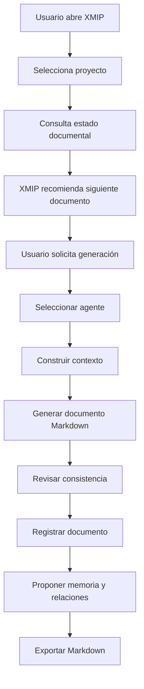

# ORION-016 — Definición del MVP

**Nivel documental:** L3 — Product
**Volumen:** 005-producto
**Proyecto:** ORION / XMIP
**Versión:** 1.0
**Estado:** Draft
**Owner:** Fernando Cuellar
**Última actualización:** 2026-07-01
**Ruta sugerida:** `docs/005-producto/ORION-016-definicion-del-mvp.md`
**Ruta equivalente por nivel:** `docs/L3-product/ORION-016-definicion-del-mvp.md`

---

## 1. Propósito

Este documento define el alcance del Producto Mínimo Viable de XMIP.

Su propósito es establecer qué debe incluir el primer MVP, qué debe quedar fuera, qué flujo debe validar, qué capacidades mínimas debe entregar y bajo qué criterios se considerará suficientemente útil para continuar hacia implementación real.

ORION-016 responde a la pregunta:

> ¿Cuál es la primera versión funcional de XMIP que demuestra valor real sin sobrediseñar el producto?

El MVP no debe intentar construir toda la visión de XMIP.
Debe probar el núcleo del producto con el menor alcance razonable y con suficiente calidad arquitectónica para no convertirse en deuda desde el primer día.

---

## 2. Alcance

Este documento cubre:

* Objetivo del MVP.
* Hipótesis principal.
* Usuario objetivo del MVP.
* Problema que valida.
* Flujo principal.
* Capacidades incluidas.
* Capacidades excluidas.
* Módulos mínimos.
* Agentes mínimos.
* Workflows mínimos.
* Datos mínimos.
* Reglas de calidad.
* Criterios de aceptación.
* Métricas de éxito.
* Riesgos.
* Dependencias.
* Roadmap posterior al MVP.

Este documento no cubre:

* Diseño visual detallado.
* Wireframes finales.
* Modelo comercial.
* Pricing.
* Go-to-market.
* Infraestructura cloud definitiva.
* Código.
* Historias de usuario completas.
* Sprints técnicos detallados.
* Implementación final de cada módulo.

---

## 3. Documentos base

Este documento se apoya en:

* ORION-008 — Guía de Estilo.
* ORION-009 — Principios de Arquitectura Empresarial.
* ORION-010 — Arquitectura Empresarial.
* ORION-011 — Arquitectura del Sistema.
* ORION-012 — Grafo de Conocimiento.
* ORION-013 — Modelo de Datos.
* ORION-014 — Arquitectura de Agentes.
* ORION-015 — Visión de Producto.

Este documento alimenta directamente:

* ORION-017 — Requerimientos de Producto.
* ORION-018 — Casos de Uso.
* ORION-019 — Roadmap de Producto.
* ORION-020 — Backlog Inicial.
* L5 — Sprints de implementación del MVP.

---

## 4. Definición del MVP

El MVP de XMIP es la primera versión operable de la plataforma que permite crear, organizar, generar, revisar y exportar documentación ORION mediante agentes especializados, memoria básica, trazabilidad mínima y estructura de proyecto.

La definición resumida del MVP es:

> Un workspace documental multiagente que permite continuar un proyecto ORION/XMIP, generar documentos Markdown estructurados, registrar contexto mínimo, mantener estado documental y exportar entregables listos para Git.

El MVP debe demostrar que XMIP puede convertir:

```text
intención del usuario + contexto del proyecto + estructura ORION + agentes especializados
```

en:

```text
documentos Markdown consistentes + trazabilidad mínima + continuidad operativa
```

---

## 5. Hipótesis principal

La hipótesis principal del MVP es:

> Si XMIP puede ayudar al usuario a producir documentación técnica y de producto consistente, conectada y exportable, entonces la plataforma demuestra valor real como sistema operativo multiagente para proyectos complejos.

La hipótesis no es que XMIP pueda automatizarlo todo.

La hipótesis correcta es más sobria:

> XMIP reduce improvisación, conserva contexto y acelera producción de entregables estructurados.

---

## 6. Usuario objetivo del MVP

El usuario objetivo del MVP es el **Owner / Architect** del proyecto.

Perfil:

* Diseña proyectos complejos.
* Necesita documentación consistente.
* Trabaja con arquitectura, producto y ejecución.
* Usa IA como copiloto operativo.
* Quiere convertir conversaciones en documentos.
* Quiere evitar perder contexto entre sesiones.
* Necesita entregar artefactos listos para repositorio.

En esta etapa, el MVP no está optimizado para equipos grandes.
Primero debe funcionar bien para un operador fuerte. Después se escala.

---

## 7. Problema que valida el MVP

El MVP valida si XMIP puede resolver este problema:

> El usuario tiene muchas decisiones, documentos, agentes y arquitectura en construcción, pero necesita convertir todo eso en un flujo ordenado, repetible y documentado sin empezar desde cero cada vez.

El problema práctico incluye:

* Saber qué documento sigue.
* Mantener estructura documental.
* Generar documentos consistentes.
* No perder contexto.
* Relacionar documentos.
* Exportar Markdown limpio.
* Registrar decisiones básicas.
* Evitar que los agentes improvisen formato.
* Preparar base para sprints.

---

## 8. Objetivo del MVP

El objetivo del MVP es entregar una primera versión útil para operar el ciclo documental ORION/XMIP.

El MVP debe permitir:

1. Crear o seleccionar un proyecto.
2. Ver documentos existentes.
3. Identificar el siguiente documento recomendado.
4. Generar un nuevo documento Markdown.
5. Aplicar guía de estilo ORION.
6. Usar un agente especializado.
7. Registrar contexto mínimo de generación.
8. Asociar el documento con documentos base.
9. Guardar memoria de proyecto básica.
10. Exportar el documento listo para Git.

---

## 9. Resultado esperado del MVP

Al finalizar el MVP, el usuario debe poder ejecutar este flujo completo:

```text
Abrir XMIP
→ seleccionar proyecto ORION/XMIP
→ ver documentos existentes
→ elegir siguiente documento
→ generar documento con agente
→ revisar salida
→ guardar documento
→ registrar relación documental
→ guardar memoria relevante
→ exportar Markdown
```

Si este flujo funciona de punta a punta, el MVP cumple su función.

---

## 10. Principio rector del MVP

El MVP debe ser:

```text
pequeño en alcance,
serio en arquitectura,
útil en operación,
limpio en documentación,
preparado para evolucionar.
```

El MVP no debe ser una demo visual vacía.

Tampoco debe ser una plataforma empresarial completa.

Debe ser la mínima versión que demuestre el valor central sin meternos en pantanos innecesarios.

---

## 11. Capacidades incluidas

### 11.1 Capacidades obligatorias

| ID      | Capacidad                        | Descripción                            | Prioridad |
| ------- | -------------------------------- | --------------------------------------- | --------- |
| MVP-001 | Workspace de proyecto            | Crear o seleccionar proyecto activo     | Alta      |
| MVP-002 | Registro documental              | Ver documentos ORION existentes         | Alta      |
| MVP-003 | Siguiente documento recomendado  | Sugerir el próximo documento lógico   | Alta      |
| MVP-004 | Generación documental           | Generar documentos Markdown completos   | Alta      |
| MVP-005 | Aplicación de guía de estilo   | Usar estructura documental ORION-008    | Alta      |
| MVP-006 | Uso de agentes especializados    | Usar agente adecuado para documento     | Alta      |
| MVP-007 | Memoria básica de proyecto      | Guardar contexto estable mínimo        | Alta      |
| MVP-008 | Relaciones documentales básicas | Conectar documento con dependencias     | Alta      |
| MVP-009 | Auditoría mínima               | Registrar generación y agente usado    | Alta      |
| MVP-010 | Exportación Markdown            | Entregar archivo o texto listo para Git | Alta      |
| MVP-011 | Estado documental                | Manejar Draft / Review / Approved       | Media     |
| MVP-012 | Registro de decisiones básicas  | Guardar decisiones clave del proyecto   | Media     |

---

## 12. Capacidades excluidas

El MVP no incluye:

| Capacidad excluida                 | Motivo                                |
| ---------------------------------- | ------------------------------------- |
| UI avanzada de grafo               | Prematura para validar valor          |
| Workflow builder visual            | Complejidad innecesaria               |
| Multiusuario empresarial completo  | Primero validar uso individual fuerte |
| Motor avanzado de permisos         | Puede iniciar con roles mínimos      |
| Marketplace de agentes             | Fuera del alcance inicial             |
| Automatización autónoma avanzada | Riesgo alto para MVP                  |
| Integraciones externas múltiples  | Primero Git/exportación manual       |
| Motor de graph database dedicado   | Grafo lógico basta para MVP          |
| Observabilidad avanzada            | Métricas básicas son suficientes    |
| Optimización compleja de costos   | Medición básica primero             |
| Editor colaborativo en tiempo real | No necesario para validar             |
| Chat omnicanal                     | Fuera del foco                        |
| Mobile app                         | No aporta al primer caso de uso       |
| Model router avanzado              | Puede resolverse después             |
| Fine-tuning                        | No necesario en MVP                   |

---

## 13. Módulos mínimos del MVP

### 13.1 Project Workspace

Función:

* Mostrar proyecto activo.
* Mostrar estado general.
* Mostrar documentos existentes.
* Mostrar siguiente documento recomendado.
* Mostrar acciones principales.

Debe incluir:

* Nombre del proyecto.
* Descripción breve.
* Owner.
* Estado.
* Última actividad.
* Documentos recientes.
* Próximo paso sugerido.

---

### 13.2 Document Registry

Función:

* Mantener catálogo de documentos ORION.

Debe incluir:

* Código de documento.
* Título.
* Nivel documental.
* Estado.
* Versión.
* Ruta sugerida.
* Documento anterior.
* Documento siguiente.
* Dependencias básicas.

---

### 13.3 Document Generator

Función:

* Generar documentos Markdown completos.

Debe incluir:

* Selección de tipo de documento.
* Uso de plantilla documental.
* Uso de guía de estilo.
* Inclusión de metadata.
* Generación de criterios de aceptación.
* Relación con documentos previos.
* Salida en Markdown limpio.

---

### 13.4 Agent Selector

Función:

* Seleccionar agente según tipo de trabajo.

Debe incluir:

* ProductAgent.
* DocumentationAgent.
* ArchitectureAgent.
* MemoryAgent.
* KnowledgeAgent básico.

No necesita permitir configuración avanzada en MVP.

---

### 13.5 Memory Panel

Función:

* Mostrar y guardar memoria básica de proyecto.

Debe incluir:

* Memoria activa.
* Fuente.
* Fecha.
* Tipo.
* Estado.
* Opción de invalidar manualmente.

---

### 13.6 Knowledge Links

Función:

* Mostrar relaciones básicas entre documentos.

Debe incluir:

* depends_on.
* governs.
* defines.
* implements.
* references.

En MVP puede mostrarse como lista o tabla.
No requiere visualización tipo grafo todavía.

---

### 13.7 Audit Log Básico

Función:

* Registrar qué ocurrió.

Debe incluir:

* Documento generado.
* Agente usado.
* Fecha.
* Usuario.
* Acción.
* Estado.
* correlation_id.

---

### 13.8 Markdown Export

Función:

* Exportar documentos para repositorio.

Debe incluir:

* Copiar Markdown.
* Descargar archivo `.md`.
* Ruta sugerida.
* Nombre de archivo correcto.

Integración automática con Git puede quedar para fase posterior.

---

## 14. Agentes mínimos del MVP

### 14.1 ProductAgent

Responsabilidad:

* Generar documentos de producto.
* Convertir visión en requerimientos.
* Proponer MVP, roadmap y backlog.
* Mantener consistencia con ORION-015.

Uso en MVP:

* ORION-015.
* ORION-016.
* ORION-017.
* ORION-018.
* ORION-019.
* ORION-020.

---

### 14.2 DocumentationAgent

Responsabilidad:

* Aplicar guía de estilo.
* Validar estructura documental.
* Mantener metadata.
* Preparar salida en Markdown.

Uso en MVP:

* Todos los documentos generados.

---

### 14.3 ArchitectureAgent

Responsabilidad:

* Validar consistencia con arquitectura.
* Revisar relación con ORION-010 a ORION-014.
* Detectar contradicciones.

Uso en MVP:

* Documentos L2 y validación de documentos L3.

---

### 14.4 MemoryAgent

Responsabilidad:

* Proponer memoria persistente útil.
* Evitar memoria basura.
* Relacionar memoria con proyecto y documento.

Uso en MVP:

* Guardar decisiones y contexto estable.

---

### 14.5 KnowledgeAgent

Responsabilidad:

* Proponer relaciones documentales.
* Mantener dependencias básicas.
* Alimentar grafo lógico mínimo.

Uso en MVP:

* Relacionar documentos generados con documentos base.

---

## 15. Workflows mínimos del MVP

### 15.1 Workflow: Generar documento ORION

ID sugerido:

```text
wf_generate_orion_document
```

Flujo:

1. Usuario solicita documento.
2. Sistema identifica nivel documental.
3. Sistema identifica documentos base.
4. Sistema selecciona agente principal.
5. DocumentationAgent aplica estructura.
6. Agente principal genera contenido.
7. ArchitectureAgent o ProductAgent valida consistencia según tipo.
8. Sistema registra auditoría.
9. Sistema sugiere memoria o relaciones.
10. Usuario recibe Markdown final.

Resultado:

* Documento generado.
* Evento auditado.
* Relaciones documentales propuestas.
* Memoria sugerida si aplica.

---

### 15.2 Workflow: Registrar documento

ID sugerido:

```text
wf_register_document
```

Flujo:

1. Usuario confirma documento.
2. Sistema registra metadata.
3. Sistema asigna estado Draft.
4. Sistema registra versión.
5. Sistema registra ruta.
6. Sistema crea relaciones básicas.
7. Sistema genera evento de auditoría.

Resultado:

* Documento registrado.
* Estado controlado.
* Relación documental creada.

---

### 15.3 Workflow: Guardar memoria de proyecto

ID sugerido:

```text
wf_save_project_memory
```

Flujo:

1. Sistema propone memoria.
2. Usuario revisa.
3. Usuario aprueba o descarta.
4. Sistema guarda memoria aprobada.
5. Sistema relaciona memoria con documento o decisión.
6. Sistema registra evento.

Resultado:

* Memoria útil persistida.
* Fuente identificada.
* Auditoría mínima.

---

### 15.4 Workflow: Exportar Markdown

ID sugerido:

```text
wf_export_markdown_document
```

Flujo:

1. Usuario selecciona documento.
2. Sistema valida metadata.
3. Sistema genera nombre de archivo.
4. Sistema prepara Markdown.
5. Sistema entrega archivo o texto.
6. Sistema registra evento de exportación.

Resultado:

* Documento listo para Git.
* Ruta sugerida.
* Evento registrado.

---

## 16. Flujo principal del MVP

El flujo principal del MVP es:



---

## 17. Datos mínimos del MVP

El MVP debe persistir al menos:

### 17.1 Proyecto

Campos mínimos:

```text
project_id
name
description
owner
status
created_at
updated_at
```

### 17.2 Documento

Campos mínimos:

```text
document_id
document_code
title
level
status
version
path
owner
created_at
updated_at
```

### 17.3 Versión documental

Campos mínimos:

```text
document_version_id
document_id
version
content
content_hash
status
created_at
created_by
```

### 17.4 Agente

Campos mínimos:

```text
agent_id
agent_key
name
version
purpose
status
```

### 17.5 Ejecución de agente

Campos mínimos:

```text
agent_execution_id
agent_id
task
status
input_hash
output_hash
started_at
completed_at
correlation_id
```

### 17.6 Workflow run

Campos mínimos:

```text
workflow_run_id
workflow_key
status
input
output
started_at
completed_at
correlation_id
```

### 17.7 Memoria

Campos mínimos:

```text
memory_id
memory_type
title
content
source_ref
status
created_at
```

### 17.8 Relación de conocimiento

Campos mínimos:

```text
relationship_id
source_ref
relationship_type
target_ref
confidence
status
created_at
```

### 17.9 Auditoría

Campos mínimos:

```text
event_id
event_type
actor
subject
action
status
timestamp
correlation_id
```

---

## 18. Estados mínimos

### 18.1 Estado de documento

```text
draft
review
approved
deprecated
archived
```

### 18.2 Estado de workflow

```text
pending
running
completed
failed
cancelled
waiting_approval
```

### 18.3 Estado de agente

```text
draft
active
disabled
deprecated
```

### 18.4 Estado de memoria

```text
proposed
active
invalidated
archived
```

### 18.5 Estado de relación

```text
proposed
active
approved
invalidated
```

---

## 19. Reglas funcionales del MVP

### 19.1 Regla de documentación

Todo documento generado debe incluir:

* Título.
* Nivel documental.
* Proyecto.
* Versión.
* Estado.
* Owner.
* Fecha.
* Ruta sugerida.
* Propósito.
* Alcance.
* Criterios de aceptación.
* Relación con otros documentos.
* Historial de cambios.

---

### 19.2 Regla de agente

Todo documento generado debe registrar:

* Agente principal.
* Tipo de tarea.
* Fecha.
* correlation_id.
* Documentos base usados.

---

### 19.3 Regla de memoria

Toda memoria persistente debe tener:

* Fuente.
* Tipo.
* Estado.
* Fecha.
* Motivo de persistencia.

---

### 19.4 Regla de relación documental

Todo documento nuevo debe tener al menos una relación con documentos existentes, salvo documentos raíz.

Ejemplos:

```text
ORION-016 depends_on ORION-015
ORION-016 references ORION-010
ORION-016 references ORION-014
```

---

### 19.5 Regla de exportación

Todo documento exportado debe tener:

* Nombre de archivo correcto.
* Ruta sugerida.
* Markdown limpio.
* Sin contenido temporal o notas internas.
* Sin placeholders sin resolver.

---

## 20. Requerimientos funcionales del MVP

| ID         | Requerimiento                                               | Prioridad |
| ---------- | ----------------------------------------------------------- | --------- |
| MVP-FR-001 | El sistema debe permitir crear un proyecto                  | Alta      |
| MVP-FR-002 | El sistema debe permitir seleccionar proyecto activo        | Alta      |
| MVP-FR-003 | El sistema debe listar documentos del proyecto              | Alta      |
| MVP-FR-004 | El sistema debe mostrar estado documental                   | Alta      |
| MVP-FR-005 | El sistema debe sugerir el siguiente documento recomendado  | Alta      |
| MVP-FR-006 | El sistema debe generar documentos Markdown                 | Alta      |
| MVP-FR-007 | El sistema debe aplicar estructura ORION-008                | Alta      |
| MVP-FR-008 | El sistema debe seleccionar agente según tipo de documento | Alta      |
| MVP-FR-009 | El sistema debe registrar ejecución de agente              | Alta      |
| MVP-FR-010 | El sistema debe registrar workflow de generación           | Alta      |
| MVP-FR-011 | El sistema debe permitir revisar documento generado         | Alta      |
| MVP-FR-012 | El sistema debe registrar documento como Draft              | Alta      |
| MVP-FR-013 | El sistema debe registrar versión documental               | Alta      |
| MVP-FR-014 | El sistema debe crear relaciones documentales básicas      | Alta      |
| MVP-FR-015 | El sistema debe proponer memoria útil                      | Media     |
| MVP-FR-016 | El sistema debe permitir aprobar memoria propuesta          | Media     |
| MVP-FR-017 | El sistema debe exportar documento Markdown                 | Alta      |
| MVP-FR-018 | El sistema debe registrar eventos básicos de auditoría    | Alta      |
| MVP-FR-019 | El sistema debe mostrar historial básico de actividad      | Media     |
| MVP-FR-020 | El sistema debe permitir cambiar estado documental          | Media     |

---

## 21. Requerimientos no funcionales del MVP

| ID          | Requerimiento                                                                     | Prioridad |
| ----------- | --------------------------------------------------------------------------------- | --------- |
| MVP-NFR-001 | Toda ejecución debe tener correlation_id                                         | Alta      |
| MVP-NFR-002 | Todo documento debe tener versión                                                | Alta      |
| MVP-NFR-003 | Todo documento debe tener estado                                                  | Alta      |
| MVP-NFR-004 | Todo documento debe exportarse como Markdown válido                              | Alta      |
| MVP-NFR-005 | Toda memoria debe tener fuente                                                    | Alta      |
| MVP-NFR-006 | Toda relación debe tener tipo y fuente                                           | Alta      |
| MVP-NFR-007 | La auditoría debe ser append-only                                                | Alta      |
| MVP-NFR-008 | El sistema debe evitar secretos en documentos y logs                              | Alta      |
| MVP-NFR-009 | La generación debe ser reproducible por versión de agente/prompt cuando aplique | Media     |
| MVP-NFR-010 | El MVP debe funcionar como monolito modular                                       | Alta      |
| MVP-NFR-011 | El sistema debe permitir evolución a módulos separados                          | Media     |
| MVP-NFR-012 | Los errores deben registrarse con código y mensaje                               | Alta      |
| MVP-NFR-013 | El producto debe ser usable sin configuración avanzada                           | Alta      |
| MVP-NFR-014 | El tiempo de generación debe ser razonable para uso interactivo                  | Media     |
| MVP-NFR-015 | La estructura documental debe ser consistente entre documentos                    | Alta      |

---

## 22. Pantallas o vistas mínimas

El MVP puede iniciar con una interfaz sencilla.

### 22.1 Vista: Project Workspace

Debe mostrar:

* Proyecto activo.
* Descripción.
* Owner.
* Estado.
* Documentos existentes.
* Siguiente documento sugerido.
* Acciones rápidas.

Acciones:

* Generar documento.
* Ver documentos.
* Ver memoria.
* Exportar.

---

### 22.2 Vista: Document Registry

Debe mostrar:

* Código.
* Título.
* Nivel.
* Estado.
* Versión.
* Última actualización.
* Ruta sugerida.

Acciones:

* Ver documento.
* Generar siguiente.
* Cambiar estado.
* Exportar.

---

### 22.3 Vista: Document Generator

Debe permitir:

* Seleccionar documento a generar.
* Confirmar documentos base.
* Ver agente sugerido.
* Ejecutar generación.
* Revisar resultado.
* Registrar documento.

---

### 22.4 Vista: Memory

Debe mostrar:

* Memorias activas.
* Memorias propuestas.
* Fuente.
* Estado.
* Fecha.

Acciones:

* Aprobar memoria.
* Invalidar memoria.
* Ver relación con documento.

---

### 22.5 Vista: Activity / Audit

Debe mostrar:

* Eventos recientes.
* Documentos generados.
* Agentes usados.
* Workflows ejecutados.
* Errores.

---

## 23. API mínima conceptual

### 23.1 Projects

```text
POST /projects
GET  /projects
GET  /projects/{project_id}
POST /projects/{project_id}/activate
```

### 23.2 Documents

```text
GET  /projects/{project_id}/documents
POST /projects/{project_id}/documents/generate
GET  /documents/{document_id}
POST /documents/{document_id}/status
GET  /documents/{document_id}/export
```

### 23.3 Agents

```text
GET /agents
GET /agents/{agent_id}
```

### 23.4 Workflows

```text
POST /workflows/{workflow_key}/runs
GET  /workflow-runs/{workflow_run_id}
```

### 23.5 Memory

```text
GET  /projects/{project_id}/memory
POST /projects/{project_id}/memory
POST /memory/{memory_id}/approve
POST /memory/{memory_id}/invalidate
```

### 23.6 Knowledge

```text
GET  /projects/{project_id}/knowledge/relationships
POST /projects/{project_id}/knowledge/relationships
```

### 23.7 Audit

```text
GET /projects/{project_id}/audit/events
GET /audit/correlation/{correlation_id}
```

---

## 24. Modelo de datos mínimo

El MVP puede usar el subconjunto definido en ORION-013.

### 24.1 Tablas obligatorias

* projects.
* documents.
* document_versions.
* document_relationships.
* agent_definitions.
* agent_versions.
* agent_executions.
* workflow_definitions.
* workflow_runs.
* memory_items.
* memory_relationships.
* knowledge_nodes.
* knowledge_edges.
* audit_events.

### 24.2 Tablas recomendadas

* users.
* roles.
* permissions.
* prompt_templates.
* prompt_versions.
* workflow_steps.
* workflow_step_runs.
* approval_requests.
* cost_events.
* error_events.

### 24.3 Simplificación permitida

Para MVP, prompts pueden iniciar como archivos versionados en repositorio.

Pero cada ejecución debe registrar al menos:

```text
agent_key
prompt_key
prompt_version
correlation_id
```

---

## 25. Métricas de éxito del MVP

### 25.1 Métricas de adopción

| Métrica                           |                          Meta inicial |
| ---------------------------------- | ------------------------------------: |
| Documentos generados               |                        10+ documentos |
| Documentos exportados              |           80% de documentos generados |
| Workflows completados              | 90% de ejecuciones sin fallo crítico |
| Memorias aprobadas                 |                   5+ memorias útiles |
| Relaciones documentales creadas    |                      1+ por documento |
| Tiempo para generar documento base |         Menor que hacerlo manualmente |
| Reutilización de contexto         |    Evidente en documentos posteriores |

---

### 25.2 Métricas de calidad

| Métrica                                |               Meta inicial |
| --------------------------------------- | -------------------------: |
| Documentos con metadata completa        |                       100% |
| Documentos con criterios de aceptación |                       100% |
| Documentos con ruta sugerida            |                       100% |
| Documentos con relación documental     |                       90%+ |
| Eventos con correlation_id              |                       100% |
| Memorias con fuente                     |                       100% |
| Errores registrados                     | 100% de errores relevantes |

---

### 25.3 Métricas de valor

| Métrica                      | Señal positiva                                   |
| ----------------------------- | ------------------------------------------------- |
| Menos repetición de contexto | Usuario no tiene que reexplicar todo              |
| Siguiente paso claro          | XMIP recomienda documento siguiente correctamente |
| Documentos reutilizables      | Salidas listas para Git                           |
| Continuidad                   | Cada documento toma en cuenta los anteriores      |
| Menos improvisación          | Los sprints pueden derivarse de documentos        |

---

## 26. Criterios de aceptación del MVP

El MVP se considera aceptado cuando:

* [ ] Permite crear o seleccionar proyecto.
* [ ] Lista documentos existentes.
* [ ] Sugiere siguiente documento lógico.
* [ ] Genera documentos Markdown completos.
* [ ] Aplica metadata estándar.
* [ ] Aplica estructura ORION-008.
* [ ] Usa agente especializado según tipo de documento.
* [ ] Registra ejecución de agente.
* [ ] Registra workflow de generación.
* [ ] Genera correlation_id por operación.
* [ ] Registra documento como Draft.
* [ ] Registra versión documental.
* [ ] Crea relaciones documentales básicas.
* [ ] Permite exportar Markdown limpio.
* [ ] Permite guardar memoria de proyecto.
* [ ] Toda memoria guardada tiene fuente.
* [ ] Registra auditoría mínima.
* [ ] Muestra historial básico de actividad.
* [ ] Maneja errores sin perder la ejecución completa.
* [ ] Permite continuar con el siguiente documento sin reiniciar contexto.

---

## 27. Definición de “Done” del MVP

El MVP está terminado cuando un usuario puede producir y registrar una cadena completa de documentos L3 de producto usando XMIP.

Cadena mínima recomendada:

```text
ORION-015 — Visión de Producto
ORION-016 — Definición del MVP
ORION-017 — Requerimientos de Producto
ORION-018 — Casos de Uso
ORION-019 — Roadmap de Producto
ORION-020 — Backlog Inicial
```

La prueba fuerte es simple:

> XMIP debe poder ayudar a construir su propio volumen de producto de forma ordenada, trazable y exportable.

Si no puede hacer eso, todavía no es MVP.
Es maqueta.

---

## 28. Riesgos del MVP

| Riesgo                               | Impacto | Probabilidad | Mitigación                                       |
| ------------------------------------ | ------: | -----------: | ------------------------------------------------- |
| Alcance demasiado grande             |    Alto |         Alta | Mantener foco en flujo documental                 |
| UI consume más esfuerzo que lógica |   Medio |        Media | UI simple, funcional primero                      |
| Documentos generados inconsistentes  |    Alto |        Media | Guía de estilo y agente documental               |
| Memoria se vuelve ruido              |    Alto |        Media | Aprobación manual de memoria                     |
| Relaciones documentales pobres       |   Medio |        Media | Tipos básicos obligatorios                       |
| Auditoría incompleta                |    Alto |        Media | audit_events desde el inicio                      |
| No hay sensación de producto        |    Alto |        Media | Workspace y flujo completo                        |
| Se vuelve chatbot disfrazado         |    Alto |        Media | Document registry, workflows y exportación       |
| Sobrediseño técnico                |   Medio |         Alta | Monolito modular                                  |
| Falta de valor visible rápido       |    Alto |        Media | Primer flujo completo antes de módulos avanzados |

---

## 29. Decisiones del MVP

### 29.1 MVP centrado en documentación

**Decisión:** El MVP se centrará en generación, registro y exportación de documentos ORION.

**Justificación:** Es el caso de uso más claro, más útil y más alineado con el enfoque documentation-first.

---

### 29.2 Markdown como salida oficial

**Decisión:** El formato de salida oficial del MVP será Markdown.

**Justificación:** Facilita Git, versionado, revisión, copia, automatización y continuidad.

---

### 29.3 Monolito modular

**Decisión:** El MVP se implementará como monolito modular.

**Justificación:** Reduce complejidad inicial sin romper separación de dominios.

---

### 29.4 Grafo lógico, no motor dedicado

**Decisión:** El MVP usará relaciones lógicas en base relacional.

**Justificación:** Suficiente para trazabilidad inicial sin meter infraestructura prematura.

---

### 29.5 Memoria con aprobación manual

**Decisión:** La memoria persistente propuesta por agentes debe aprobarse manualmente.

**Justificación:** Evita contaminar contexto desde el inicio.

---

### 29.6 Exportación manual primero

**Decisión:** El MVP permitirá exportar Markdown; integración automática con Git queda después.

**Justificación:** Reduce complejidad y valida valor sin bloquearse en integraciones.

---

## 30. Dependencias

### 30.1 Dependencias documentales

| Documento | Dependencia                       |
| --------- | --------------------------------- |
| ORION-015 | Define visión de producto        |
| ORION-014 | Define agentes disponibles        |
| ORION-013 | Define datos mínimos             |
| ORION-012 | Define relaciones de conocimiento |
| ORION-011 | Define componentes técnicos      |
| ORION-008 | Define estilo documental          |

---

### 30.2 Dependencias técnicas

| Dependencia                 | Uso                                      |
| --------------------------- | ---------------------------------------- |
| Backend API                 | Ejecutar workflows y persistir datos     |
| Base de datos               | Documentos, agentes, memoria, auditoría |
| LLM Provider                | Generación asistida                     |
| Markdown renderer/exporter  | Salida documental                        |
| Storage local o repositorio | Guardar versiones                        |
| Auth básica                | Identificar usuario                      |
| Logging básico             | Diagnóstico                             |

---

## 31. Roadmap posterior al MVP

Después del MVP, la evolución recomendada es:

### 31.1 MVP+1 — Product Requirements

Agregar:

* ORION-017 Requerimientos de Producto.
* Captura formal de requerimientos.
* Priorización.
* Dependencias.
* Criterios de aceptación por requerimiento.

---

### 31.2 MVP+2 — Use Case Engine

Agregar:

* ORION-018 Casos de Uso.
* Actores.
* Flujos principales.
* Flujos alternos.
* Excepciones.
* Relación con agentes y workflows.

---

### 31.3 MVP+3 — Roadmap & Backlog

Agregar:

* ORION-019 Roadmap.
* ORION-020 Backlog.
* Priorización.
* Épicas.
* Historias.
* Sprints derivados.

---

### 31.4 MVP+4 — Git Integration

Agregar:

* Sincronización con repositorio.
* Pull/push controlado.
* Branch por documento o sprint.
* Historial conectado con Git.

---

### 31.5 MVP+5 — Knowledge UI

Agregar:

* Visualización básica de grafo.
* Impact analysis.
* Dependencias.
* Nodos huérfanos.
* Riesgos sin control.

---

## 32. Antipatrones prohibidos

El MVP debe evitar:

* Intentar construir toda la plataforma.
* Priorizar UI bonita sobre flujo funcional.
* Generar documentos sin registrar metadata.
* Exportar contenido con placeholders.
* Guardar memoria sin fuente.
* Crear relaciones sin significado.
* No registrar correlation_id.
* No auditar generaciones.
* Meter multiusuario avanzado prematuramente.
* Crear agentes genéricos sin límites.
* Usar el MVP como excusa para ignorar arquitectura.
* Construir una demo que no pueda evolucionar.

---

## 33. Relación con arquitectura

El MVP implementa una parte específica de la arquitectura definida.

| Documento | Aplicación en MVP                                           |
| --------- | ------------------------------------------------------------ |
| ORION-010 | Capacidades de documentación, agentes, memoria y auditoría |
| ORION-011 | Runtime básico, workflow, context manager mínimo           |
| ORION-012 | Relaciones documentales y grafo lógico                      |
| ORION-013 | Tablas mínimas de documentos, agentes, memoria y auditoría |
| ORION-014 | Agentes mínimos para generar producto                       |
| ORION-015 | Visión de producto que justifica el MVP                     |

---

## 34. Relación con sprints

Este documento debe permitir derivar sprints L5.

Sprints recomendados:

```text
SPRINT-001 — Project Workspace Foundation
SPRINT-002 — Document Registry
SPRINT-003 — Markdown Document Generator
SPRINT-004 — Agent Registry MVP
SPRINT-005 — Workflow Run MVP
SPRINT-006 — Memory MVP
SPRINT-007 — Knowledge Links MVP
SPRINT-008 — Audit Log MVP
SPRINT-009 — Markdown Export
SPRINT-010 — MVP End-to-End Validation
```

Cada sprint debe referenciar este documento y los documentos de arquitectura correspondientes.

---

## 35. Criterios de aceptación de este documento

Este documento se considera aceptado cuando:

* [ ] Define el MVP de XMIP.
* [ ] Define la hipótesis principal.
* [ ] Define usuario objetivo.
* [ ] Define problema que valida.
* [ ] Define objetivo del MVP.
* [ ] Define flujo principal.
* [ ] Define capacidades incluidas.
* [ ] Define capacidades excluidas.
* [ ] Define módulos mínimos.
* [ ] Define agentes mínimos.
* [ ] Define workflows mínimos.
* [ ] Define datos mínimos.
* [ ] Define requerimientos funcionales.
* [ ] Define requerimientos no funcionales.
* [ ] Define pantallas mínimas.
* [ ] Define API conceptual mínima.
* [ ] Define métricas de éxito.
* [ ] Define criterios de aceptación del MVP.
* [ ] Define riesgos y mitigaciones.
* [ ] Define decisiones del MVP.
* [ ] Define dependencias.
* [ ] Define roadmap posterior.
* [ ] Permite derivar sprints L5.

---

## 36. Próximos pasos

Después de aprobar ORION-016, continuar con:

1. ORION-017 — Requerimientos de Producto.
2. ORION-018 — Casos de Uso.
3. ORION-019 — Roadmap de Producto.
4. ORION-020 — Backlog Inicial.

ORION-017 debe convertir esta definición de MVP en requerimientos funcionales y no funcionales completos, priorizados y verificables.

---

## 37. Historial de cambios

| Versión | Fecha      | Cambio                                  | Autor            |
| -------- | ---------- | --------------------------------------- | ---------------- |
| 1.0      | 2026-07-01 | Versión inicial de definición del MVP | Fernando Cuellar |
