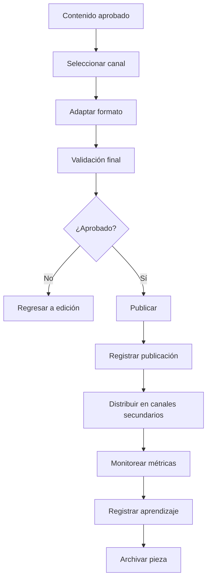

# ORION-019 — Flujo de Publicación

**Nivel documental:** L4 — Operations
**Volumen:** 006-operaciones
**Proyecto:** ORION / XCripto / XMIP
**Versión:** 1.0
**Estado:** Draft
**Owner:** Fernando Cuellar
**Última actualización:** 2026-07-02
**Ruta sugerida:** `docs/006-operaciones/ORION-019-Flujo-de-Publicacion.md`

---

## 1. Propósito

Este documento define el flujo operativo de publicación de XCripto.

Su propósito es establecer cómo una noticia, análisis, guion, clip, alerta o pieza editorial pasa desde estado aprobado hasta publicación, distribución, registro, medición y archivo dentro del newsroom.

ORION-019 responde a la pregunta:

> ¿Cómo publica XCripto contenido cripto de forma consistente, verificable, trazable y adaptada a cada canal?

Este documento complementa ORION-018 — Operaciones Diarias y sirve como base para la publicación multicanal de XCripto.

---

## 2. Alcance

Este documento cubre:

* Flujo general de publicación.
* Estados de contenido.
* Roles responsables.
* Agentes involucrados.
* Validaciones previas a publicación.
* Publicación por canal.
* Distribución multicanal.
* Reglas para YouTube.
* Reglas para Shorts / Reels / TikTok.
* Reglas para X / Twitter.
* Reglas para LinkedIn.
* Reglas para newsletter.
* Reglas para blog / archivo web.
* Registro de publicación.
* Trazabilidad.
* Correcciones posteriores.
* Métricas posteriores a publicación.
* Riesgos y mitigaciones.
* Checklist de publicación.

Este documento no cubre en detalle:

* Rutina diaria completa del newsroom.
* Gestión profunda de fuentes.
* Protocolo completo de verificación editorial.
* Diseño de calendario editorial.
* Métricas operativas avanzadas.
* Gestión de incidentes editoriales.
* Automatización técnica de publicación.
* Operación detallada de agentes.

Esos temas se desarrollan en:

* ORION-018 — Operaciones Diarias.
* ORION-020 — Runbook de Producción de Noticias.
* ORION-021 — Gestión de Fuentes.
* ORION-022 — Protocolo de Verificación Editorial.
* ORION-024 — Calendario Editorial.
* ORION-025 — Distribución Multicanal.
* ORION-026 — Métricas Operativas.
* ORION-027 — Gestión de Incidentes Editoriales.
* ORION-028 — Operación de Agentes Editoriales.

---

## 3. Contexto operativo

XCripto publica contenido cripto en un entorno de alta velocidad, alto ruido y alto riesgo de desinformación.

El flujo de publicación debe evitar:

* Publicar rumores como hechos.
* Usar titulares exagerados.
* Omitir fuentes.
* Confundir opinión con noticia.
* Publicar sin revisión.
* Publicar el mismo texto en todos los canales sin adaptación.
* Perder trazabilidad después de publicar.
* Corregir errores sin dejar registro.

Publicar no es solo presionar un botón.

Publicar es cerrar un ciclo editorial:

```text
contenido aprobado
→ adaptación por canal
→ validación final
→ publicación
→ distribución
→ registro
→ medición
→ archivo
→ memoria editorial
```

---

## 4. Principios de publicación

### 4.1 Cada canal requiere adaptación

Una pieza no debe copiarse igual en YouTube, X, LinkedIn, newsletter y Shorts.

Cada canal tiene:

* Audiencia.
* Ritmo.
* Formato.
* Profundidad.
* Restricciones.
* Métrica de éxito.

### 4.2 La fuente debe viajar con la pieza

Toda publicación debe conservar referencia a sus fuentes base, aunque no todas las fuentes se muestren públicamente en todos los formatos.

### 4.3 Titular fuerte no significa titular engañoso

El titular debe atraer sin deformar el hecho.

### 4.4 La trazabilidad no termina al publicar

Después de publicar debe registrarse:

* Canal.
* URL.
* Fecha.
* Responsable.
* Fuente.
* Estado.
* Correcciones.
* Métricas iniciales.

### 4.5 La revisión humana aplica en temas sensibles

Los agentes pueden preparar publicaciones, pero no deben aprobar por sí solos temas de alto impacto o riesgo.

### 4.6 La publicación debe tener intención

No se publica para llenar.
Se publica porque la pieza informa, explica, alerta, contextualiza o aporta valor.

---

## 5. Definiciones

### Pieza editorial

Unidad de contenido preparada para publicación.

Ejemplos:

* Noticia.
* Guion.
* Clip.
* Post.
* Hilo.
* Newsletter.
* Artículo.
* Alerta.
* Explainer.

### Canal

Medio donde se publica contenido.

Ejemplos:

* YouTube.
* YouTube Shorts.
* TikTok.
* Instagram Reels.
* X / Twitter.
* LinkedIn.
* Newsletter.
* Blog.
* Telegram.
* Discord.

### Registro de publicación

Evidencia interna de que una pieza fue publicada, incluyendo metadata, URL, responsable y trazabilidad.

### Corrección editorial

Modificación posterior a la publicación para corregir precisión, contexto, fuente, titular, fecha o interpretación.

### Distribución

Adaptación y difusión de una pieza en varios canales.

---

## 6. Flujo general de publicación

El flujo estándar de publicación es:



---

## 7. Estados de contenido

Toda pieza editorial debe tener estado.

| Estado      | Descripción                       |
| ----------- | ---------------------------------- |
| draft       | Borrador inicial                   |
| editing     | En edición                        |
| reviewing   | En revisión                       |
| approved    | Aprobada para publicación         |
| scheduled   | Programada                         |
| published   | Publicada                          |
| distributed | Distribuida en canales secundarios |
| corrected   | Corregida después de publicación |
| retracted   | Retirada                           |
| archived    | Archivada                          |
| rejected    | Rechazada                          |
| escalated   | Escalada por riesgo editorial      |

---

## 8. Roles responsables

### 8.1 Owner / Editor Principal

Responsabilidades:

* Aprobar piezas sensibles.
* Definir prioridad de publicación.
* Autorizar correcciones relevantes.
* Decidir retiro de contenido si aplica.
* Validar postura editorial.

### 8.2 Operador de Newsroom

Responsabilidades:

* Ejecutar el flujo de publicación.
* Preparar metadata.
* Confirmar fuentes.
* Registrar URLs publicadas.
* Mantener checklist.
* Registrar métricas iniciales.

### 8.3 Revisor Editorial

Responsabilidades:

* Revisar precisión.
* Validar titular.
* Confirmar separación entre hecho y opinión.
* Detectar riesgos.
* Aprobar o rechazar publicación.

### 8.4 Productor de Contenido

Responsabilidades:

* Adaptar la pieza al canal.
* Preparar descripción, caption, thumbnail brief, hashtags y assets.
* Ajustar duración, tono y ritmo.

### 8.5 Agentes XMIP

Responsabilidades:

* Preparar versiones por canal.
* Sugerir titulares.
* Revisar riesgos.
* Generar captions.
* Crear resumen.
* Registrar metadata.
* Sugerir memoria editorial.
* Apoyar auditoría.

---

## 9. Agentes involucrados

### 9.1 EditorialAgent

Uso:

* Ajustar texto final.
* Preparar versión publicable.
* Revisar claridad y estructura.
* Separar hecho, análisis y opinión.

### 9.2 ScriptAgent

Uso:

* Preparar guion para YouTube.
* Dividir bloques.
* Crear transiciones.
* Ajustar ritmo narrativo.

### 9.3 SocialClipAgent

Uso:

* Convertir noticia en clips.
* Crear hooks.
* Preparar captions.
* Adaptar por canal corto.

### 9.4 SourceValidatorAgent

Uso:

* Confirmar fuente antes de publicación.
* Verificar fecha.
* Alertar si la pieza depende de fuente débil.

### 9.5 RiskAgent

Uso:

* Detectar lenguaje riesgoso.
* Marcar afirmaciones no verificadas.
* Sugerir disclaimers.
* Escalar temas sensibles.

### 9.6 AuditAgent

Uso:

* Confirmar que la publicación tiene trazabilidad.
* Validar registro interno.
* Detectar piezas sin fuente o sin responsable.

### 9.7 MemoryAgent

Uso:

* Proponer memoria editorial después de publicar.
* Guardar aprendizajes relevantes.
* Relacionar la pieza con narrativas o seguimiento.

---

## 10. Entrada del flujo de publicación

Una pieza solo puede entrar al flujo de publicación si cumple:

* Tiene título o tema definido.
* Tiene fuente registrada.
* Tiene estado editorial mínimo `approved` o `reviewing`.
* Tiene categoría.
* Tiene prioridad.
* Tiene responsable.
* Tiene formato destino.
* Tiene nivel de riesgo evaluado.
* Tiene relación con una noticia, evento o tema.

Entrada mínima:

```text
content_id
news_id
title
summary
category
priority
source_refs
format
target_channel
status
owner
risk_level
correlation_id
```

---

## 11. Salida del flujo de publicación

La salida debe ser un registro publicado o archivado.

Salida mínima:

```text
publication_id
content_id
channel
published_url
published_at
published_by
status
source_refs
correction_status
metrics_status
correlation_id
```

---

## 12. Validación previa a publicación

Antes de publicar cualquier pieza, validar:

* [ ] La fuente está registrada.
* [ ] La fecha fue confirmada.
* [ ] El titular corresponde al contenido.
* [ ] No hay afirmaciones sin evidencia.
* [ ] Se distingue hecho de análisis.
* [ ] No hay recomendación financiera.
* [ ] No hay lenguaje manipulador.
* [ ] El formato corresponde al canal.
* [ ] El contenido tiene responsable.
* [ ] El riesgo editorial fue evaluado.
* [ ] Se agregaron disclaimers si aplica.
* [ ] La pieza tiene estado aprobado o escalado resuelto.

---

## 13. Clasificación de riesgo antes de publicación

| Riesgo   | Descripción                                               | Acción                                  |
| -------- | ---------------------------------------------------------- | ---------------------------------------- |
| Bajo     | Contenido educativo o informativo no sensible              | Puede publicarse con revisión estándar |
| Medio    | Noticia relevante con impacto limitado                     | Requiere revisión editorial             |
| Alto     | Mercado, regulación, hacks, exchanges, acusaciones        | Requiere aprobación humana              |
| Crítico | Información contradictoria, posible rumor, impacto fuerte | Escalar antes de publicar                |

---

## 14. Flujo para YouTube

### 14.1 Uso del canal

YouTube se usa para:

* Noticiero diario o semanal.
* Análisis.
* Explicadores.
* Resúmenes largos.
* Cobertura especial.
* Entrevistas.
* Reportes editoriales.

### 14.2 Formato mínimo

Una publicación de YouTube debe incluir:

```text
título
descripción
guion
thumbnail brief
capítulos si aplica
fuentes principales
disclaimer si aplica
tags
categoría
estado de publicación
```

### 14.3 Estructura recomendada del video

```text
hook inicial
contexto rápido
noticia principal
impacto
noticias secundarias
explicación o análisis
cierre
llamado a suscribirse
disclaimer si aplica
```

### 14.4 Validaciones específicas

* [ ] El título no promete predicción de precio.
* [ ] El thumbnail no exagera riesgo o ganancia.
* [ ] Las fuentes están en descripción o registro interno.
* [ ] El guion no confunde análisis con recomendación.
* [ ] Se agregan disclaimers cuando hay temas de inversión.
* [ ] El video tiene estructura clara.
* [ ] El cierre no induce compra/venta.

### 14.5 Registro interno

Registrar:

```text
youtube_video_id
url
title
description_hash
thumbnail_ref
script_ref
published_at
status
source_refs
correlation_id
```

---

## 15. Flujo para Shorts / Reels / TikTok

### 15.1 Uso del canal

Formatos cortos se usan para:

* Una noticia.
* Una alerta.
* Un dato importante.
* Un resumen rápido.
* Un clip del noticiero.
* Un concepto educativo.
* Una advertencia de riesgo.

### 15.2 Estructura recomendada

```text
hook de 1 a 3 segundos
dato central
contexto mínimo
impacto
cierre corto
disclaimer si aplica
```

### 15.3 Reglas

* Una idea por clip.
* No saturar con demasiados datos.
* No usar titulares engañosos.
* No presentar rumor como confirmado.
* No usar “compra”, “vende”, “se va a disparar” como afirmación.
* Mantener fuente registrada internamente.

### 15.4 Validaciones específicas

* [ ] El hook no deforma la noticia.
* [ ] El clip puede entenderse sin contexto excesivo.
* [ ] El riesgo está controlado.
* [ ] La fuente existe.
* [ ] El caption no exagera.
* [ ] Hay versión adaptada al canal.

---

## 16. Flujo para X / Twitter

### 16.1 Uso del canal

X se usa para:

* Alertas.
* Titulares rápidos.
* Hilos breves.
* Contexto inmediato.
* Seguimiento de breaking news.
* Opinión editorial claramente marcada.

### 16.2 Tipos de publicación

| Tipo           | Uso                              |
| -------------- | -------------------------------- |
| Alerta         | Noticia urgente                  |
| Resumen        | Nota breve                       |
| Hilo           | Explicación por partes          |
| Comentario     | Opinión editorial marcada       |
| Fuente directa | Compartir documento o comunicado |
| Seguimiento    | Actualización de noticia previa |

### 16.3 Reglas

* Incluir fuente cuando sea posible.
* Marcar rumor explícitamente si no está confirmado.
* No convertir especulación en hecho.
* No usar lenguaje de recomendación financiera.
* Mantener claridad sobre fecha y contexto.
* Evitar hilos demasiado largos sin estructura.

### 16.4 Formato sugerido para alerta

```text
ALERTA:

[Hecho confirmado]

Contexto:
[1-2 líneas]

Impacto:
[1 línea]

Fuente:
[referencia]
```

### 16.5 Formato sugerido para hilo

```text
1/ Qué pasó
2/ Por qué importa
3/ Qué está confirmado
4/ Qué falta por confirmar
5/ Impacto potencial
6/ Fuente / seguimiento
```

---

## 17. Flujo para LinkedIn

### 17.1 Uso del canal

LinkedIn se usa para contenido más profesional:

* Análisis.
* Contexto de industria.
* Regulación.
* Institucional.
* Seguridad.
* Tendencias.
* Educación ejecutiva.

### 17.2 Reglas

* Menos hype.
* Más contexto.
* Tono profesional.
* Explicar implicaciones.
* Evitar lenguaje especulativo.
* Separar claramente noticia y análisis.

### 17.3 Estructura recomendada

```text
contexto
hecho principal
por qué importa
implicaciones
riesgos o preguntas abiertas
cierre editorial
```

### 17.4 Validaciones específicas

* [ ] El texto aporta contexto, no solo titular.
* [ ] El lenguaje es profesional.
* [ ] No hay promesas especulativas.
* [ ] La fuente está registrada.
* [ ] El análisis está diferenciado del hecho.

---

## 18. Flujo para newsletter

### 18.1 Uso del canal

La newsletter se usa para:

* Resumen diario.
* Resumen semanal.
* Curaduría.
* Análisis breve.
* Seguimiento de temas.
* Agenda de eventos.

### 18.2 Estructura recomendada

```text
asunto
resumen ejecutivo
top noticias
impacto por noticia
tema a vigilar
lectura recomendada
cierre
disclaimer si aplica
```

### 18.3 Reglas

* Priorizar claridad.
* Evitar saturar.
* Incluir links o referencias.
* Mantener consistencia editorial.
* Separar noticias de opinión.
* No convertir newsletter en spam promocional.

### 18.4 Validaciones específicas

* [ ] El asunto no es engañoso.
* [ ] Las fuentes están disponibles.
* [ ] Las noticias están priorizadas.
* [ ] Hay contexto suficiente.
* [ ] El resumen es útil sin leer todo.

---

## 19. Flujo para blog / archivo web

### 19.1 Uso del canal

El blog o web se usa para:

* Archivo editorial.
* Artículos.
* Análisis evergreen.
* Guías.
* Explicadores.
* Reportes.
* Páginas de referencia.

### 19.2 Estructura recomendada

```text
título
slug
resumen
cuerpo
fuentes
categoría
tags
fecha
autor
estado
disclaimer si aplica
```

### 19.3 Reglas

* Usar URLs limpias.
* Mantener fuentes.
* Cuidar SEO sin sacrificar precisión.
* Actualizar si la noticia evoluciona.
* Registrar correcciones.
* Archivar piezas obsoletas.

### 19.4 Validaciones específicas

* [ ] El slug es claro.
* [ ] El título no es clickbait.
* [ ] Hay fuentes.
* [ ] La fecha es visible.
* [ ] El contenido está categorizado.
* [ ] El artículo puede actualizarse.

---

## 20. Flujo para Telegram / Discord

### 20.1 Uso del canal

Canales comunitarios se usan para:

* Alertas rápidas.
* Seguimiento.
* Resúmenes.
* Conversación.
* Distribución directa.

### 20.2 Reglas

* Ser breve.
* No saturar.
* Marcar rumores.
* Evitar lenguaje alarmista.
* Enlazar a contenido completo cuando exista.
* Cuidar respuestas improvisadas en comunidad.

### 20.3 Validaciones específicas

* [ ] La alerta está confirmada o marcada como rumor.
* [ ] El mensaje no induce pánico.
* [ ] Hay link o referencia.
* [ ] El canal correcto fue elegido.

---

## 21. Publicación programada

Una pieza puede programarse cuando:

* No es breaking news.
* Tiene vigencia editorial.
* Se alinea con calendario.
* No depende de confirmación pendiente.
* Ya está aprobada.
* Tiene assets listos.

Campos mínimos:

```text
scheduled_at
scheduled_by
channel
content_id
status
approval_ref
```

Regla:

> Una pieza programada debe revalidarse si ocurre un evento que cambia su contexto antes de publicarse.

---

## 22. Breaking news

### 22.1 Definición

Breaking news es una noticia urgente, de alto impacto y con ventana corta de relevancia.

Ejemplos:

* Hack importante.
* Exchange detiene retiros.
* Regulador anuncia acción relevante.
* ETF aprobado o rechazado.
* Caída crítica de infraestructura.
* Liquidación o insolvencia relevante.
* Anuncio institucional mayor.

### 22.2 Flujo acelerado

```text
detección
→ validación mínima fuerte
→ revisión humana
→ publicación breve
→ seguimiento
→ actualización
→ pieza extendida
```

### 22.3 Reglas

* No sacrificar fuente por velocidad.
* Publicar breve si no hay contexto completo.
* Marcar claramente lo confirmado.
* Actualizar conforme cambie información.
* Evitar conclusiones prematuras.

### 22.4 Formato recomendado

```text
BREAKING:

[Hecho confirmado]

Lo que sabemos:
- Punto 1
- Punto 2

Lo que falta confirmar:
- Punto 1

Fuente:
[referencia]

Actualizaremos conforme haya más información.
```

---

## 23. Correcciones posteriores

### 23.1 Cuándo corregir

Debe corregirse una pieza si:

* El titular fue impreciso.
* Una fuente fue mal citada.
* La fecha fue incorrecta.
* Cambió información clave.
* Se publicó contexto incompleto.
* Se confundió rumor con hecho.
* Hubo error de traducción o interpretación.
* Se omitió disclaimer necesario.

### 23.2 Tipos de corrección

| Tipo                | Descripción                       |
| ------------------- | ---------------------------------- |
| minor_correction    | Error menor sin cambio de sentido  |
| material_correction | Cambio importante de precisión    |
| update              | Nueva información agregada        |
| clarification       | Aclaración de contexto            |
| retraction          | Retiro de pieza por error crítico |

### 23.3 Regla

Las correcciones materiales deben registrarse.

No se debe corregir silenciosamente una pieza crítica sin dejar rastro.

### 23.4 Registro mínimo

```text
correction_id
content_id
publication_id
correction_type
previous_text
corrected_text
reason
corrected_by
corrected_at
```

---

## 24. Retiro de contenido

### 24.1 Cuándo retirar

Una pieza puede retirarse si:

* Es falsa.
* Tiene riesgo legal.
* Usa fuente manipulada.
* Publica acusación no sustentada.
* Genera daño reputacional injustificado.
* Contiene error crítico no corregible.
* Viola lineamientos editoriales.

### 24.2 Aprobación

El retiro requiere aprobación del Owner / Editor Principal.

### 24.3 Registro

Debe registrarse:

```text
content_id
publication_id
reason
removed_by
approved_by
removed_at
replacement_url
public_note_required
```

---

## 25. Registro de publicación

Cada publicación debe guardarse como registro operativo.

### 25.1 Campos mínimos

```text
publication_id
content_id
news_id
channel
format
title
status
published_url
published_at
published_by
reviewed_by
source_refs
risk_level
correlation_id
metadata
```

### 25.2 Estados de publicación

| Estado    | Descripción        |
| --------- | ------------------- |
| pending   | Pendiente           |
| scheduled | Programada          |
| published | Publicada           |
| failed    | Falló publicación |
| corrected | Corregida           |
| removed   | Retirada            |
| archived  | Archivada           |

---

## 26. Trazabilidad mínima

Toda publicación debe poder responder:

* ¿Qué noticia originó la pieza?
* ¿Qué fuentes se usaron?
* ¿Qué agente preparó el contenido?
* ¿Quién revisó?
* ¿Quién aprobó?
* ¿En qué canal se publicó?
* ¿Cuándo se publicó?
* ¿Cuál fue la URL?
* ¿Hubo correcciones?
* ¿Qué métricas produjo?

### 26.1 Relación mínima

```text
NewsItem
→ ContentPiece
→ PublicationRecord
→ Channel
→ Metrics
→ Memory
→ AuditEvent
```

---

## 27. Métricas posteriores a publicación

### 27.1 Métricas por canal

| Canal               | Métricas principales                       |
| ------------------- | ------------------------------------------- |
| YouTube             | views, watch time, retention, CTR, comments |
| Shorts/Reels/TikTok | views, completion rate, shares, saves       |
| X                   | impressions, reposts, replies, clicks       |
| LinkedIn            | impressions, reactions, comments, shares    |
| Newsletter          | open rate, click rate, unsubscribes         |
| Blog                | pageviews, time on page, search traffic     |
| Telegram/Discord    | views, reactions, replies                   |

### 27.2 Métricas mínimas a registrar

```text
publication_id
channel
metric_name
metric_value
recorded_at
source
```

### 27.3 Ventanas de medición

Medir al menos:

* 1 hora.
* 24 horas.
* 7 días.

Para breaking news, la medición de primera hora es especialmente importante.

---

## 28. Memoria editorial posterior

Después de publicar, MemoryAgent puede proponer memoria si la pieza genera aprendizaje reutilizable.

### 28.1 Qué guardar

* Fuente confiable nueva.
* Fuente problemática.
* Tema recurrente.
* Narrativa emergente.
* Error editorial.
* Lección de formato.
* Buen desempeño por canal.
* Tema para seguimiento.

### 28.2 Qué no guardar

* Métricas aisladas sin interpretación.
* Ruido temporal.
* Opiniones impulsivas.
* Duplicados.
* Rumores no confirmados como hechos.

### 28.3 Ejemplo

```text
La audiencia respondió mejor a explicaciones sobre regulación cuando el contenido separó claramente hecho, impacto y siguiente paso.
```

---

## 29. Checklist de publicación

### 29.1 Checklist general

* [ ] Pieza aprobada.
* [ ] Fuente registrada.
* [ ] Fecha validada.
* [ ] Canal seleccionado.
* [ ] Formato adaptado.
* [ ] Titular revisado.
* [ ] Riesgo evaluado.
* [ ] Disclaimer agregado si aplica.
* [ ] Responsable asignado.
* [ ] Metadata completa.
* [ ] Publicación registrada.
* [ ] URL guardada.
* [ ] Métricas programadas.
* [ ] Memoria editorial evaluada.

---

### 29.2 Checklist para YouTube

* [ ] Título validado.
* [ ] Descripción preparada.
* [ ] Thumbnail brief listo.
* [ ] Guion revisado.
* [ ] Fuentes incluidas o registradas.
* [ ] Disclaimer incluido si aplica.
* [ ] Tags preparados.
* [ ] Capítulos si aplica.
* [ ] Estado publicado o programado.

---

### 29.3 Checklist para Shorts / Reels / TikTok

* [ ] Hook claro.
* [ ] Una sola idea central.
* [ ] Caption adaptado.
* [ ] Fuente registrada.
* [ ] No hay exageración.
* [ ] CTA adecuado.
* [ ] Formato vertical.
* [ ] Duración adecuada.

---

### 29.4 Checklist para X / Twitter

* [ ] Texto breve y claro.
* [ ] Fuente incluida si aplica.
* [ ] Rumor marcado si aplica.
* [ ] No hay recomendación financiera.
* [ ] Link correcto.
* [ ] Hilo numerado si aplica.
* [ ] Seguimiento preparado si es breaking news.

---

### 29.5 Checklist para LinkedIn

* [ ] Tono profesional.
* [ ] Contexto suficiente.
* [ ] Implicaciones claras.
* [ ] Fuente registrada.
* [ ] Separación hecho/análisis.
* [ ] Cierre editorial claro.

---

### 29.6 Checklist para newsletter

* [ ] Asunto claro.
* [ ] Top noticias priorizadas.
* [ ] Links revisados.
* [ ] Resumen ejecutivo.
* [ ] Disclaimer si aplica.
* [ ] Prueba de envío si aplica.
* [ ] Métricas activas.

---

## 30. Riesgos de publicación

| Riesgo                                      | Impacto | Probabilidad | Mitigación                               |
| ------------------------------------------- | ------: | -----------: | ----------------------------------------- |
| Publicar sin fuente suficiente              |    Alto |        Media | Validación obligatoria antes de publicar |
| Titular clickbait                           |    Alto |        Media | Revisión editorial                       |
| Rumor publicado como hecho                  |    Alto |        Media | Estado`rumor` y escalamiento            |
| Error no corregido                          |    Alto |         Baja | Proceso de corrección                    |
| Pérdida de URL publicada                   |   Medio |        Media | Registro obligatorio                      |
| Publicar en canal equivocado                |   Medio |        Media | Checklist por canal                       |
| Duplicar contenido sin adaptar              |   Medio |         Alta | Distribución por canal                   |
| No registrar métricas                      |   Medio |        Media | Métricas post-publicación               |
| Publicar contenido sensible sin aprobación |    Alto |        Media | RiskAgent + revisión humana              |
| Confundir análisis con consejo financiero  |    Alto |        Media | Disclaimer y revisión                    |

---

## 31. Reglas de escalamiento

Debe escalarse antes de publicar si la pieza:

* Trata sobre hack, exploit o pérdida de fondos.
* Menciona insolvencia o retiro de fondos de exchange.
* Contiene acusaciones contra persona o empresa.
* Tiene implicaciones regulatorias.
* Puede mover mercado.
* Depende de fuente anónima.
* Contradice información previa.
* Tiene alto riesgo reputacional.
* Puede interpretarse como recomendación financiera.
* Requiere retractación si sale mal.

Estado recomendado:

```text
escalated
```

---

## 32. Relación con XMIP

XMIP debe soportar este flujo mediante:

* Content Registry.
* Publication Records.
* Channel metadata.
* Agent execution logs.
* Source references.
* Risk classification.
* Approval states.
* Audit events.
* Metrics tracking.
* Memory proposals.
* Knowledge relationships.

La publicación debe ser una operación trazable dentro del sistema, no una actividad manual invisible.

---

## 33. Modelo mínimo de publicación

### 33.1 Entidades mínimas

```text
NewsItem
ContentPiece
Channel
PublicationRecord
SourceReference
AgentExecution
ApprovalRecord
MetricRecord
CorrectionRecord
AuditEvent
```

### 33.2 Relaciones mínimas

```text
ContentPiece derived_from NewsItem
ContentPiece uses SourceReference
ContentPiece prepared_by AgentExecution
ContentPiece approved_by User
PublicationRecord publishes ContentPiece
PublicationRecord distributed_to Channel
MetricRecord measures PublicationRecord
CorrectionRecord modifies PublicationRecord
AuditEvent records PublicationRecord
```

---

## 34. Criterios de aceptación

Este documento se considera aceptado cuando:

* [ ] Define el flujo general de publicación.
* [ ] Define estados de contenido.
* [ ] Define roles responsables.
* [ ] Define agentes involucrados.
* [ ] Define entrada y salida del flujo.
* [ ] Define validación previa a publicación.
* [ ] Define clasificación de riesgo.
* [ ] Define reglas para YouTube.
* [ ] Define reglas para Shorts / Reels / TikTok.
* [ ] Define reglas para X / Twitter.
* [ ] Define reglas para LinkedIn.
* [ ] Define reglas para newsletter.
* [ ] Define reglas para blog / archivo web.
* [ ] Define reglas para Telegram / Discord.
* [ ] Define flujo para breaking news.
* [ ] Define correcciones posteriores.
* [ ] Define retiro de contenido.
* [ ] Define registro de publicación.
* [ ] Define trazabilidad mínima.
* [ ] Define métricas posteriores.
* [ ] Define memoria editorial posterior.
* [ ] Define checklist de publicación.
* [ ] Define riesgos y mitigaciones.
* [ ] Define relación con XMIP.

---

## 35. Relación con otros documentos

Este documento se apoya en:

* ORION-005 — Constitución Editorial.
* ORION-006 — Estándares Editoriales.
* ORION-007 — Flujo Editorial.
* ORION-008 — Guía de Estilo.
* ORION-014 — Arquitectura de Agentes.
* ORION-018 — Operaciones Diarias.

Este documento gobierna directamente:

* ORION-020 — Runbook de Producción de Noticias.
* ORION-023 — Pipeline del Newsroom.
* ORION-024 — Calendario Editorial.
* ORION-025 — Distribución Multicanal.
* ORION-026 — Métricas Operativas.
* ORION-027 — Gestión de Incidentes Editoriales.
* ORION-029 — Checklist Diario del Newsroom.

---

## 36. Próximos pasos

Después de aprobar ORION-019, continuar con:

1. ORION-020 — Runbook de Producción de Noticias.
2. ORION-021 — Gestión de Fuentes.
3. ORION-022 — Protocolo de Verificación Editorial.
4. ORION-023 — Pipeline del Newsroom.
5. ORION-025 — Distribución Multicanal.

ORION-020 debe convertir este flujo en instrucciones operativas paso a paso para producir una noticia desde detección hasta publicación.

---

## 37. Historial de cambios

| Versión | Fecha      | Cambio                                     | Autor            |
| -------- | ---------- | ------------------------------------------ | ---------------- |
| 1.0      | 2026-07-02 | Versión inicial del flujo de publicación | Fernando Cuellar |
