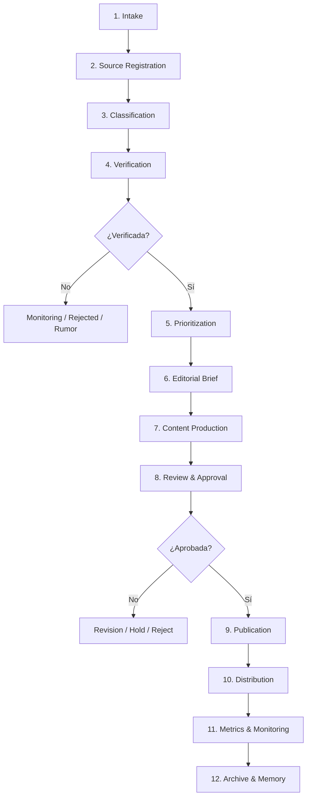

# ORION-023 — Pipeline del Newsroom

**Nivel documental:** L4 — Operations
**Volumen:** 006-operaciones
**Proyecto:** ORION / XCripto / XMIP
**Versión:** 1.0
**Estado:** Draft
**Owner:** Fernando Cuellar
**Última actualización:** 2026-07-02
**Ruta sugerida:** `docs/006-operaciones/ORION-023-Pipeline-del-Newsroom.md`

---

## 1. Propósito

Este documento define el pipeline operativo del newsroom de XCripto.

Su propósito es conectar en un solo flujo integral la detección de noticias, gestión de fuentes, verificación editorial, producción de contenido, revisión, publicación, distribución, medición, archivo y memoria editorial dentro de XMIP.

ORION-023 responde a la pregunta:

> ¿Cómo fluye una noticia dentro del newsroom de XCripto desde que aparece como señal hasta que queda publicada, medida, archivada y aprendida por el sistema?

Este documento convierte los documentos operativos anteriores en un pipeline estructurado, trazable y ejecutable.

---

## 2. Alcance

Este documento cubre:

* Pipeline completo del newsroom.
* Etapas operativas.
* Estados por etapa.
* Entradas y salidas.
* Responsables.
* Agentes involucrados.
* Workflows XMIP.
* Reglas de transición.
* Validaciones obligatorias.
* Datos mínimos.
* Eventos de auditoría.
* Métricas del pipeline.
* Riesgos.
* Criterios de aceptación.

Este documento no cubre en detalle:

* Calendario editorial.
* Distribución multicanal profunda.
* Métricas avanzadas.
* Gestión de incidentes editoriales.
* Operación detallada de cada agente.
* Diseño técnico de implementación.
* UI final del newsroom.

Esos temas se desarrollan en:

* ORION-024 — Calendario Editorial.
* ORION-025 — Distribución Multicanal.
* ORION-026 — Métricas Operativas.
* ORION-027 — Gestión de Incidentes Editoriales.
* ORION-028 — Operación de Agentes Editoriales.
* ORION-029 — Checklist Diario del Newsroom.

---

## 3. Documentos base

Este documento se apoya en:

* ORION-005 — Constitución Editorial.
* ORION-006 — Estándares Editoriales.
* ORION-007 — Flujo Editorial.
* ORION-014 — Arquitectura de Agentes.
* ORION-018 — Operaciones Diarias.
* ORION-019 — Flujo de Publicación.
* ORION-020 — Runbook de Producción de Noticias.
* ORION-021 — Gestión de Fuentes.
* ORION-022 — Protocolo de Verificación Editorial.

Este documento gobierna directamente:

* ORION-024 — Calendario Editorial.
* ORION-025 — Distribución Multicanal.
* ORION-026 — Métricas Operativas.
* ORION-027 — Gestión de Incidentes Editoriales.
* ORION-028 — Operación de Agentes Editoriales.
* ORION-029 — Checklist Diario del Newsroom.

---

## 4. Contexto operativo

XCripto no debe operar como una colección de publicaciones aisladas.

Debe operar como un newsroom con flujo, estados, responsables, agentes, controles y trazabilidad.

El pipeline evita que el contenido nazca de improvisación.

El flujo central es:

```text
señal
→ noticia candidata
→ fuente registrada
→ verificación
→ priorización
→ brief
→ pieza editorial
→ revisión
→ aprobación
→ publicación
→ distribución
→ medición
→ archivo
→ memoria
```

Cada etapa debe dejar evidencia dentro de XMIP.

---

## 5. Principio rector del pipeline

El pipeline del newsroom sigue este principio:

```text
Nada se publica sin fuente.
Nada sensible se publica sin verificación.
Nada crítico se publica sin aprobación.
Nada publicado queda sin registro.
Nada aprendido queda fuera de memoria útil.
```

Este pipeline no existe para hacer lento al newsroom.

Existe para hacerlo confiable, repetible y escalable.

---

## 6. Visión general del pipeline

El pipeline completo se compone de 12 etapas principales.

| Etapa | Nombre               | Objetivo                     |
| ----: | -------------------- | ---------------------------- |
|     1 | Intake               | Detectar y capturar señales |
|     2 | Source Registration  | Registrar fuente             |
|     3 | Classification       | Clasificar noticia           |
|     4 | Verification         | Validar información         |
|     5 | Prioritization       | Decidir relevancia           |
|     6 | Editorial Brief      | Crear brief editorial        |
|     7 | Content Production   | Producir pieza               |
|     8 | Review & Approval    | Revisar y aprobar            |
|     9 | Publication          | Publicar                     |
|    10 | Distribution         | Distribuir                   |
|    11 | Metrics & Monitoring | Medir desempeño             |
|    12 | Archive & Memory     | Archivar y aprender          |

---

## 7. Diagrama del pipeline



---

## 8. Etapa 1 — Intake

### 8.1 Objetivo

Detectar señales informativas relevantes para XCripto.

### 8.2 Entradas

* Fuente oficial.
* Medio especializado.
* Red social.
* Alertas de mercado.
* Datos on-chain.
* Comunicado regulatorio.
* Blog de proyecto.
* Newsletter.
* Calendario editorial.
* Evento programado.
* Reporte de seguridad.

### 8.3 Responsable

* Operador de Newsroom.
* NewsScoutAgent.

### 8.4 Actividades

1. Revisar fuentes activas.
2. Detectar señal relevante.
3. Capturar título preliminar.
4. Registrar URL o referencia.
5. Registrar fecha/hora de detección.
6. Identificar categoría preliminar.
7. Crear `NewsItem` en estado `detected`.

### 8.5 Salida

```text
NewsItem detected
```

### 8.6 Criterios de aceptación

* [ ] Señal registrada.
* [ ] Fuente inicial capturada.
* [ ] Fecha/hora registrada.
* [ ] Categoría preliminar asignada.
* [ ] Estado `detected`.
* [ ] correlation_id creado.

---

## 9. Etapa 2 — Source Registration

### 9.1 Objetivo

Registrar o validar la fuente asociada a la señal.

### 9.2 Entradas

* NewsItem detected.
* URL.
* Nombre de fuente.
* Tipo preliminar de fuente.

### 9.3 Responsable

* SourceValidatorAgent.
* Operador de Newsroom.

### 9.4 Actividades

1. Verificar si la fuente ya existe en Source Registry.
2. Si no existe, crear registro nuevo.
3. Asignar tipo de fuente.
4. Asignar nivel de confianza preliminar.
5. Revisar si está en whitelist, watchlist o blacklist.
6. Registrar uso de fuente en `SourceUsage`.

### 9.5 Estados posibles de fuente

```text
proposed
active
trusted
watchlist
restricted
blocked
archived
```

### 9.6 Salida

```text
SourceReference linked to NewsItem
```

### 9.7 Criterios de aceptación

* [ ] Fuente registrada.
* [ ] Tipo de fuente asignado.
* [ ] Estado de fuente identificado.
* [ ] No se usa fuente bloqueada.
* [ ] Uso de fuente registrado.
* [ ] Fuente ligada al NewsItem.

---

## 10. Etapa 3 — Classification

### 10.1 Objetivo

Clasificar la noticia por categoría, prioridad, riesgo y formato potencial.

### 10.2 Entradas

* NewsItem.
* SourceReference.
* Contexto del día.
* Narrativas activas.

### 10.3 Responsable

* MarketImpactAgent.
* Operador de Newsroom.

### 10.4 Actividades

1. Asignar categoría editorial.
2. Asignar prioridad preliminar.
3. Asignar tipo editorial.
4. Identificar activos, proyectos o sectores relacionados.
5. Estimar riesgo editorial.
6. Determinar si requiere escalamiento.

### 10.5 Categorías

```text
Bitcoin
Ethereum
Altcoins
Exchanges
Regulation
DeFi
Stablecoins
Security
Institutional
Macro
On-chain
AI + Crypto
Scam / Fraud
Education
Market
```

### 10.6 Prioridades

```text
P0 — Breaking / alto impacto
P1 — Principal del día
P2 — Relevante secundaria
P3 — Seguimiento
P4 — Ruido / descarte
```

### 10.7 Salida

```text
Classified NewsItem
```

### 10.8 Criterios de aceptación

* [ ] Categoría asignada.
* [ ] Prioridad asignada.
* [ ] Riesgo preliminar asignado.
* [ ] Tipo editorial recomendado.
* [ ] Escalamiento marcado si aplica.

---

## 11. Etapa 4 — Verification

### 11.1 Objetivo

Validar si la noticia puede tratarse como hecho, información parcial, rumor, monitoreo o descarte.

### 11.2 Entradas

* Classified NewsItem.
* SourceReference.
* EvidenceRecord preliminar.
* Nivel de riesgo.

### 11.3 Responsable

* SourceValidatorAgent.
* RiskAgent.
* Revisor Editorial.

### 11.4 Actividades

1. Buscar fuente primaria.
2. Confirmar fecha.
3. Revisar duplicados.
4. Revisar si la noticia es vieja reciclada.
5. Evaluar evidencia.
6. Asignar nivel de evidencia.
7. Asignar nivel de confianza.
8. Asignar estado de verificación.
9. Registrar `VerificationRecord`.
10. Escalar si corresponde.

### 11.5 Estados de verificación

```text
unverified
validating
verified
partially_verified
rumor
contradicted
rejected
escalated
monitoring
outdated
```

### 11.6 Niveles de evidencia

```text
E0 — Sin evidencia
E1 — Señal débil
E2 — Evidencia secundaria
E3 — Evidencia secundaria confiable
E4 — Evidencia primaria
E5 — Evidencia primaria + confirmación independiente
```

### 11.7 Salida

```text
VerificationRecord
```

### 11.8 Reglas de transición

* `unverified` no puede pasar a producción.
* `rumor` no puede publicarse como hecho.
* `contradicted` debe escalar o mantenerse en monitoreo.
* `verified` puede pasar a priorización.
* `partially_verified` puede pasar solo con lenguaje condicionado.
* Temas sensibles requieren revisión humana.

### 11.9 Criterios de aceptación

* [ ] Fuente primaria revisada o ausencia justificada.
* [ ] Fecha validada.
* [ ] Nivel de evidencia asignado.
* [ ] Nivel de confianza asignado.
* [ ] Estado de verificación asignado.
* [ ] Riesgo evaluado.
* [ ] Escalamiento realizado si aplica.

---

## 12. Etapa 5 — Prioritization

### 12.1 Objetivo

Decidir si la noticia merece producción, seguimiento, descarte o breaking coverage.

### 12.2 Entradas

* VerificationRecord.
* Classified NewsItem.
* Daily Editorial Context.
* Riesgo editorial.
* Capacidad del newsroom.

### 12.3 Responsable

* Editor Principal.
* Operador de Newsroom.
* MarketImpactAgent.

### 12.4 Actividades

1. Revisar prioridad inicial.
2. Comparar contra otras noticias del día.
3. Definir si será lead story, brief, alerta, seguimiento o descarte.
4. Confirmar canal o formato probable.
5. Asignar responsable.
6. Actualizar estado a `prioritized`, `monitoring`, `rejected` o `breaking`.

### 12.5 Decisiones posibles

| Decisión              | Estado resultante |
| ---------------------- | ----------------- |
| Producir               | prioritized       |
| Publicar como breaking | breaking          |
| Monitorear             | monitoring        |
| Descartar              | rejected          |
| Escalar                | escalated         |
| Mantener en espera     | hold              |

### 12.6 Salida

```text
Editorial Priority Decision
```

### 12.7 Criterios de aceptación

* [ ] Decisión registrada.
* [ ] Motivo registrado.
* [ ] Responsable asignado.
* [ ] Formato recomendado.
* [ ] Estado actualizado.

---

## 13. Etapa 6 — Editorial Brief

### 13.1 Objetivo

Convertir la noticia priorizada en un brief editorial claro y utilizable.

### 13.2 Entradas

* NewsItem verified / partially_verified.
* SourceReference.
* VerificationRecord.
* Priority Decision.

### 13.3 Responsable

* EditorialAgent.
* Operador de Newsroom.

### 13.4 Actividades

1. Redactar titular preliminar.
2. Resumir qué pasó.
3. Explicar por qué importa.
4. Separar hechos confirmados de puntos pendientes.
5. Identificar impacto potencial.
6. Registrar fuentes.
7. Identificar riesgos.
8. Recomendar formato.

### 13.5 Estructura mínima

```markdown
# Brief Editorial

**News ID:**  
**Prioridad:**  
**Categoría:**  
**Estado de verificación:**  
**Riesgo:**  

## Qué pasó

## Por qué importa

## Qué está confirmado

## Qué falta por confirmar

## Impacto potencial

## Fuentes

## Riesgos editoriales

## Formato recomendado
```

### 13.6 Salida

```text
Editorial Brief
```

### 13.7 Criterios de aceptación

* [ ] Brief creado.
* [ ] Hechos separados de interpretación.
* [ ] Fuentes incluidas.
* [ ] Riesgos incluidos.
* [ ] Formato recomendado.
* [ ] Lenguaje proporcional a evidencia.

---

## 14. Etapa 7 — Content Production

### 14.1 Objetivo

Producir la pieza editorial en el formato requerido.

### 14.2 Entradas

* Editorial Brief.
* Formato seleccionado.
* Canal objetivo.
* Guía de estilo.
* Estándares editoriales.

### 14.3 Responsable

* Productor de Contenido.
* EditorialAgent.
* ScriptAgent.
* SocialClipAgent.

### 14.4 Actividades

1. Crear pieza base.
2. Adaptar al formato.
3. Crear título.
4. Crear resumen.
5. Crear cuerpo o guion.
6. Agregar fuentes o referencias.
7. Agregar disclaimer si aplica.
8. Preparar metadata.
9. Crear `ContentPiece`.

### 14.5 Formatos posibles

| Formato         | Uso               |
| --------------- | ----------------- |
| article         | Artículo web     |
| brief           | Nota breve        |
| alert           | Alerta            |
| script          | Guion YouTube     |
| short_script    | Guion corto       |
| social_post     | Post corto        |
| thread          | Hilo              |
| newsletter_item | Bloque newsletter |
| explainer       | Explicador        |

### 14.6 Salida

```text
ContentPiece draft
```

### 14.7 Criterios de aceptación

* [ ] Pieza creada.
* [ ] Formato correcto.
* [ ] Fuente conservada.
* [ ] Disclaimer incluido si aplica.
* [ ] No hay recomendación financiera.
* [ ] No hay lenguaje desproporcionado.
* [ ] Estado `draft` o `reviewing`.

---

## 15. Etapa 8 — Review & Approval

### 15.1 Objetivo

Revisar la pieza antes de permitir publicación.

### 15.2 Entradas

* ContentPiece.
* VerificationRecord.
* RiskReview.
* SourceReference.

### 15.3 Responsable

* Revisor Editorial.
* RiskAgent.
* AuditAgent.
* Editor Principal si aplica.

### 15.4 Actividades

1. Revisar precisión.
2. Revisar titular.
3. Revisar tono.
4. Revisar fuentes.
5. Confirmar que hecho, análisis y opinión estén separados.
6. Confirmar disclaimers.
7. Evaluar riesgo.
8. Aprobar, regresar a edición, rechazar o escalar.

### 15.5 Decisiones posibles

```text
approve
revise
reject
hold
escalate
```

### 15.6 Salida

```text
ApprovalRecord
```

### 15.7 Criterios de aceptación

* [ ] Revisión registrada.
* [ ] Riesgo evaluado.
* [ ] Aprobación humana registrada si aplica.
* [ ] AuditAgent valida trazabilidad.
* [ ] Estado actualizado.

---

## 16. Etapa 9 — Publication

### 16.1 Objetivo

Publicar la pieza aprobada en el canal definido.

### 16.2 Entradas

* Approved ContentPiece.
* Canal.
* Metadata.
* Assets.
* ApprovalRecord.

### 16.3 Responsable

* Operador de Newsroom.
* Productor de Contenido.

### 16.4 Actividades

1. Validar canal.
2. Preparar metadata final.
3. Cargar contenido.
4. Cargar assets.
5. Publicar o programar.
6. Capturar URL.
7. Crear `PublicationRecord`.
8. Actualizar estado.

### 16.5 Canales

```text
YouTube
YouTube Shorts
TikTok
Instagram Reels
X / Twitter
LinkedIn
Newsletter
Blog / Web
Telegram
Discord
```

### 16.6 Salida

```text
PublicationRecord
```

### 16.7 Criterios de aceptación

* [ ] Pieza aprobada.
* [ ] Canal correcto.
* [ ] URL registrada.
* [ ] Fecha/hora registrada.
* [ ] Responsable registrado.
* [ ] Estado `published` o `scheduled`.
* [ ] Evento de auditoría generado.

---

## 17. Etapa 10 — Distribution

### 17.1 Objetivo

Adaptar y distribuir la publicación en canales secundarios.

### 17.2 Entradas

* PublicationRecord.
* ContentPiece.
* Canal principal.
* Canales secundarios.

### 17.3 Responsable

* SocialClipAgent.
* Productor de Contenido.
* Operador de Newsroom.

### 17.4 Actividades

1. Identificar canales secundarios.
2. Adaptar texto por canal.
3. Crear captions.
4. Crear clips si aplica.
5. Publicar o programar distribución.
6. Registrar `DistributionRecord`.

### 17.5 Regla clave

La distribución no debe ser copia mecánica.

Cada canal debe tener adaptación de:

* Tono.
* Longitud.
* Hook.
* CTA.
* Profundidad.
* Link.
* Hashtags si aplica.

### 17.6 Salida

```text
DistributionRecord
```

### 17.7 Criterios de aceptación

* [ ] Canales secundarios definidos.
* [ ] Texto adaptado por canal.
* [ ] Links correctos.
* [ ] Distribución registrada.
* [ ] No se perdió trazabilidad con la pieza original.

---

## 18. Etapa 11 — Metrics & Monitoring

### 18.1 Objetivo

Medir desempeño inicial y detectar problemas posteriores.

### 18.2 Entradas

* PublicationRecord.
* DistributionRecord.
* Canal.
* Ventana de medición.

### 18.3 Responsable

* Operador de Newsroom.
* AuditAgent.
* MetricsAgent si existe en fases futuras.

### 18.4 Actividades

1. Registrar métricas iniciales.
2. Medir en ventanas definidas.
3. Detectar desempeño anormal.
4. Detectar comentarios relevantes.
5. Registrar correcciones si aplica.
6. Marcar aprendizaje potencial.

### 18.5 Ventanas mínimas

```text
1 hora
24 horas
7 días
```

### 18.6 Métricas mínimas

| Canal                   | Métricas                                |
| ----------------------- | ---------------------------------------- |
| YouTube                 | views, watch time, CTR, retention        |
| Shorts / Reels / TikTok | views, completion rate, shares, saves    |
| X / Twitter             | impressions, reposts, replies, clicks    |
| LinkedIn                | impressions, reactions, comments, shares |
| Newsletter              | open rate, click rate, unsubscribe rate  |
| Blog / Web              | pageviews, time on page                  |
| Telegram / Discord      | views, reactions, replies                |

### 18.7 Salida

```text
MetricSnapshot
```

### 18.8 Criterios de aceptación

* [ ] Métricas registradas.
* [ ] publication_id relacionado.
* [ ] Canal identificado.
* [ ] Ventana de medición registrada.
* [ ] Hallazgos relevantes marcados.

---

## 19. Etapa 12 — Archive & Memory

### 19.1 Objetivo

Cerrar el ciclo operativo de la noticia y conservar aprendizaje útil.

### 19.2 Entradas

* NewsItem.
* ContentPiece.
* PublicationRecord.
* MetricSnapshot.
* AuditEvents.
* Hallazgos.

### 19.3 Responsable

* Operador de Newsroom.
* MemoryAgent.
* AuditAgent.
* KnowledgeAgent.

### 19.4 Actividades

1. Archivar noticia.
2. Relacionar fuentes.
3. Relacionar piezas publicadas.
4. Relacionar métricas.
5. Evaluar si debe guardarse memoria.
6. Registrar aprendizaje.
7. Crear relaciones de conocimiento.
8. Cerrar workflow.

### 19.5 Qué puede guardarse como memoria

* Fuente nueva confiable.
* Fuente problemática.
* Narrativa emergente.
* Error editorial.
* Formato que funcionó.
* Tema que requiere seguimiento.
* Riesgo recurrente.
* Lección de verificación.

### 19.6 Qué no debe guardarse

* Ruido temporal.
* Métrica sin interpretación.
* Rumor no confirmado como hecho.
* Duplicados.
* Opiniones impulsivas.

### 19.7 Salida

```text
Archived NewsItem + EditorialMemory + KnowledgeLinks
```

### 19.8 Criterios de aceptación

* [ ] NewsItem archivado.
* [ ] Piezas relacionadas.
* [ ] Fuentes relacionadas.
* [ ] Métricas relacionadas.
* [ ] Memoria evaluada.
* [ ] Relaciones de conocimiento creadas.
* [ ] Workflow cerrado.

---

## 20. Estados globales del pipeline

### 20.1 Estados del NewsItem

```text
detected
registered
classified
validating
verified
partially_verified
rumor
monitoring
rejected
prioritized
drafting
reviewing
approved
scheduled
published
distributed
measured
archived
corrected
retracted
escalated
```

### 20.2 Estados del ContentPiece

```text
draft
editing
reviewing
approved
scheduled
published
distributed
corrected
rejected
archived
```

### 20.3 Estados del PublicationRecord

```text
pending
scheduled
published
failed
corrected
removed
archived
```

### 20.4 Estados del WorkflowRun

```text
pending
running
waiting_approval
completed
failed
cancelled
paused
retrying
```

---

## 21. Reglas de transición

### 21.1 Reglas obligatorias

| Regla | Descripción                                           |
| ----- | ------------------------------------------------------ |
| R-001 | Un NewsItem no puede publicarse sin SourceReference    |
| R-002 | Un NewsItem no puede publicarse sin VerificationRecord |
| R-003 | Un ContentPiece no puede publicarse sin ApprovalRecord |
| R-004 | Una pieza sensible requiere revisión humana           |
| R-005 | Rumor no puede pasar a`published` como hecho         |
| R-006 | Fuente bloqueada impide publicación                   |
| R-007 | Toda publicación requiere PublicationRecord           |
| R-008 | Toda publicación requiere correlation_id              |
| R-009 | Toda corrección material requiere CorrectionRecord    |
| R-010 | Todo cierre debe evaluar memoria editorial             |

---

## 22. Workflows XMIP asociados

### 22.1 Workflow principal

```text
wf_newsroom_pipeline
```

Objetivo:

Ejecutar el pipeline completo de noticia.

Etapas:

```text
intake
source_registration
classification
verification
prioritization
editorial_brief
content_production
review_approval
publication
distribution
metrics_monitoring
archive_memory
```

---

### 22.2 Workflows secundarios

| Workflow                  | Propósito                 |
| ------------------------- | -------------------------- |
| wf_news_intake            | Registrar señales         |
| wf_source_review          | Evaluar fuentes            |
| wf_editorial_verification | Verificar noticia          |
| wf_breaking_news          | Flujo acelerado            |
| wf_content_production     | Crear pieza editorial      |
| wf_publication            | Publicar contenido         |
| wf_distribution           | Distribuir en canales      |
| wf_metrics_capture        | Capturar métricas         |
| wf_archive_memory         | Archivar y guardar memoria |
| wf_correction             | Corregir publicación      |

---

## 23. Agentes por etapa

| Etapa                | Agentes                                      |
| -------------------- | -------------------------------------------- |
| Intake               | NewsScoutAgent                               |
| Source Registration  | SourceValidatorAgent, AuditAgent             |
| Classification       | MarketImpactAgent                            |
| Verification         | SourceValidatorAgent, RiskAgent, AuditAgent  |
| Prioritization       | MarketImpactAgent, EditorialAgent            |
| Editorial Brief      | EditorialAgent                               |
| Content Production   | EditorialAgent, ScriptAgent, SocialClipAgent |
| Review & Approval    | RiskAgent, AuditAgent                        |
| Publication          | AuditAgent                                   |
| Distribution         | SocialClipAgent                              |
| Metrics & Monitoring | AuditAgent                                   |
| Archive & Memory     | MemoryAgent, KnowledgeAgent, AuditAgent      |

---

## 24. Datos mínimos del pipeline

### 24.1 NewsItem

```text
news_id
title
summary
category
priority
status
risk_level
detected_at
validated_at
published_at
owner
correlation_id
metadata
```

### 24.2 SourceReference

```text
source_ref_id
source_id
news_id
source_url
source_type
trust_level
accessed_at
confidence
notes
```

### 24.3 VerificationRecord

```text
verification_id
news_id
status
evidence_level
confidence_level
verified_by
verified_at
source_refs
risk_level
notes
correlation_id
```

### 24.4 ContentPiece

```text
content_id
news_id
format
channel_target
title
body
status
created_by
reviewed_by
approved_by
source_refs
correlation_id
```

### 24.5 PublicationRecord

```text
publication_id
content_id
channel
published_url
published_at
published_by
status
correlation_id
metadata
```

### 24.6 DistributionRecord

```text
distribution_id
publication_id
channel
content_variant
distributed_url
distributed_at
status
correlation_id
```

### 24.7 MetricSnapshot

```text
metric_snapshot_id
publication_id
channel
window
metric_name
metric_value
recorded_at
source
```

### 24.8 EditorialMemory

```text
memory_id
memory_type
title
content
source_ref
related_news_id
status
created_at
approved_by
```

### 24.9 AuditEvent

```text
event_id
event_type
actor_type
actor_ref
subject_type
subject_ref
action
status
correlation_id
occurred_at
metadata
```

---

## 25. Eventos de auditoría

### 25.1 Eventos mínimos

| Evento                  | Etapa                |
| ----------------------- | -------------------- |
| news_detected           | Intake               |
| source_linked           | Source Registration  |
| news_classified         | Classification       |
| verification_started    | Verification         |
| verification_approved   | Verification         |
| verification_rejected   | Verification         |
| news_prioritized        | Prioritization       |
| editorial_brief_created | Editorial Brief      |
| content_drafted         | Content Production   |
| content_reviewed        | Review & Approval    |
| content_approved        | Review & Approval    |
| content_published       | Publication          |
| content_distributed     | Distribution         |
| metric_recorded         | Metrics & Monitoring |
| news_archived           | Archive & Memory     |
| memory_proposed         | Archive & Memory     |
| memory_approved         | Archive & Memory     |
| pipeline_completed      | Archive & Memory     |

### 25.2 Evento mínimo JSON

```json
{
  "event_type": "pipeline_completed",
  "actor_type": "system",
  "actor_ref": "xmip",
  "subject_type": "news_item",
  "subject_ref": "news_001",
  "action": "complete_newsroom_pipeline",
  "status": "success",
  "correlation_id": "corr_20260702_xxxxxx",
  "occurred_at": "2026-07-02T00:00:00Z"
}
```

---

## 26. Vistas operativas recomendadas en XMIP

### 26.1 Intake Board

Debe mostrar:

* Señales detectadas.
* Fuente.
* Categoría preliminar.
* Estado.
* Prioridad.
* Responsable.
* Hora de detección.

### 26.2 Verification Queue

Debe mostrar:

* Noticias en validación.
* Fuente primaria.
* Nivel de evidencia.
* Nivel de confianza.
* Riesgo.
* Estado de verificación.

### 26.3 Editorial Queue

Debe mostrar:

* Noticias priorizadas.
* Briefs pendientes.
* Piezas en redacción.
* Piezas en revisión.
* Piezas aprobadas.

### 26.4 Publishing Board

Debe mostrar:

* Piezas aprobadas.
* Canal.
* Estado de publicación.
* URL.
* Fecha programada.
* Responsable.

### 26.5 Metrics Board

Debe mostrar:

* Publicaciones recientes.
* Métricas 1h.
* Métricas 24h.
* Métricas 7d.
* Alertas de desempeño.

### 26.6 Memory & Archive

Debe mostrar:

* Noticias archivadas.
* Memorias propuestas.
* Memorias aprobadas.
* Fuentes relacionadas.
* Narrativas recurrentes.

---

## 27. Manejo de excepciones

### 27.1 Fuente bloqueada

Acción:

```text
bloquear publicación
registrar evento
solicitar fuente alternativa
escalar si es P0/P1
```

### 27.2 Verificación insuficiente

Acción:

```text
mantener en validating, rumor o monitoring
no publicar como hecho
solicitar evidencia adicional
```

### 27.3 Información contradictoria

Acción:

```text
marcar contradicted
registrar fuentes en conflicto
escalar si es sensible
publicar solo contexto si se aprueba
```

### 27.4 Error después de publicar

Acción:

```text
activar wf_correction
crear CorrectionRecord
actualizar publicación
registrar memoria si deja aprendizaje
```

### 27.5 Publicación fallida

Acción:

```text
marcar PublicationRecord como failed
registrar causa
reintentar o cambiar canal
auditar evento
```

---

## 28. Métricas del pipeline

### 28.1 Métricas de flujo

| Métrica                             | Propósito                |
| ------------------------------------ | ------------------------- |
| Señales detectadas                  | Medir volumen de intake   |
| Señales convertidas en noticias     | Medir calidad de intake   |
| Noticias verificadas                 | Medir capacidad editorial |
| Noticias rechazadas                  | Medir filtro              |
| Noticias publicadas                  | Medir salida              |
| Tiempo intake → verificación       | Medir eficiencia          |
| Tiempo verificación → publicación | Medir producción         |
| Noticias escaladas                   | Medir riesgo              |
| Correcciones posteriores             | Medir calidad             |
| Piezas archivadas                    | Medir cierre operativo    |

### 28.2 Métricas de calidad

| Métrica                               | Meta inicial |
| -------------------------------------- | -----------: |
| Publicaciones con fuente registrada    |         100% |
| Publicaciones con VerificationRecord   |         100% |
| Publicaciones con ApprovalRecord       |         100% |
| Publicaciones con correlation_id       |         100% |
| Noticias sensibles con escalamiento    |         100% |
| Fuentes bloqueadas usadas              |            0 |
| Rumores publicados como hechos         |            0 |
| Correcciones materiales no registradas |            0 |

### 28.3 Métricas de aprendizaje

| Métrica                             | Propósito                   |
| ------------------------------------ | ---------------------------- |
| Memorias propuestas                  | Detectar aprendizaje         |
| Memorias aprobadas                   | Medir utilidad               |
| Fuentes degradadas                   | Medir higiene                |
| Narrativas recurrentes identificadas | Medir conocimiento editorial |
| Seguimientos abiertos                | Medir continuidad            |

---

## 29. SLA operativo sugerido

Los siguientes tiempos son metas internas, no compromisos públicos.

| Tipo                                    | Meta                                      |
| --------------------------------------- | ----------------------------------------- |
| P0 Intake → Registro                   | Inmediato                                 |
| P0 Registro → Verificación preliminar | Lo más rápido posible con fuente fuerte |
| P0 Verificación → Alerta              | Solo después de revisión humana         |
| P1 Registro → Brief                    | Mismo bloque operativo                    |
| P1 Brief → Pieza                       | Mismo día                                |
| P2 Registro → Producción              | Durante el día                           |
| P3 Registro → Seguimiento              | Según calendario                         |
| P4 Registro → Descarte                 | Mismo bloque operativo                    |

---

## 30. Riesgos del pipeline

| Riesgo                                  | Impacto | Probabilidad | Mitigación                             |
| --------------------------------------- | ------: | -----------: | --------------------------------------- |
| Pipeline demasiado lento                |   Medio |        Media | Flujo especial para breaking news       |
| Publicar sin verificación              |    Alto |        Media | Regla de VerificationRecord obligatorio |
| Fuente bloqueada usada                  |    Alto |         Baja | Policy check antes de publicación      |
| Agentes generan contenido inconsistente |   Medio |        Media | Revisión editorial y guía de estilo   |
| Métricas no registradas                |   Medio |        Media | MetricSnapshot obligatorio              |
| Memoria contaminada                     |   Medio |        Media | Aprobación de memoria                  |
| Duplicación de noticias                |   Medio |        Media | Revisión de duplicados en intake       |
| Contenido se queda atorado en revisión |   Medio |        Media | Estados y responsables claros           |
| Se pierde URL publicada                 |   Medio |        Media | PublicationRecord obligatorio           |
| Correcciones sin registro               |    Alto |         Baja | wf_correction obligatorio               |

---

## 31. Antipatrones prohibidos

XCripto debe evitar:

* Publicar directo desde intake.
* Saltarse verificación por urgencia.
* Crear contenido sin SourceReference.
* Generar guion sin brief.
* Publicar sin ApprovalRecord.
* Distribuir sin adaptar por canal.
* No registrar URL.
* No medir.
* Archivar sin memoria evaluada.
* Guardar todo como memoria.
* Usar agentes sin trazabilidad.
* Corregir silenciosamente.
* Mantener noticias indefinidamente en limbo.
* Llamar “pipeline” a una lista manual sin estados.

---

## 32. Criterios de aceptación del pipeline

El pipeline se considera operativo cuando:

* [ ] Toda señal puede convertirse en NewsItem.
* [ ] Toda noticia tiene fuente registrada.
* [ ] Toda noticia tiene categoría y prioridad.
* [ ] Toda noticia publicable tiene VerificationRecord.
* [ ] Toda pieza tiene ContentPiece.
* [ ] Toda pieza publicada tiene PublicationRecord.
* [ ] Toda publicación tiene URL registrada.
* [ ] Toda pieza sensible tiene revisión humana.
* [ ] Toda publicación tiene correlation_id.
* [ ] Toda publicación puede medirse.
* [ ] Toda noticia puede archivarse.
* [ ] Toda memoria propuesta tiene fuente.
* [ ] Los estados permiten saber dónde está cada noticia.
* [ ] El pipeline puede reconstruirse con auditoría.
* [ ] El sistema bloquea publicación cuando falta evidencia crítica.

---

## 33. Relación con arquitectura XMIP

Este pipeline debe mapearse con componentes de XMIP:

| Componente XMIP       | Uso                                            |
| --------------------- | ---------------------------------------------- |
| Source Registry       | Registro y evaluación de fuentes              |
| News Intake           | Captura de señales                            |
| Workflow Orchestrator | Ejecución del pipeline                        |
| Agent Runtime         | Ejecución de agentes                          |
| Content Registry      | Gestión de piezas                             |
| Publication Records   | Registro de publicación                       |
| Memory Service        | Memoria editorial                              |
| Knowledge Graph       | Relaciones entre noticias, fuentes y contenido |
| Audit Service         | Trazabilidad                                   |
| Observability Service | Métricas y errores                            |
| Policy Engine         | Bloqueos y reglas de publicación              |

---

## 34. Relación con otros documentos

Este documento se apoya en:

* ORION-018 — Operaciones Diarias.
* ORION-019 — Flujo de Publicación.
* ORION-020 — Runbook de Producción de Noticias.
* ORION-021 — Gestión de Fuentes.
* ORION-022 — Protocolo de Verificación Editorial.

Este documento gobierna directamente:

* ORION-024 — Calendario Editorial.
* ORION-025 — Distribución Multicanal.
* ORION-026 — Métricas Operativas.
* ORION-027 — Gestión de Incidentes Editoriales.
* ORION-028 — Operación de Agentes Editoriales.
* ORION-029 — Checklist Diario del Newsroom.

---

## 35. Próximos pasos

Después de aprobar ORION-023, continuar con:

1. ORION-024 — Calendario Editorial.
2. ORION-025 — Distribución Multicanal.
3. ORION-026 — Métricas Operativas.
4. ORION-027 — Gestión de Incidentes Editoriales.
5. ORION-028 — Operación de Agentes Editoriales.
6. ORION-029 — Checklist Diario del Newsroom.

ORION-024 debe definir cómo se planean, programan y coordinan las piezas editoriales recurrentes, noticieros, newsletters, coberturas especiales y contenidos evergreen.

---

## 36. Historial de cambios

| Versión | Fecha      | Cambio                                     | Autor            |
| -------- | ---------- | ------------------------------------------ | ---------------- |
| 1.0      | 2026-07-02 | Versión inicial del pipeline del newsroom | Fernando Cuellar |
