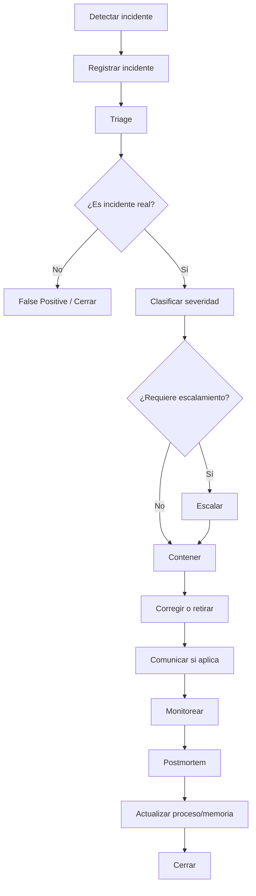

# ORION-027 — Gestión de Incidentes Editoriales

**Nivel documental:** L4 — Operations
**Volumen:** 006-operaciones
**Proyecto:** ORION / XCripto / XMIP
**Versión:** 1.0
**Estado:** Draft
**Owner:** Fernando Cuellar
**Última actualización:** 2026-07-02
**Ruta sugerida:** `docs/006-operaciones/ORION-027-Gestion-de-Incidentes-Editoriales.md`

---

## 1. Propósito

Este documento define el modelo operativo para gestionar incidentes editoriales dentro de XCripto.

Su propósito es establecer cómo detectar, clasificar, escalar, corregir, retirar, comunicar, auditar y aprender de errores editoriales, fallas de publicación, problemas de fuente, errores de verificación, fallas de agentes o incidentes de distribución.

ORION-027 responde a la pregunta:

> ¿Qué debe hacer XCripto cuando una publicación, fuente, verificación, agente o proceso editorial falla?

La gestión de incidentes no existe para castigar errores.
Existe para proteger credibilidad, reducir daño, corregir con transparencia y evitar repetición.

---

## 2. Alcance

Este documento cubre:

* Definición de incidente editorial.
* Tipos de incidentes.
* Severidades.
* Estados.
* Detección.
* Triage.
* Escalamiento.
* Respuesta operativa.
* Correcciones.
* Retiro de contenido.
* Comunicación interna y externa.
* Postmortem.
* Prevención.
* Roles responsables.
* Agentes involucrados.
* Datos mínimos en XMIP.
* Auditoría.
* Métricas.
* Checklists.
* Playbooks operativos.

Este documento no cubre en detalle:

* Producción normal de noticias.
* Gestión completa de fuentes.
* Verificación editorial regular.
* Distribución multicanal estándar.
* Métricas completas del newsroom.
* Operación detallada de agentes.

Esos temas se desarrollan en:

* ORION-020 — Runbook de Producción de Noticias.
* ORION-021 — Gestión de Fuentes.
* ORION-022 — Protocolo de Verificación Editorial.
* ORION-023 — Pipeline del Newsroom.
* ORION-025 — Distribución Multicanal.
* ORION-026 — Métricas Operativas.
* ORION-028 — Operación de Agentes Editoriales.

---

## 3. Documentos base

Este documento se apoya en:

* ORION-005 — Constitución Editorial.
* ORION-006 — Estándares Editoriales.
* ORION-007 — Flujo Editorial.
* ORION-018 — Operaciones Diarias.
* ORION-019 — Flujo de Publicación.
* ORION-020 — Runbook de Producción de Noticias.
* ORION-021 — Gestión de Fuentes.
* ORION-022 — Protocolo de Verificación Editorial.
* ORION-023 — Pipeline del Newsroom.
* ORION-024 — Calendario Editorial.
* ORION-025 — Distribución Multicanal.
* ORION-026 — Métricas Operativas.

Este documento gobierna directamente:

* ORION-028 — Operación de Agentes Editoriales.
* ORION-029 — Checklist Diario del Newsroom.

---

## 4. Contexto operativo

XCripto opera en un ecosistema cripto donde la información se mueve rápido, las narrativas se distorsionan con facilidad y los errores pueden afectar la confianza de la audiencia.

Los incidentes pueden originarse por:

* Fuente incorrecta.
* Rumor tratado como hecho.
* Titular exagerado.
* Error de fecha.
* Error de traducción.
* Interpretación incorrecta de dato on-chain.
* Falta de disclaimer.
* Publicación en canal equivocado.
* Error de agente.
* Duplicación.
* Falta de revisión humana.
* Información vieja publicada como nueva.
* Corrección no registrada.
* Problema técnico de publicación.
* Riesgo reputacional.

La pregunta no es si ocurrirán incidentes.
La pregunta es si XCripto tendrá un sistema para responder con rapidez, honestidad y trazabilidad.

---

## 5. Principio rector

La gestión de incidentes editoriales de XCripto sigue este principio:

```text
Corregir rápido,
documentar completo,
comunicar con claridad,
aprender de forma permanente.
```

Un incidente bien manejado puede fortalecer la confianza.
Un incidente ocultado la destruye.

---

## 6. Definición de incidente editorial

Un incidente editorial es cualquier evento que afecta o puede afectar:

* Precisión.
* Confianza.
* Verificación.
* Trazabilidad.
* Reputación.
* Seguridad informativa.
* Publicación.
* Distribución.
* Cumplimiento de estándares editoriales.
* Integridad del pipeline.

Ejemplos:

* Se publicó una noticia con fuente equivocada.
* Se publicó un rumor como hecho.
* Se omitió un disclaimer necesario.
* Un agente inventó una fuente.
* Se publicó un titular que exagera la evidencia.
* Se publicó una pieza sensible sin revisión humana.
* Se distribuyó una versión incorrecta en un canal.
* Se usó una fuente bloqueada.
* Se borró una publicación sin registrar motivo.
* Se corrigió una pieza materialmente sin auditoría.

---

## 7. Objetivos de la gestión de incidentes

El proceso de incidentes debe permitir:

1. Detectar errores rápido.
2. Clasificar severidad.
3. Reducir daño.
4. Corregir contenido.
5. Retirar contenido si es necesario.
6. Comunicar con transparencia.
7. Proteger la confianza editorial.
8. Registrar trazabilidad.
9. Identificar causa raíz.
10. Actualizar fuentes, agentes, prompts o procesos.
11. Guardar memoria útil.
12. Prevenir repetición.

---

## 8. Tipos de incidentes

### 8.1 Incidentes de fuente

| Tipo                 | Descripción                           |
| -------------------- | -------------------------------------- |
| wrong_source         | Fuente equivocada                      |
| blocked_source_used  | Se usó fuente bloqueada               |
| weak_source_used     | Fuente débil usada como confirmación |
| missing_source       | Publicación sin fuente                |
| source_impersonation | Fuente suplantada                      |
| source_compromised   | Cuenta o dominio comprometido          |
| source_outdated      | Fuente vieja o desactualizada          |

---

### 8.2 Incidentes de verificación

| Tipo                        | Descripción                           |
| --------------------------- | -------------------------------------- |
| rumor_published_as_fact     | Rumor publicado como hecho             |
| insufficient_evidence       | Evidencia insuficiente                 |
| missing_verification_record | Falta registro de verificación        |
| wrong_evidence_level        | Nivel de evidencia incorrecto          |
| contradiction_ignored       | Se ignoró información contradictoria |
| old_news_published_as_new   | Noticia vieja tratada como nueva       |
| screenshot_used_as_evidence | Captura usada sin validación          |

---

### 8.3 Incidentes editoriales

| Tipo                       | Descripción                                           |
| -------------------------- | ------------------------------------------------------ |
| headline_exceeded_evidence | Titular excede evidencia                               |
| fact_opinion_mixed         | Hecho y opinión mezclados                             |
| missing_disclaimer         | Falta disclaimer                                       |
| financial_advice_risk      | Riesgo de interpretarse como recomendación financiera |
| legal_reputational_risk    | Riesgo legal o reputacional                            |
| incorrect_context          | Contexto incorrecto                                    |
| translation_error          | Error de traducción                                   |
| wrong_date                 | Fecha incorrecta                                       |

---

### 8.4 Incidentes de publicación

| Tipo                       | Descripción                               |
| -------------------------- | ------------------------------------------ |
| wrong_channel              | Publicado en canal equivocado              |
| wrong_version_published    | Se publicó versión incorrecta            |
| publication_failed         | Falló publicación                        |
| published_without_approval | Publicado sin aprobación                  |
| url_not_recorded           | URL no registrada                          |
| duplicate_publication      | Publicación duplicada                     |
| scheduled_content_outdated | Contenido programado quedó desactualizado |

---

### 8.5 Incidentes de distribución

| Tipo                       | Descripción                     |
| -------------------------- | -------------------------------- |
| channel_variant_error      | Variante por canal incorrecta    |
| exaggerated_hook           | Hook exagerado                   |
| evidence_level_changed     | Variante cambia nivel de certeza |
| broken_link                | Link roto                        |
| wrong_caption              | Caption incorrecto               |
| distribution_without_trace | Distribución sin trazabilidad   |
| unmeasured_distribution    | Distribución sin métricas      |

---

### 8.6 Incidentes de agentes

| Tipo                                  | Descripción                             |
| ------------------------------------- | ---------------------------------------- |
| agent_hallucinated_source             | Agente inventó fuente                   |
| agent_policy_violation                | Agente violó política                  |
| agent_wrong_classification            | Agente clasificó mal                    |
| agent_unverified_claim                | Agente generó afirmación sin evidencia |
| agent_reused_invalid_memory           | Agente usó memoria inválida            |
| agent_output_published_without_review | Output de agente publicado sin revisión |
| agent_execution_missing_log           | Ejecución sin registro                  |

---

### 8.7 Incidentes de métricas y auditoría

| Tipo                        | Descripción                  |
| --------------------------- | ----------------------------- |
| missing_metric              | Métrica obligatoria faltante |
| incorrect_metric            | Métrica incorrecta           |
| missing_audit_event         | Falta evento de auditoría    |
| missing_correlation_id      | Falta correlation_id          |
| correction_not_logged       | Corrección sin registro      |
| retraction_not_logged       | Retiro sin registro           |
| memory_saved_without_source | Memoria sin fuente            |

---

## 9. Severidad de incidentes

### 9.1 Niveles de severidad

| Severidad | Nombre       | Descripción                                              | Respuesta              |
| --------- | ------------ | --------------------------------------------------------- | ---------------------- |
| SEV-0     | Crítico     | Daño alto o riesgo grave de confianza/legal/mercado      | Respuesta inmediata    |
| SEV-1     | Alto         | Error material publicado o pieza sensible afectada        | Respuesta prioritaria  |
| SEV-2     | Medio        | Error relevante pero contenido corregible sin daño mayor | Corrección controlada |
| SEV-3     | Bajo         | Error menor, metadata, formato o detalle operativo        | Corrección estándar  |
| SEV-4     | Observación | Riesgo potencial, sin impacto confirmado                  | Monitoreo              |

---

### 9.2 Criterios SEV-0

Un incidente es SEV-0 si:

* Se publicó rumor como hecho en tema sensible.
* Se acusó a persona o empresa sin evidencia.
* Se publicó información falsa que puede mover mercado.
* Se publicó recomendación financiera explícita o implícita de alto riesgo.
* Se publicó noticia falsa sobre hack, insolvencia o regulación.
* Se usó fuente falsa o suplantada en noticia crítica.
* Se requiere retractación pública inmediata.
* Existe riesgo legal o reputacional grave.

Acción:

```text
pausar distribución
escalar al Owner / Editor Principal
corregir o retirar
registrar incidente
preparar comunicación pública si aplica
postmortem obligatorio
```

---

### 9.3 Criterios SEV-1

Un incidente es SEV-1 si:

* Hay error material en noticia publicada.
* El titular excede evidencia en tema relevante.
* Faltó revisión humana en pieza sensible.
* Se omitió disclaimer necesario en contenido de mercado.
* Se publicó información parcialmente incorrecta.
* Se requiere corrección visible.

Acción:

```text
escalar
corregir
registrar CorrectionRecord
evaluar comunicación pública
postmortem requerido
```

---

### 9.4 Criterios SEV-2

Un incidente es SEV-2 si:

* Hay error de contexto.
* Hay error de fecha no crítico.
* Hay link incorrecto.
* Hay fuente secundaria mal etiquetada.
* Hay variante de canal con tono incorrecto.
* Hay publicación duplicada.
* Hay métrica faltante relevante.

Acción:

```text
corregir
registrar
evaluar aprendizaje
```

---

### 9.5 Criterios SEV-3

Un incidente es SEV-3 si:

* Hay typo menor.
* Hay metadata incompleta.
* Hay formato incorrecto.
* Hay retraso operativo.
* Falta tag o categoría no crítica.
* Falta métrica no crítica.

Acción:

```text
corrección estándar
registro operativo
```

---

### 9.6 Criterios SEV-4

Un incidente es SEV-4 si:

* Se detecta riesgo potencial.
* Hay fuente en observación.
* Hay contenido que podría quedar obsoleto.
* Hay discusión externa que requiere monitoreo.
* Hay posible contradicción no confirmada.

Acción:

```text
monitorear
registrar señal
revisar si escala
```

---

## 10. Estados del incidente

Todo incidente debe tener estado.

| Estado             | Descripción         |
| ------------------ | -------------------- |
| detected           | Incidente detectado  |
| triaging           | En clasificación    |
| confirmed          | Incidente confirmado |
| false_positive     | No era incidente     |
| escalated          | Escalado             |
| contained          | Daño contenido      |
| correcting         | En corrección       |
| corrected          | Corregido            |
| retracted          | Contenido retirado   |
| monitoring         | En monitoreo         |
| resolved           | Resuelto             |
| postmortem_pending | Postmortem pendiente |
| closed             | Cerrado              |
| reopened           | Reabierto            |

---

## 11. Ciclo de vida del incidente



---

## 12. Flujo estándar de gestión de incidentes

### 12.1 Paso 1 — Detectar

#### Objetivo

Identificar un posible incidente editorial u operativo.

#### Fuentes de detección

* Revisor Editorial.
* Owner / Editor Principal.
* Comentarios de audiencia.
* Métricas anómalas.
* Agente RiskAgent.
* Agente AuditAgent.
* SourceValidatorAgent.
* Error técnico.
* Comparación con fuentes.
* Alerta de plataforma.
* Corrección de tercero.

#### Salida

```text
IncidentCandidate
```

#### Criterios de aceptación

* [ ] Posible incidente identificado.
* [ ] Fuente de detección registrada.
* [ ] Pieza afectada identificada si aplica.
* [ ] Correlation ID registrado o creado.

---

### 12.2 Paso 2 — Registrar incidente

#### Objetivo

Crear registro formal del incidente en XMIP.

#### Campos mínimos

```text
incident_id
incident_type
severity
status
detected_at
detected_by
affected_news_id
affected_content_id
affected_publication_id
affected_channel
description
correlation_id
```

#### Salida

```text
IncidentRecord
```

#### Criterios de aceptación

* [ ] IncidentRecord creado.
* [ ] Tipo asignado.
* [ ] Estado inicial `detected`.
* [ ] Entidad afectada relacionada.
* [ ] Auditoría generada.

---

### 12.3 Paso 3 — Triage

#### Objetivo

Determinar si el incidente es real, su severidad y la acción inicial.

#### Responsable

* Operador de Newsroom.
* RiskAgent.
* AuditAgent.
* Editor Principal si aplica.

#### Preguntas de triage

* ¿Qué pieza está afectada?
* ¿Está publicada?
* ¿En qué canales?
* ¿Qué fuente se usó?
* ¿Qué evidencia existe?
* ¿El error cambia el sentido?
* ¿Afecta reputación?
* ¿Afecta decisiones financieras?
* ¿Requiere corrección pública?
* ¿Requiere retiro?
* ¿Debe pausarse distribución?

#### Salida

```text
TriageDecision
```

#### Criterios de aceptación

* [ ] Incidente confirmado o descartado.
* [ ] Severidad asignada.
* [ ] Acción inicial definida.
* [ ] Escalamiento definido si aplica.

---

### 12.4 Paso 4 — Contener

#### Objetivo

Reducir daño inmediato.

#### Acciones posibles

* Pausar distribución.
* Detener publicaciones programadas relacionadas.
* Despublicar temporalmente si aplica.
* Fijar estado `hold`.
* Bloquear variante incorrecta.
* Marcar fuente como watchlist/restricted.
* Evitar nuevos clips derivados.
* Notificar al equipo.

#### Salida

```text
ContainmentAction
```

#### Criterios de aceptación

* [ ] Daño adicional reducido.
* [ ] Canales afectados identificados.
* [ ] Distribución pausada si aplica.
* [ ] Acción registrada.

---

### 12.5 Paso 5 — Corregir o retirar

#### Objetivo

Resolver el contenido afectado.

#### Decisiones posibles

| Decisión           | Uso                                |
| ------------------- | ---------------------------------- |
| minor_correction    | Error menor                        |
| material_correction | Error que cambia precisión        |
| clarification       | Se requiere aclaración            |
| update              | Nueva información cambia contexto |
| retraction          | Retiro formal                      |
| no_action           | Incidente no confirmado            |

#### Salida

```text
CorrectionRecord or RetractionRecord
```

#### Criterios de aceptación

* [ ] Corrección o retiro aplicado.
* [ ] Registro creado.
* [ ] Canales afectados actualizados.
* [ ] URL corregida registrada.
* [ ] Auditoría generada.

---

### 12.6 Paso 6 — Comunicar

#### Objetivo

Informar internamente o públicamente cuando corresponda.

#### Comunicación interna obligatoria para:

* SEV-0.
* SEV-1.
* Incidentes con riesgo reputacional.
* Incidentes de fuente.
* Incidentes de agente.
* Correcciones materiales.

#### Comunicación pública requerida si:

* La pieza tuvo error material.
* La audiencia pudo ser inducida a error.
* El titular fue incorrecto.
* Se publicó información falsa.
* Se retiró contenido.
* La corrección cambia el sentido de la pieza.

#### Salida

```text
IncidentCommunicationRecord
```

---

### 12.7 Paso 7 — Monitorear

#### Objetivo

Revisar si el incidente quedó resuelto o generó efectos posteriores.

#### Actividades

* Monitorear comentarios.
* Revisar republicaciones.
* Revisar canales afectados.
* Revisar métricas.
* Revisar si hay nuevas fuentes.
* Revisar si hay críticas externas.
* Revisar si hay necesidad de actualización adicional.

#### Salida

```text
IncidentMonitoringRecord
```

---

### 12.8 Paso 8 — Postmortem

#### Objetivo

Identificar causa raíz y acciones preventivas.

#### Obligatorio para:

* SEV-0.
* SEV-1.
* Incidentes repetidos.
* Errores de agente.
* Uso de fuente bloqueada.
* Rumor publicado como hecho.
* Correcciones materiales.

#### Salida

```text
IncidentPostmortem
```

---

### 12.9 Paso 9 — Actualizar sistema

#### Objetivo

Convertir el incidente en mejora operativa.

Acciones posibles:

* Actualizar fuente.
* Degradar fuente.
* Bloquear fuente.
* Ajustar prompt.
* Ajustar agente.
* Actualizar checklist.
* Agregar alerta.
* Modificar pipeline.
* Crear memoria editorial.
* Crear regla de policy engine.
* Crear nueva métrica.
* Crear tarea de backlog.

#### Salida

```text
PreventiveAction
```

---

### 12.10 Paso 10 — Cerrar incidente

#### Objetivo

Cerrar formalmente el incidente con trazabilidad.

Criterios de cierre:

* [ ] Incidente clasificado.
* [ ] Acción aplicada.
* [ ] Corrección o retiro registrado si aplica.
* [ ] Comunicación realizada si aplica.
* [ ] Métricas revisadas.
* [ ] Postmortem completado si aplica.
* [ ] Acciones preventivas registradas.
* [ ] Memoria evaluada.
* [ ] Estado `closed`.

---

## 13. Escalamiento

### 13.1 Escalar obligatoriamente

Escalar al Owner / Editor Principal si:

* Severidad SEV-0 o SEV-1.
* Hay riesgo legal o reputacional.
* Se publicó rumor como hecho.
* Hay acusación contra persona o empresa.
* Se usó fuente bloqueada.
* Se publicó contenido sensible sin revisión.
* Se requiere retractación.
* Hay error en hack, exploit, regulación o exchange.
* Hay posible recomendación financiera.
* Hay uso incorrecto de IA o agente.
* El incidente puede afectar confianza pública.

---

### 13.2 Registro mínimo de escalamiento

```text
escalation_id
incident_id
reason
severity
requested_by
requested_at
decision
decided_by
decided_at
notes
correlation_id
```

---

### 13.3 Decisiones posibles

| Decisión        | Acción            |
| ---------------- | ------------------ |
| correct          | Corregir           |
| clarify          | Aclarar            |
| retract          | Retirar            |
| hold             | Mantener en espera |
| no_action        | No actuar          |
| investigate_more | Investigar más    |
| source_review    | Revisar fuente     |
| agent_review     | Revisar agente     |
| process_change   | Cambiar proceso    |

---

## 14. Correcciones

### 14.1 Tipos de corrección

| Tipo                  | Descripción                                  |
| --------------------- | --------------------------------------------- |
| minor_correction      | Error menor sin cambio de sentido             |
| material_correction   | Error que cambia precisión o interpretación |
| clarification         | Aclaración de contexto                       |
| update                | Actualización por nueva información         |
| source_correction     | Corrección de fuente                         |
| title_correction      | Corrección de titular                        |
| disclaimer_correction | Agregar o corregir disclaimer                 |

---

### 14.2 Cuándo hacer corrección visible

La corrección debe ser visible si:

* Cambia el sentido.
* Cambia dato clave.
* Cambia fuente.
* Corrige titular.
* Aclara rumor.
* Afecta interpretación.
* Evita posible daño a audiencia.

---

### 14.3 Registro mínimo de corrección

```text
correction_id
incident_id
content_id
publication_id
correction_type
previous_text
corrected_text
reason
corrected_by
approved_by
corrected_at
public_note_required
correlation_id
```

---

### 14.4 Nota pública de corrección

Plantilla:

```text
Corrección: una versión anterior de esta publicación indicaba [error]. 
La información correcta es [corrección]. 
Actualizamos el contenido para reflejarlo con mayor precisión.
```

---

## 15. Retiro de contenido

### 15.1 Cuándo retirar

Retirar contenido si:

* Es falso.
* Tiene error grave no corregible.
* Usa fuente falsa.
* Tiene riesgo legal alto.
* Afecta reputación sin evidencia.
* Publica acusación no sustentada.
* Induce a error financiero grave.
* Contiene información sensible incorrecta.
* Fue publicado sin aprobación en tema crítico.

---

### 15.2 Aprobación requerida

Todo retiro requiere aprobación del Owner / Editor Principal.

---

### 15.3 Registro mínimo de retiro

```text
retraction_id
incident_id
content_id
publication_id
reason
removed_by
approved_by
removed_at
public_note
replacement_url
correlation_id
```

---

### 15.4 Nota pública de retiro

Plantilla:

```text
Esta publicación fue retirada porque no cumplía con nuestros estándares de verificación editorial. 
XCripto revisará el caso y actualizará la información solo si existen fuentes suficientes.
```

---

## 16. Comunicación de incidentes

### 16.1 Comunicación interna

Debe incluir:

```text
incident_id
severidad
qué ocurrió
pieza afectada
canales afectados
acción tomada
responsable
siguiente paso
```

---

### 16.2 Comunicación pública

Debe ser:

* Clara.
* Breve.
* Sin excusas.
* Sin culpar a terceros sin evidencia.
* Con corrección concreta.
* Con explicación suficiente si el error fue material.
* Con compromiso de actualización si aplica.

---

### 16.3 Cuándo no comunicar públicamente

No se requiere comunicación pública si:

* El error fue menor.
* No cambió sentido.
* No fue visible para audiencia.
* La pieza no fue publicada.
* El incidente fue falso positivo.

Aun así, debe registrarse internamente si llegó a incidente.

---

## 17. Playbooks específicos

## 17.1 Playbook: Rumor publicado como hecho

### Severidad recomendada

```text
SEV-0 o SEV-1
```

### Pasos

1. Pausar distribución.
2. Marcar publicación afectada.
3. Escalar al Editor Principal.
4. Revisar fuente y evidencia.
5. Corregir o retirar.
6. Publicar aclaración si aplica.
7. Revisar cómo falló verificación.
8. Actualizar fuente.
9. Crear postmortem.
10. Guardar memoria editorial.

### Criterios de cierre

* [ ] Rumor ya no aparece como hecho.
* [ ] Canales corregidos.
* [ ] Audiencia informada si aplica.
* [ ] Fuente revisada.
* [ ] Proceso ajustado.

---

## 17.2 Playbook: Fuente incorrecta

### Severidad recomendada

```text
SEV-1 o SEV-2
```

### Pasos

1. Confirmar fuente correcta.
2. Identificar piezas afectadas.
3. Corregir fuente.
4. Actualizar SourceReference.
5. Registrar CorrectionRecord.
6. Revisar si la fuente debe degradarse.
7. Auditar otras piezas relacionadas.

---

## 17.3 Playbook: Titular excede evidencia

### Severidad recomendada

```text
SEV-1 o SEV-2
```

### Pasos

1. Comparar titular contra evidencia.
2. Reescribir titular.
3. Actualizar publicación.
4. Registrar corrección.
5. Revisar variantes en redes.
6. Revisar prompts de hooks si aplica.
7. Guardar aprendizaje si fue patrón.

---

## 17.4 Playbook: Falta de disclaimer

### Severidad recomendada

```text
SEV-2 o SEV-3
```

### Pasos

1. Identificar contenido afectado.
2. Agregar disclaimer.
3. Revisar canal.
4. Registrar corrección.
5. Revisar checklist de publicación.
6. Agregar alerta si es recurrente.

---

## 17.5 Playbook: Error de agente

### Severidad recomendada

```text
SEV-1 a SEV-3 según impacto
```

### Pasos

1. Identificar agente.
2. Revisar input.
3. Revisar output.
4. Revisar prompt/version.
5. Revisar memoria usada.
6. Bloquear output si no se publicó.
7. Corregir contenido si se publicó.
8. Registrar AgentIncident.
9. Ajustar prompt o política.
10. Reentrenar checklist operativo.

---

## 17.6 Playbook: Publicación en canal equivocado

### Severidad recomendada

```text
SEV-2 o SEV-3
```

### Pasos

1. Identificar canal equivocado.
2. Pausar o retirar si aplica.
3. Publicar en canal correcto.
4. Registrar cambio.
5. Verificar links.
6. Revisar DistributionPlan.
7. Actualizar calendario si aplica.

---

## 17.7 Playbook: Información legal o regulatoria mal interpretada

### Severidad recomendada

```text
SEV-0 o SEV-1
```

### Pasos

1. Pausar distribución.
2. Escalar al Editor Principal.
3. Revisar documento oficial.
4. Identificar interpretación incorrecta.
5. Corregir o retirar.
6. Publicar aclaración si aplica.
7. Actualizar protocolo regulatorio.
8. Registrar postmortem.

---

## 17.8 Playbook: Dato on-chain mal interpretado

### Severidad recomendada

```text
SEV-1 o SEV-2
```

### Pasos

1. Revisar hash, wallet o contrato.
2. Separar dato de interpretación.
3. Corregir atribución.
4. Corregir titular si aplica.
5. Revisar fuentes de etiquetado.
6. Registrar CorrectionRecord.
7. Ajustar guía de lenguaje on-chain.

---

## 18. Roles responsables

### 18.1 Owner / Editor Principal

Responsabilidades:

* Aprobar respuesta a incidentes SEV-0 y SEV-1.
* Aprobar correcciones materiales.
* Aprobar retiros.
* Decidir comunicación pública.
* Validar postmortem.
* Aprobar cambios de proceso.

---

### 18.2 Operador de Newsroom

Responsabilidades:

* Registrar incidente.
* Ejecutar triage inicial.
* Pausar distribución.
* Coordinar correcciones.
* Actualizar estados.
* Registrar auditoría.
* Asegurar cierre operativo.

---

### 18.3 Revisor Editorial

Responsabilidades:

* Evaluar precisión.
* Confirmar error.
* Revisar corrección.
* Validar lenguaje público.
* Revisar causa editorial.

---

### 18.4 Productor de Contenido

Responsabilidades:

* Corregir versiones por canal.
* Actualizar captions, guiones, posts o artículos.
* Verificar que todos los canales afectados queden corregidos.
* Registrar URLs actualizadas.

---

### 18.5 Agentes XMIP

Responsabilidades:

* Detectar anomalías.
* Identificar fuentes problemáticas.
* Comparar evidencia.
* Sugerir severidad.
* Proponer corrección.
* Auditar trazabilidad.
* Guardar memoria útil.

---

## 19. Agentes involucrados

### 19.1 RiskAgent

Responsabilidades:

* Detectar riesgo.
* Clasificar severidad preliminar.
* Recomendar escalamiento.
* Identificar lenguaje riesgoso.

---

### 19.2 AuditAgent

Responsabilidades:

* Verificar trazabilidad.
* Detectar piezas sin fuente.
* Detectar falta de VerificationRecord.
* Confirmar correction/retraction logs.
* Validar cierre.

---

### 19.3 SourceValidatorAgent

Responsabilidades:

* Revisar fuente afectada.
* Confirmar si fuente debe degradarse o bloquearse.
* Detectar suplantación o error de fuente.

---

### 19.4 EditorialAgent

Responsabilidades:

* Proponer corrección.
* Reescribir titular o texto.
* Separar hecho/opinión.
* Preparar aclaración.

---

### 19.5 DistributionAgent

Responsabilidades:

* Identificar canales afectados.
* Pausar distribución.
* Coordinar corrección por canal.
* Confirmar URLs actualizadas.

---

### 19.6 MemoryAgent

Responsabilidades:

* Proponer memoria de aprendizaje.
* Registrar patrón de error.
* Invalidar memoria incorrecta si causó incidente.

---

### 19.7 KnowledgeAgent

Responsabilidades:

* Relacionar incidente con fuente, noticia, publicación, agente y decisión.
* Actualizar grafo de conocimiento.
* Detectar impacto en piezas relacionadas.

---

## 20. Datos mínimos en XMIP

### 20.1 IncidentRecord

```text
incident_id
incident_type
severity
status
title
description
detected_at
detected_by
owner
affected_news_id
affected_content_id
affected_publication_id
affected_channel
root_cause
resolution
correlation_id
metadata
```

---

### 20.2 IncidentTriage

```text
triage_id
incident_id
triaged_by
triaged_at
confirmed
severity
impact_summary
recommended_action
requires_escalation
notes
correlation_id
```

---

### 20.3 IncidentAction

```text
action_id
incident_id
action_type
description
owner
status
started_at
completed_at
result
correlation_id
```

---

### 20.4 CorrectionRecord

```text
correction_id
incident_id
content_id
publication_id
correction_type
previous_value
new_value
reason
corrected_by
approved_by
corrected_at
public_note_required
correlation_id
```

---

### 20.5 RetractionRecord

```text
retraction_id
incident_id
content_id
publication_id
reason
removed_by
approved_by
removed_at
public_note
replacement_url
correlation_id
```

---

### 20.6 IncidentCommunication

```text
communication_id
incident_id
communication_type
audience
message
channel
sent_by
sent_at
status
correlation_id
```

---

### 20.7 IncidentPostmortem

```text
postmortem_id
incident_id
summary
timeline
root_cause
contributing_factors
impact
what_worked
what_failed
preventive_actions
owner
completed_at
approved_by
correlation_id
```

---

### 20.8 PreventiveAction

```text
preventive_action_id
incident_id
action_type
description
owner
status
due_date
completed_at
verification_method
correlation_id
```

---

## 21. Relaciones de conocimiento

El incidente debe conectarse con el grafo de conocimiento.

Relaciones mínimas:

```text
IncidentRecord affects NewsItem
IncidentRecord affects ContentPiece
IncidentRecord affects PublicationRecord
IncidentRecord caused_by SourceReference
IncidentRecord caused_by AgentExecution
IncidentRecord detected_by User
IncidentRecord detected_by Agent
IncidentRecord resolved_by IncidentAction
CorrectionRecord corrects ContentPiece
RetractionRecord retracts PublicationRecord
IncidentPostmortem analyzes IncidentRecord
PreventiveAction mitigates IncidentRecord
EditorialMemory derived_from IncidentPostmortem
```

---

## 22. Auditoría

### 22.1 Eventos obligatorios

| Evento                      | Cuándo ocurre             |
| --------------------------- | -------------------------- |
| incident_detected           | Se detecta incidente       |
| incident_registered         | Se crea IncidentRecord     |
| incident_triaged            | Se clasifica               |
| incident_escalated          | Se escala                  |
| incident_contained          | Se contiene                |
| correction_created          | Se crea corrección        |
| correction_published        | Se publica corrección     |
| content_retracted           | Se retira contenido        |
| incident_communication_sent | Se comunica                |
| postmortem_created          | Se crea postmortem         |
| preventive_action_created   | Se crea acción preventiva |
| incident_closed             | Se cierra incidente        |

---

### 22.2 Evento mínimo

```json
{
  "event_type": "incident_registered",
  "incident_id": "incident_001",
  "incident_type": "headline_exceeded_evidence",
  "severity": "SEV-1",
  "status": "confirmed",
  "actor_type": "user",
  "actor_ref": "operator",
  "subject_type": "publication_record",
  "subject_ref": "publication_001",
  "correlation_id": "corr_20260702_xxxxxx",
  "occurred_at": "2026-07-02T00:00:00Z"
}
```

---

## 23. Métricas de incidentes

### 23.1 Métricas principales

| Métrica                              | Propósito                      |
| ------------------------------------- | ------------------------------- |
| `incidents_count`                   | Medir volumen de incidentes     |
| `incidents_by_severity`             | Medir gravedad                  |
| `incidents_by_type`                 | Detectar patrones               |
| `open_incidents_count`              | Ver carga activa                |
| `mean_time_to_detect`               | Medir detección                |
| `mean_time_to_triage`               | Medir clasificación            |
| `mean_time_to_contain`              | Medir contención               |
| `mean_time_to_resolve`              | Medir resolución               |
| `corrections_count`                 | Medir errores corregidos        |
| `retractions_count`                 | Medir fallas graves             |
| `repeat_incidents_count`            | Detectar problemas sistémicos  |
| `incidents_by_source`               | Detectar fuentes problemáticas |
| `incidents_by_agent`                | Detectar agentes problemáticos |
| `postmortem_completion_rate`        | Medir disciplina                |
| `preventive_action_completion_rate` | Medir mejora real               |

---

### 23.2 Metas iniciales

| Métrica                             | Meta |
| ------------------------------------ | ---: |
| SEV-0 sin escalamiento               |    0 |
| SEV-1 sin postmortem                 |    0 |
| Correcciones materiales sin registro |    0 |
| Retiros sin aprobación              |    0 |
| Incidentes sin correlation_id        |    0 |
| Incidentes cerrados sin resolución  |    0 |
| Acciones preventivas sin dueño      |    0 |

---

## 24. Alertas operativas

### 24.1 Alertas críticas

Disparar alerta crítica si:

* Incidente SEV-0.
* Rumor publicado como hecho.
* Fuente bloqueada usada.
* Pieza sensible publicada sin revisión.
* Retiro requerido.
* Corrección material urgente.
* Agente inventó fuente y llegó a publicación.
* Hay riesgo legal o reputacional alto.

---

### 24.2 Alertas medias

Disparar alerta media si:

* Aumentan correcciones.
* Hay varias publicaciones sin métricas.
* Hay fuente en watchlist usada repetidamente.
* Varias variantes por canal son rechazadas.
* Se detecta patrón de titular exagerado.
* Hay errores repetidos de agente.

---

### 24.3 Alertas bajas

Disparar alerta baja si:

* Hay incidentes SEV-3 abiertos.
* Hay postmortem pendiente.
* Hay acción preventiva vencida.
* Hay memoria de incidente sin revisar.
* Hay pieza archivada con metadata incompleta.

---

## 25. Plantilla de Incident Report

```markdown
# Incident Report

**Incident ID:**  
**Tipo:**  
**Severidad:**  
**Estado:**  
**Detectado por:**  
**Fecha de detección:**  
**Owner:**  
**Correlation ID:**  

---

## 1. Resumen

## 2. Pieza afectada

## 3. Canales afectados

## 4. Qué ocurrió

## 5. Impacto

## 6. Acción inmediata

## 7. Corrección o retiro

## 8. Comunicación

## 9. Causa raíz preliminar

## 10. Próximos pasos
```

---

## 26. Plantilla de Postmortem

```markdown
# Incident Postmortem

**Incident ID:**  
**Severidad:**  
**Fecha:**  
**Owner:**  
**Estado:**  

---

## 1. Resumen ejecutivo

## 2. Línea de tiempo

| Hora | Evento |
|---|---|

## 3. Impacto

## 4. Causa raíz

## 5. Factores contribuyentes

## 6. Qué funcionó

## 7. Qué falló

## 8. Acciones correctivas

| Acción | Owner | Fecha límite | Estado |
|---|---|---|---|

## 9. Cambios a proceso

## 10. Cambios a fuentes

## 11. Cambios a agentes/prompts

## 12. Memoria editorial propuesta

## 13. Cierre
```

---

## 27. Checklist de respuesta a incidentes

### 27.1 Detección

* [ ] Incidente detectado.
* [ ] Pieza afectada identificada.
* [ ] Canal afectado identificado.
* [ ] Fuente de detección registrada.
* [ ] Correlation ID creado o asociado.

---

### 27.2 Triage

* [ ] Tipo asignado.
* [ ] Severidad asignada.
* [ ] Impacto evaluado.
* [ ] Estado confirmado o falso positivo.
* [ ] Escalamiento definido.

---

### 27.3 Contención

* [ ] Distribución pausada si aplica.
* [ ] Publicaciones programadas revisadas.
* [ ] Canales afectados identificados.
* [ ] Owner notificado.
* [ ] Acción inmediata registrada.

---

### 27.4 Corrección / retiro

* [ ] Corrección creada si aplica.
* [ ] Retiro creado si aplica.
* [ ] Aprobación registrada.
* [ ] URLs actualizadas.
* [ ] Comunicación pública preparada si aplica.

---

### 27.5 Cierre

* [ ] Métricas revisadas.
* [ ] Postmortem completado si aplica.
* [ ] Acciones preventivas creadas.
* [ ] Memoria evaluada.
* [ ] Estado `closed`.
* [ ] Auditoría completa.

---

## 28. Reglas de prevención

XCripto debe implementar controles preventivos:

* Bloquear publicación sin fuente.
* Bloquear publicación sin VerificationRecord.
* Bloquear pieza sensible sin aprobación.
* Bloquear fuente en estado `blocked`.
* Alertar si hay fuente social como única fuente en P0/P1.
* Alertar si falta disclaimer en contenido de mercado.
* Alertar si canal corto cambia nivel de certeza.
* Alertar si agente genera fuente no registrada.
* Alertar si pieza programada está desactualizada.
* Alertar si hay corrección sin registro.

---

## 29. Antipatrones prohibidos

XCripto debe evitar:

* Ocultar errores.
* Corregir silenciosamente errores materiales.
* Retirar contenido sin registro.
* Culpar a la IA sin revisar proceso.
* Culpar a fuente externa sin admitir falla de verificación.
* No comunicar errores relevantes.
* No hacer postmortem de incidentes graves.
* No actualizar checklists después de incidente.
* No degradar fuentes problemáticas.
* No ajustar agentes que fallaron.
* Repetir el mismo incidente sin acción preventiva.
* Cerrar incidentes sin causa raíz.
* Guardar memoria falsa o incompleta.

---

## 30. Relación con XMIP

XMIP debe soportar gestión de incidentes mediante:

* Incident Records.
* Incident Triage.
* Incident Actions.
* Correction Records.
* Retraction Records.
* Incident Communications.
* Incident Postmortems.
* Preventive Actions.
* Source status changes.
* Agent execution review.
* Audit events.
* Metric alerts.
* Knowledge relationships.
* Memory records.

El objetivo es que cada incidente se convierta en mejora verificable del sistema.

---

## 31. Criterios de aceptación

Este documento se considera aceptado cuando:

* [ ] Define qué es un incidente editorial.
* [ ] Define tipos de incidentes.
* [ ] Define severidades.
* [ ] Define estados.
* [ ] Define ciclo de vida.
* [ ] Define flujo estándar de respuesta.
* [ ] Define reglas de escalamiento.
* [ ] Define correcciones.
* [ ] Define retiro de contenido.
* [ ] Define comunicación de incidentes.
* [ ] Define playbooks específicos.
* [ ] Define roles responsables.
* [ ] Define agentes involucrados.
* [ ] Define datos mínimos en XMIP.
* [ ] Define relaciones de conocimiento.
* [ ] Define auditoría.
* [ ] Define métricas.
* [ ] Define alertas.
* [ ] Define plantillas.
* [ ] Define checklists.
* [ ] Define reglas de prevención.
* [ ] Define antipatrones.
* [ ] Define relación con XMIP.

---

## 32. Relación con otros documentos

Este documento se apoya en:

* ORION-018 — Operaciones Diarias.
* ORION-019 — Flujo de Publicación.
* ORION-020 — Runbook de Producción de Noticias.
* ORION-021 — Gestión de Fuentes.
* ORION-022 — Protocolo de Verificación Editorial.
* ORION-023 — Pipeline del Newsroom.
* ORION-024 — Calendario Editorial.
* ORION-025 — Distribución Multicanal.
* ORION-026 — Métricas Operativas.

Este documento gobierna directamente:

* ORION-028 — Operación de Agentes Editoriales.
* ORION-029 — Checklist Diario del Newsroom.

---

## 33. Próximos pasos

Después de aprobar ORION-027, continuar con:

1. ORION-028 — Operación de Agentes Editoriales.
2. ORION-029 — Checklist Diario del Newsroom.

ORION-028 debe definir cómo se ejecutan, supervisan, limitan, auditan y corrigen los agentes editoriales dentro del newsroom.

---

## 34. Historial de cambios

| Versión | Fecha      | Cambio                                                 | Autor            |
| -------- | ---------- | ------------------------------------------------------ | ---------------- |
| 1.0      | 2026-07-02 | Versión inicial de gestión de incidentes editoriales | Fernando Cuellar |
