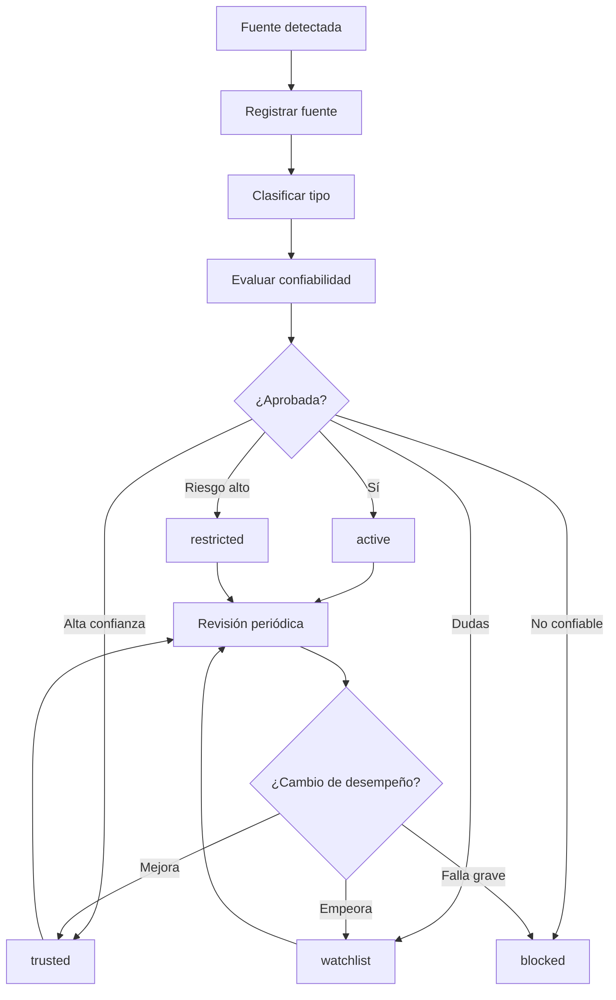

# ORION-021 — Gestión de Fuentes

**Nivel documental:** L4 — Operations
**Volumen:** 006-operaciones
**Proyecto:** ORION / XCripto / XMIP
**Versión:** 1.0
**Estado:** Draft
**Owner:** Fernando Cuellar
**Última actualización:** 2026-07-02
**Ruta sugerida:** `docs/006-operaciones/ORION-021-Gestion-de-Fuentes.md`

---

## 1. Propósito

Este documento define el modelo operativo para gestionar fuentes dentro de XCripto.

Su propósito es establecer cómo se identifican, clasifican, evalúan, validan, monitorean, aprueban, degradan o bloquean las fuentes utilizadas por el newsroom para producir noticias, análisis, alertas, guiones y contenido editorial.

ORION-021 responde a la pregunta:

> ¿Qué fuentes puede usar XCripto, bajo qué nivel de confianza y con qué controles editoriales?

La gestión de fuentes es una capacidad crítica para mantener credibilidad.
Sin fuentes claras, XCripto se convierte en otro canal de ruido cripto. Ese no es el negocio.

---

## 2. Alcance

Este documento cubre:

* Tipos de fuentes.
* Clasificación de confiabilidad.
* Fuentes primarias.
* Fuentes secundarias.
* Fuentes sociales.
* Fuentes on-chain.
* Fuentes regulatorias.
* Fuentes de mercado.
* Scoring de fuentes.
* Whitelist.
* Watchlist.
* Blacklist.
* Reglas de uso por tipo de noticia.
* Validación mínima por fuente.
* Registro de fuentes.
* Ciclo de vida de una fuente.
* Responsables.
* Agentes involucrados.
* Métricas.
* Riesgos.
* Checklist operativo.

Este documento no cubre en detalle:

* Protocolo completo de verificación editorial.
* Producción de noticias paso a paso.
* Distribución multicanal.
* Gestión de incidentes editoriales.
* Métricas avanzadas de contenido.

Esos temas se desarrollan en:

* ORION-020 — Runbook de Producción de Noticias.
* ORION-022 — Protocolo de Verificación Editorial.
* ORION-025 — Distribución Multicanal.
* ORION-026 — Métricas Operativas.
* ORION-027 — Gestión de Incidentes Editoriales.

---

## 3. Contexto operativo

El ecosistema cripto produce información a alta velocidad, pero no toda información es noticia.

Las fuentes pueden ser:

* Oficiales.
* Periodísticas.
* Técnicas.
* Sociales.
* Comerciales.
* Interesadas.
* Manipuladas.
* Automatizadas.
* Anónimas.
* Desactualizadas.
* Directamente falsas.

XCripto debe operar bajo una regla simple:

> Una fuente no es confiable porque aparece primero. Es confiable porque puede sostener lo que afirma.

La gestión de fuentes debe permitir separar:

```text
fuente primaria
fuente secundaria confiable
fuente social útil
rumor
señal débil
manipulación
ruido
```

---

## 4. Principios de gestión de fuentes

### 4.1 La fuente primaria tiene prioridad

Siempre que exista fuente primaria, debe revisarse antes de publicar.

Ejemplos:

* Blog oficial.
* Comunicado de empresa.
* Filing regulatorio.
* Documento judicial.
* Transacción on-chain.
* Repositorio oficial.
* Postmortem técnico.
* Comunicado de exchange.
* Publicación oficial de regulador.

---

### 4.2 La fuente social no confirma por sí sola

Una publicación en X, Telegram, Discord, Reddit o YouTube puede disparar investigación, pero no debe confirmar una noticia sensible por sí sola.

---

### 4.3 La reputación no elimina verificación

Un medio reconocido también puede equivocarse.

La reputación de la fuente mejora el nivel de confianza, pero no reemplaza la validación.

---

### 4.4 Las fuentes tienen sesgos

Toda fuente puede tener incentivos:

* Comerciales.
* Políticos.
* De mercado.
* De reputación.
* De comunidad.
* De tráfico.
* De promoción de token.

XCripto debe considerar esos incentivos antes de amplificar información.

---

### 4.5 La trazabilidad es obligatoria

Toda pieza publicada debe poder responder:

* Qué fuente se usó.
* Qué tipo de fuente era.
* Cuándo se consultó.
* Qué nivel de confianza tenía.
* Si existía fuente primaria.
* Si hubo fuentes contradictorias.
* Quién aprobó su uso.

---

### 4.6 Las fuentes evolucionan

Una fuente puede mejorar, degradarse o bloquearse con el tiempo.

La clasificación no debe ser permanente sin revisión.

---

## 5. Definiciones

### Fuente primaria

Fuente que origina directamente la información.

Ejemplos:

* Sitio oficial de una empresa.
* Blog oficial de un protocolo.
* Cuenta oficial verificada.
* Documento regulatorio.
* Hash de transacción.
* Contrato inteligente.
* Repositorio GitHub oficial.
* Comunicado de prensa oficial.
* Declaración directa de un actor involucrado.

---

### Fuente secundaria

Fuente que reporta información originada por otra fuente.

Ejemplos:

* Medio de noticias.
* Newsletter.
* Analista.
* Reporte de investigación.
* Podcast.
* Cuenta curadora.

---

### Fuente social

Fuente basada en redes sociales o comunidades.

Ejemplos:

* X / Twitter.
* Telegram.
* Discord.
* Reddit.
* YouTube.
* TikTok.
* Foros.
* Spaces.

---

### Fuente on-chain

Fuente verificable mediante datos de blockchain.

Ejemplos:

* Exploradores de bloques.
* Transacciones.
* Smart contracts.
* Wallets etiquetadas.
* Dashboards on-chain.
* Métricas de protocolos.

---

### Fuente regulatoria

Fuente oficial legal, gubernamental o regulatoria.

Ejemplos:

* SEC.
* CFTC.
* ESMA.
* Banco central.
* Poder judicial.
* Diario oficial.
* Legisladores.
* Cortes.
* Documentos legales.

---

### Fuente de mercado

Fuente que provee datos financieros, precios, volumen, funding, liquidaciones o derivados.

Ejemplos:

* Exchanges.
* Agregadores de mercado.
* Dashboards.
* APIs.
* Proveedores de datos.
* Plataformas de derivados.

---

### Fuente interesada

Fuente que tiene incentivo directo en que cierta narrativa se difunda.

Ejemplos:

* Founder de proyecto.
* Exchange involucrado.
* Influencer con posición abierta.
* Fondo con inversión.
* Comunidad de token.
* Sponsor.
* Afiliado.

No está prohibida, pero debe etiquetarse con cuidado.

---

## 6. Clasificación de fuentes

### 6.1 Tipos principales

| Tipo                 | Descripción                   | Uso permitido                    |
| -------------------- | ------------------------------ | -------------------------------- |
| primary              | Fuente originaria              | Confirmación principal          |
| secondary_trusted    | Medio o analista confiable     | Apoyo y contexto                 |
| secondary_unverified | Medio sin historial claro      | Solo con validación adicional   |
| social_official      | Cuenta social oficial          | Útil si identidad confirmada    |
| social_unverified    | Cuenta social no verificada    | Señal, no confirmación         |
| on_chain             | Dato blockchain verificable    | Evidencia técnica               |
| regulatory           | Documento o autoridad oficial  | Alta confianza                   |
| market_data          | Datos de mercado               | Contexto cuantitativo            |
| community            | Comunidad o foro               | Señal de seguimiento            |
| anonymous            | Fuente anónima                | Alto riesgo                      |
| sponsored            | Fuente con incentivo comercial | Uso limitado y etiquetado        |
| unreliable           | Fuente problemática           | No usar salvo análisis crítico |

---

### 6.2 Niveles de confianza

| Nivel | Valor | Descripción                       | Uso                                     |
| ----- | ----: | ---------------------------------- | --------------------------------------- |
| T0    |  0.00 | Bloqueada o no confiable           | No usar                                 |
| T1    |  0.25 | Baja confianza                     | Solo monitoreo                          |
| T2    |  0.50 | Confianza media                    | Requiere confirmación                  |
| T3    |  0.75 | Alta confianza                     | Puede apoyar publicación               |
| T4    |  0.90 | Muy alta confianza                 | Puede confirmar con validación mínima |
| T5    |  1.00 | Fuente primaria oficial/verificada | Confirmación fuerte                    |

---

## 7. Matriz de uso por tipo de noticia

| Tipo de noticia          | Fuente mínima requerida                                              |
| ------------------------ | --------------------------------------------------------------------- |
| Noticia educativa        | Fuente secundaria confiable o documentación base                     |
| Movimiento de mercado    | Fuente de datos + contexto                                            |
| Hack / exploit           | Fuente primaria, on-chain o investigador confiable + revisión humana |
| Regulación              | Documento oficial o fuente regulatoria primaria                       |
| Exchange detiene retiros | Comunicado oficial o evidencia fuerte + confirmación secundaria      |
| Rumor de insolvencia     | No publicar como hecho; solo monitoreo o pieza claramente marcada     |
| Lanzamiento de producto  | Comunicado oficial o blog del proyecto                                |
| ETF / institucional      | Documento oficial, filing, comunicado o medio altamente confiable     |
| Demanda legal            | Documento judicial o regulador                                        |
| Scam / fraude            | Evidencia verificable + revisión humana                              |
| Precio / mercado         | Datos verificables; no hacer predicción                              |
| Opinión editorial       | Fuente base + etiquetar como análisis/opinión                       |

---

## 8. Registro de fuentes

Toda fuente usada por XCripto debe registrarse en XMIP.

### 8.1 Campos mínimos

```text
source_id
source_name
source_type
source_url
owner_entity
category
trust_level
status
first_seen_at
last_used_at
last_reviewed_at
reviewed_by
notes
```

### 8.2 Campos recomendados

```text
language
region
topics
known_bias
risk_level
verification_method
primary_contact
social_handles
official_domains
blacklist_reason
watchlist_reason
confidence_score
metadata
```

---

## 9. Estados de fuente

| Estado     | Descripción                    |
| ---------- | ------------------------------- |
| proposed   | Fuente propuesta, no revisada   |
| active     | Fuente aprobada para uso normal |
| trusted    | Fuente de alta confianza        |
| watchlist  | Fuente en observación          |
| restricted | Uso limitado                    |
| deprecated | Ya no recomendada               |
| blocked    | No usar                         |
| archived   | Conservada como histórico      |

---

## 10. Ciclo de vida de una fuente



---

## 11. Scoring de fuente

Cada fuente debe tener un score operativo.

### 11.1 Factores de evaluación

| Factor                  |    Peso sugerido |
| ----------------------- | ---------------: |
| Es fuente primaria      |             Alto |
| Historial de precisión |             Alto |
| Transparencia           |             Alto |
| Fecha clara             |            Medio |
| Identidad verificable   |             Alto |
| Incentivo comercial     | Medio / negativo |
| Correcciones previas    |            Medio |
| Sesgo conocido          |            Medio |
| Calidad documental      |             Alto |
| Reputación editorial   |            Medio |
| Riesgo de manipulación |  Alto / negativo |

---

### 11.2 Score recomendado

```text
source_score = confianza_base + evidencia + historial - riesgo - sesgo - errores
```

### 11.3 Escala práctica

|  Score | Clasificación | Acción                   |
| -----: | -------------- | ------------------------- |
| 90-100 | trusted        | Uso preferente            |
|  75-89 | active_high    | Uso permitido             |
|  60-74 | active_medium  | Requiere segunda fuente   |
|  40-59 | watchlist      | Solo monitoreo o contexto |
|  20-39 | restricted     | Uso excepcional           |
|   0-19 | blocked        | No usar                   |

---

## 12. Whitelist, Watchlist y Blacklist

### 12.1 Whitelist

Fuentes aprobadas para uso recurrente.

Criterios:

* Historial confiable.
* Identidad clara.
* Bajo riesgo de manipulación.
* Correcciones transparentes.
* Información verificable.

Uso:

* Puede alimentar monitoreo diario.
* Puede apoyar publicaciones normales.
* Sigue requiriendo revisión en temas sensibles.

---

### 12.2 Watchlist

Fuentes en observación.

Criterios:

* Fuente nueva.
* Historial mixto.
* Posible sesgo.
* Información útil pero no siempre precisa.
* Requiere confirmación.

Uso:

* Puede generar señales.
* No debe confirmar noticias críticas.
* Debe revisarse periódicamente.

---

### 12.3 Blacklist

Fuentes bloqueadas.

Criterios:

* Difusión recurrente de información falsa.
* Manipulación deliberada.
* Promoción engañosa.
* Suplantación.
* Falta grave de transparencia.
* Historial de scams o pump narratives.

Uso:

* No usar como fuente.
* Solo puede mencionarse en análisis crítico o caso de estudio.
* Requiere aprobación editorial si se referencia.

---

## 13. Fuentes primarias recomendadas

### 13.1 Proyectos y protocolos

Ejemplos de fuente primaria:

```text
blog oficial
docs oficiales
governance forum
repositorio GitHub oficial
cuenta oficial verificada
comunicado oficial
postmortem técnico
```

### 13.2 Exchanges

Ejemplos:

```text
status page
blog oficial
help center
cuenta oficial verificada
comunicado de incidentes
proof-of-reserves si aplica
```

### 13.3 Regulación

Ejemplos:

```text
documento judicial
regulador
filing
comunicado oficial
ley publicada
diario oficial
comisión legislativa
```

### 13.4 On-chain

Ejemplos:

```text
transaction hash
wallet address
block explorer
contract address
protocol dashboard
security researcher con evidencia
```

---

## 14. Fuentes secundarias recomendadas

Una fuente secundaria puede ser útil cuando:

* Resume información primaria.
* Aporta contexto.
* Tiene historial confiable.
* Cita fuentes.
* Corrige errores.
* Separa noticia de opinión.

Reglas:

* Preferir fuentes que enlazan al documento original.
* Evitar fuentes que solo reciclan titulares.
* No usar como única fuente en temas críticos.
* Registrar si el contenido es nota, opinión, análisis o rumor.

---

## 15. Fuentes sociales

### 15.1 Uso permitido

Las fuentes sociales pueden usarse para:

* Detección temprana.
* Monitoreo de narrativas.
* Reacciones de comunidad.
* Declaraciones de actores oficiales.
* Seguimiento de incidentes.
* Señales de riesgo.

### 15.2 Uso restringido

No deben usarse como confirmación única para:

* Hacks.
* Insolvencia.
* Demandas.
* Acusaciones.
* Movimientos de fondos sensibles.
* Riesgo de exchange.
* Fallecimientos.
* Fraudes.
* Noticias regulatorias.

### 15.3 Reglas

* Confirmar identidad de la cuenta.
* Revisar fecha.
* Revisar si hay edición o eliminación.
* Capturar evidencia si es necesario.
* Buscar confirmación externa.
* Marcar como rumor si no está confirmado.

---

## 16. Fuentes on-chain

### 16.1 Uso permitido

Las fuentes on-chain pueden confirmar:

* Transacciones.
* Movimientos de wallet.
* Deployments.
* Interacciones con contratos.
* Exploits visibles.
* Flujos de fondos.
* Emisiones.
* Burns.
* Bridges.
* Liquidaciones on-chain.

### 16.2 Riesgos

Los datos on-chain pueden ser reales, pero su interpretación puede ser incorrecta.

Ejemplo:

```text
Una wallet movió fondos.
```

Eso no siempre significa:

```text
El exchange está insolvente.
```

### 16.3 Reglas

* Separar dato de interpretación.
* Registrar hash o dirección.
* Evitar atribución sin evidencia.
* Confirmar etiquetas de wallet.
* Revisar fuente de etiquetado.
* Usar lenguaje cuidadoso.

---

## 17. Fuentes de mercado

### 17.1 Uso permitido

Se usan para:

* Precio.
* Volumen.
* Funding.
* Open interest.
* Liquidaciones.
* Dominancia.
* Volatilidad.
* Flujos ETF.
* Datos derivados.

### 17.2 Reglas

* No confundir correlación con causa.
* No hacer predicciones.
* No presentar movimiento de precio como noticia si no hay contexto.
* Registrar proveedor.
* Registrar hora de consulta.
* Evitar screenshots sin fuente.

---

## 18. Fuentes regulatorias y legales

### 18.1 Reglas

Para noticias regulatorias o legales, usar preferentemente:

* Documento oficial.
* Expediente judicial.
* Comunicado de regulador.
* Texto de ley.
* Filing.
* Declaración oficial.

### 18.2 Validaciones mínimas

* Jurisdicción.
* Fecha.
* Entidad emisora.
* Número de caso o documento.
* Estado del proceso.
* Si es propuesta, aprobación, demanda, sanción o resolución.

### 18.3 Riesgo

Las noticias legales mal interpretadas son de alto riesgo.

Todo contenido legal o regulatorio sensible requiere revisión humana.

---

## 19. Fuentes prohibidas o de uso crítico

No usar como fuente principal:

* Rumores anónimos.
* Capturas sin origen.
* Canales de pump.
* Influencers con conflicto directo.
* Comunidades de token sin confirmación.
* Contenido patrocinado no etiquetado.
* Cuentas impersonator.
* Bots.
* Resúmenes generados por IA sin fuente.
* Videos sin links verificables.
* “Me dijeron” o “se dice”.

Pueden usarse solo como señal de monitoreo, nunca como confirmación.

---

## 20. Proceso para registrar una fuente nueva

### 20.1 Paso 1 — Detectar fuente

Origen posible:

* Noticia.
* Agente.
* Usuario.
* Monitoreo.
* Recomendación.
* Investigación.

### 20.2 Paso 2 — Crear registro

Campos mínimos:

```text
source_name
source_url
source_type
category
detected_by
first_seen_at
notes
```

### 20.3 Paso 3 — Evaluar fuente

Validar:

* Identidad.
* Historial.
* Tipo de fuente.
* Evidencia.
* Sesgo.
* Riesgo.
* Relevancia.
* Uso permitido.

### 20.4 Paso 4 — Asignar estado

Estados posibles:

```text
active
trusted
watchlist
restricted
blocked
```

### 20.5 Paso 5 — Registrar decisión

Toda clasificación debe tener:

```text
reviewed_by
reviewed_at
reason
trust_level
status
```

---

## 21. Proceso para degradar una fuente

Una fuente puede degradarse si:

* Publicó información falsa.
* No corrigió errores.
* Eliminó contenido crítico sin aclaración.
* Mostró sesgo fuerte no declarado.
* Amplificó rumores como hechos.
* Fue suplantada o comprometida.
* Se detectó conflicto de interés.

Estados de degradación:

```text
trusted → active
active → watchlist
watchlist → restricted
restricted → blocked
```

Toda degradación debe registrar motivo.

---

## 22. Proceso para bloquear una fuente

### 22.1 Criterios de bloqueo

Bloquear si:

* Difunde scams.
* Manipula mercado deliberadamente.
* Finge identidad.
* Publica falsedades recurrentes.
* Oculta contenido patrocinado.
* Promueve phishing.
* Reincide en información falsa.
* Representa riesgo reputacional para XCripto.

### 22.2 Registro mínimo

```text
source_id
blocked_at
blocked_by
reason
evidence_refs
review_required
```

### 22.3 Regla

Una fuente bloqueada no debe alimentar producción editorial regular.

---

## 23. Proceso para rehabilitar una fuente

Una fuente bloqueada o restringida puede rehabilitarse solo si:

* Hay evidencia de corrección.
* Cambió su operación.
* Recuperó control de cuenta si fue hackeada.
* Mejoró transparencia.
* Tiene historial posterior confiable.
* Editor Principal aprueba.

Estados posibles:

```text
blocked → restricted
restricted → watchlist
watchlist → active
```

No rehabilitar por comodidad. La confianza se gana; no se regala.

---

## 24. Agentes involucrados

### 24.1 NewsScoutAgent

Responsabilidades:

* Detectar nuevas fuentes.
* Registrar señales.
* Proponer clasificación preliminar.

### 24.2 SourceValidatorAgent

Responsabilidades:

* Evaluar fuente.
* Revisar identidad.
* Revisar confiabilidad.
* Detectar duplicados.
* Asignar confianza preliminar.

### 24.3 RiskAgent

Responsabilidades:

* Detectar conflicto de interés.
* Identificar manipulación.
* Marcar riesgo reputacional.
* Sugerir bloqueo o restricción.

### 24.4 KnowledgeAgent

Responsabilidades:

* Relacionar fuentes con noticias.
* Relacionar fuentes con categorías.
* Mantener grafo de fuentes.
* Detectar fuentes huérfanas o repetidas.

### 24.5 MemoryAgent

Responsabilidades:

* Guardar aprendizaje sobre fuentes confiables o problemáticas.
* Evitar memoria basada en ruido.
* Proponer cambios de estado cuando haya patrón.

### 24.6 AuditAgent

Responsabilidades:

* Registrar cambios de estado.
* Verificar que piezas publicadas tengan fuente.
* Detectar uso de fuentes bloqueadas.
* Revisar trazabilidad.

---

## 25. Datos mínimos en XMIP

### 25.1 Source

```text
source_id
source_name
source_type
source_url
trust_level
score
status
category
owner_entity
known_bias
risk_level
first_seen_at
last_used_at
last_reviewed_at
reviewed_by
metadata
```

### 25.2 SourceReview

```text
source_review_id
source_id
reviewed_by
reviewed_at
previous_status
new_status
previous_score
new_score
reason
evidence_refs
correlation_id
```

### 25.3 SourceUsage

```text
source_usage_id
source_id
news_id
content_id
publication_id
usage_type
used_at
used_by_agent
used_by_user
correlation_id
```

### 25.4 SourceIncident

```text
source_incident_id
source_id
incident_type
description
impact
detected_at
detected_by
resolution
status
```

---

## 26. Relaciones de conocimiento

El grafo de conocimiento debe conectar fuentes con noticias, contenido, riesgos y decisiones.

### 26.1 Relaciones mínimas

```text
Source cited_by NewsItem
Source used_by ContentPiece
Source validates NewsItem
Source contradicted_by Source
Source classified_as SourceType
Source has_status SourceStatus
Source associated_with Category
Source caused SourceIncident
Source reviewed_by User
Source blocked_by Decision
```

### 26.2 Ejemplo

```text
OfficialSECWebsite validates RegulationNewsItem
UnknownTwitterAccount classified_as social_unverified
UnknownTwitterAccount has_status watchlist
NewsItem uses SourceReference
RiskAgent flags SourceRisk
```

---

## 27. Reglas por nivel de prioridad

### 27.1 P0 — Breaking news

Requiere:

* Fuente primaria o fuente secundaria altamente confiable.
* Revisión humana.
* Registro de incertidumbre.
* Seguimiento activo.

No publicar P0 solo por rumor social.

---

### 27.2 P1 — Noticia principal

Requiere:

* Fuente primaria preferente.
* Segunda fuente si es sensible.
* Validación editorial.
* Contexto claro.

---

### 27.3 P2 — Noticia secundaria

Requiere:

* Fuente confiable.
* Fecha validada.
* Riesgo bajo o medio.
* Contexto suficiente.

---

### 27.4 P3 — Seguimiento

Requiere:

* Fuente identificada.
* Estado `monitoring`.
* Motivo de seguimiento.

---

### 27.5 P4 — Ruido

Debe descartarse o archivarse con motivo.

---

## 28. Métricas de fuentes

### 28.1 Métricas operativas

| Métrica                       | Propósito                      |
| ------------------------------ | ------------------------------- |
| Fuentes registradas            | Medir crecimiento del catálogo |
| Fuentes trusted                | Medir base confiable            |
| Fuentes en watchlist           | Medir riesgo informativo        |
| Fuentes bloqueadas             | Medir limpieza del sistema      |
| Noticias por fuente            | Detectar dependencia excesiva   |
| Correcciones por fuente        | Medir precisión                |
| Rumores por fuente             | Detectar fuentes débiles       |
| Uso de fuentes primarias       | Medir calidad editorial         |
| Uso de fuentes sociales        | Medir exposición a ruido       |
| Fuentes sin revisión reciente | Mantener higiene                |

---

### 28.2 Metas iniciales

| Métrica                                             | Meta |
| ---------------------------------------------------- | ---: |
| Noticias publicadas con fuente registrada            | 100% |
| Noticias sensibles con fuente primaria o equivalente | 100% |
| Fuentes nuevas revisadas antes de uso crítico       | 100% |
| Fuentes bloqueadas usadas en publicación            |    0 |
| Piezas con fuente social como única fuente sensible |    0 |
| Fuentes sin tipo asignado                            |    0 |

---

## 29. Checklist para evaluar una fuente

Antes de usar una fuente nueva, validar:

* [ ] ¿La fuente tiene identidad clara?
* [ ] ¿La URL o cuenta es oficial?
* [ ] ¿Tiene historial confiable?
* [ ] ¿Cita fuente primaria?
* [ ] ¿Tiene conflicto de interés?
* [ ] ¿La fecha es clara?
* [ ] ¿Ha corregido errores antes?
* [ ] ¿Publica rumores como hechos?
* [ ] ¿Promueve tokens o productos?
* [ ] ¿Puede manipular mercado?
* [ ] ¿Requiere segunda fuente?
* [ ] ¿Debe entrar a whitelist, watchlist o blacklist?

---

## 30. Checklist antes de publicar con una fuente

* [ ] Fuente registrada.
* [ ] Tipo de fuente identificado.
* [ ] Nivel de confianza asignado.
* [ ] Fecha validada.
* [ ] Fuente primaria revisada si existe.
* [ ] Segunda fuente revisada si aplica.
* [ ] Riesgo editorial evaluado.
* [ ] No está bloqueada.
* [ ] No está en uso fuera de su nivel permitido.
* [ ] La pieza no afirma más de lo que la fuente sostiene.

---

## 31. Riesgos de gestión de fuentes

| Riesgo                                | Impacto | Probabilidad | Mitigación                           |
| ------------------------------------- | ------: | -----------: | ------------------------------------- |
| Usar fuente falsa                     |    Alto |        Media | Registro y validación obligatoria    |
| Publicar rumor social como hecho      |    Alto |         Alta | Estado`rumor` y revisión humana    |
| Depender demasiado de una fuente      |   Medio |        Media | Métrica de concentración por fuente |
| Fuente confiable se equivoca          |   Medio |        Media | Verificación en temas sensibles      |
| Fuente cambia de dueño o es hackeada |    Alto |   Baja/Media | Revisión periódica                  |
| Conflicto de interés no detectado    |    Alto |        Media | RiskAgent y metadata de sesgo         |
| Fuente bloqueada usada por error      |    Alto |         Baja | Policy check antes de publicar        |
| Noticia vieja reciclada               |   Medio |        Media | Validación de fecha                  |
| Captura falsa tomada como evidencia   |    Alto |        Media | Rechazar screenshots sin fuente       |
| Datos on-chain mal interpretados      |    Alto |        Media | Separar dato de interpretación       |

---

## 32. Reglas de escalamiento

Escalar al Owner / Editor Principal cuando:

* La fuente es anónima.
* La fuente está en watchlist o restricted.
* La noticia es P0.
* La fuente contradice otra fuente confiable.
* La noticia involucra hack, exploit o insolvencia.
* La noticia involucra regulación o demanda.
* Hay posible conflicto de interés.
* Se usará una fuente social como parte central.
* El contenido puede afectar reputación de empresa o persona.
* La fuente fue bloqueada previamente y se evalúa rehabilitación.

---

## 33. Auditoría

Toda acción importante sobre fuentes debe auditarse.

### 33.1 Eventos obligatorios

| Evento                         | Cuándo ocurre                    |
| ------------------------------ | --------------------------------- |
| source_created                 | Se registra fuente nueva          |
| source_reviewed                | Se revisa fuente                  |
| source_status_changed          | Cambia estado                     |
| source_score_changed           | Cambia score                      |
| source_used                    | Se usa fuente en una noticia      |
| source_blocked                 | Se bloquea fuente                 |
| source_rehabilitated           | Se rehabilita fuente              |
| source_incident_created        | Se detecta incidente              |
| blocked_source_usage_attempted | Se intentó usar fuente bloqueada |

### 33.2 Evento mínimo

```json
{
  "event_type": "source_used",
  "source_id": "source_001",
  "subject_type": "news_item",
  "subject_ref": "news_001",
  "actor_type": "agent",
  "actor_ref": "source-validator-agent",
  "status": "success",
  "correlation_id": "corr_20260702_xxxxxx",
  "occurred_at": "2026-07-02T00:00:00Z"
}
```

---

## 34. Antipatrones prohibidos

XCripto debe evitar:

* Usar “lo vi en Twitter” como fuente.
* Publicar screenshots sin verificar.
* Citar cuentas impersonator.
* Usar fuente bloqueada por comodidad.
* No registrar URL original.
* No revisar fecha.
* No distinguir fuente primaria de secundaria.
* Tomar análisis de influencer como hecho.
* Usar datos on-chain sin contexto.
* Publicar rumor y corregir después.
* Depender de una sola fuente para temas críticos.
* Guardar fuentes sin clasificación.
* No auditar cambios de estado.
* Dejar fuentes viejas como trusted sin revisión.

---

## 35. Relación con XMIP

XMIP debe soportar la gestión de fuentes mediante:

* Source Registry.
* Source Review Records.
* Source Usage Logs.
* Source Incidents.
* Knowledge relationships.
* Agent execution logs.
* Policy checks.
* Audit events.
* Memory records.
* Metrics.

La gestión de fuentes debe convertirse gradualmente en una capacidad operacional automatizable, pero siempre con control humano en cambios críticos.

---

## 36. Relación con otros documentos

Este documento se apoya en:

* ORION-005 — Constitución Editorial.
* ORION-006 — Estándares Editoriales.
* ORION-007 — Flujo Editorial.
* ORION-018 — Operaciones Diarias.
* ORION-019 — Flujo de Publicación.
* ORION-020 — Runbook de Producción de Noticias.

Este documento gobierna directamente:

* ORION-022 — Protocolo de Verificación Editorial.
* ORION-023 — Pipeline del Newsroom.
* ORION-025 — Distribución Multicanal.
* ORION-027 — Gestión de Incidentes Editoriales.
* ORION-028 — Operación de Agentes Editoriales.
* ORION-029 — Checklist Diario del Newsroom.

---

## 37. Criterios de aceptación

Este documento se considera aceptado cuando:

* [ ] Define tipos de fuentes.
* [ ] Define niveles de confianza.
* [ ] Define matriz de uso por tipo de noticia.
* [ ] Define registro de fuentes.
* [ ] Define estados de fuente.
* [ ] Define ciclo de vida.
* [ ] Define scoring.
* [ ] Define whitelist, watchlist y blacklist.
* [ ] Define uso de fuentes primarias.
* [ ] Define uso de fuentes secundarias.
* [ ] Define uso de fuentes sociales.
* [ ] Define uso de fuentes on-chain.
* [ ] Define uso de fuentes regulatorias.
* [ ] Define proceso para registrar fuente nueva.
* [ ] Define proceso para degradar fuente.
* [ ] Define proceso para bloquear fuente.
* [ ] Define agentes involucrados.
* [ ] Define datos mínimos.
* [ ] Define métricas.
* [ ] Define checklists.
* [ ] Define riesgos y mitigaciones.
* [ ] Define reglas de escalamiento.
* [ ] Define auditoría.
* [ ] Define relación con XMIP.

---

## 38. Próximos pasos

Después de aprobar ORION-021, continuar con:

1. ORION-022 — Protocolo de Verificación Editorial.
2. ORION-023 — Pipeline del Newsroom.
3. ORION-024 — Calendario Editorial.
4. ORION-025 — Distribución Multicanal.
5. ORION-026 — Métricas Operativas.

ORION-022 debe definir cómo se verifica una noticia antes de publicarse, especialmente cuando involucra rumores, hacks, regulación, exchanges, mercado o información sensible.

---

## 39. Historial de cambios

| Versión | Fecha      | Cambio                                  | Autor            |
| -------- | ---------- | --------------------------------------- | ---------------- |
| 1.0      | 2026-07-02 | Versión inicial de gestión de fuentes | Fernando Cuellar |
